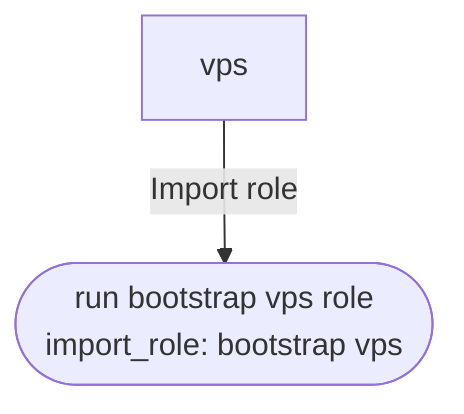

<!-- DOCSIBLE START -->

# 📃 Role overview

## site-vps


Description: Playbook documentation wrapper for site-vps.yaml


### Tasks


## Playbook

```yml
---
# site-vps.yaml - Setup K3s VPS Agent Node
# This playbook configures a VPS as an edge/gateway node for the k3s cluster

- name: Setup K3s VPS Agent Node
  hosts: vps
  become: true
  vars_files:
    - "{{ secrets_file | default('secrets.yaml') }}"
  pre_tasks:
    # @docsible Refreshes APT cache with 1-hour validity
    - name: Update APT cache
      ansible.builtin.apt:
        update_cache: true
        cache_valid_time: 3600
      tags: always

    # @docsible Runs shared bootstrap validations for auth keys and inventory assumptions
    - name: Run bootstrap validations
      ansible.builtin.import_role:
        name: validate_secrets
      vars:
        validateTailscaleAuth: true
        validateK3sServerGroup: true
      tags: always

  tasks:
    # @docsible Executes ordered VPS bootstrap phases (host + cluster join)
    - name: Run bootstrap vps role
      ansible.builtin.import_role:
        name: bootstrap_vps

  post_tasks:
    # @docsible Outputs post-install summary and manual action items
    - name: Display VPS setup summary
      ansible.builtin.debug:
        msg: |
          ====================================
          VPS Node Setup Complete
          ====================================
          Hostname: {{ ansible_facts['hostname'] }}
          Tailscale IP: {{ IP_tailscale | default('Not configured') }}
          Public IP: {{ ansible_host }}
          K3s Server: {{ k3s_agentServerUrl | default('Not configured') }}
          Exit Node: {{ tailscale_exitNodeEnabled | default(false) }}
      tags: always

```
## Playbook graph


## Author Information
rc

#### License

MIT

#### Minimum Ansible Version

2.14

#### Platforms

- **Ubuntu**: ['noble']


#### Dependencies

No dependencies specified.
<!-- DOCSIBLE END -->
