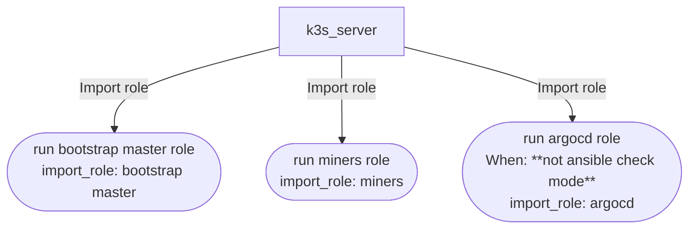

<!-- DOCSIBLE START -->

# 📃 Role overview

## site


Description: Playbook documentation wrapper for site.yaml


### Tasks


## Playbook

```yml
---
# site.yaml - Master Playbook for K3s Homelab
# Organized into distinct phases for Master, Miners, VPS, and GitOps.

# ==============================================================================
# PLAY 1: K3s Master Node Setup (Infrastructure)
# ==============================================================================
- name: Setup K3s Master Node
  hosts: k3s_server
  become: true
  vars_files:
    - "{{ secrets_file | default('secrets.yaml') }}"
  pre_tasks:
    # @docsible Refreshes APT cache with 1-hour validity to minimize upstream hits
    - name: Update APT cache
      ansible.builtin.apt:
        update_cache: true
        cache_valid_time: 3600
      tags: always
    # @docsible Normalizes nvidia_setupMode fact for downstream logic (auto detection)
    - name: Normalize NVIDIA GPU setup mode
      ansible.builtin.set_fact:
        nvidia_setupMode: "{{ nvidia_setup | default('auto') | string | lower }}"
      tags: ["nvidia"]
    # @docsible Runs shared bootstrap validations for auth keys and inventory assumptions
    - name: Run bootstrap validations
      ansible.builtin.import_role:
        name: validate_secrets
      vars:
        validateTailscaleAuth: true
        validateK3sServerGroup: false
      tags: always

  tasks:
    # @docsible Executes ordered master bootstrap phases (host, manifests, cluster, infra)
    - name: Run bootstrap master role
      ansible.builtin.import_role:
        name: bootstrap_master

# ==============================================================================
# PLAY 2: Mining Workloads (Deploy before VPS)
# ==============================================================================
- name: Deploy Mining Workloads
  hosts: k3s_server
  become: false
  vars_files:
    - "{{ secrets_file | default('secrets.yaml') }}"
  tasks:
    # @docsible Deploys mining workloads through the dedicated miners role
    - name: Run miners role
      ansible.builtin.import_role:
        name: miners
      tags: ["miners"]

# ==============================================================================
# PLAY 3: VPS Agent Setup (Import)
# ==============================================================================
# @docsible Triggers VPS setup if vps group is present
- name: Import VPS playbook
  ansible.builtin.import_playbook: site-vps.yaml
  when: groups['vps'] | default([]) | length > 0

# ==============================================================================
# PLAY 4: GitOps & Platform (ArgoCD)
# ==============================================================================
- name: Deploy ArgoCD GitOps
  hosts: k3s_server
  become: false
  tasks:
    # @docsible Deploys ArgoCD (GitOps controller) to manage cluster state
    - name: Run argocd role
      ansible.builtin.import_role:
        name: argocd
      tags: ["gitops"]
      when: not ansible_check_mode

```
## Playbook graph


## Author Information
rc

#### License

MIT

#### Minimum Ansible Version

2.14

#### Platforms

- **Ubuntu**: ['noble']


#### Dependencies

No dependencies specified.
<!-- DOCSIBLE END -->
