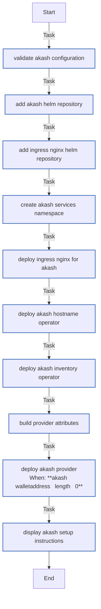

<!-- DOCSIBLE START -->

# 📃 Role overview

## akash

Description: Deploy Akash Provider stack on K3s cluster

<b> Argument Specifications in meta/argument_specs</b>

#### Key: main

**Description**: Installs and configures Akash Network provider on K3s,
including hostname operator, inventory operator, and ingress controller.

**Options**:

  - **akash_walletAddress**
    - **Required**: True
    - **Type**: str
    - **Default**: none
  
    - **Description**: Akash wallet address for provider payments.
  
  
  

  - **akash_providerDomain**
    - **Required**: True
    - **Type**: str
    - **Default**: none
  
    - **Description**: Domain for provider endpoints.
  
  
  

  - **akash_nodeMoniker**
    - **Required**: True
    - **Type**: str
    - **Default**: none
  
    - **Description**: Provider node moniker (name).
  
  
  

  - **akash_chainId**
    - **Required**: False
    - **Type**: str
    - **Default**: akashnet-2
  
    - **Description**: Akash network chain ID.
  
  
  

  - **akash_nodeRpc**
    - **Required**: False
    - **Type**: str
    - **Default**: https://rpc.akashnet.net:443
  
    - **Description**: Akash RPC endpoint.
  
  
  

  - **akash_keyringBackend**
    - **Required**: False
    - **Type**: str
    - **Default**: file
  
    - **Description**: Keyring backend for wallet storage.
  
  
  

  - **akash_gpuEnabled**
    - **Required**: False
    - **Type**: bool
    - **Default**: False
  
    - **Description**: Enable GPU support in provider attributes.
  
  
  

  - **akash_gpuVendor**
    - **Required**: False
    - **Type**: str
    - **Default**: nvidia
  
    - **Description**: GPU vendor for provider attributes.
  
  
  

  - **akash_gpuModel**
    - **Required**: False
    - **Type**: str
    - **Default**: rtx3060
  
    - **Description**: GPU model for provider attributes.
  
  
  

  - **akash_providerAttributes**
    - **Required**: False
    - **Type**: list
    - **Default**: []
  
    - **Description**: List of provider attribute objects.
  
  
  

  - **akash_ingressNginxVersion**
    - **Required**: True
    - **Type**: str
    - **Default**: none
  
    - **Description**: Ingress NGINX Helm chart version.
  
  
  

  - **akash_hostnameOperatorVersion**
    - **Required**: True
    - **Type**: str
    - **Default**: none
  
    - **Description**: Hostname operator Helm chart version.
  
  
  

  - **akash_inventoryOperatorVersion**
    - **Required**: True
    - **Type**: str
    - **Default**: none
  
    - **Description**: Inventory operator Helm chart version.
  
  
  

  - **akash_providerVersion**
    - **Required**: True
    - **Type**: str
    - **Default**: none
  
    - **Description**: Provider Helm chart version.
  
  
  

  - **kubeconfig**
    - **Required**: True
    - **Type**: str
    - **Default**: none
  
    - **Description**: Path to kubeconfig for cluster access.
  
  
  

### Tasks

#### File: tasks/main.yml

| Name | Module | Has Conditions | Comments |
| ---- | ------ | -------------- | -------- |
| [Validate Akash configuration](tasks/main.yml#L3) | ansible.builtin.assert | False | @docsible Validate required Akash configuration variables |
| [Add Akash Helm repository](tasks/main.yml#L11) | kubernetes.core.helm_repository | False | @docsible Add Akash Network Helm repository |
| [Add Ingress Nginx Helm repository](tasks/main.yml#L18) | kubernetes.core.helm_repository | False | @docsible Add Ingress NGINX Helm repository |
| [Create akash-services namespace](tasks/main.yml#L25) | kubernetes.core.k8s | False | @docsible Create dedicated namespace with restricted pod security |
| [Deploy Ingress Nginx for Akash](tasks/main.yml#L39) | kubernetes.core.helm | False | @docsible Deploy Ingress NGINX controller for Akash workloads |
| [Deploy Akash Hostname Operator](tasks/main.yml#L71) | kubernetes.core.helm | False | @docsible Deploy hostname operator for custom domains |
| [Deploy Akash Inventory Operator](tasks/main.yml#L81) | kubernetes.core.helm | False | @docsible Deploy inventory operator for resource tracking |
| [Build provider attributes](tasks/main.yml#L91) | ansible.builtin.set_fact | False | @docsible Build provider attributes including GPU if enabled |
| [Deploy Akash Provider](tasks/main.yml#L105) | kubernetes.core.helm | True | @docsible Deploy Akash provider with bidding configuration |
| [Display Akash setup instructions](tasks/main.yml#L136) | ansible.builtin.debug | False | @docsible Display deployment status and next steps |

## Task Flow Graphs

### Graph for main.yml

## Author Information
rc

### License

MIT

### Minimum Ansible Version

2.14

### Platforms

- **Ubuntu**: ['jammy', 'noble']

### Dependencies

- **gvisor**
  
  

<!-- DOCSIBLE END -->
