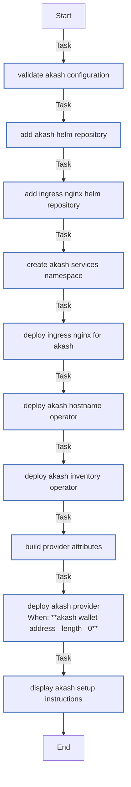

<!-- DOCSIBLE START -->

# 📃 Role overview

## akash

Description: Deploy Akash Provider stack on K3s cluster

### Tasks

#### File: tasks/main.yml

| Name | Module | Has Conditions | Comments |
| ---- | ------ | -------------- | -------- |
| [Validate Akash configuration](tasks/main.yml#L6) | ansible.builtin.assert | False | Validate required variables |
| [Add Akash Helm repository](tasks/main.yml#L14) | kubernetes.core.helm_repository | False | Add Akash Helm repository |
| [Add Ingress Nginx Helm repository](tasks/main.yml#L21) | kubernetes.core.helm_repository | False | Add Ingress Nginx Helm repository |
| [Create akash-services namespace](tasks/main.yml#L28) | kubernetes.core.k8s | False | Create akash-services namespace |
| [Deploy Ingress Nginx for Akash](tasks/main.yml#L42) | kubernetes.core.helm | False | Deploy Ingress Nginx for Akash |
| [Deploy Akash Hostname Operator](tasks/main.yml#L74) | kubernetes.core.helm | False | Deploy Akash Hostname Operator |
| [Deploy Akash Inventory Operator](tasks/main.yml#L84) | kubernetes.core.helm | False | Deploy Akash Inventory Operator |
| [Build provider attributes](tasks/main.yml#L94) | ansible.builtin.set_fact | False | Build provider attributes |
| [Deploy Akash Provider](tasks/main.yml#L108) | kubernetes.core.helm | True | Deploy Akash Provider |
| [Display Akash setup instructions](tasks/main.yml#L139) | ansible.builtin.debug | False | Display post-installation instructions |

## Task Flow Graphs

### Graph for main.yml

## Author Information
rc

### License

MIT

### Minimum Ansible Version

2.14

### Platforms

- **Ubuntu**: ['jammy', 'noble']

### Dependencies

- **gvisor**
  
  

<!-- DOCSIBLE END -->
