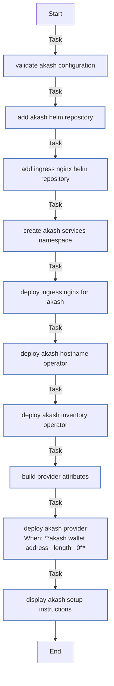

<!-- DOCSIBLE START -->

# 📃 Role overview

## akash

Description: Deploy Akash Provider stack on K3s cluster

### Defaults

**These are static variables with lower priority**

#### File: defaults/main.yml

| Var          | Type         | Value       |Required    | Title       |
|--------------|--------------|-------------|------------|-------------|
| [akash_node_moniker](defaults/main.yml#L7)   | str | `homelab-provider` |    true  |  Akash Node Moniker |
| [akash_wallet_address](defaults/main.yml#L13)   | str |  |    true  |  Akash Wallet Address |
| [akash_keyring_backend](defaults/main.yml#L19)   | str | `os` |    false  |  Akash Keyring Backend |
| [akash_chain_id](defaults/main.yml#L25)   | str | `akashnet-2` |    false  |  Akash Chain ID |
| [akash_node_rpc](defaults/main.yml#L31)   | str | `https://rpc.akashnet.net:443` |    false  |  Akash RPC Node |
| [akash_provider_domain](defaults/main.yml#L37)   | str |  |    true  |  Provider Domain |
| [akash_bid_price_script](defaults/main.yml#L43)   | str |  |    false  |  Provider Bid Price Script |
| [akash_provider_attributes](defaults/main.yml#L49)   | list | `[]` |    false  |  Provider Attributes |
| [akash_provider_attributes.**0**](defaults/main.yml#L55)   | dict | `{}` |    false  |  Attribute Item |
| [akash_provider_attributes.0.**key**](defaults/main.yml#L55)   | str | `host` |    false  |  Attribute Item |
| [akash_provider_attributes.0.**value**](defaults/main.yml#L60)   | str | `akash` |    false  |  Attribute Value |
| [akash_provider_attributes.**1**](defaults/main.yml#L66)   | dict | `{}` |    false  |  Attribute Item |
| [akash_provider_attributes.1.**key**](defaults/main.yml#L66)   | str | `tier` |    false  |  Attribute Item |
| [akash_provider_attributes.1.**value**](defaults/main.yml#L71)   | str | `community` |    false  |  Attribute Value |
| [akash_provider_attributes.**2**](defaults/main.yml#L76)   | dict | `{}` |    false  |  Attribute Item |
| [akash_provider_attributes.2.**key**](defaults/main.yml#L76)   | str | `organization` |    false  |  Attribute Item |
| [akash_provider_attributes.2.**value**](defaults/main.yml#L81)   | str | `homelab` |    false  |  Attribute Value |
| [akash_gpu_vendor](defaults/main.yml#L87)   | str | `nvidia` |    false  |  GPU Vendor |
| [akash_gpu_model](defaults/main.yml#L93)   | str | `rtx4070` |    false  |  GPU Model |
| [akash_ingress_nginx_version](defaults/main.yml#L99)   | str | `4.11.3` |    false  |  Ingress Nginx Chart Version |
| [akash_hostname_operator_version](defaults/main.yml#L105)   | str | `1.0.0` |    false  |  Hostname Operator Chart Version |
| [akash_inventory_operator_version](defaults/main.yml#L111)   | str | `1.0.0` |    false  |  Inventory Operator Chart Version |
| [akash_provider_version](defaults/main.yml#L117)   | str | `6.0.0` |    false  |  Provider Chart Version |
| [akash_gpu_enabled](defaults/main.yml#L123)   | bool | `True` |    false  |  Enable GPU Support |

<b>🖇️ Full descriptions for vars in defaults/main.yml</b>

 
<table>
<th>Var</th><th>Description</th>
<tr><td><b>akash_node_moniker</b></td><td>Provider display name on the Akash network.</td></tr>
<tr><td><b>akash_wallet_address</b></td><td>Provider wallet address for receiving payments.</td></tr>
<tr><td><b>akash_keyring_backend</b></td><td>Keyring backend for wallet management.</td></tr>
<tr><td><b>akash_chain_id</b></td><td>Akash network chain ID.</td></tr>
<tr><td><b>akash_node_rpc</b></td><td>RPC endpoint for Akash network.</td></tr>
<tr><td><b>akash_provider_domain</b></td><td>Public domain for provider endpoints.</td></tr>
<tr><td><b>akash_bid_price_script</b></td><td>Path to bid pricing script.</td></tr>
<tr><td><b>akash_provider_attributes</b></td><td>Provider attributes for marketplace; list of {key,value} entries (e.g., host=akash, tier=community).</td></tr>
<tr><td><b>akash_provider_attributes.0</b></td><td>Provider attribute key/value pair (key is namespaced attribute, value is string).</td></tr>
<tr><td><b>akash_provider_attributes.0.key</b></td><td>Provider attribute key/value pair (key is namespaced attribute, value is string).</td></tr>
<tr><td><b>akash_provider_attributes.0.value</b></td><td>Provider attribute value (string).</td></tr>
<tr><td><b>akash_provider_attributes.1</b></td><td>Provider attribute key/value pair (key is namespaced attribute, value is string).</td></tr>
<tr><td><b>akash_provider_attributes.1.key</b></td><td>Provider attribute key/value pair (key is namespaced attribute, value is string).</td></tr>
<tr><td><b>akash_provider_attributes.1.value</b></td><td>Provider attribute value (string).</td></tr>
<tr><td><b>akash_provider_attributes.2</b></td><td>Provider attribute key/value pair (key is namespaced attribute, value is string).</td></tr>
<tr><td><b>akash_provider_attributes.2.key</b></td><td>Provider attribute key/value pair (key is namespaced attribute, value is string).</td></tr>
<tr><td><b>akash_provider_attributes.2.value</b></td><td>Provider attribute value (string).</td></tr>
<tr><td><b>akash_gpu_vendor</b></td><td>GPU vendor for GPU-enabled providers.</td></tr>
<tr><td><b>akash_gpu_model</b></td><td>GPU model name for attributes.</td></tr>
<tr><td><b>akash_ingress_nginx_version</b></td><td>Version of ingress-nginx Helm chart.</td></tr>
<tr><td><b>akash_hostname_operator_version</b></td><td>Version of akash-hostname-operator Helm chart.</td></tr>
<tr><td><b>akash_inventory_operator_version</b></td><td>Version of akash-inventory-operator Helm chart.</td></tr>
<tr><td><b>akash_provider_version</b></td><td>Version of akash-provider Helm chart.</td></tr>
<tr><td><b>akash_gpu_enabled</b></td><td>Whether to advertise GPU capabilities.</td></tr>
</table>
 

### Tasks

#### File: tasks/main.yml

| Name | Module | Has Conditions | Comments |
| ---- | ------ | -------------- | -------- |
| [Validate Akash configuration](tasks/main.yml#L6) | ansible.builtin.assert | False | Validate required variables |
| [Add Akash Helm repository](tasks/main.yml#L14) | kubernetes.core.helm_repository | False | Add Akash Helm repository |
| [Add Ingress Nginx Helm repository](tasks/main.yml#L21) | kubernetes.core.helm_repository | False | Add Ingress Nginx Helm repository |
| [Create akash-services namespace](tasks/main.yml#L28) | kubernetes.core.k8s | False | Create akash-services namespace |
| [Deploy Ingress Nginx for Akash](tasks/main.yml#L42) | kubernetes.core.helm | False | Deploy Ingress Nginx for Akash |
| [Deploy Akash Hostname Operator](tasks/main.yml#L74) | kubernetes.core.helm | False | Deploy Akash Hostname Operator |
| [Deploy Akash Inventory Operator](tasks/main.yml#L84) | kubernetes.core.helm | False | Deploy Akash Inventory Operator |
| [Build provider attributes](tasks/main.yml#L94) | ansible.builtin.set_fact | False | Build provider attributes |
| [Deploy Akash Provider](tasks/main.yml#L108) | kubernetes.core.helm | True | Deploy Akash Provider |
| [Display Akash setup instructions](tasks/main.yml#L139) | ansible.builtin.debug | False | Display post-installation instructions |

## Task Flow Graphs

### Graph for main.yml

## Author Information
rc

#### License

MIT

#### Minimum Ansible Version

2.14

#### Platforms

- **Ubuntu**: ['jammy', 'noble']

#### Dependencies

- **gvisor**
  
  

<!-- DOCSIBLE END -->
