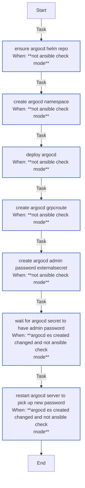

<!-- DOCSIBLE START -->

# 📃 Role overview

## argocd

Description: Deploy ArgoCD on K3s via Helm (expects External Secrets and an OCI ClusterSecretStore named oci-vault for admin password).

<b> Argument Specifications in meta/argument_specs</b>

#### Key: main

**Description**: Installs ArgoCD via Helm and configures admin password
via External Secrets OCI Vault integration.

**Options**:

  - **argocd_namespace**
    - **Required**: False
    - **Type**: str
    - **Default**: argocd
  
    - **Description**: Namespace for ArgoCD deployment.
  
  
  

  - **argocd_chartVersion**
    - **Required**: False
    - **Type**: str
    - **Default**: none
  
    - **Description**: ArgoCD Helm chart version (omit for latest).
  
  
  

  - **argocd_installCrds**
    - **Required**: False
    - **Type**: bool
    - **Default**: True
  
    - **Description**: Install ArgoCD CRDs.
  
  
  

  - **argocd_dexEnabled**
    - **Required**: False
    - **Type**: bool
    - **Default**: False
  
    - **Description**: Enable Dex for SSO integration.
  
  
  

  - **argocd_haEnabled**
    - **Required**: False
    - **Type**: bool
    - **Default**: False
  
    - **Description**: Enable high availability mode.
  
  
  

  - **argocd_serviceMonitorEnabled**
    - **Required**: False
    - **Type**: bool
    - **Default**: False
  
    - **Description**: Enable Prometheus ServiceMonitor.
  
  
  

  - **kubeconfig**
    - **Required**: True
    - **Type**: str
    - **Default**: none
  
    - **Description**: Path to kubeconfig for cluster access.
  
  
  

### Tasks

#### File: tasks/main.yml

| Name | Module | Has Conditions | Tags | Comments |
| ---- | ------ | -------------- | -----| -------- |
| [Ensure ArgoCD Helm repo](tasks/main.yml#L2) | kubernetes.core.helm_repository | True |  | @docsible Registers ArgoCD Helm repository |
| [Create argocd namespace](tasks/main.yml#L9) | kubernetes.core.k8s | True |  | @docsible Creates 'argocd' namespace |
| [Deploy ArgoCD](tasks/main.yml#L17) | kubernetes.core.helm | True | gitops | @docsible Installs ArgoCD (Helm) |
| [Create ArgoCD GRPCRoute](tasks/main.yml#L34) | kubernetes.core.k8s | True | gitops | @docsible Deploys GRPCRoute for ArgoCD CLI |
| [Create ArgoCD Admin Password ExternalSecret](tasks/main.yml#L43) | kubernetes.core.k8s | True | gitops | @docsible Syncs Admin Password from Vault (ExternalSecret) |
| [Wait for argocd-secret to have admin.password](tasks/main.yml#L54) | kubernetes.core.k8s_info | True | gitops | @docsible Waits for Admin Password Secret sync |
| [Restart ArgoCD Server to pick up new password](tasks/main.yml#L71) | kubernetes.core.k8s | True | gitops | @docsible Restarts ArgoCD Server (Applies new password) |

## Task Flow Graphs

### Graph for main.yml

## Author Information
rc

### License

MIT

### Minimum Ansible Version

2.14

### Platforms

- **Ubuntu**: ['noble']

### Dependencies

No dependencies specified.
<!-- DOCSIBLE END -->
