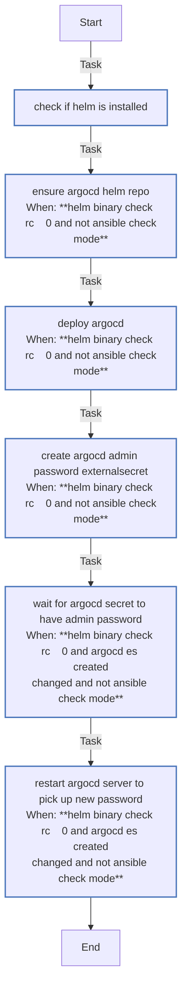

<!-- DOCSIBLE START -->

# 📃 Role overview

## argocd

Description: Deploy ArgoCD on K3s via Helm (expects External Secrets and an OCI ClusterSecretStore named oci-vault for admin password).

### Defaults

**These are static variables with lower priority**

#### File: defaults/main.yml

| Var          | Type         | Value       |Required    | Title       |
|--------------|--------------|-------------|------------|-------------|
| [argocd_namespace](defaults/main.yml#L5)   | str | `argocd` |    false  |  ArgoCD Namespace |
| [argocd_chart_version](defaults/main.yml#L10)   | str |  |    false  |  Chart Version |
| [argocd_install_crds](defaults/main.yml#L15)   | bool | `True` |    false  |  Install CRDs |
| [argocd_ha_enabled](defaults/main.yml#L20)   | bool | `False` |    false  |  High Availability |
| [argocd_dex_enabled](defaults/main.yml#L25)   | bool | `False` |    false  |  Dex Integration |
| [argocd_servicemonitor_enabled](defaults/main.yml#L30)   | bool | `True` |    false  |  ServiceMonitor |

<b>Full descriptions for vars in defaults/main.yml</b>

 
<table>
<th>Var</th><th>Description</th>
<tr><td><b>argocd_namespace</b></td><td>Kubernetes namespace where ArgoCD will be installed.</td></tr>
<tr><td><b>argocd_chart_version</b></td><td>ArgoCD Helm chart version (empty for latest).</td></tr>
<tr><td><b>argocd_install_crds</b></td><td>Whether to install ArgoCD Custom Resource Definitions.</td></tr>
<tr><td><b>argocd_ha_enabled</b></td><td>Enable high availability mode for ArgoCD.</td></tr>
<tr><td><b>argocd_dex_enabled</b></td><td>Enable Dex for SSO authentication integration.</td></tr>
<tr><td><b>argocd_servicemonitor_enabled</b></td><td>Enable Prometheus ServiceMonitor for metrics collection.</td></tr>
</table>
 

### Tasks

#### File: tasks/main.yml

| Name | Module | Has Conditions | Tags | Comments |
| ---- | ------ | -------------- | -----| -------- |
| [Check if Helm is installed](tasks/main.yml#L2) | ansible.builtin.command | False |  | @docsible Check Helm availability |
| [Ensure ArgoCD Helm repo](tasks/main.yml#L9) | kubernetes.core.helm_repository | True |  | @docsible Add ArgoCD Helm repository |
| [Deploy ArgoCD](tasks/main.yml#L18) | kubernetes.core.helm | True | apps,argocd | @docsible Deploy ArgoCD via Helm |
| [Create ArgoCD Admin Password ExternalSecret](tasks/main.yml#L143) | kubernetes.core.k8s | True | apps,argocd,secrets | @docsible Create ExternalSecret for admin password |
| [Wait for argocd-secret to have admin.password](tasks/main.yml#L176) | kubernetes.core.k8s_info | True | apps,argocd,secrets | @docsible Wait for admin password secret |
| [Restart ArgoCD Server to pick up new password](tasks/main.yml#L197) | kubernetes.core.k8s | True | apps,argocd,secrets | @docsible Restart ArgoCD server for password update |

## Task Flow Graphs

### Graph for main.yml

## Author Information
rc

### License

MIT

### Minimum Ansible Version

2.14

### Platforms

- **Ubuntu**: ['jammy', 'noble']

### Dependencies

- **external_secrets**
  
  

<!-- DOCSIBLE END -->
