<!-- DOCSIBLE START -->

# 📃 Role overview

## bootstrap_master

Description: Orchestrator role that calls other roles in sequence for master node bootstrap.

### Tasks

#### File: tasks/main.yml

| Name | Module | Has Conditions | Tags | Comments |
| ---- | ------ | -------------- | -----| -------- |
| [Validate hardware requirements](tasks/main.yml#L4) | ansible.builtin.import_role | False | host | @docsible Validates hardware constraints (RAM/Disk) and system readiness |
| [Run common role](tasks/main.yml#L10) | ansible.builtin.import_role | False | host | @docsible Configures kernel (BBR, hugepages), limits, and base packages |
| [Run common network optimizations](tasks/main.yml#L16) | ansible.builtin.import_role | True | host | @docsible Applies advanced sysctl networking tuning (BBR, buffer sizes) |
| [Run developer tools role](tasks/main.yml#L24) | ansible.builtin.import_role | True | host | @docsible Installs kubectl, helm, and dev utilities (if enabled) |
| [Run gvisor host role](tasks/main.yml#L31) | ansible.builtin.import_role | True | host,gvisor | @docsible Installs gVisor runsc for sandboxed container runtime |
| [Run NVIDIA GPU host role](tasks/main.yml#L39) | ansible.builtin.import_role | True | host,nvidia | @docsible Installs NVIDIA drivers, container toolkit, and configures X11 for fan control |
| [Flush host handlers before cluster init](tasks/main.yml#L47) | ansible.builtin.meta | False |  | @docsible Ensures kernel modules/sysctl changes are active before K8s init |
| [Clean remote manifests directory](tasks/main.yml#L51) | ansible.builtin.file | False | cluster | @docsible Removes {{ k8s_manifestsDir }} to ensure a clean manifest sync slate |
| [Copy Kustomize bases to remote](tasks/main.yml#L58) | ansible.builtin.copy | False | cluster,miners,infra,gitops | @docsible Synchronizes local k8s/ directory to master node for bootstrap operations |
| [Run tailscale role](tasks/main.yml#L69) | ansible.builtin.import_role | False | cluster,tailscale | @docsible Configures Tailscale mesh networking before cluster start |
| [Run k3s server role](tasks/main.yml#L75) | ansible.builtin.import_role | False | cluster | @docsible Bootstraps K3s control plane with disabled Traefik/ServiceLB |
| [Run gvisor RuntimeClass](tasks/main.yml#L81) | ansible.builtin.import_role | True | cluster,gvisor | @docsible Registers runsc RuntimeClass in the cluster |
| [Run crds_bootstrap role](tasks/main.yml#L90) | ansible.builtin.import_role | True | cluster | @docsible Applies essential CRDs required by addons |
| [Run cilium role](tasks/main.yml#L98) | ansible.builtin.import_role | True | cluster | @docsible Deploys Cilium CNI (Helm) with kube-proxy replacement |
| [Advertise Cilium pod CIDR via Tailscale](tasks/main.yml#L106) | ansible.builtin.import_role | True | cluster,tailscale | @docsible Configures Tailscale to advertise K8s Pod CIDRs (post-Cilium) |
| [Run NVIDIA GPU cluster role](tasks/main.yml#L115) | ansible.builtin.import_role | True | cluster,nvidia | @docsible Deploys NVIDIA Device Plugin and GPU Feature Discovery |
| [Run cert-manager role](tasks/main.yml#L126) | ansible.builtin.import_role | True | infra | @docsible Installs cert-manager via Helm for TLS certificate management |
| [Run external-secrets role](tasks/main.yml#L134) | ansible.builtin.import_role | True | infra | @docsible Deploys External Secrets Operator |
| [Configure ACME Issuers](tasks/main.yml#L142) | ansible.builtin.import_role | True | infra | @docsible Configures Cert-Manager Issuers (depends on ESO) |
| [Run gateway role](tasks/main.yml#L151) | ansible.builtin.import_role | True | infra,networking | @docsible Configures Gateway API infrastructure |

## Task Flow Graphs

### Graph for main.yml

```mermaid
flowchart TD
Start
classDef block stroke:#3498db,stroke-width:2px;
classDef task stroke:#4b76bb,stroke-width:2px;
classDef includeTasks stroke:#16a085,stroke-width:2px;
classDef importTasks stroke:#34495e,stroke-width:2px;
classDef includeRole stroke:#2980b9,stroke-width:2px;
classDef importRole stroke:#699ba7,stroke-width:2px;
classDef includeVars stroke:#8e44ad,stroke-width:2px;
classDef rescue stroke:#665352,stroke-width:2px;

  Start-->|Import role| Validate_hardware_requirements_validate_hardware_0([validate hardware requirements<br>import_role: validate hardware]):::importRole
  Validate_hardware_requirements_validate_hardware_0-->|Import role| Run_common_role_common_1([run common role<br>import_role: common]):::importRole
  Run_common_role_common_1-->|Import role| Run_common_network_optimizations_common_2([run common network optimizations<br>When: **system networkoptimize   default true**<br>import_role: common]):::importRole
  Run_common_network_optimizations_common_2-->|Import role| Run_developer_tools_role_developer_tools_3([run developer tools role<br>When: **devtools enabled   default true    bool**<br>import_role: developer tools]):::importRole
  Run_developer_tools_role_developer_tools_3-->|Import role| Run_gvisor_host_role_gvisor_4([run gvisor host role<br>When: **not ansible check mode**<br>import_role: gvisor]):::importRole
  Run_gvisor_host_role_gvisor_4-->|Import role| Run_NVIDIA_GPU_host_role_nvidia_gpu_5([run nvidia gpu host role<br>When: **nvidia setupmode     false**<br>import_role: nvidia gpu]):::importRole
  Run_NVIDIA_GPU_host_role_nvidia_gpu_5-->|Task| Flush_host_handlers_before_cluster_init6[flush host handlers before cluster init]:::task
  Flush_host_handlers_before_cluster_init6-->|Task| Clean_remote_manifests_directory7[clean remote manifests directory]:::task
  Clean_remote_manifests_directory7-->|Task| Copy_Kustomize_bases_to_remote8[copy kustomize bases to remote]:::task
  Copy_Kustomize_bases_to_remote8-->|Import role| Run_tailscale_role_tailscale_9([run tailscale role<br>import_role: tailscale]):::importRole
  Run_tailscale_role_tailscale_9-->|Import role| Run_k3s_server_role_k3s_server_10([run k3s server role<br>import_role: k3s server]):::importRole
  Run_k3s_server_role_k3s_server_10-->|Import role| Run_gvisor_RuntimeClass_gvisor_11([run gvisor runtimeclass<br>When: **not ansible check mode**<br>import_role: gvisor]):::importRole
  Run_gvisor_RuntimeClass_gvisor_11-->|Import role| Run_crds_bootstrap_role_crds_bootstrap_12([run crds bootstrap role<br>When: **not ansible check mode**<br>import_role: crds bootstrap]):::importRole
  Run_crds_bootstrap_role_crds_bootstrap_12-->|Import role| Run_cilium_role_cilium_13([run cilium role<br>When: **not ansible check mode**<br>import_role: cilium]):::importRole
  Run_cilium_role_cilium_13-->|Import role| Advertise_Cilium_pod_CIDR_via_Tailscale_tailscale_14([advertise cilium pod cidr via tailscale<br>When: **not ansible check mode**<br>import_role: tailscale]):::importRole
  Advertise_Cilium_pod_CIDR_via_Tailscale_tailscale_14-->|Import role| Run_NVIDIA_GPU_cluster_role_nvidia_gpu_15([run nvidia gpu cluster role<br>When: **nvidia active   default false    bool and not<br>ansible check mode**<br>import_role: nvidia gpu]):::importRole
  Run_NVIDIA_GPU_cluster_role_nvidia_gpu_15-->|Import role| Run_cert_manager_role_cert_manager_16([run cert manager role<br>When: **not ansible check mode**<br>import_role: cert manager]):::importRole
  Run_cert_manager_role_cert_manager_16-->|Import role| Run_external_secrets_role_external_secrets_17([run external secrets role<br>When: **not ansible check mode**<br>import_role: external secrets]):::importRole
  Run_external_secrets_role_external_secrets_17-->|Import role| Configure_ACME_Issuers_cert_manager_18([configure acme issuers<br>When: **not ansible check mode**<br>import_role: cert manager]):::importRole
  Configure_ACME_Issuers_cert_manager_18-->|Import role| Run_gateway_role_gateway_19([run gateway role<br>When: **not ansible check mode**<br>import_role: gateway]):::importRole
  Run_gateway_role_gateway_19-->End
```

## Author Information
rc

#### License

MIT

#### Minimum Ansible Version

2.20.0

#### Platforms

- **Ubuntu**: ['noble']

#### Dependencies

No dependencies specified.
<!-- DOCSIBLE END -->
