<!-- DOCSIBLE START -->

# 📃 Role overview

## bootstrap_vps

Description: Orchestrator role that calls other roles for VPS agent join.

### Tasks

#### File: tasks/main.yml

| Name | Module | Has Conditions | Tags | Comments |
| ---- | ------ | -------------- | -----| -------- |
| [Run common role](tasks/main.yml#L4) | ansible.builtin.import_role | False | host | @docsible Configures base OS settings, packages, and kernel parameters |
| [Run tailscale role](tasks/main.yml#L10) | ansible.builtin.import_role | False | cluster,tailscale | @docsible Configures Tailscale interface and routing |
| [Flush host handlers before cluster join](tasks/main.yml#L16) | ansible.builtin.meta | False |  | @docsible Flushes host-level handlers before K3s agent bootstrap |
| [Get master Tailscale IP](tasks/main.yml#L20) | ansible.builtin.command | True |  | @docsible Resolves K3s Master Tailscale IP (100.x) for secure join |
| [Validate Master IP](tasks/main.yml#L28) | ansible.builtin.fail | True |  | @docsible Fails early when master Tailscale IP cannot be resolved |
| [Set K3s agent server URL](tasks/main.yml#L36) | ansible.builtin.set_fact | True |  | @docsible Constructs internal K3s API URL using Tailscale IP |
| [Set K3s agent server URL (check mode)](tasks/main.yml#L48) | ansible.builtin.set_fact | True |  | @docsible Mocks API URL for Ansible check mode safety |
| [Retrieve K3s server token from master](tasks/main.yml#L54) | ansible.builtin.slurp | True | cluster | @docsible Fetches K3s node-token directly from Master node |
| [Set K3s token fact](tasks/main.yml#L65) | ansible.builtin.set_fact | True | cluster | @docsible Registers node-token fact for agent role consumption |
| [Run k3s_agent role](tasks/main.yml#L77) | ansible.builtin.import_role | False | cluster | @docsible Installs K3s agent and joins the cluster |
| [Advertise Cilium pod CIDR via Tailscale](tasks/main.yml#L83) | ansible.builtin.import_role | True | cluster,tailscale | @docsible Announces local Pod CIDR to Tailscale mesh (hybrid connectivity) |

## Task Flow Graphs

### Graph for main.yml

```mermaid
flowchart TD
Start
classDef block stroke:#3498db,stroke-width:2px;
classDef task stroke:#4b76bb,stroke-width:2px;
classDef includeTasks stroke:#16a085,stroke-width:2px;
classDef importTasks stroke:#34495e,stroke-width:2px;
classDef includeRole stroke:#2980b9,stroke-width:2px;
classDef importRole stroke:#699ba7,stroke-width:2px;
classDef includeVars stroke:#8e44ad,stroke-width:2px;
classDef rescue stroke:#665352,stroke-width:2px;

  Start-->|Import role| Run_common_role_common_0([run common role<br>import_role: common]):::importRole
  Run_common_role_common_0-->|Import role| Run_tailscale_role_tailscale_1([run tailscale role<br>import_role: tailscale]):::importRole
  Run_tailscale_role_tailscale_1-->|Task| Flush_host_handlers_before_cluster_join2[flush host handlers before cluster join]:::task
  Flush_host_handlers_before_cluster_join2-->|Task| Get_master_Tailscale_IP3[get master tailscale ip<br>When: **not ansible check mode**]:::task
  Get_master_Tailscale_IP3-->|Task| Validate_Master_IP4[validate master ip<br>When: **not ansible check mode and k3s master tailscale ip<br>stdout   length    0**]:::task
  Validate_Master_IP4-->|Task| Set_K3s_agent_server_URL5[set k3s agent server url<br>When: **not ansible check mode**]:::task
  Set_K3s_agent_server_URL5-->|Task| Set_K3s_agent_server_URL__check_mode_6[set k3s agent server url  check mode <br>When: **ansible check mode**]:::task
  Set_K3s_agent_server_URL__check_mode_6-->|Task| Retrieve_K3s_server_token_from_master7[retrieve k3s server token from master<br>When: **not ansible check mode**]:::task
  Retrieve_K3s_server_token_from_master7-->|Task| Set_K3s_token_fact8[set k3s token fact<br>When: **ansible check mode or k3s token raw is not skipped**]:::task
  Set_K3s_token_fact8-->|Import role| Run_k3s_agent_role_k3s_agent_9([run k3s agent role<br>import_role: k3s agent]):::importRole
  Run_k3s_agent_role_k3s_agent_9-->|Import role| Advertise_Cilium_pod_CIDR_via_Tailscale_tailscale_10([advertise cilium pod cidr via tailscale<br>When: **not ansible check mode**<br>import_role: tailscale]):::importRole
  Advertise_Cilium_pod_CIDR_via_Tailscale_tailscale_10-->End
```

## Author Information
rc

#### License

MIT

#### Minimum Ansible Version

2.20.0

#### Platforms

- **Ubuntu**: ['noble']

#### Dependencies

No dependencies specified.
<!-- DOCSIBLE END -->
