<!-- DOCSIBLE START -->

# 📃 Role overview

## cert_manager

Description: Install cert-manager on K3s and bootstrap a self-signed CA with ClusterIssuers.

### Tasks

#### File: tasks/main.yml

| Name | Module | Has Conditions | Tags |
| ---- | ------ | -------------- | -----|
| [Check if Helm is installed](tasks/main.yml#L1) | ansible.builtin.command | False |  |
| [Ensure Jetstack Helm repo](tasks/main.yml#L7) | kubernetes.core.helm_repository | True |  |
| [Deploy cert-manager](tasks/main.yml#L15) | kubernetes.core.helm | True | cluster,infrastructure,cert-manager |
| [Wait for cert-manager webhook to be available](tasks/main.yml#L78) | kubernetes.core.k8s | True | cluster,infrastructure,cert-manager |
| [Create cert-manager self-signed ClusterIssuer](tasks/main.yml#L96) | kubernetes.core.k8s | True | cluster,infrastructure,cert-manager |
| [Create cert-manager CA certificate](tasks/main.yml#L113) | kubernetes.core.k8s | True | cluster,infrastructure,cert-manager |
| [Wait for cert-manager CA secret](tasks/main.yml#L140) | kubernetes.core.k8s_info | True | cluster,infrastructure,cert-manager |
| [Create cert-manager CA ClusterIssuer](tasks/main.yml#L158) | kubernetes.core.k8s | True | cluster,infrastructure,cert-manager |

## Task Flow Graphs

### Graph for main.yml

```mermaid
flowchart TD
Start
classDef block stroke:#3498db,stroke-width:2px;
classDef task stroke:#4b76bb,stroke-width:2px;
classDef includeTasks stroke:#16a085,stroke-width:2px;
classDef importTasks stroke:#34495e,stroke-width:2px;
classDef includeRole stroke:#2980b9,stroke-width:2px;
classDef importRole stroke:#699ba7,stroke-width:2px;
classDef includeVars stroke:#8e44ad,stroke-width:2px;
classDef rescue stroke:#665352,stroke-width:2px;

  Start-->|Task| Check_if_Helm_is_installed0[check if helm is installed]:::task
  Check_if_Helm_is_installed0-->|Task| Ensure_Jetstack_Helm_repo1[ensure jetstack helm repo<br>When: **helm binary check rc    0 and not ansible check<br>mode**]:::task
  Ensure_Jetstack_Helm_repo1-->|Task| Deploy_cert_manager2[deploy cert manager<br>When: **helm binary check rc    0 and not ansible check<br>mode**]:::task
  Deploy_cert_manager2-->|Task| Wait_for_cert_manager_webhook_to_be_available3[wait for cert manager webhook to be available<br>When: **helm binary check rc    0 and not ansible check<br>mode**]:::task
  Wait_for_cert_manager_webhook_to_be_available3-->|Task| Create_cert_manager_self_signed_ClusterIssuer4[create cert manager self signed clusterissuer<br>When: **helm binary check rc    0 and not ansible check<br>mode**]:::task
  Create_cert_manager_self_signed_ClusterIssuer4-->|Task| Create_cert_manager_CA_certificate5[create cert manager ca certificate<br>When: **helm binary check rc    0 and not ansible check<br>mode**]:::task
  Create_cert_manager_CA_certificate5-->|Task| Wait_for_cert_manager_CA_secret6[wait for cert manager ca secret<br>When: **helm binary check rc    0 and not ansible check<br>mode**]:::task
  Wait_for_cert_manager_CA_secret6-->|Task| Create_cert_manager_CA_ClusterIssuer7[create cert manager ca clusterissuer<br>When: **helm binary check rc    0 and not ansible check<br>mode**]:::task
  Create_cert_manager_CA_ClusterIssuer7-->End
```

## Author Information
rc

### License

MIT

### Minimum Ansible Version

2.14

### Platforms

- **Ubuntu**: ['jammy', 'noble']

### Dependencies

No dependencies specified.
<!-- DOCSIBLE END -->
