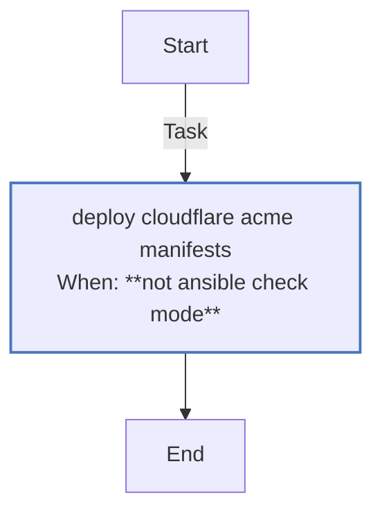

<!-- DOCSIBLE START -->

# 📃 Role overview

## cert_manager

Description: Install cert-manager on K3s and bootstrap a self-signed CA with ClusterIssuers.

<b>🧩 Argument Specifications in meta/argument_specs</b>

#### Key: main

**Description**: Deploys cert-manager via Helm with CRDs enabled and bootstraps
a self-signed CA with ClusterIssuers for cluster-wide TLS.

**Options**:

  - **certManager_namespace**
    - **Required**: False
    - **Type**: str
    - **Default**: cert-manager
  
    - **Description**: Namespace for cert-manager deployment.
  
  
  

  - **certManager_chartVersion**
    - **Required**: False
    - **Type**: str
    - **Default**: none
  
    - **Description**: cert-manager Helm chart version (omit for latest).
  
  
  

  - **certManager_selfsignedIssuerName**
    - **Required**: False
    - **Type**: str
    - **Default**: selfsigned-issuer
  
    - **Description**: Name for the self-signed ClusterIssuer.
  
  
  

  - **certManager_caCertificateName**
    - **Required**: False
    - **Type**: str
    - **Default**: ca-certificate
  
    - **Description**: Name for the CA Certificate resource.
  
  
  

  - **certManager_caSecretName**
    - **Required**: False
    - **Type**: str
    - **Default**: ca-secret
  
    - **Description**: Secret name for storing the CA certificate.
  
  
  

  - **certManager_caIssuerName**
    - **Required**: False
    - **Type**: str
    - **Default**: ca-issuer
  
    - **Description**: Name for the CA ClusterIssuer.
  
  
  

  - **certManager_prometheusEnabled**
    - **Required**: False
    - **Type**: bool
    - **Default**: False
  
    - **Description**: Enable Prometheus ServiceMonitor for metrics.
  
  
  

  - **kubeconfig**
    - **Required**: True
    - **Type**: str
    - **Default**: none
  
    - **Description**: Path to kubeconfig for cluster access.
  
  
  

### Tasks

#### File: tasks/configure_issuers.yml

| Name | Module | Has Conditions | Tags | Comments |
| ---- | ------ | -------------- | -----| -------- |
| [Deploy Cloudflare ACME manifests](tasks/configure_issuers.yml#L2) | kubernetes.core.k8s | True | infra | @docsible Deploys Cloudflare Token and Let's Encrypt ClusterIssuer |

#### File: tasks/main.yml

| Name | Module | Has Conditions | Tags | Comments |
| ---- | ------ | -------------- | -----| -------- |
| [Ensure Jetstack Helm repo](tasks/main.yml#L2) | kubernetes.core.helm_repository | True |  | @docsible Registers Jetstack Helm repository |
| [Create cert-manager namespace](tasks/main.yml#L10) | kubernetes.core.k8s | True |  | @docsible Creates namespace for cert-manager |
| [Deploy cert-manager](tasks/main.yml#L18) | kubernetes.core.helm | True | infra | @docsible Installs cert-manager via Helm |
| [Wait for cert-manager webhook to be available](tasks/main.yml#L34) | kubernetes.core.k8s | True | infra | @docsible Waits for cert-manager webhook availability required by CRDs |
| [Create cert-manager self-signed ClusterIssuer](tasks/main.yml#L50) | kubernetes.core.k8s | True | infra | @docsible Creates self-signed bootstrap ClusterIssuer |
| [Create cert-manager CA certificate](tasks/main.yml#L59) | kubernetes.core.k8s | True | infra | @docsible Generates root CA certificate |
| [Wait for cert-manager CA secret](tasks/main.yml#L68) | kubernetes.core.k8s_info | True | infra | @docsible Waits for root CA secret |
| [Create cert-manager CA ClusterIssuer](tasks/main.yml#L84) | kubernetes.core.k8s | True | infra | @docsible Creates CA-based ClusterIssuer for internal PKI |

## Task Flow Graphs

### Graph for configure_issuers.yml

### Graph for main.yml

```mermaid
flowchart TD
Start
classDef block stroke:#3498db,stroke-width:2px;
classDef task stroke:#4b76bb,stroke-width:2px;
classDef includeTasks stroke:#16a085,stroke-width:2px;
classDef importTasks stroke:#34495e,stroke-width:2px;
classDef includeRole stroke:#2980b9,stroke-width:2px;
classDef importRole stroke:#699ba7,stroke-width:2px;
classDef includeVars stroke:#8e44ad,stroke-width:2px;
classDef rescue stroke:#665352,stroke-width:2px;

  Start-->|Task| Ensure_Jetstack_Helm_repo0[ensure jetstack helm repo<br>When: **not ansible check mode**]:::task
  Ensure_Jetstack_Helm_repo0-->|Task| Create_cert_manager_namespace1[create cert manager namespace<br>When: **not ansible check mode**]:::task
  Create_cert_manager_namespace1-->|Task| Deploy_cert_manager2[deploy cert manager<br>When: **not ansible check mode**]:::task
  Deploy_cert_manager2-->|Task| Wait_for_cert_manager_webhook_to_be_available3[wait for cert manager webhook to be available<br>When: **not ansible check mode**]:::task
  Wait_for_cert_manager_webhook_to_be_available3-->|Task| Create_cert_manager_self_signed_ClusterIssuer4[create cert manager self signed clusterissuer<br>When: **not ansible check mode**]:::task
  Create_cert_manager_self_signed_ClusterIssuer4-->|Task| Create_cert_manager_CA_certificate5[create cert manager ca certificate<br>When: **not ansible check mode**]:::task
  Create_cert_manager_CA_certificate5-->|Task| Wait_for_cert_manager_CA_secret6[wait for cert manager ca secret<br>When: **not ansible check mode**]:::task
  Wait_for_cert_manager_CA_secret6-->|Task| Create_cert_manager_CA_ClusterIssuer7[create cert manager ca clusterissuer<br>When: **not ansible check mode**]:::task
  Create_cert_manager_CA_ClusterIssuer7-->End
```

## Author Information
rc

#### License

MIT

#### Minimum Ansible Version

2.20.0

#### Platforms

- **Ubuntu**: ['noble']

#### Dependencies

No dependencies specified.
<!-- DOCSIBLE END -->
