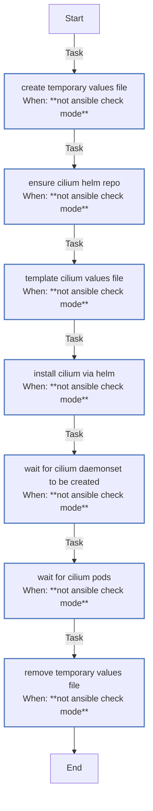

<!-- DOCSIBLE START -->

# 📃 Role overview

## cilium

Description: Installs and configures Cilium CNI for K3s clusters.

<b> Argument Specifications in meta/argument_specs</b>

#### Key: main

**Description**: Deploys Cilium CNI using Helm, managing values templating and rollout verification.

**Options**:

  - **cilium_chartVersion**
    - **Required**: False
    - **Type**: str
    - **Default**: 1.18.5
  
    - **Description**: Version of the Cilium Helm chart to install.
  
  
  

  - **cilium_chartName**
    - **Required**: False
    - **Type**: str
    - **Default**: cilium
  
    - **Description**: Name of the chart in the repository (e.g., cilium/cilium).
  
  
  

  - **cilium_namespace**
    - **Required**: False
    - **Type**: str
    - **Default**: kube-system
  
    - **Description**: Kubernetes namespace where Cilium should be installed.
  
  
  

  - **cilium_rolloutTimeout**
    - **Required**: False
    - **Type**: int
    - **Default**: 300
  
    - **Description**: Timeout (seconds) for waiting for Cilium pods rollout.
  
  
  

  - **cilium_waitRetries**
    - **Required**: False
    - **Type**: int
    - **Default**: 60
  
    - **Description**: Number of retries when checking for DaemonSet creation.
  
  
  

  - **cilium_waitDelay**
    - **Required**: False
    - **Type**: int
    - **Default**: 5
  
    - **Description**: Delay (seconds) between DaemonSet existence checks.
  
  
  

  - **cilium_devices**
    - **Required**: False
    - **Type**: str
    - **Default**: eth+ en+ ens+
  
    - **Description**: Device patterns for Cilium to attach to (space-separated patterns).
  
  
  

### Tasks

#### File: tasks/main.yml

| Name | Module | Has Conditions | Comments |
| ---- | ------ | -------------- | -------- |
| [Create temporary values file](tasks/main.yml#L2) | ansible.builtin.tempfile | True | @docsible Create temporary values file |
| [Ensure Cilium Helm repo](tasks/main.yml#L10) | kubernetes.core.helm_repository | True | @docsible Add Cilium Helm repository |
| [Template Cilium values file](tasks/main.yml#L17) | ansible.builtin.template | True | @docsible Generate Cilium values from template |
| [Install Cilium via Helm](tasks/main.yml#L25) | kubernetes.core.helm | True | @docsible Deploy Cilium CNI via Helm |
| [Wait for Cilium DaemonSet to be created](tasks/main.yml#L38) | kubernetes.core.k8s_info | True | @docsible Wait for Cilium DaemonSet creation |
| [Wait for cilium pods](tasks/main.yml#L51) | kubernetes.core.k8s_info | True | @docsible Wait for all Cilium pods to be ready |
| [Remove temporary values file](tasks/main.yml#L69) | ansible.builtin.file | True | @docsible Cleanup temporary values file |

## Task Flow Graphs

### Graph for main.yml

## Author Information
Roura

### License

MIT

### Minimum Ansible Version

2.20.0

### Platforms

- **Ubuntu**: ['noble']

### Dependencies

No dependencies specified.
<!-- DOCSIBLE END -->
