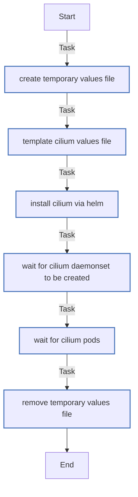

<!-- DOCSIBLE START -->

# 📃 Role overview

## cilium

| Field                | Value           |
|--------------------- |-----------------|
| Readme update        | 2026/01/05 |

### Defaults

**These are static variables with lower priority**

#### File: defaults/main.yml

| Var          | Type         | Value       |
|--------------|--------------|-------------|
| [cilium_version](defaults/main.yml#L2)   | str | `1.18.5` |    
| [cilium_chart_repo](defaults/main.yml#L3)   | str | `https://helm.cilium.io/` |    
| [cilium_chart_name](defaults/main.yml#L4)   | str | `cilium` |    
| [cilium_namespace](defaults/main.yml#L5)   | str | `kube-system` |    
| [cilium_rollout_timeout](defaults/main.yml#L6)   | int | `300` |    
| [cilium_wait_retries](defaults/main.yml#L7)   | int | `60` |    
| [cilium_wait_delay](defaults/main.yml#L8)   | int | `5` |    

### Tasks

#### File: tasks/main.yml

| Name | Module | Has Conditions |
| ---- | ------ | -------------- |
| Create temporary values file | ansible.builtin.tempfile | False |
| Template Cilium values file | ansible.builtin.template | False |
| Install Cilium via Helm | kubernetes.core.helm | False |
| Wait for Cilium DaemonSet to be created | ansible.builtin.command | False |
| Wait for cilium pods | ansible.builtin.command | False |
| Remove temporary values file | ansible.builtin.file | False |

## Task Flow Graphs

### Graph for main.yml

#### Dependencies

No dependencies specified.
<!-- DOCSIBLE END -->
