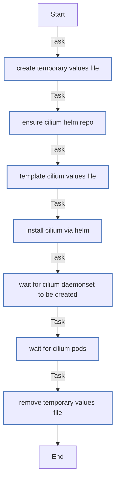

<!-- DOCSIBLE START -->

# 📃 Role overview

## cilium

Description: Installs and configures Cilium CNI for K3s clusters.

<b>🧩 Argument Specifications in meta/argument_specs</b>

#### Key: main

**Description**: Deploys Cilium CNI using Helm, managing values templating and rollout verification.

**Options**:

  - **cilium_version**
    - **Required**: False
    - **Type**: str
    - **Default**: 1.18.5
  
    - **Description**: Version of the Cilium Helm chart to install.
  
  
  

  - **cilium_chart_name**
    - **Required**: False
    - **Type**: str
    - **Default**: cilium
  
    - **Description**: Name of the chart in the repository (e.g., cilium/cilium).
  
  
  

  - **cilium_namespace**
    - **Required**: False
    - **Type**: str
    - **Default**: kube-system
  
    - **Description**: Kubernetes namespace where Cilium should be installed.
  
  
  

  - **cilium_rollout_timeout**
    - **Required**: False
    - **Type**: int
    - **Default**: 300
  
    - **Description**: Timeout (seconds) for waiting for Cilium pods rollout.
  
  
  

  - **cilium_wait_retries**
    - **Required**: False
    - **Type**: int
    - **Default**: 60
  
    - **Description**: Number of retries when checking for DaemonSet creation.
  
  
  

  - **cilium_wait_delay**
    - **Required**: False
    - **Type**: int
    - **Default**: 5
  
    - **Description**: Delay (seconds) between DaemonSet existence checks.
  
  
  

### Defaults

**These are static variables with lower priority**

#### File: defaults/main.yml

| Var          | Type         | Value       |Required    | Title       |
|--------------|--------------|-------------|------------|-------------|
| [cilium_version](defaults/main.yml#L6)   | str | `1.18.5` |    false  |  Cilium Version |
| [cilium_chart_name](defaults/main.yml#L11)   | str | `cilium` |    false  |  Chart Name |
| [cilium_namespace](defaults/main.yml#L16)   | str | `kube-system` |    false  |  Namespace |
| [cilium_rollout_timeout](defaults/main.yml#L21)   | int | `300` |    false  |  Rollout Timeout |
| [cilium_wait_retries](defaults/main.yml#L26)   | int | `60` |    false  |  Wait Retries |
| [cilium_wait_delay](defaults/main.yml#L31)   | int | `5` |    false  |  Wait Delay |
| [cilium_devices](defaults/main.yml#L36)   | str | `eth+ en+ ens+` |    false  |  Cilium devices |

<b>🖇️ Full descriptions for vars in defaults/main.yml</b>

 
<table>
<th>Var</th><th>Description</th>
<tr><td><b>cilium_version</b></td><td>Version of the Cilium Helm chart to install.</td></tr>
<tr><td><b>cilium_chart_name</b></td><td>Name of the chart in the repository (e.g., cilium/cilium).</td></tr>
<tr><td><b>cilium_namespace</b></td><td>Kubernetes namespace where Cilium should be installed.</td></tr>
<tr><td><b>cilium_rollout_timeout</b></td><td>Timeout (seconds) for waiting for Cilium pods rollout.</td></tr>
<tr><td><b>cilium_wait_retries</b></td><td>Number of retries when checking for DaemonSet creation.</td></tr>
<tr><td><b>cilium_wait_delay</b></td><td>Delay (seconds) between DaemonSet existence checks.</td></tr>
<tr><td><b>cilium_devices</b></td><td>Space-separated device patterns to include (exclude tailscale0).</td></tr>
</table>
 

### Tasks

#### File: tasks/main.yml

| Name | Module | Has Conditions |
| ---- | ------ | -------------- |
| [Create temporary values file](tasks/main.yml#L2) | ansible.builtin.tempfile | False |
| [Ensure Cilium Helm repo](tasks/main.yml#L8) | ansible.builtin.command | False |
| [Template Cilium values file](tasks/main.yml#L13) | ansible.builtin.template | False |
| [Install Cilium via Helm](tasks/main.yml#L19) | kubernetes.core.helm | False |
| [Wait for Cilium DaemonSet to be created](tasks/main.yml#L30) | ansible.builtin.command | False |
| [Wait for cilium pods](tasks/main.yml#L39) | ansible.builtin.command | False |
| [Remove temporary values file](tasks/main.yml#L47) | ansible.builtin.file | False |

## Task Flow Graphs

### Graph for main.yml

## Author Information
Roura

#### License

MIT

#### Minimum Ansible Version

2.20.0

#### Platforms

- **Ubuntu**: ['noble']

#### Dependencies

No dependencies specified.
<!-- DOCSIBLE END -->
