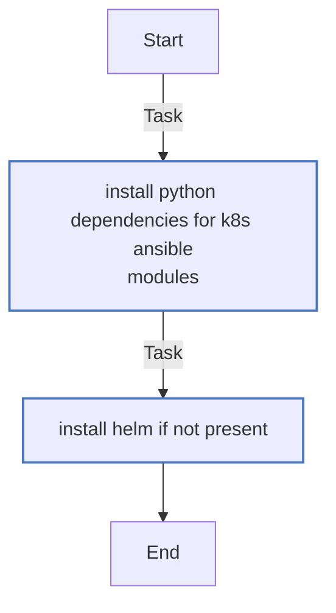
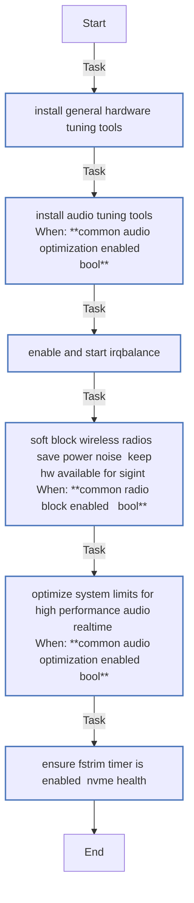
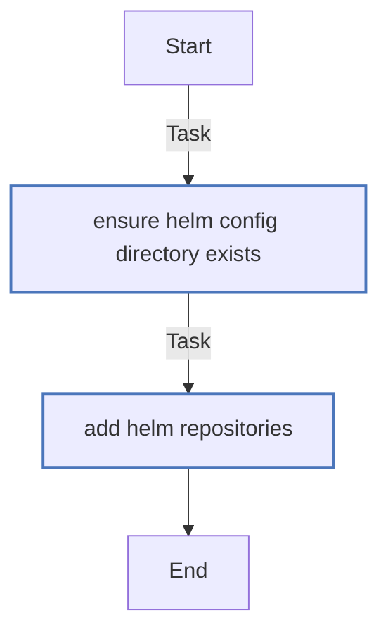
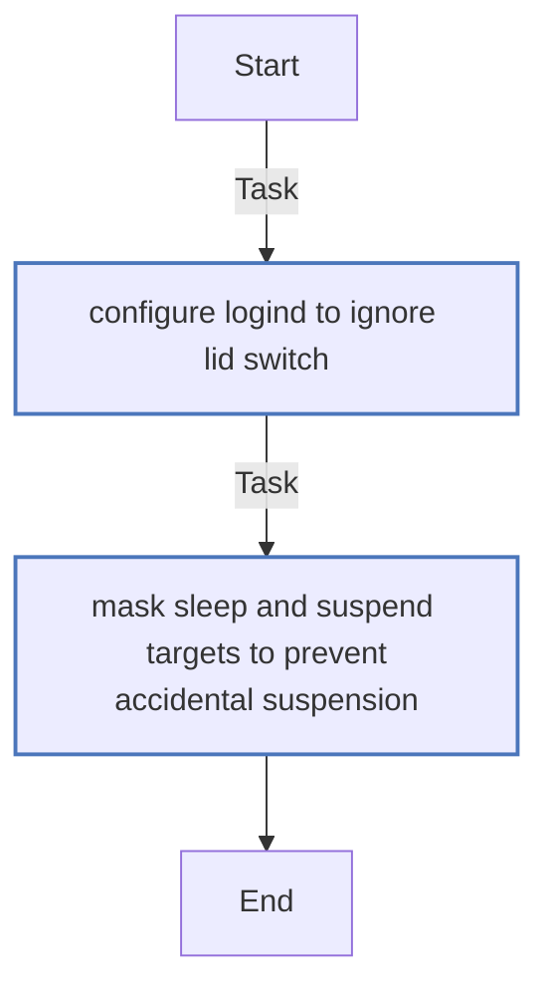
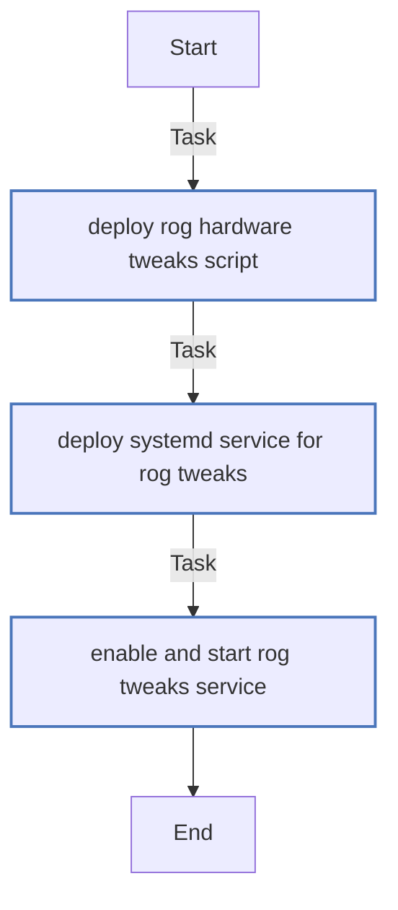

<!-- DOCSIBLE START -->

# 📃 Role overview

## common

Description: Common system configurations and optimizations for K3s homelab.

<b>🧩 Argument Specifications in meta/argument_specs</b>

#### Key: main

**Description**: Configures base system settings including kernel tuning, power management,
RoG hardware tweaks, and network optimizations.

**Options**:

  - **common_network_optimization_enabled**
    - **Required**: False
    - **Type**: bool
    - **Default**: True
  
    - **Description**: Enables sysctl adjustments for network performance.
  
  
  

  - **common_rog_server**
    - **Required**: False
    - **Type**: bool
    - **Default**: True
  
    - **Description**: Enables ASUS RoG specific hardware tweaks (drivers, LEDs, power profiles).
  
  
  

  - **common_radio_block_enabled**
    - **Required**: False
    - **Type**: bool
    - **Default**: True
  
    - **Description**: Soft-blocks WiFi and Bluetooth radios to save power.
  
  
  

  - **common_audio_optimization_enabled**
    - **Required**: False
    - **Type**: bool
    - **Default**: True
  
    - **Description**: Installs alsa-utils and configures realtime limits for audio.
  
  
  

  - **common_file_descriptors_soft**
    - **Required**: False
    - **Type**: int
    - **Default**: 100000
  
    - **Description**: Soft limit for open file descriptors (ulimit -n).
  
  
  

  - **common_file_descriptors_hard**
    - **Required**: False
    - **Type**: int
    - **Default**: 100000
  
    - **Description**: Hard limit for open file descriptors.
  
  
  

  - **common_fs_file_max**
    - **Required**: False
    - **Type**: int
    - **Default**: 2097152
  
    - **Description**: System-wide maximum number of open file descriptors.
  
  
  

  - **common_inotify_max_instances**
    - **Required**: False
    - **Type**: int
    - **Default**: 8192
  
    - **Description**: Max inotify instances per user.
  
  
  

  - **common_inotify_max_watches**
    - **Required**: False
    - **Type**: int
    - **Default**: 524288
  
    - **Description**: Max inotify watches per user.
  
  
  

  - **common_watchdog_timeout_sec**
    - **Required**: False
    - **Type**: int
    - **Default**: 120
  
    - **Description**: Hardware watchdog timeout in seconds (RuntimeWatchdogSec).
  
  
  

  - **common_battery_charge_threshold**
    - **Required**: False
    - **Type**: int
    - **Default**: 80
  
    - **Description**: Battery charge limit percentage for RoG laptops.
  
  
  

  - **common_thermal_policy**
    - **Required**: False
    - **Type**: int
    - **Default**: 1
  
    - **Description**: RoG thermal policy ID (0=balanced, 1=turbo, 2=silent - check specific model).
  
  
  

  - **common_ring_buffer_target**
    - **Required**: False
    - **Type**: int
    - **Default**: 4096
  
    - **Description**: Target size for network ring buffers.
  
  
  

  - **common_mining_enabled**
    - **Required**: False
    - **Type**: bool
    - **Default**: True
  
    - **Description**: Enables optimizations for crypto mining (hugepages, MSR).
  
  
  

  - **common_hugepages_count**
    - **Required**: False
    - **Type**: int
    - **Default**: 1280
  
    - **Description**: Number of hugepages to allocate if mining is enabled.
  
  
  

  - **common_helm_repositories**
    - **Required**: False
    - **Type**: list
    - **Default**: []
  
    - **Description**: List of Helm repositories to add.
  
  
  
    
  

### Defaults

**These are static variables with lower priority**

#### File: defaults/main.yml

| Var          | Type         | Value       |Required    | Title       |
|--------------|--------------|-------------|------------|-------------|
| [common_network_optimization_enabled](defaults/main.yml#L6)   | bool | `True` |    false  |  Network Optimization |
| [common_rog_server](defaults/main.yml#L12)   | bool | `True` |    false  |  RoG Server Support |
| [common_radio_block_enabled](defaults/main.yml#L18)   | bool | `True` |    false  |  Radio Block |
| [common_audio_optimization_enabled](defaults/main.yml#L24)   | bool | `True` |    false  |  Audio Optimization |
| [common_file_descriptors_soft](defaults/main.yml#L30)   | int | `100000` |    false  |  File Descriptors (Soft) |
| [common_file_descriptors_hard](defaults/main.yml#L36)   | int | `100000` |    false  |  File Descriptors (Hard) |
| [common_fs_file_max](defaults/main.yml#L42)   | int | `2097152` |    false  |  System File Max |
| [common_inotify_max_instances](defaults/main.yml#L48)   | int | `8192` |    false  |  Inotify Instances |
| [common_inotify_max_watches](defaults/main.yml#L54)   | int | `524288` |    false  |  Inotify Watches |
| [common_watchdog_timeout_sec](defaults/main.yml#L60)   | int | `120` |    false  |  Watchdog Timeout |
| [common_battery_charge_threshold](defaults/main.yml#L66)   | int | `80` |    false  |  Battery Charge Threshold |
| [common_thermal_policy](defaults/main.yml#L72)   | int | `1` |    false  |  Thermal Policy |
| [common_ring_buffer_target](defaults/main.yml#L78)   | int | `4096` |    false  |  Ring Buffer Target |
| [common_mining_enabled](defaults/main.yml#L84)   | bool | `True` |    false  |  Mining Optimization |
| [common_hugepages_count](defaults/main.yml#L90)   | int | `1280` |    false  |  Hugepages Count |
| [common_helm_repositories](defaults/main.yml#L96)   | list | `[]` |    false  |  Helm Repositories |
| [common_helm_repositories.**0**](defaults/main.yml#L97)   | dict | `{}` |    None  |  None |
| [common_helm_repositories.0.**name**](defaults/main.yml#L97)   | str | `cilium` |    None  |  None |
| [common_helm_repositories.0.**repo_url**](defaults/main.yml#L98)   | str | `https://helm.cilium.io/` |    None  |  None |
| [common_helm_repositories.**1**](defaults/main.yml#L99)   | dict | `{}` |    None  |  None |
| [common_helm_repositories.1.**name**](defaults/main.yml#L99)   | str | `nvdp` |    None  |  None |
| [common_helm_repositories.1.**repo_url**](defaults/main.yml#L100)   | str | `https://nvidia.github.io/k8s-device-plugin` |    None  |  None |

<b>🖇️ Full descriptions for vars in defaults/main.yml</b>

 
<table>
<th>Var</th><th>Description</th>
<tr><td><b>common_network_optimization_enabled</b></td><td>Enables sysctl adjustments for network performance.</td></tr>
<tr><td><b>common_rog_server</b></td><td>Enables ASUS RoG specific hardware tweaks (drivers, LEDs, power profiles).</td></tr>
<tr><td><b>common_radio_block_enabled</b></td><td>Soft-blocks WiFi and Bluetooth radios to save power.</td></tr>
<tr><td><b>common_audio_optimization_enabled</b></td><td>Installs alsa-utils and configures realtime limits for audio.</td></tr>
<tr><td><b>common_file_descriptors_soft</b></td><td>Soft limit for open file descriptors (ulimit -n).</td></tr>
<tr><td><b>common_file_descriptors_hard</b></td><td>Hard limit for open file descriptors.</td></tr>
<tr><td><b>common_fs_file_max</b></td><td>System-wide maximum number of open file descriptors.</td></tr>
<tr><td><b>common_inotify_max_instances</b></td><td>Max inotify instances per user.</td></tr>
<tr><td><b>common_inotify_max_watches</b></td><td>Max inotify watches per user.</td></tr>
<tr><td><b>common_watchdog_timeout_sec</b></td><td>Hardware watchdog timeout in seconds (RuntimeWatchdogSec).</td></tr>
<tr><td><b>common_battery_charge_threshold</b></td><td>Battery charge limit percentage for RoG laptops.</td></tr>
<tr><td><b>common_thermal_policy</b></td><td>RoG thermal policy ID (0=balanced, 1=turbo, 2=silent - check specific model).</td></tr>
<tr><td><b>common_ring_buffer_target</b></td><td>Target size for network ring buffers.</td></tr>
<tr><td><b>common_mining_enabled</b></td><td>Enables optimizations for crypto mining (hugepages, MSR).</td></tr>
<tr><td><b>common_hugepages_count</b></td><td>Number of hugepages to allocate if mining is enabled.</td></tr>
<tr><td><b>common_helm_repositories</b></td><td>List of Helm repositories to add.</td></tr>
</table>
 

### Tasks

#### File: tasks/dependencies.yml

| Name | Module | Has Conditions |
| ---- | ------ | -------------- |
| [Install Python dependencies for K8s Ansible modules](tasks/dependencies.yml#L2) | ansible.builtin.apt | False |
| [Install Helm (if not present)](tasks/dependencies.yml#L11) | ansible.builtin.shell | False |

#### File: tasks/hardware_tuning.yml

| Name | Module | Has Conditions |
| ---- | ------ | -------------- |
| [Install General Hardware Tuning Tools](tasks/hardware_tuning.yml#L2) | ansible.builtin.apt | False |
| [Install Audio Tuning Tools](tasks/hardware_tuning.yml#L8) | ansible.builtin.apt | True |
| [Enable and start irqbalance](tasks/hardware_tuning.yml#L14) | ansible.builtin.systemd | False |
| [Soft-block Wireless Radios (Save power/noise, keep HW available for SIGINT)](tasks/hardware_tuning.yml#L20) | ansible.builtin.command | True |
| [Optimize System Limits for High Performance Audio (Realtime)](tasks/hardware_tuning.yml#L28) | community.general.pam_limits | True |
| [Ensure fstrim.timer is enabled (NVMe Health)](tasks/hardware_tuning.yml#L38) | ansible.builtin.systemd | False |

#### File: tasks/helm_setup.yml

| Name | Module | Has Conditions |
| ---- | ------ | -------------- |
| [Ensure Helm config directory exists](tasks/helm_setup.yml#L2) | ansible.builtin.file | False |
| [Add Helm Repositories](tasks/helm_setup.yml#L9) | kubernetes.core.helm_repository | False |

#### File: tasks/main.yml

| Name | Module | Has Conditions |
| ---- | ------ | -------------- |
| [Disable swap now](tasks/main.yml#L2) | ansible.builtin.command | True |
| [Disable swap permanently in fstab](tasks/main.yml#L6) | ansible.builtin.replace | False |
| [Detect Ubuntu version for HWE kernel](tasks/main.yml#L11) | ansible.builtin.set_fact | False |
| [Set HWE kernel package name](tasks/main.yml#L14) | ansible.builtin.set_fact | True |
| [Install base packages](tasks/main.yml#L18) | ansible.builtin.apt | False |
| [Install Common Dependencies (Python/Helm)](tasks/main.yml#L29) | ansible.builtin.include_tasks | False |
| [Install HWE kernel (Ubuntu 20.04-24.04)](tasks/main.yml#L32) | ansible.builtin.apt | True |
| [Install generic kernel as fallback](tasks/main.yml#L39) | ansible.builtin.apt | True |
| [Register kernel changes for consolidated reboot](tasks/main.yml#L45) | ansible.builtin.set_fact | False |
| [Configure Power Management (Lid Switch / No Sleep)](tasks/main.yml#L50) | ansible.builtin.include_tasks | False |
| [Apply Hardware Tuning (CPU/Radios/Audio)](tasks/main.yml#L52) | ansible.builtin.include_tasks | False |
| [Apply System Kernel Tuning (BBR/Limits/Watchdog)](tasks/main.yml#L54) | ansible.builtin.include_tasks | False |
| [Apply RoG Server Hardware Tweaks](tasks/main.yml#L57) | ansible.builtin.include_tasks | True |
| [Initialize network_driver_changed if not set](tasks/main.yml#L60) | ansible.builtin.set_fact | True |
| [Consolidated Reboot - Phase 1 (Kernel + Network Drivers)](tasks/main.yml#L65) | ansible.builtin.reboot | True |
| [Configure Helm Repositories (User Level)](tasks/main.yml#L75) | ansible.builtin.include_tasks | False |

#### File: tasks/network_optimization.yml

| Name | Module | Has Conditions | Comments |
| ---- | ------ | -------------- | -------- |
| [RoG/Realtek Specific Optimizations](tasks/network_optimization.yml#L3) | block | True | Network optimization: Realtek drivers and network configuration |
| [Install Realtek driver (r8168-dkms)](tasks/network_optimization.yml#L6) | ansible.builtin.apt | False |  |
| [Blacklist unstable generic driver (r8169)](tasks/network_optimization.yml#L11) | ansible.builtin.copy | False |  |
| [Disable ASPM in GRUB](tasks/network_optimization.yml#L18) | ansible.builtin.lineinfile | False |  |
| [Ensure pcie_aspm=off is present exactly once](tasks/network_optimization.yml#L33) | ansible.builtin.replace | True | Prevents parameter duplication if the regex already added it |
| [Update GRUB](tasks/network_optimization.yml#L39) | ansible.builtin.command | True |  |
| [Register network driver changes for consolidated reboot](tasks/network_optimization.yml#L43) | ansible.builtin.set_fact | False |  |
| [Detect primary ethernet interface](tasks/network_optimization.yml#L59) | ansible.builtin.set_fact | True |  |
| [Deploy network optimization script](tasks/network_optimization.yml#L63) | ansible.builtin.template | False |  |
| [Deploy systemd service for network optimization](tasks/network_optimization.yml#L68) | ansible.builtin.copy | False |  |
| [Enable and start network optimization service](tasks/network_optimization.yml#L73) | ansible.builtin.systemd | False |  |

#### File: tasks/power_management.yml

| Name | Module | Has Conditions | Comments |
| ---- | ------ | -------------- | -------- |
| [Configure logind to ignore Lid Switch](tasks/power_management.yml#L3) | ansible.builtin.lineinfile | False | Power management: disable suspension and lid switch handling |
| [Mask sleep and suspend targets to prevent accidental suspension](tasks/power_management.yml#L14) | ansible.builtin.systemd | False |  |

#### File: tasks/rog_hardware.yml

| Name | Module | Has Conditions | Comments |
| ---- | ------ | -------------- | -------- |
| [Deploy RoG Hardware Tweaks Script](tasks/rog_hardware.yml#L7) | ansible.builtin.template | False | ROG HARDWARE TWEAKS - Low-level optimizations (always enabled) |
| [Deploy systemd service for RoG Tweaks](tasks/rog_hardware.yml#L12) | ansible.builtin.copy | False |  |
| [Enable and start RoG Tweaks service](tasks/rog_hardware.yml#L17) | ansible.builtin.systemd | False |  |

#### File: tasks/system_tuning.yml

| Name | Module | Has Conditions | Tags | Comments |
| ---- | ------ | -------------- | -----| -------- |
| [Install performance tools](tasks/system_tuning.yml#L3) | ansible.builtin.apt | False |  | Kernel optimization: CPU, networking, and system limits |
| [Set CPU Governor to Schedutil](tasks/system_tuning.yml#L8) | ansible.builtin.lineinfile | False |  |  |
| [Enable TCP BBR Congestion Control](tasks/system_tuning.yml#L16) | ansible.posix.sysctl | False |  |  |
| [Increase File Descriptors Limits](tasks/system_tuning.yml#L26) | community.general.pam_limits | False |  |  |
| [Increase System-wide File Max](tasks/system_tuning.yml#L35) | ansible.posix.sysctl | False |  |  |
| [Increase Inotify Watches](tasks/system_tuning.yml#L41) | ansible.posix.sysctl | False |  |  |
| [Increase Inotify User Watches](tasks/system_tuning.yml#L47) | ansible.posix.sysctl | False |  |  |
| [Enable Hardware Watchdog (Auto-reboot on freeze)](tasks/system_tuning.yml#L53) | ansible.builtin.lineinfile | False |  |  |
| [Configure Huge Pages for mining (RandomX)](tasks/system_tuning.yml#L59) | ansible.posix.sysctl | True | os |  |
| [Load MSR kernel module for CPU optimization](tasks/system_tuning.yml#L67) | community.general.modprobe | True | os |  |

## Task Flow Graphs

### Graph for dependencies.yml

### Graph for hardware_tuning.yml

### Graph for helm_setup.yml

### Graph for main.yml

```mermaid
flowchart TD
Start
classDef block stroke:#3498db,stroke-width:2px;
classDef task stroke:#4b76bb,stroke-width:2px;
classDef includeTasks stroke:#16a085,stroke-width:2px;
classDef importTasks stroke:#34495e,stroke-width:2px;
classDef includeRole stroke:#2980b9,stroke-width:2px;
classDef importRole stroke:#699ba7,stroke-width:2px;
classDef includeVars stroke:#8e44ad,stroke-width:2px;
classDef rescue stroke:#665352,stroke-width:2px;

  Start-->|Task| Disable_swap_now0[disable swap now<br>When: **ansible facts  swaptotal mb     0**]:::task
  Disable_swap_now0-->|Task| Disable_swap_permanently_in_fstab1[disable swap permanently in fstab]:::task
  Disable_swap_permanently_in_fstab1-->|Task| Detect_Ubuntu_version_for_HWE_kernel2[detect ubuntu version for hwe kernel]:::task
  Detect_Ubuntu_version_for_HWE_kernel2-->|Task| Set_HWE_kernel_package_name3[set hwe kernel package name<br>When: **ubuntu version is version  20 04         and<br>ubuntu version is version  24 04**]:::task
  Set_HWE_kernel_package_name3-->|Task| Install_base_packages4[install base packages]:::task
  Install_base_packages4-->|Include task| Install_Common_Dependencies__Python_Helm__dependencies_yml_5[install common dependencies  python helm <br>include_task: dependencies yml]:::includeTasks
  Install_Common_Dependencies__Python_Helm__dependencies_yml_5-->|Task| Install_HWE_kernel__Ubuntu_20_04_24_04_6[install hwe kernel  ubuntu 20 04 24 04 <br>When: **hwe kernel package is defined**]:::task
  Install_HWE_kernel__Ubuntu_20_04_24_04_6-->|Task| Install_generic_kernel_as_fallback7[install generic kernel as fallback<br>When: **common hwe kernel install is failed or hwe kernel<br>package is not defined**]:::task
  Install_generic_kernel_as_fallback7-->|Task| Register_kernel_changes_for_consolidated_reboot8[register kernel changes for consolidated reboot]:::task
  Register_kernel_changes_for_consolidated_reboot8-->|Include task| Configure_Power_Management__Lid_Switch___No_Sleep__power_management_yml_9[configure power management  lid switch   no sleep <br>include_task: power management yml]:::includeTasks
  Configure_Power_Management__Lid_Switch___No_Sleep__power_management_yml_9-->|Include task| Apply_Hardware_Tuning__CPU_Radios_Audio__hardware_tuning_yml_10[apply hardware tuning  cpu radios audio <br>include_task: hardware tuning yml]:::includeTasks
  Apply_Hardware_Tuning__CPU_Radios_Audio__hardware_tuning_yml_10-->|Include task| Apply_System_Kernel_Tuning__BBR_Limits_Watchdog__system_tuning_yml_11[apply system kernel tuning  bbr limits watchdog <br>include_task: system tuning yml]:::includeTasks
  Apply_System_Kernel_Tuning__BBR_Limits_Watchdog__system_tuning_yml_11-->|Include task| Apply_RoG_Server_Hardware_Tweaks_rog_hardware_yml_12[apply rog server hardware tweaks<br>When: **common rog server   default true    bool**<br>include_task: rog hardware yml]:::includeTasks
  Apply_RoG_Server_Hardware_Tweaks_rog_hardware_yml_12-->|Task| Initialize_network_driver_changed_if_not_set13[initialize network driver changed if not set<br>When: **common network driver changed is not defined**]:::task
  Initialize_network_driver_changed_if_not_set13-->|Task| Consolidated_Reboot___Phase_1__Kernel___Network_Drivers_14[consolidated reboot   phase 1  kernel   network<br>drivers <br>When: **common kernel changed   default false   or <br>common network driver changed   default false**]:::task
  Consolidated_Reboot___Phase_1__Kernel___Network_Drivers_14-->|Include task| Configure_Helm_Repositories__User_Level__helm_setup_yml_15[configure helm repositories  user level <br>include_task: helm setup yml]:::includeTasks
  Configure_Helm_Repositories__User_Level__helm_setup_yml_15-->End
```

### Graph for network_optimization.yml

```mermaid
flowchart TD
Start
classDef block stroke:#3498db,stroke-width:2px;
classDef task stroke:#4b76bb,stroke-width:2px;
classDef includeTasks stroke:#16a085,stroke-width:2px;
classDef importTasks stroke:#34495e,stroke-width:2px;
classDef includeRole stroke:#2980b9,stroke-width:2px;
classDef importRole stroke:#699ba7,stroke-width:2px;
classDef includeVars stroke:#8e44ad,stroke-width:2px;
classDef rescue stroke:#665352,stroke-width:2px;

  Start-->|Block Start| RoG_Realtek_Specific_Optimizations0_block_start_0[[rog realtek specific optimizations<br>When: **common rog server   bool**]]:::block
  RoG_Realtek_Specific_Optimizations0_block_start_0-->|Task| Install_Realtek_driver__r8168_dkms_0[install realtek driver  r8168 dkms ]:::task
  Install_Realtek_driver__r8168_dkms_0-->|Task| Blacklist_unstable_generic_driver__r8169_1[blacklist unstable generic driver  r8169 ]:::task
  Blacklist_unstable_generic_driver__r8169_1-->|Task| Disable_ASPM_in_GRUB2[disable aspm in grub]:::task
  Disable_ASPM_in_GRUB2-->|Task| Ensure_pcie_aspm_off_is_present_exactly_once3[ensure pcie aspm off is present exactly once<br>When: **common grub aspm changed**]:::task
  Ensure_pcie_aspm_off_is_present_exactly_once3-->|Task| Update_GRUB4[update grub<br>When: **common grub aspm changed**]:::task
  Update_GRUB4-->|Task| Register_network_driver_changes_for_consolidated_reboot5[register network driver changes for consolidated<br>reboot]:::task
  Register_network_driver_changes_for_consolidated_reboot5-.->|End of Block| RoG_Realtek_Specific_Optimizations0_block_start_0
  Register_network_driver_changes_for_consolidated_reboot5-->|Rescue Start| RoG_Realtek_Specific_Optimizations0_rescue_start_0[rog realtek specific optimizations<br>When: **common rog server   bool**]:::rescue
  RoG_Realtek_Specific_Optimizations0_rescue_start_0-->|Task| Report_RoG_Realtek_optimization_failure0[report rog realtek optimization failure]:::task
  Report_RoG_Realtek_optimization_failure0-->|Task| Fail_RoG_Realtek_optimization1[fail rog realtek optimization]:::task
  Fail_RoG_Realtek_optimization1-.->|End of Rescue Block| RoG_Realtek_Specific_Optimizations0_block_start_0
  Fail_RoG_Realtek_optimization1-->|Task| Detect_primary_ethernet_interface1[detect primary ethernet interface<br>When: **ansible facts  default ipv4    interface   is<br>defined**]:::task
  Detect_primary_ethernet_interface1-->|Task| Deploy_network_optimization_script2[deploy network optimization script]:::task
  Deploy_network_optimization_script2-->|Task| Deploy_systemd_service_for_network_optimization3[deploy systemd service for network optimization]:::task
  Deploy_systemd_service_for_network_optimization3-->|Task| Enable_and_start_network_optimization_service4[enable and start network optimization service]:::task
  Enable_and_start_network_optimization_service4-->End
```

### Graph for power_management.yml

### Graph for rog_hardware.yml

### Graph for system_tuning.yml

```mermaid
flowchart TD
Start
classDef block stroke:#3498db,stroke-width:2px;
classDef task stroke:#4b76bb,stroke-width:2px;
classDef includeTasks stroke:#16a085,stroke-width:2px;
classDef importTasks stroke:#34495e,stroke-width:2px;
classDef includeRole stroke:#2980b9,stroke-width:2px;
classDef importRole stroke:#699ba7,stroke-width:2px;
classDef includeVars stroke:#8e44ad,stroke-width:2px;
classDef rescue stroke:#665352,stroke-width:2px;

  Start-->|Task| Install_performance_tools0[install performance tools]:::task
  Install_performance_tools0-->|Task| Set_CPU_Governor_to_Schedutil1[set cpu governor to schedutil]:::task
  Set_CPU_Governor_to_Schedutil1-->|Task| Enable_TCP_BBR_Congestion_Control2[enable tcp bbr congestion control]:::task
  Enable_TCP_BBR_Congestion_Control2-->|Task| Increase_File_Descriptors_Limits3[increase file descriptors limits]:::task
  Increase_File_Descriptors_Limits3-->|Task| Increase_System_wide_File_Max4[increase system wide file max]:::task
  Increase_System_wide_File_Max4-->|Task| Increase_Inotify_Watches5[increase inotify watches]:::task
  Increase_Inotify_Watches5-->|Task| Increase_Inotify_User_Watches6[increase inotify user watches]:::task
  Increase_Inotify_User_Watches6-->|Task| Enable_Hardware_Watchdog__Auto_reboot_on_freeze_7[enable hardware watchdog  auto reboot on freeze ]:::task
  Enable_Hardware_Watchdog__Auto_reboot_on_freeze_7-->|Task| Configure_Huge_Pages_for_mining__RandomX_8[configure huge pages for mining  randomx <br>When: **common mining enabled   default true**]:::task
  Configure_Huge_Pages_for_mining__RandomX_8-->|Task| Load_MSR_kernel_module_for_CPU_optimization9[load msr kernel module for cpu optimization<br>When: **common mining enabled   default true**]:::task
  Load_MSR_kernel_module_for_CPU_optimization9-->End
```

## Author Information
rc

#### License

MIT

#### Minimum Ansible Version

2.9

#### Platforms

- **Ubuntu**: ['focal', 'jammy', 'noble']

#### Dependencies

No dependencies specified.
<!-- DOCSIBLE END -->
