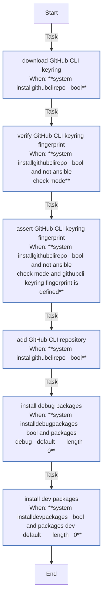
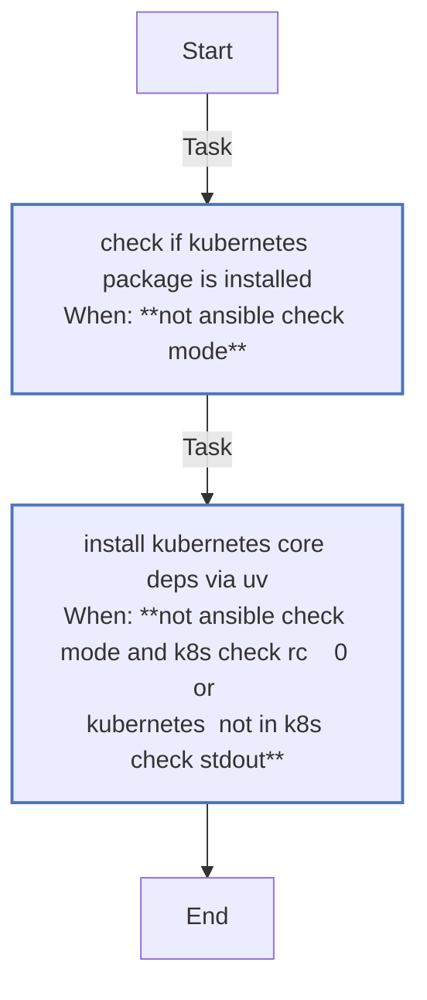
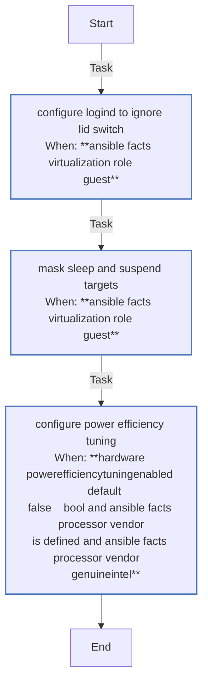

<!-- DOCSIBLE START -->

# 📃 Role overview

## common

Description: Common system configurations and optimizations for K3s homelab.

<b> Argument Specifications in meta/argument_specs</b>

#### Key: main

**Description**: Configures base system settings including kernel tuning, power management,
RoG hardware tweaks, and network optimizations.

**Options**:

  - **hardware_rogServer**
    - **Required**: False
    - **Type**: bool
    - **Default**: False
  
    - **Description**: Enables ASUS RoG specific hardware tweaks (drivers, LEDs, power profiles).
  
  
  

  - **hardware_radioBlockEnabled**
    - **Required**: False
    - **Type**: bool
    - **Default**: False
  
    - **Description**: Soft-blocks WiFi and Bluetooth radios to save power.
  
  
  

  - **hardware_audioOptimizationEnabled**
    - **Required**: False
    - **Type**: bool
    - **Default**: False
  
    - **Description**: Installs alsa-utils and configures realtime limits for audio.
  
  
  

  - **system_fileDescriptorsSoft**
    - **Required**: False
    - **Type**: int
    - **Default**: 100000
  
    - **Description**: Soft limit for open file descriptors (ulimit -n).
  
  
  

  - **system_fileDescriptorsHard**
    - **Required**: False
    - **Type**: int
    - **Default**: 100000
  
    - **Description**: Hard limit for open file descriptors.
  
  
  

  - **system_fsFileMax**
    - **Required**: False
    - **Type**: int
    - **Default**: 2097152
  
    - **Description**: System-wide maximum number of open file descriptors.
  
  
  

  - **system_inotifyMaxInstances**
    - **Required**: False
    - **Type**: int
    - **Default**: 8192
  
    - **Description**: Max inotify instances per user.
  
  
  

  - **system_inotifyMaxWatches**
    - **Required**: False
    - **Type**: int
    - **Default**: 524288
  
    - **Description**: Max inotify watches per user.
  
  
  

  - **system_watchdogTimeoutSec**
    - **Required**: False
    - **Type**: int
    - **Default**: 120
  
    - **Description**: Hardware watchdog timeout in seconds (RuntimeWatchdogSec).
  
  
  

  - **hardware_batteryChargeThreshold**
    - **Required**: False
    - **Type**: int
    - **Default**: 80
  
    - **Description**: Battery charge limit percentage for RoG laptops.
  
  
  

  - **hardware_thermalPolicy**
    - **Required**: False
    - **Type**: int
    - **Default**: 1
  
    - **Description**: RoG thermal policy ID (0=balanced, 1=turbo, 2=silent - check specific model).
  
  
  

  - **mining_cpuEnabled**
    - **Required**: False
    - **Type**: bool
    - **Default**: False
  
    - **Description**: Enables optimizations for crypto mining (hugepages, MSR).
  
  
  

  - **system_hugepagesCount**
    - **Required**: False
    - **Type**: int
    - **Default**: 1280
  
    - **Description**: Number of hugepages to allocate if mining is enabled (1280 ~ 2.5Gi).
  
  
  

  - **hardware_powerEfficiencyTuningEnabled**
    - **Required**: False
    - **Type**: bool
    - **Default**: False
  
    - **Description**: Enables Intel P-State power efficiency tuning.
  
  
  

  - **hardware_intelPstateMaxPerfPct**
    - **Required**: False
    - **Type**: int
    - **Default**: 80
  
    - **Description**: Maximum performance percentage for Intel P-State driver.
  
  
  

  - **hardware_intelPstateNoTurbo**
    - **Required**: False
    - **Type**: int
    - **Default**: 1
  
    - **Description**: Disable Intel Turbo Boost (1=disabled, 0=enabled).
  
  
  

  - **system_helmRepositories**
    - **Required**: False
    - **Type**: list
    - **Default**: []
  
    - **Description**: List of Helm repositories to add.
  
  
  
    
  

  - **system_installUv**
    - **Required**: False
    - **Type**: bool
    - **Default**: True
  
    - **Description**: Install uv Python package manager (required by Python roles).
  
  
  

### Tasks

#### File: tasks/binaries.yml

| Name | Module | Has Conditions | Comments |
| ---- | ------ | -------------- | -------- |
| [Install uv (Python Tool Manager)](tasks/binaries.yml#L2) | block | True | @docsible Block: Install uv (Fast Python Package Manager) |
| [Check if uv is installed](tasks/binaries.yml#L5) | ansible.builtin.stat | False | @docsible Checks for existing uv binary |
| [Download and install uv](tasks/binaries.yml#L10) | ansible.builtin.get_url | True | @docsible Downloads uv installer |
| [Run uv installer](tasks/binaries.yml#L19) | ansible.builtin.command | True | @docsible Executes uv installer |
| [Install Kubectl (Official Binary)](tasks/binaries.yml#L34) | block | True | @docsible Block: Install kubectl |
| [Get latest stable kubectl version](tasks/binaries.yml#L37) | ansible.builtin.uri | False | @docsible Resolves latest stable kubectl version |
| [Set kubectl version fact](tasks/binaries.yml#L44) | ansible.builtin.set_fact | False | @docsible Sets kubectl version fact |
| [Get kubectl checksum](tasks/binaries.yml#L48) | ansible.builtin.uri | False | @docsible Fetches kubectl SHA256 checksum |
| [Check current kubectl version](tasks/binaries.yml#L55) | ansible.builtin.command | False | @docsible Checks currently installed kubectl version |
| [Download and install kubectl](tasks/binaries.yml#L61) | ansible.builtin.get_url | True | @docsible Downloads and installs kubectl binary |
| [Install Helm (Official Script)](tasks/binaries.yml#L79) | block | True | @docsible Block: Install Helm 3 |
| [Check if helm is installed](tasks/binaries.yml#L82) | ansible.builtin.stat | False | @docsible Checks for existing helm binary |
| [Install Helm](tasks/binaries.yml#L87) | ansible.builtin.get_url | True | @docsible Downloads Helm installer script |
| [Run helm installer](tasks/binaries.yml#L98) | ansible.builtin.command | True | @docsible Executes Helm installer |
| [Install helm-diff plugin](tasks/binaries.yml#L105) | ansible.builtin.command | True | @docsible Installs helm-diff plugin |

#### File: tasks/dependencies.yml

| Name | Module | Has Conditions | Comments |
| ---- | ------ | -------------- | -------- |
| [Download GitHub CLI keyring](tasks/dependencies.yml#L2) | ansible.builtin.get_url | True | @docsible Downloads GitHub CLI GPG keyring |
| [Verify GitHub CLI keyring fingerprint](tasks/dependencies.yml#L11) | ansible.builtin.command | True | @docsible Verifies GPG keyring fingerprint against official ID |
| [Assert GitHub CLI keyring fingerprint](tasks/dependencies.yml#L21) | ansible.builtin.assert | True | @docsible Enforces GPG fingerprint match |
| [Add GitHub CLI repository](tasks/dependencies.yml#L32) | ansible.builtin.apt_repository | True | @docsible Adds signed GitHub CLI APT repository |
| [Install debug packages](tasks/dependencies.yml#L45) | ansible.builtin.apt | True | @docsible Installs network diagnostic tools (tcpdump, net-tools) |
| [Install dev packages](tasks/dependencies.yml#L55) | ansible.builtin.apt | True | @docsible Installs development tools (make, gcc) if enabled |

#### File: tasks/hardware_tuning.yml

| Name | Module | Has Conditions | Comments |
| ---- | ------ | -------------- | -------- |
| [Install tuning tools](tasks/hardware_tuning.yml#L2) | ansible.builtin.apt | True | @docsible Installs irqbalance for interrupt distribution |
| [Install audio tools](tasks/hardware_tuning.yml#L11) | ansible.builtin.apt | True | @docsible Installs ALSA tools for audio tuning |
| [Start irqbalance](tasks/hardware_tuning.yml#L19) | ansible.builtin.systemd | True | @docsible Starts irqbalance service |
| [Block wireless radios](tasks/hardware_tuning.yml#L28) | ansible.builtin.command | True | @docsible Blocks WiFi/Bluetooth via rfkill (Server Mode) |
| [Optimize audio limits](tasks/hardware_tuning.yml#L41) | community.general.pam_limits | True | @docsible Sets realtime priority limits for audio |
| [Enable fstrim](tasks/hardware_tuning.yml#L53) | ansible.builtin.systemd | False | @docsible Enables fstrim timer for SSD maintenance |
| [Deploy RoG Hardware Tweaks Script](tasks/hardware_tuning.yml#L61) | ansible.builtin.template | True | @docsible Deploys custom ASUS RoG hardware tuning script |
| [Deploy systemd service for RoG Tweaks](tasks/hardware_tuning.yml#L71) | ansible.builtin.copy | True | @docsible Installs systemd service for RoG tuning |
| [Enable and start RoG Tweaks service](tasks/hardware_tuning.yml#L81) | ansible.builtin.systemd | True | @docsible Starts RoG tuning service |

#### File: tasks/k8s_ansible_deps.yml

| Name | Module | Has Conditions | Tags | Comments |
| ---- | ------ | -------------- | -----| -------- |
| [Check if kubernetes package is installed](tasks/k8s_ansible_deps.yml#L2) | ansible.builtin.command | True |  | @docsible Checks for python-kubernetes package |
| [Install kubernetes.core deps via uv](tasks/k8s_ansible_deps.yml#L11) | ansible.builtin.command | True | k8s,deps | @docsible Installs kubernetes python library via uv |

#### File: tasks/main.yml

| Name | Module | Has Conditions | Comments |
| ---- | ------ | -------------- | -------- |
| [Disable swap](tasks/main.yml#L2) | ansible.builtin.command | True | @docsible Disables swap immediately (required for Kubelet) |
| [Disable swap (fstab)](tasks/main.yml#L9) | ansible.builtin.replace | False | @docsible Persists swap disablement in /etc/fstab |
| [Detect Ubuntu version](tasks/main.yml#L15) | ansible.builtin.set_fact | False | @docsible Detects Ubuntu version for HWE kernel selection |
| [Define kernel package](tasks/main.yml#L19) | ansible.builtin.set_fact | True | @docsible Resolves appropriate HWE kernel package name |
| [Install system base tools](tasks/main.yml#L24) | ansible.builtin.apt | False | @docsible Installs core utilities (curl, iptables, ethtool) |
| [Install NetworkManager](tasks/main.yml#L34) | ansible.builtin.apt | True | @docsible Installs NetworkManager (if enabled in vars) |
| [Install ACPI daemon](tasks/main.yml#L40) | ansible.builtin.apt | True | @docsible Installs ACPI daemon for power event handling |
| [Install dependencies](tasks/main.yml#L46) | ansible.builtin.include_tasks | False | @docsible Imports additional package dependencies |
| [Install HWE kernel](tasks/main.yml#L49) | ansible.builtin.apt | True | @docsible Installs Hardware Enablement (HWE) Kernel |
| [Install generic kernel](tasks/main.yml#L59) | ansible.builtin.apt | True | @docsible Falls back to generic kernel if HWE is unavailable |
| [Register kernel change](tasks/main.yml#L69) | ansible.builtin.set_fact | False | @docsible Flags reboot requirement if kernel changed |
| [Configure power](tasks/main.yml#L76) | ansible.builtin.include_tasks | False | @docsible Configures power management (lid switch, sleep masks) |
| [Apply hardware tuning](tasks/main.yml#L79) | ansible.builtin.include_tasks | False | @docsible Applies hardware tuning (irqbalance, audio, RoG) |
| [System Tuning](tasks/main.yml#L82) | ansible.builtin.include_tasks | False | @docsible Applies sysctl kernel tuning and limits |
| [Install Cloud-Native Binaries](tasks/main.yml#L85) | ansible.builtin.include_tasks | False | @docsible Installs kubectl, helm, and uv |
| [Ensure Helm config directory exists](tasks/main.yml#L89) | ansible.builtin.file | True | @docsible Creates Helm config directory structure |
| [Add Helm Repositories](tasks/main.yml#L98) | kubernetes.core.helm_repository | True | @docsible Registers upstream Helm repositories |
| [Install K8s Ansible deps](tasks/main.yml#L107) | ansible.builtin.include_tasks | True | @docsible Installs python-kubernetes via uv |

#### File: tasks/network_optimization.yml

| Name | Module | Has Conditions | Comments |
| ---- | ------ | -------------- | -------- |
| [Realtek optimizations](tasks/network_optimization.yml#L2) | block | True | @docsible Block: Realtek NIC driver replacement (r8169 -> r8168-dkms) |
| [Install Realtek driver](tasks/network_optimization.yml#L6) | ansible.builtin.apt | False | @docsible Installs r8168-dkms driver |
| [Blacklist generic driver](tasks/network_optimization.yml#L12) | ansible.builtin.copy | False | @docsible Blacklists kernel r8169 driver |
| [Ensure pcie_aspm=off in GRUB](tasks/network_optimization.yml#L20) | ansible.builtin.replace | False | @docsible Disables PCIe ASPM in GRUB to prevent NIC drops |
| [Update GRUB](tasks/network_optimization.yml#L27) | ansible.builtin.command | True | @docsible Regenerates GRUB configuration |
| [Register driver change](tasks/network_optimization.yml#L34) | ansible.builtin.set_fact | False | @docsible Flags reboot requirement for driver switch |
| [Detect primary ethernet interface](tasks/network_optimization.yml#L53) | ansible.builtin.set_fact | True | @docsible Identifies primary physical ethernet interface (skips Virtual/CNI) |
| [Deploy optimization script](tasks/network_optimization.yml#L83) | ansible.builtin.template | False | @docsible Deploys ethtool network optimization script |
| [Deploy optimization service](tasks/network_optimization.yml#L90) | ansible.builtin.copy | False | @docsible Installs network optimization systemd service |
| [Reload systemd daemon for network optimization](tasks/network_optimization.yml#L97) | ansible.builtin.systemd | True | @docsible Reloads systemd |
| [Start optimization service](tasks/network_optimization.yml#L105) | ansible.builtin.systemd | True | @docsible Starts network optimization service |

#### File: tasks/power_management.yml

| Name | Module | Has Conditions | Comments |
| ---- | ------ | -------------- | -------- |
| [Configure logind to ignore Lid Switch](tasks/power_management.yml#L2) | ansible.builtin.lineinfile | True | @docsible Configures logind to ignore Lid Switch events |
| [Mask sleep and suspend targets](tasks/power_management.yml#L16) | ansible.builtin.systemd | True | @docsible Masks sleep/suspend systemd targets |
| [Configure Power Efficiency Tuning](tasks/power_management.yml#L30) | ansible.builtin.template | True | @docsible Deploys Intel RAPL energy tuning config |

#### File: tasks/system_tuning.yml

| Name | Module | Has Conditions | Tags | Comments |
| ---- | ------ | -------------- | -----| -------- |
| [Install performance tools](tasks/system_tuning.yml#L2) | ansible.builtin.apt | True |  | @docsible Installs cpufrequtils for governor control |
| [Set CPU governor](tasks/system_tuning.yml#L10) | ansible.builtin.lineinfile | True |  | @docsible Sets CPU governor to 'schedutil' |
| [Enable BBR and Network Tuning](tasks/system_tuning.yml#L21) | ansible.posix.sysctl | False |  | @docsible Enables TCP BBR congestion control and optimizations |
| [Akash Provider sysctl tuning](tasks/system_tuning.yml#L41) | ansible.posix.sysctl | True |  | @docsible Tunes sysctl for high-concurrency Akash workloads |
| [Increase FD limits](tasks/system_tuning.yml#L56) | community.general.pam_limits | False |  | @docsible Increases PAM file descriptor limits (soft/hard) |
| [Increase file-max](tasks/system_tuning.yml#L67) | ansible.posix.sysctl | False |  | @docsible Increases system-wide fs.file-max |
| [Increase inotify watches](tasks/system_tuning.yml#L75) | ansible.posix.sysctl | False |  | @docsible Increases fs.inotify.max_user_instances |
| [Increase user watches](tasks/system_tuning.yml#L83) | ansible.posix.sysctl | False |  | @docsible Increases fs.inotify.max_user_watches |
| [Enable watchdog](tasks/system_tuning.yml#L91) | ansible.builtin.lineinfile | False |  | @docsible Enables RuntimeWatchdogSec for system recovery |
| [Configure hugepages](tasks/system_tuning.yml#L99) | ansible.posix.sysctl | True | host | @docsible Allocates HugePages for mining efficiency |
| [Load MSR module](tasks/system_tuning.yml#L110) | community.general.modprobe | True | host | @docsible Loads msr kernel module for CPU mining (RandomX) |
| [Configure Nvidia modules load](tasks/system_tuning.yml#L119) | ansible.builtin.copy | True | host,nvidia | @docsible Pre-loads NVIDIA kernel modules |

## Task Flow Graphs

### Graph for binaries.yml

```mermaid
flowchart TD
Start
classDef block stroke:#3498db,stroke-width:2px;
classDef task stroke:#4b76bb,stroke-width:2px;
classDef includeTasks stroke:#16a085,stroke-width:2px;
classDef importTasks stroke:#34495e,stroke-width:2px;
classDef includeRole stroke:#2980b9,stroke-width:2px;
classDef importRole stroke:#699ba7,stroke-width:2px;
classDef includeVars stroke:#8e44ad,stroke-width:2px;
classDef rescue stroke:#665352,stroke-width:2px;

  Start-->|Block Start| Install_uv__Python_Tool_Manager_0_block_start_0[[install uv  python tool manager <br>When: **system installuv   bool and not ansible check mode**]]:::block
  Install_uv__Python_Tool_Manager_0_block_start_0-->|Task| Check_if_uv_is_installed0[check if uv is installed]:::task
  Check_if_uv_is_installed0-->|Task| Download_and_install_uv1[download and install uv<br>When: **not uv binary stat exists**]:::task
  Download_and_install_uv1-->|Task| Run_uv_installer2[run uv installer<br>When: **not uv binary stat exists**]:::task
  Run_uv_installer2-.->|End of Block| Install_uv__Python_Tool_Manager_0_block_start_0
  Run_uv_installer2-->|Rescue Start| Install_uv__Python_Tool_Manager_0_rescue_start_0[install uv  python tool manager <br>When: **system installuv   bool and not ansible check mode**]:::rescue
  Install_uv__Python_Tool_Manager_0_rescue_start_0-->|Task| Report_uv_installation_failure0[report uv installation failure]:::task
  Report_uv_installation_failure0-.->|End of Rescue Block| Install_uv__Python_Tool_Manager_0_block_start_0
  Report_uv_installation_failure0-->|Block Start| Install_Kubectl__Official_Binary_1_block_start_0[[install kubectl  official binary <br>When: **system installcloudbinaries   bool and not ansible<br>check mode**]]:::block
  Install_Kubectl__Official_Binary_1_block_start_0-->|Task| Get_latest_stable_kubectl_version0[get latest stable kubectl version]:::task
  Get_latest_stable_kubectl_version0-->|Task| Set_kubectl_version_fact1[set kubectl version fact]:::task
  Set_kubectl_version_fact1-->|Task| Get_kubectl_checksum2[get kubectl checksum]:::task
  Get_kubectl_checksum2-->|Task| Check_current_kubectl_version3[check current kubectl version]:::task
  Check_current_kubectl_version3-->|Task| Download_and_install_kubectl4[download and install kubectl<br>When: **kubectl current version failed or kubectl version<br>not in kubectl current version stdout**]:::task
  Download_and_install_kubectl4-.->|End of Block| Install_Kubectl__Official_Binary_1_block_start_0
  Download_and_install_kubectl4-->|Rescue Start| Install_Kubectl__Official_Binary_1_rescue_start_0[install kubectl  official binary <br>When: **system installcloudbinaries   bool and not ansible<br>check mode**]:::rescue
  Install_Kubectl__Official_Binary_1_rescue_start_0-->|Task| Report_kubectl_installation_failure0[report kubectl installation failure]:::task
  Report_kubectl_installation_failure0-.->|End of Rescue Block| Install_Kubectl__Official_Binary_1_block_start_0
  Report_kubectl_installation_failure0-->|Block Start| Install_Helm__Official_Script_2_block_start_0[[install helm  official script <br>When: **system installcloudbinaries   bool and not ansible<br>check mode**]]:::block
  Install_Helm__Official_Script_2_block_start_0-->|Task| Check_if_helm_is_installed0[check if helm is installed]:::task
  Check_if_helm_is_installed0-->|Task| Install_Helm1[install helm<br>When: **not helm binary stat exists**]:::task
  Install_Helm1-->|Task| Run_helm_installer2[run helm installer<br>When: **not helm binary stat exists**]:::task
  Run_helm_installer2-->|Task| Install_helm_diff_plugin3[install helm diff plugin<br>When: **not ansible check mode or helm binary stat exists**]:::task
  Install_helm_diff_plugin3-.->|End of Block| Install_Helm__Official_Script_2_block_start_0
  Install_helm_diff_plugin3-->|Rescue Start| Install_Helm__Official_Script_2_rescue_start_0[install helm  official script <br>When: **system installcloudbinaries   bool and not ansible<br>check mode**]:::rescue
  Install_Helm__Official_Script_2_rescue_start_0-->|Task| Report_helm_installation_failure0[report helm installation failure]:::task
  Report_helm_installation_failure0-.->|End of Rescue Block| Install_Helm__Official_Script_2_block_start_0
  Report_helm_installation_failure0-->End
```

### Graph for dependencies.yml

### Graph for hardware_tuning.yml

```mermaid
flowchart TD
Start
classDef block stroke:#3498db,stroke-width:2px;
classDef task stroke:#4b76bb,stroke-width:2px;
classDef includeTasks stroke:#16a085,stroke-width:2px;
classDef importTasks stroke:#34495e,stroke-width:2px;
classDef includeRole stroke:#2980b9,stroke-width:2px;
classDef importRole stroke:#699ba7,stroke-width:2px;
classDef includeVars stroke:#8e44ad,stroke-width:2px;
classDef rescue stroke:#665352,stroke-width:2px;

  Start-->|Task| Install_tuning_tools0[install tuning tools<br>When: **ansible facts  virtualization role       guest**]:::task
  Install_tuning_tools0-->|Task| Install_audio_tools1[install audio tools<br>When: **hardware audiooptimizationenabled   default false <br>  bool**]:::task
  Install_audio_tools1-->|Task| Start_irqbalance2[start irqbalance<br>When: **ansible facts  virtualization role       guest**]:::task
  Start_irqbalance2-->|Task| Block_wireless_radios3[block wireless radios<br>When: **hardware radioblockenabled   default false    bool<br>and ansible facts  virtualization role       guest<br> and not ansible check mode**]:::task
  Block_wireless_radios3-->|Task| Optimize_audio_limits4[optimize audio limits<br>When: **hardware audiooptimizationenabled   default false <br>  bool**]:::task
  Optimize_audio_limits4-->|Task| Enable_fstrim5[enable fstrim]:::task
  Enable_fstrim5-->|Task| Deploy_RoG_Hardware_Tweaks_Script6[deploy rog hardware tweaks script<br>When: **hardware rogserver   default false    bool and<br>ansible facts  virtualization role     default <br>guest       guest**]:::task
  Deploy_RoG_Hardware_Tweaks_Script6-->|Task| Deploy_systemd_service_for_RoG_Tweaks7[deploy systemd service for rog tweaks<br>When: **hardware rogserver   default false    bool and<br>ansible facts  virtualization role     default <br>guest       guest**]:::task
  Deploy_systemd_service_for_RoG_Tweaks7-->|Task| Enable_and_start_RoG_Tweaks_service8[enable and start rog tweaks service<br>When: **hardware rogserver   default false    bool and<br>ansible facts  virtualization role     default <br>guest       guest**]:::task
  Enable_and_start_RoG_Tweaks_service8-->End
```

### Graph for k8s_ansible_deps.yml

### Graph for main.yml

```mermaid
flowchart TD
Start
classDef block stroke:#3498db,stroke-width:2px;
classDef task stroke:#4b76bb,stroke-width:2px;
classDef includeTasks stroke:#16a085,stroke-width:2px;
classDef importTasks stroke:#34495e,stroke-width:2px;
classDef includeRole stroke:#2980b9,stroke-width:2px;
classDef importRole stroke:#699ba7,stroke-width:2px;
classDef includeVars stroke:#8e44ad,stroke-width:2px;
classDef rescue stroke:#665352,stroke-width:2px;

  Start-->|Task| Disable_swap0[disable swap<br>When: **ansible facts  swaptotal mb     0 and not ansible<br>check mode**]:::task
  Disable_swap0-->|Task| Disable_swap__fstab_1[disable swap  fstab ]:::task
  Disable_swap__fstab_1-->|Task| Detect_Ubuntu_version2[detect ubuntu version]:::task
  Detect_Ubuntu_version2-->|Task| Define_kernel_package3[define kernel package<br>When: **ubuntu version is version  20 04         and<br>ubuntu version is version  24 04**]:::task
  Define_kernel_package3-->|Task| Install_system_base_tools4[install system base tools]:::task
  Install_system_base_tools4-->|Task| Install_NetworkManager5[install networkmanager<br>When: **system installnetworkmanager   bool**]:::task
  Install_NetworkManager5-->|Task| Install_ACPI_daemon6[install acpi daemon<br>When: **system installacpid   bool**]:::task
  Install_ACPI_daemon6-->|Include task| Install_dependencies_dependencies_yml_7[install dependencies<br>include_task: dependencies yml]:::includeTasks
  Install_dependencies_dependencies_yml_7-->|Task| Install_HWE_kernel8[install hwe kernel<br>When: **hwe kernel package is defined and system<br>installhwekernel   bool**]:::task
  Install_HWE_kernel8-->|Task| Install_generic_kernel9[install generic kernel<br>When: **common hwe kernel install is skipped  or  common<br>hwe kernel install is failed  or  hwe kernel<br>package is not defined**]:::task
  Install_generic_kernel9-->|Task| Register_kernel_change10[register kernel change]:::task
  Register_kernel_change10-->|Include task| Configure_power_power_management_yml_11[configure power<br>include_task: power management yml]:::includeTasks
  Configure_power_power_management_yml_11-->|Include task| Apply_hardware_tuning_hardware_tuning_yml_12[apply hardware tuning<br>include_task: hardware tuning yml]:::includeTasks
  Apply_hardware_tuning_hardware_tuning_yml_12-->|Include task| System_Tuning_system_tuning_yml_13[system tuning<br>include_task: system tuning yml]:::includeTasks
  System_Tuning_system_tuning_yml_13-->|Include task| Install_Cloud_Native_Binaries_binaries_yml_14[install cloud native binaries<br>include_task: binaries yml]:::includeTasks
  Install_Cloud_Native_Binaries_binaries_yml_14-->|Task| Ensure_Helm_config_directory_exists15[ensure helm config directory exists<br>When: **system installcloudbinaries   bool**]:::task
  Ensure_Helm_config_directory_exists15-->|Task| Add_Helm_Repositories16[add helm repositories<br>When: **system installcloudbinaries   bool**]:::task
  Add_Helm_Repositories16-->|Include task| Install_K8s_Ansible_deps_k8s_ansible_deps_yml_17[install k8s ansible deps<br>When: **system installk8sansibledeps   bool and system<br>installcloudbinaries   bool**<br>include_task: k8s ansible deps yml]:::includeTasks
  Install_K8s_Ansible_deps_k8s_ansible_deps_yml_17-->End
```

### Graph for network_optimization.yml

```mermaid
flowchart TD
Start
classDef block stroke:#3498db,stroke-width:2px;
classDef task stroke:#4b76bb,stroke-width:2px;
classDef includeTasks stroke:#16a085,stroke-width:2px;
classDef importTasks stroke:#34495e,stroke-width:2px;
classDef includeRole stroke:#2980b9,stroke-width:2px;
classDef importRole stroke:#699ba7,stroke-width:2px;
classDef includeVars stroke:#8e44ad,stroke-width:2px;
classDef rescue stroke:#665352,stroke-width:2px;

  Start-->|Block Start| Realtek_optimizations0_block_start_0[[realtek optimizations<br>When: **hardware rogserver   default false    bool**]]:::block
  Realtek_optimizations0_block_start_0-->|Task| Install_Realtek_driver0[install realtek driver]:::task
  Install_Realtek_driver0-->|Task| Blacklist_generic_driver1[blacklist generic driver]:::task
  Blacklist_generic_driver1-->|Task| Ensure_pcie_aspm_off_in_GRUB2[ensure pcie aspm off in grub]:::task
  Ensure_pcie_aspm_off_in_GRUB2-->|Task| Update_GRUB3[update grub<br>When: **common grub aspm changed and not ansible check<br>mode**]:::task
  Update_GRUB3-->|Task| Register_driver_change4[register driver change]:::task
  Register_driver_change4-.->|End of Block| Realtek_optimizations0_block_start_0
  Register_driver_change4-->|Rescue Start| Realtek_optimizations0_rescue_start_0[realtek optimizations<br>When: **hardware rogserver   default false    bool**]:::rescue
  Realtek_optimizations0_rescue_start_0-->|Task| Report_RoG_Realtek_optimization_failure0[report rog realtek optimization failure]:::task
  Report_RoG_Realtek_optimization_failure0-->|Task| Fail_RoG_Realtek_optimization1[fail rog realtek optimization]:::task
  Fail_RoG_Realtek_optimization1-.->|End of Rescue Block| Realtek_optimizations0_block_start_0
  Fail_RoG_Realtek_optimization1-->|Task| Detect_primary_ethernet_interface1[detect primary ethernet interface<br>When: **ansible facts  interfaces   is defined**]:::task
  Detect_primary_ethernet_interface1-->|Task| Deploy_optimization_script2[deploy optimization script]:::task
  Deploy_optimization_script2-->|Task| Deploy_optimization_service3[deploy optimization service]:::task
  Deploy_optimization_service3-->|Task| Reload_systemd_daemon_for_network_optimization4[reload systemd daemon for network optimization<br>When: **ansible facts  service mgr       systemd  and not<br>ansible check mode**]:::task
  Reload_systemd_daemon_for_network_optimization4-->|Task| Start_optimization_service5[start optimization service<br>When: **ansible facts  service mgr       systemd  and not<br>ansible check mode**]:::task
  Start_optimization_service5-->End
```

### Graph for power_management.yml

### Graph for system_tuning.yml

```mermaid
flowchart TD
Start
classDef block stroke:#3498db,stroke-width:2px;
classDef task stroke:#4b76bb,stroke-width:2px;
classDef includeTasks stroke:#16a085,stroke-width:2px;
classDef importTasks stroke:#34495e,stroke-width:2px;
classDef includeRole stroke:#2980b9,stroke-width:2px;
classDef importRole stroke:#699ba7,stroke-width:2px;
classDef includeVars stroke:#8e44ad,stroke-width:2px;
classDef rescue stroke:#665352,stroke-width:2px;

  Start-->|Task| Install_performance_tools0[install performance tools<br>When: **ansible facts  virtualization role       guest**]:::task
  Install_performance_tools0-->|Task| Set_CPU_governor1[set cpu governor<br>When: **ansible facts  virtualization role       guest**]:::task
  Set_CPU_governor1-->|Task| Enable_BBR_and_Network_Tuning2[enable bbr and network tuning]:::task
  Enable_BBR_and_Network_Tuning2-->|Task| Akash_Provider_sysctl_tuning3[akash provider sysctl tuning<br>When: **akash provider enabled   default false**]:::task
  Akash_Provider_sysctl_tuning3-->|Task| Increase_FD_limits4[increase fd limits]:::task
  Increase_FD_limits4-->|Task| Increase_file_max5[increase file max]:::task
  Increase_file_max5-->|Task| Increase_inotify_watches6[increase inotify watches]:::task
  Increase_inotify_watches6-->|Task| Increase_user_watches7[increase user watches]:::task
  Increase_user_watches7-->|Task| Enable_watchdog8[enable watchdog]:::task
  Enable_watchdog8-->|Task| Configure_hugepages9[configure hugepages<br>When: **mining cpuenabled   default false  or mining<br>gpuenabled   default false**]:::task
  Configure_hugepages9-->|Task| Load_MSR_module10[load msr module<br>When: **mining cpuenabled   default false**]:::task
  Load_MSR_module10-->|Task| Configure_Nvidia_modules_load11[configure nvidia modules load<br>When: **mining gpuenabled   default false**]:::task
  Configure_Nvidia_modules_load11-->End
```

## Author Information
rc

### License

MIT

### Minimum Ansible Version

2.20.0

### Platforms

- **Ubuntu**: ['noble']

### Dependencies

No dependencies specified.
<!-- DOCSIBLE END -->
