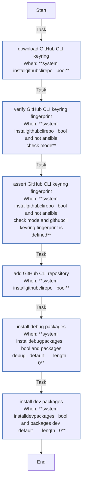
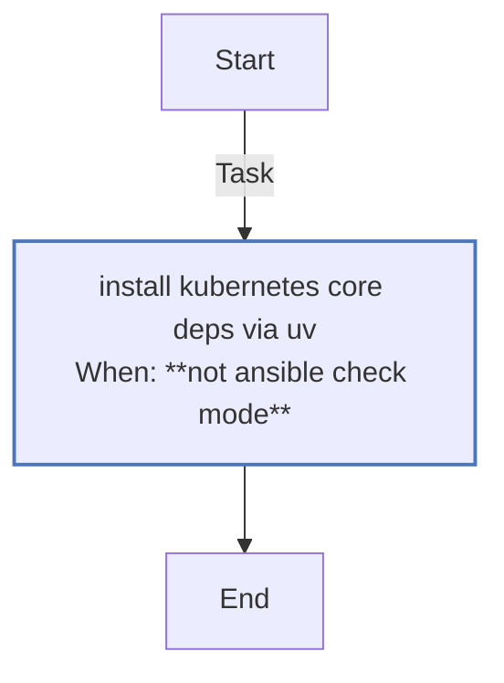
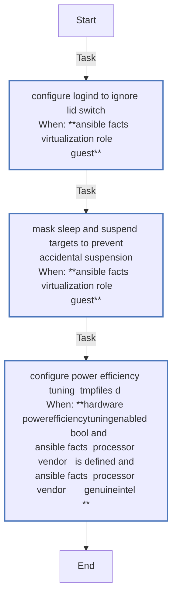

<!-- DOCSIBLE START -->

# 📃 Role overview

## common

Description: Common system configurations and optimizations for K3s homelab.

<b> Argument Specifications in meta/argument_specs</b>

#### Key: main

**Description**: Configures base system settings including kernel tuning, power management,
RoG hardware tweaks, and network optimizations.

**Options**:

  - **hardware_rogServer**
    - **Required**: False
    - **Type**: bool
    - **Default**: False
  
    - **Description**: Enables ASUS RoG specific hardware tweaks (drivers, LEDs, power profiles).
  
  
  

  - **hardware_radioBlockEnabled**
    - **Required**: False
    - **Type**: bool
    - **Default**: False
  
    - **Description**: Soft-blocks WiFi and Bluetooth radios to save power.
  
  
  

  - **hardware_audioOptimizationEnabled**
    - **Required**: False
    - **Type**: bool
    - **Default**: False
  
    - **Description**: Installs alsa-utils and configures realtime limits for audio.
  
  
  

  - **system_fileDescriptorsSoft**
    - **Required**: False
    - **Type**: int
    - **Default**: 100000
  
    - **Description**: Soft limit for open file descriptors (ulimit -n).
  
  
  

  - **system_fileDescriptorsHard**
    - **Required**: False
    - **Type**: int
    - **Default**: 100000
  
    - **Description**: Hard limit for open file descriptors.
  
  
  

  - **system_fsFileMax**
    - **Required**: False
    - **Type**: int
    - **Default**: 2097152
  
    - **Description**: System-wide maximum number of open file descriptors.
  
  
  

  - **system_inotifyMaxInstances**
    - **Required**: False
    - **Type**: int
    - **Default**: 8192
  
    - **Description**: Max inotify instances per user.
  
  
  

  - **system_inotifyMaxWatches**
    - **Required**: False
    - **Type**: int
    - **Default**: 524288
  
    - **Description**: Max inotify watches per user.
  
  
  

  - **system_watchdogTimeoutSec**
    - **Required**: False
    - **Type**: int
    - **Default**: 120
  
    - **Description**: Hardware watchdog timeout in seconds (RuntimeWatchdogSec).
  
  
  

  - **hardware_batteryChargeThreshold**
    - **Required**: False
    - **Type**: int
    - **Default**: 80
  
    - **Description**: Battery charge limit percentage for RoG laptops.
  
  
  

  - **hardware_thermalPolicy**
    - **Required**: False
    - **Type**: int
    - **Default**: 1
  
    - **Description**: RoG thermal policy ID (0=balanced, 1=turbo, 2=silent - check specific model).
  
  
  

  - **mining_cpuEnabled**
    - **Required**: False
    - **Type**: bool
    - **Default**: False
  
    - **Description**: Enables optimizations for crypto mining (hugepages, MSR).
  
  
  

  - **system_hugepagesCount**
    - **Required**: False
    - **Type**: int
    - **Default**: 1280
  
    - **Description**: Number of hugepages to allocate if mining is enabled (1280 ~ 2.5Gi).
  
  
  

  - **hardware_powerEfficiencyTuningEnabled**
    - **Required**: False
    - **Type**: bool
    - **Default**: False
  
    - **Description**: Enables Intel P-State power efficiency tuning.
  
  
  

  - **hardware_intelPstateMaxPerfPct**
    - **Required**: False
    - **Type**: int
    - **Default**: 80
  
    - **Description**: Maximum performance percentage for Intel P-State driver.
  
  
  

  - **hardware_intelPstateNoTurbo**
    - **Required**: False
    - **Type**: int
    - **Default**: 1
  
    - **Description**: Disable Intel Turbo Boost (1=disabled, 0=enabled).
  
  
  

  - **system_helmRepositories**
    - **Required**: False
    - **Type**: list
    - **Default**: []
  
    - **Description**: List of Helm repositories to add.
  
  
  
    
  

  - **system_installUv**
    - **Required**: False
    - **Type**: bool
    - **Default**: True
  
    - **Description**: Install uv Python package manager (required by glances and other Python roles).
  
  
  

  - **system_uvInstallScriptChecksum**
    - **Required**: False
    - **Type**: str
    - **Default**: 10fb1f54d56f3eb60622006797339d4ea0bfda9b358d07db635f73cf89f7094c
  
    - **Description**: SHA256 checksum for uv install script verification.
  
  
  

  - **system_helmInstallScriptChecksum**
    - **Required**: False
    - **Type**: str
    - **Default**: 38b65f882d9cae3891755bdb03becc6a01ae6f9cb24826c191f219ddfee70a5d
  
    - **Description**: SHA256 checksum for Helm install script verification.
  
  
  

### Tasks

#### File: tasks/binaries.yml

| Name | Module | Has Conditions |
| ---- | ------ | -------------- |
| [Install uv (Python Tool Manager)](tasks/binaries.yml#L1) | block | True |
| [Check if uv is installed](tasks/binaries.yml#L3) | ansible.builtin.stat | False |
| [Download and install uv](tasks/binaries.yml#L7) | ansible.builtin.get_url | True |
| [Run uv installer](tasks/binaries.yml#L16) | ansible.builtin.command | True |
| [Install Kubectl (Official Binary)](tasks/binaries.yml#L29) | block | True |
| [Get latest stable kubectl version](tasks/binaries.yml#L31) | ansible.builtin.uri | False |
| [Set kubectl version fact](tasks/binaries.yml#L37) | ansible.builtin.set_fact | False |
| [Get kubectl checksum](tasks/binaries.yml#L40) | ansible.builtin.uri | False |
| [Check current kubectl version](tasks/binaries.yml#L46) | ansible.builtin.command | False |
| [Download and install kubectl](tasks/binaries.yml#L51) | ansible.builtin.get_url | True |
| [Install Helm (Official Script)](tasks/binaries.yml#L67) | block | True |
| [Check if helm is installed](tasks/binaries.yml#L69) | ansible.builtin.stat | False |
| [Install Helm](tasks/binaries.yml#L73) | ansible.builtin.get_url | True |
| [Run helm installer](tasks/binaries.yml#L84) | ansible.builtin.command | True |
| [Install helm-diff plugin](tasks/binaries.yml#L90) | ansible.builtin.command | True |

#### File: tasks/dependencies.yml

| Name | Module | Has Conditions | Comments |
| ---- | ------ | -------------- | -------- |
| [Download GitHub CLI keyring](tasks/dependencies.yml#L2) | ansible.builtin.get_url | True | Download and verify GitHub CLI repository keyring for secure package installation |
| [Verify GitHub CLI keyring fingerprint](tasks/dependencies.yml#L10) | ansible.builtin.command | True | Verify GPG key fingerprint for GitHub CLI repository security |
| [Assert GitHub CLI keyring fingerprint](tasks/dependencies.yml#L19) | ansible.builtin.assert | True | Ensure GitHub CLI keyring matches expected fingerprint for security |
| [Add GitHub CLI repository](tasks/dependencies.yml#L29) | ansible.builtin.apt_repository | True | Add GitHub CLI repository with signed-by option for package verification |
| [Install debug packages](tasks/dependencies.yml#L43) | ansible.builtin.apt | True | Install lightweight debug packages |
| [Install dev packages](tasks/dependencies.yml#L52) | ansible.builtin.apt | True | Install developer/workstation packages |

#### File: tasks/hardware_tuning.yml

| Name | Module | Has Conditions | Comments |
| ---- | ------ | -------------- | -------- |
| [Install tuning tools](tasks/hardware_tuning.yml#L2) | ansible.builtin.apt | True | Install system tools for hardware optimization - IRQ balancing and radio frequency management |
| [Install audio tools](tasks/hardware_tuning.yml#L11) | ansible.builtin.apt | True | Install ALSA utilities for audio optimization when enabled |
| [Start irqbalance](tasks/hardware_tuning.yml#L19) | ansible.builtin.systemd | True | Enable IRQ balancing service for better CPU utilization across cores |
| [Block wireless radios](tasks/hardware_tuning.yml#L28) | ansible.builtin.command | True | Disable WiFi and Bluetooth radios to reduce power consumption and interference |
| [Optimize audio limits](tasks/hardware_tuning.yml#L40) | community.general.pam_limits | True | Configure PAM limits for real-time audio processing and unlimited memory locking |
| [Enable fstrim](tasks/hardware_tuning.yml#L51) | ansible.builtin.systemd | False | Enable automatic SSD trimming for optimal storage performance and longevity |
| [Deploy RoG Hardware Tweaks Script](tasks/hardware_tuning.yml#L59) | ansible.builtin.template | True | ASUS RoG specific hardware configuration |
| [Deploy systemd service for RoG Tweaks](tasks/hardware_tuning.yml#L68) | ansible.builtin.copy | True |  |
| [Enable and start RoG Tweaks service](tasks/hardware_tuning.yml#L77) | ansible.builtin.systemd | True |  |

#### File: tasks/k8s_ansible_deps.yml

| Name | Module | Has Conditions |
| ---- | ------ | -------------- |
| [Install kubernetes.core deps via uv](tasks/k8s_ansible_deps.yml#L5) | ansible.builtin.command | True |

#### File: tasks/main.yml

| Name | Module | Has Conditions | Comments |
| ---- | ------ | -------------- | -------- |
| [Disable swap](tasks/main.yml#L2) | ansible.builtin.command | True | @docsible Disable swap for Kubernetes compatibility |
| [Disable swap (fstab)](tasks/main.yml#L9) | ansible.builtin.replace | False | @docsible Permanently disable swap in fstab |
| [Detect Ubuntu version](tasks/main.yml#L15) | ansible.builtin.set_fact | False | @docsible Detect Ubuntu version for kernel selection |
| [Define kernel package](tasks/main.yml#L19) | ansible.builtin.set_fact | True | @docsible Set HWE kernel package name |
| [Install system base tools](tasks/main.yml#L24) | ansible.builtin.apt | False | @docsible Install essential system utilities |
| [Install NetworkManager](tasks/main.yml#L34) | ansible.builtin.apt | True | @docsible Install NetworkManager if enabled |
| [Install ACPI daemon](tasks/main.yml#L40) | ansible.builtin.apt | True | @docsible Install ACPI daemon if enabled |
| [Install dependencies](tasks/main.yml#L46) | ansible.builtin.include_tasks | False | @docsible Install additional system dependencies |
| [Install HWE kernel](tasks/main.yml#L49) | ansible.builtin.apt | True | @docsible Install HWE kernel for newer hardware |
| [Install generic kernel](tasks/main.yml#L59) | ansible.builtin.apt | True | @docsible Fallback to generic kernel if HWE fails |
| [Register kernel change](tasks/main.yml#L69) | ansible.builtin.set_fact | False | @docsible Track kernel installation changes |
| [Configure power](tasks/main.yml#L76) | ansible.builtin.include_tasks | False | @docsible Configure power management settings |
| [Apply hardware tuning](tasks/main.yml#L79) | ansible.builtin.include_tasks | False | @docsible Apply hardware-specific optimizations |
| [System Tuning](tasks/main.yml#L82) | ansible.builtin.include_tasks | False | @docsible Apply system-level kernel tuning |
| [Install Cloud-Native Binaries](tasks/main.yml#L85) | ansible.builtin.include_tasks | False | @docsible Install cloud-native binaries (Helm, kubectl, etc.) |
| [Ensure Helm config directory exists](tasks/main.yml#L89) | ansible.builtin.file | True | @docsible Create Helm configuration directory |
| [Add Helm Repositories](tasks/main.yml#L98) | kubernetes.core.helm_repository | True | @docsible Add configured Helm repositories |
| [Install K8s Ansible deps](tasks/main.yml#L107) | ansible.builtin.include_tasks | True | @docsible Install Python dependencies for K8s modules |

#### File: tasks/network_optimization.yml

| Name | Module | Has Conditions | Comments |
| ---- | ------ | -------------- | -------- |
| [Realtek optimizations](tasks/network_optimization.yml#L3) | block | True | Network optimization: Realtek drivers and network configuration
Optimize Realtek network drivers for ASUS RoG hardware |
| [Install Realtek driver](tasks/network_optimization.yml#L7) | ansible.builtin.apt | False | Install optimized Realtek r8168 driver for better performance |
| [Blacklist generic driver](tasks/network_optimization.yml#L13) | ansible.builtin.copy | False | Prevent r8169 generic driver from loading to avoid conflicts |
| [Ensure pcie_aspm=off in GRUB](tasks/network_optimization.yml#L21) | ansible.builtin.replace | False | Disable PCIe Active State Power Management for network stability |
| [Update GRUB](tasks/network_optimization.yml#L28) | ansible.builtin.command | True | Apply GRUB configuration changes for next boot |
| [Register driver change](tasks/network_optimization.yml#L35) | ansible.builtin.set_fact | False | Track if network driver changes require reboot |
| [Detect primary ethernet interface](tasks/network_optimization.yml#L52) | ansible.builtin.set_fact | True | Identify primary network interface for optimization targeting |
| [Deploy optimization script](tasks/network_optimization.yml#L57) | ansible.builtin.template | False | Deploy network optimization script with interface-specific settings |
| [Deploy optimization service](tasks/network_optimization.yml#L63) | ansible.builtin.copy | False | Install systemd service for network optimization at boot |
| [Reload systemd daemon for network optimization](tasks/network_optimization.yml#L69) | ansible.builtin.systemd | True | Ensure systemd sees the new unit before enabling it |
| [Start optimization service](tasks/network_optimization.yml#L76) | ansible.builtin.systemd | True | Enable and start network optimization service |

#### File: tasks/power_management.yml

| Name | Module | Has Conditions | Comments |
| ---- | ------ | -------------- | -------- |
| [Configure logind to ignore Lid Switch](tasks/power_management.yml#L2) | ansible.builtin.lineinfile | True | Power management: disable suspension and lid switch handling |
| [Mask sleep and suspend targets to prevent accidental suspension](tasks/power_management.yml#L14) | ansible.builtin.systemd | True |  |
| [Configure Power Efficiency Tuning (tmpfiles.d)](tasks/power_management.yml#L26) | ansible.builtin.template | True |  |

#### File: tasks/system_tuning.yml

| Name | Module | Has Conditions | Tags | Comments |
| ---- | ------ | -------------- | -----| -------- |
| [Install performance tools](tasks/system_tuning.yml#L2) | ansible.builtin.apt | True |  | Kernel optimization: CPU, networking, and system limits |
| [Set CPU governor](tasks/system_tuning.yml#L8) | ansible.builtin.lineinfile | True |  |  |
| [Enable BBR and Network Tuning](tasks/system_tuning.yml#L17) | ansible.posix.sysctl | False |  |  |
| [Akash Provider sysctl tuning](tasks/system_tuning.yml#L34) | ansible.posix.sysctl | True |  |  |
| [Increase FD limits](tasks/system_tuning.yml#L48) | community.general.pam_limits | False |  |  |
| [Increase file-max](tasks/system_tuning.yml#L57) | ansible.posix.sysctl | False |  |  |
| [Increase inotify watches](tasks/system_tuning.yml#L63) | ansible.posix.sysctl | False |  |  |
| [Increase user watches](tasks/system_tuning.yml#L69) | ansible.posix.sysctl | False |  |  |
| [Enable watchdog](tasks/system_tuning.yml#L75) | ansible.builtin.lineinfile | False |  |  |
| [Configure hugepages](tasks/system_tuning.yml#L81) | ansible.posix.sysctl | True | os |  |
| [Load MSR module](tasks/system_tuning.yml#L90) | community.general.modprobe | True | os |  |
| [Configure Nvidia modules load](tasks/system_tuning.yml#L97) | ansible.builtin.copy | True | os,nvidia |  |

## Task Flow Graphs

### Graph for binaries.yml

```mermaid
flowchart TD
Start
classDef block stroke:#3498db,stroke-width:2px;
classDef task stroke:#4b76bb,stroke-width:2px;
classDef includeTasks stroke:#16a085,stroke-width:2px;
classDef importTasks stroke:#34495e,stroke-width:2px;
classDef includeRole stroke:#2980b9,stroke-width:2px;
classDef importRole stroke:#699ba7,stroke-width:2px;
classDef includeVars stroke:#8e44ad,stroke-width:2px;
classDef rescue stroke:#665352,stroke-width:2px;

  Start-->|Block Start| Install_uv__Python_Tool_Manager_0_block_start_0[[install uv  python tool manager <br>When: **system installuv   bool and not ansible check mode**]]:::block
  Install_uv__Python_Tool_Manager_0_block_start_0-->|Task| Check_if_uv_is_installed0[check if uv is installed]:::task
  Check_if_uv_is_installed0-->|Task| Download_and_install_uv1[download and install uv<br>When: **not uv binary stat exists**]:::task
  Download_and_install_uv1-->|Task| Run_uv_installer2[run uv installer<br>When: **not uv binary stat exists**]:::task
  Run_uv_installer2-.->|End of Block| Install_uv__Python_Tool_Manager_0_block_start_0
  Run_uv_installer2-->|Rescue Start| Install_uv__Python_Tool_Manager_0_rescue_start_0[install uv  python tool manager <br>When: **system installuv   bool and not ansible check mode**]:::rescue
  Install_uv__Python_Tool_Manager_0_rescue_start_0-->|Task| Report_uv_installation_failure0[report uv installation failure]:::task
  Report_uv_installation_failure0-.->|End of Rescue Block| Install_uv__Python_Tool_Manager_0_block_start_0
  Report_uv_installation_failure0-->|Block Start| Install_Kubectl__Official_Binary_1_block_start_0[[install kubectl  official binary <br>When: **system installcloudbinaries   bool and not ansible<br>check mode**]]:::block
  Install_Kubectl__Official_Binary_1_block_start_0-->|Task| Get_latest_stable_kubectl_version0[get latest stable kubectl version]:::task
  Get_latest_stable_kubectl_version0-->|Task| Set_kubectl_version_fact1[set kubectl version fact]:::task
  Set_kubectl_version_fact1-->|Task| Get_kubectl_checksum2[get kubectl checksum]:::task
  Get_kubectl_checksum2-->|Task| Check_current_kubectl_version3[check current kubectl version]:::task
  Check_current_kubectl_version3-->|Task| Download_and_install_kubectl4[download and install kubectl<br>When: **kubectl current version failed or kubectl version<br>not in kubectl current version stdout**]:::task
  Download_and_install_kubectl4-.->|End of Block| Install_Kubectl__Official_Binary_1_block_start_0
  Download_and_install_kubectl4-->|Rescue Start| Install_Kubectl__Official_Binary_1_rescue_start_0[install kubectl  official binary <br>When: **system installcloudbinaries   bool and not ansible<br>check mode**]:::rescue
  Install_Kubectl__Official_Binary_1_rescue_start_0-->|Task| Report_kubectl_installation_failure0[report kubectl installation failure]:::task
  Report_kubectl_installation_failure0-.->|End of Rescue Block| Install_Kubectl__Official_Binary_1_block_start_0
  Report_kubectl_installation_failure0-->|Block Start| Install_Helm__Official_Script_2_block_start_0[[install helm  official script <br>When: **system installcloudbinaries   bool and not ansible<br>check mode**]]:::block
  Install_Helm__Official_Script_2_block_start_0-->|Task| Check_if_helm_is_installed0[check if helm is installed]:::task
  Check_if_helm_is_installed0-->|Task| Install_Helm1[install helm<br>When: **not helm binary stat exists**]:::task
  Install_Helm1-->|Task| Run_helm_installer2[run helm installer<br>When: **not helm binary stat exists**]:::task
  Run_helm_installer2-->|Task| Install_helm_diff_plugin3[install helm diff plugin<br>When: **not ansible check mode or helm binary stat exists**]:::task
  Install_helm_diff_plugin3-.->|End of Block| Install_Helm__Official_Script_2_block_start_0
  Install_helm_diff_plugin3-->|Rescue Start| Install_Helm__Official_Script_2_rescue_start_0[install helm  official script <br>When: **system installcloudbinaries   bool and not ansible<br>check mode**]:::rescue
  Install_Helm__Official_Script_2_rescue_start_0-->|Task| Report_helm_installation_failure0[report helm installation failure]:::task
  Report_helm_installation_failure0-.->|End of Rescue Block| Install_Helm__Official_Script_2_block_start_0
  Report_helm_installation_failure0-->End
```

### Graph for dependencies.yml

### Graph for hardware_tuning.yml

```mermaid
flowchart TD
Start
classDef block stroke:#3498db,stroke-width:2px;
classDef task stroke:#4b76bb,stroke-width:2px;
classDef includeTasks stroke:#16a085,stroke-width:2px;
classDef importTasks stroke:#34495e,stroke-width:2px;
classDef includeRole stroke:#2980b9,stroke-width:2px;
classDef importRole stroke:#699ba7,stroke-width:2px;
classDef includeVars stroke:#8e44ad,stroke-width:2px;
classDef rescue stroke:#665352,stroke-width:2px;

  Start-->|Task| Install_tuning_tools0[install tuning tools<br>When: **ansible facts  virtualization role       guest**]:::task
  Install_tuning_tools0-->|Task| Install_audio_tools1[install audio tools<br>When: **hardware audiooptimizationenabled   default false <br>  bool**]:::task
  Install_audio_tools1-->|Task| Start_irqbalance2[start irqbalance<br>When: **ansible facts  virtualization role       guest**]:::task
  Start_irqbalance2-->|Task| Block_wireless_radios3[block wireless radios<br>When: **hardware radioblockenabled   default false    bool<br>and ansible facts  virtualization role       guest<br> and not ansible check mode**]:::task
  Block_wireless_radios3-->|Task| Optimize_audio_limits4[optimize audio limits<br>When: **hardware audiooptimizationenabled   default false <br>  bool**]:::task
  Optimize_audio_limits4-->|Task| Enable_fstrim5[enable fstrim]:::task
  Enable_fstrim5-->|Task| Deploy_RoG_Hardware_Tweaks_Script6[deploy rog hardware tweaks script<br>When: **hardware rogserver   default false    bool and<br>ansible facts  virtualization role     default <br>guest       guest**]:::task
  Deploy_RoG_Hardware_Tweaks_Script6-->|Task| Deploy_systemd_service_for_RoG_Tweaks7[deploy systemd service for rog tweaks<br>When: **hardware rogserver   default false    bool and<br>ansible facts  virtualization role     default <br>guest       guest**]:::task
  Deploy_systemd_service_for_RoG_Tweaks7-->|Task| Enable_and_start_RoG_Tweaks_service8[enable and start rog tweaks service<br>When: **hardware rogserver   default false    bool and<br>ansible facts  virtualization role     default <br>guest       guest**]:::task
  Enable_and_start_RoG_Tweaks_service8-->End
```

### Graph for k8s_ansible_deps.yml

### Graph for main.yml

```mermaid
flowchart TD
Start
classDef block stroke:#3498db,stroke-width:2px;
classDef task stroke:#4b76bb,stroke-width:2px;
classDef includeTasks stroke:#16a085,stroke-width:2px;
classDef importTasks stroke:#34495e,stroke-width:2px;
classDef includeRole stroke:#2980b9,stroke-width:2px;
classDef importRole stroke:#699ba7,stroke-width:2px;
classDef includeVars stroke:#8e44ad,stroke-width:2px;
classDef rescue stroke:#665352,stroke-width:2px;

  Start-->|Task| Disable_swap0[disable swap<br>When: **ansible facts  swaptotal mb     0 and not ansible<br>check mode**]:::task
  Disable_swap0-->|Task| Disable_swap__fstab_1[disable swap  fstab ]:::task
  Disable_swap__fstab_1-->|Task| Detect_Ubuntu_version2[detect ubuntu version]:::task
  Detect_Ubuntu_version2-->|Task| Define_kernel_package3[define kernel package<br>When: **ubuntu version is version  20 04         and<br>ubuntu version is version  24 04**]:::task
  Define_kernel_package3-->|Task| Install_system_base_tools4[install system base tools]:::task
  Install_system_base_tools4-->|Task| Install_NetworkManager5[install networkmanager<br>When: **system installnetworkmanager   bool**]:::task
  Install_NetworkManager5-->|Task| Install_ACPI_daemon6[install acpi daemon<br>When: **system installacpid   bool**]:::task
  Install_ACPI_daemon6-->|Include task| Install_dependencies_dependencies_yml_7[install dependencies<br>include_task: dependencies yml]:::includeTasks
  Install_dependencies_dependencies_yml_7-->|Task| Install_HWE_kernel8[install hwe kernel<br>When: **hwe kernel package is defined and system<br>installhwekernel   bool**]:::task
  Install_HWE_kernel8-->|Task| Install_generic_kernel9[install generic kernel<br>When: **common hwe kernel install is skipped  or  common<br>hwe kernel install is failed  or  hwe kernel<br>package is not defined**]:::task
  Install_generic_kernel9-->|Task| Register_kernel_change10[register kernel change]:::task
  Register_kernel_change10-->|Include task| Configure_power_power_management_yml_11[configure power<br>include_task: power management yml]:::includeTasks
  Configure_power_power_management_yml_11-->|Include task| Apply_hardware_tuning_hardware_tuning_yml_12[apply hardware tuning<br>include_task: hardware tuning yml]:::includeTasks
  Apply_hardware_tuning_hardware_tuning_yml_12-->|Include task| System_Tuning_system_tuning_yml_13[system tuning<br>include_task: system tuning yml]:::includeTasks
  System_Tuning_system_tuning_yml_13-->|Include task| Install_Cloud_Native_Binaries_binaries_yml_14[install cloud native binaries<br>include_task: binaries yml]:::includeTasks
  Install_Cloud_Native_Binaries_binaries_yml_14-->|Task| Ensure_Helm_config_directory_exists15[ensure helm config directory exists<br>When: **system installcloudbinaries   bool**]:::task
  Ensure_Helm_config_directory_exists15-->|Task| Add_Helm_Repositories16[add helm repositories<br>When: **system installcloudbinaries   bool**]:::task
  Add_Helm_Repositories16-->|Include task| Install_K8s_Ansible_deps_k8s_ansible_deps_yml_17[install k8s ansible deps<br>When: **system installk8sansibledeps   bool and system<br>installcloudbinaries   bool**<br>include_task: k8s ansible deps yml]:::includeTasks
  Install_K8s_Ansible_deps_k8s_ansible_deps_yml_17-->End
```

### Graph for network_optimization.yml

```mermaid
flowchart TD
Start
classDef block stroke:#3498db,stroke-width:2px;
classDef task stroke:#4b76bb,stroke-width:2px;
classDef includeTasks stroke:#16a085,stroke-width:2px;
classDef importTasks stroke:#34495e,stroke-width:2px;
classDef includeRole stroke:#2980b9,stroke-width:2px;
classDef importRole stroke:#699ba7,stroke-width:2px;
classDef includeVars stroke:#8e44ad,stroke-width:2px;
classDef rescue stroke:#665352,stroke-width:2px;

  Start-->|Block Start| Realtek_optimizations0_block_start_0[[realtek optimizations<br>When: **hardware rogserver   default false    bool**]]:::block
  Realtek_optimizations0_block_start_0-->|Task| Install_Realtek_driver0[install realtek driver]:::task
  Install_Realtek_driver0-->|Task| Blacklist_generic_driver1[blacklist generic driver]:::task
  Blacklist_generic_driver1-->|Task| Ensure_pcie_aspm_off_in_GRUB2[ensure pcie aspm off in grub]:::task
  Ensure_pcie_aspm_off_in_GRUB2-->|Task| Update_GRUB3[update grub<br>When: **common grub aspm changed and not ansible check<br>mode**]:::task
  Update_GRUB3-->|Task| Register_driver_change4[register driver change]:::task
  Register_driver_change4-.->|End of Block| Realtek_optimizations0_block_start_0
  Register_driver_change4-->|Rescue Start| Realtek_optimizations0_rescue_start_0[realtek optimizations<br>When: **hardware rogserver   default false    bool**]:::rescue
  Realtek_optimizations0_rescue_start_0-->|Task| Report_RoG_Realtek_optimization_failure0[report rog realtek optimization failure]:::task
  Report_RoG_Realtek_optimization_failure0-->|Task| Fail_RoG_Realtek_optimization1[fail rog realtek optimization]:::task
  Fail_RoG_Realtek_optimization1-.->|End of Rescue Block| Realtek_optimizations0_block_start_0
  Fail_RoG_Realtek_optimization1-->|Task| Detect_primary_ethernet_interface1[detect primary ethernet interface<br>When: **ansible facts  default ipv4    interface   is<br>defined**]:::task
  Detect_primary_ethernet_interface1-->|Task| Deploy_optimization_script2[deploy optimization script]:::task
  Deploy_optimization_script2-->|Task| Deploy_optimization_service3[deploy optimization service]:::task
  Deploy_optimization_service3-->|Task| Reload_systemd_daemon_for_network_optimization4[reload systemd daemon for network optimization<br>When: **ansible facts  service mgr       systemd  and not<br>ansible check mode**]:::task
  Reload_systemd_daemon_for_network_optimization4-->|Task| Start_optimization_service5[start optimization service<br>When: **ansible facts  service mgr       systemd  and not<br>ansible check mode**]:::task
  Start_optimization_service5-->End
```

### Graph for power_management.yml

### Graph for system_tuning.yml

```mermaid
flowchart TD
Start
classDef block stroke:#3498db,stroke-width:2px;
classDef task stroke:#4b76bb,stroke-width:2px;
classDef includeTasks stroke:#16a085,stroke-width:2px;
classDef importTasks stroke:#34495e,stroke-width:2px;
classDef includeRole stroke:#2980b9,stroke-width:2px;
classDef importRole stroke:#699ba7,stroke-width:2px;
classDef includeVars stroke:#8e44ad,stroke-width:2px;
classDef rescue stroke:#665352,stroke-width:2px;

  Start-->|Task| Install_performance_tools0[install performance tools<br>When: **ansible facts  virtualization role       guest**]:::task
  Install_performance_tools0-->|Task| Set_CPU_governor1[set cpu governor<br>When: **ansible facts  virtualization role       guest**]:::task
  Set_CPU_governor1-->|Task| Enable_BBR_and_Network_Tuning2[enable bbr and network tuning]:::task
  Enable_BBR_and_Network_Tuning2-->|Task| Akash_Provider_sysctl_tuning3[akash provider sysctl tuning<br>When: **akash provider enabled   default false**]:::task
  Akash_Provider_sysctl_tuning3-->|Task| Increase_FD_limits4[increase fd limits]:::task
  Increase_FD_limits4-->|Task| Increase_file_max5[increase file max]:::task
  Increase_file_max5-->|Task| Increase_inotify_watches6[increase inotify watches]:::task
  Increase_inotify_watches6-->|Task| Increase_user_watches7[increase user watches]:::task
  Increase_user_watches7-->|Task| Enable_watchdog8[enable watchdog]:::task
  Enable_watchdog8-->|Task| Configure_hugepages9[configure hugepages<br>When: **mining cpuenabled   default false  or mining<br>gpuenabled   default false**]:::task
  Configure_hugepages9-->|Task| Load_MSR_module10[load msr module<br>When: **mining cpuenabled   default false**]:::task
  Load_MSR_module10-->|Task| Configure_Nvidia_modules_load11[configure nvidia modules load<br>When: **mining gpuenabled   default false**]:::task
  Configure_Nvidia_modules_load11-->End
```

## Author Information
Roura

### License

MIT

### Minimum Ansible Version

2.20.0

### Platforms

- **Ubuntu**: ['noble']

### Dependencies

No dependencies specified.
<!-- DOCSIBLE END -->
