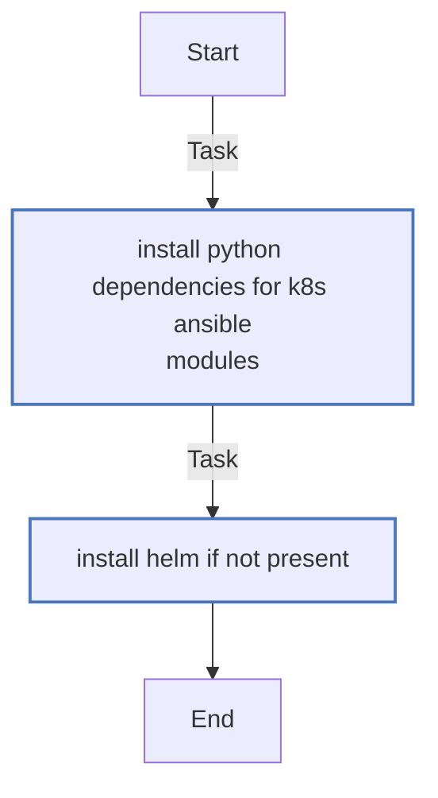
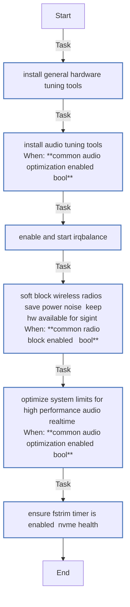
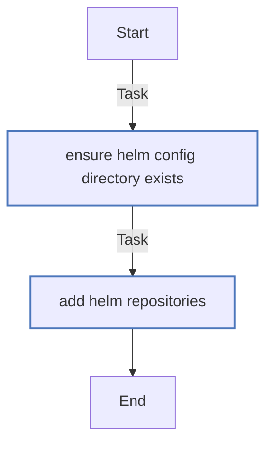
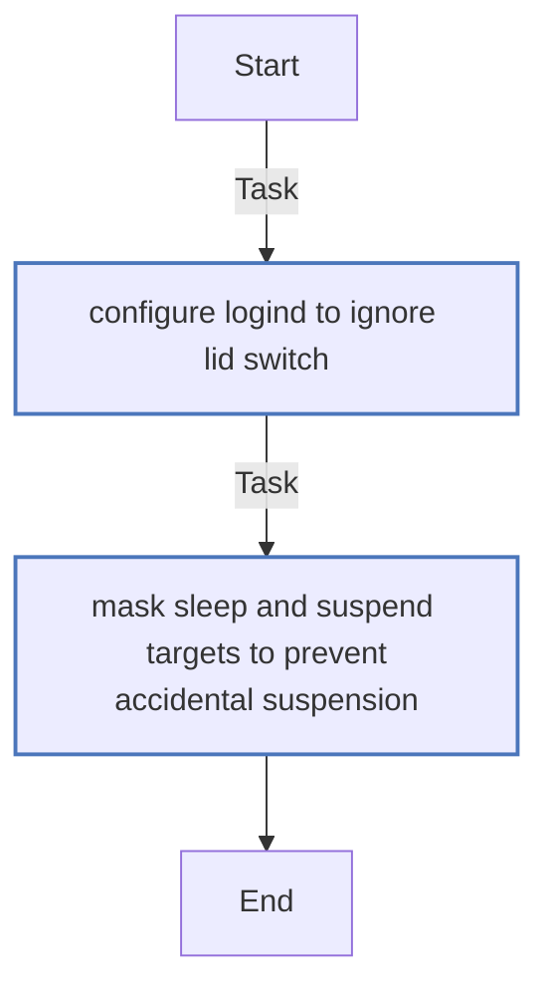
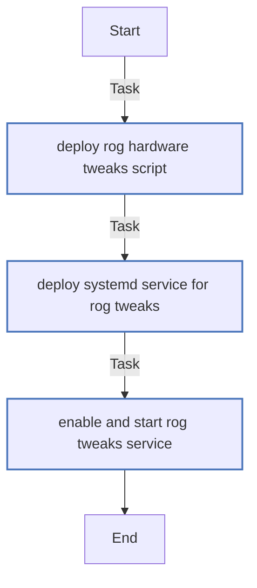

<!-- DOCSIBLE START -->

# 📃 Role overview

## common

| Field                | Value           |
|--------------------- |-----------------|
| Readme update        | 2026/01/05 |

### Defaults

**These are static variables with lower priority**

#### File: defaults/main.yml

| Var          | Type         | Value       |
|--------------|--------------|-------------|
| [common_network_optimization_enabled](defaults/main.yml#L2)   | bool | `True` |    
| [common_rog_server](defaults/main.yml#L3)   | bool | `True` |    
| [common_radio_block_enabled](defaults/main.yml#L5)   | bool | `True` |    
| [common_audio_optimization_enabled](defaults/main.yml#L6)   | bool | `True` |    
| [common_file_descriptors_soft](defaults/main.yml#L7)   | int | `100000` |    
| [common_file_descriptors_hard](defaults/main.yml#L8)   | int | `100000` |    
| [common_fs_file_max](defaults/main.yml#L9)   | int | `2097152` |    
| [common_inotify_max_instances](defaults/main.yml#L10)   | int | `8192` |    
| [common_inotify_max_watches](defaults/main.yml#L11)   | int | `524288` |    
| [common_watchdog_timeout_sec](defaults/main.yml#L12)   | int | `120` |    
| [common_battery_charge_threshold](defaults/main.yml#L13)   | int | `80` |    
| [common_thermal_policy](defaults/main.yml#L14)   | int | `1` |    
| [common_ring_buffer_target](defaults/main.yml#L15)   | int | `4096` |    
| [common_mining_enabled](defaults/main.yml#L17)   | bool | `True` |    
| [common_hugepages_count](defaults/main.yml#L18)   | int | `1280` |    
| [common_helm_repositories](defaults/main.yml#L21)   | list | `[]` |    
| [common_helm_repositories.**0**](defaults/main.yml#L22)   | dict | `{}` |    
| [common_helm_repositories.0.**name**](defaults/main.yml#L22)   | str | `cilium` |    
| [common_helm_repositories.0.**repo_url**](defaults/main.yml#L23)   | str | `https://helm.cilium.io/` |    
| [common_helm_repositories.**1**](defaults/main.yml#L24)   | dict | `{}` |    
| [common_helm_repositories.1.**name**](defaults/main.yml#L24)   | str | `nvdp` |    
| [common_helm_repositories.1.**repo_url**](defaults/main.yml#L25)   | str | `https://nvidia.github.io/k8s-device-plugin` |    

### Tasks

#### File: tasks/dependencies.yml

| Name | Module | Has Conditions |
| ---- | ------ | -------------- |
| Install Python dependencies for K8s Ansible modules | ansible.builtin.apt | False |
| Install Helm (if not present) | ansible.builtin.shell | False |

#### File: tasks/hardware_tuning.yml

| Name | Module | Has Conditions |
| ---- | ------ | -------------- |
| Install General Hardware Tuning Tools | ansible.builtin.apt | False |
| Install Audio Tuning Tools | ansible.builtin.apt | True |
| Enable and start irqbalance | ansible.builtin.systemd | False |
| Soft-block Wireless Radios (Save power/noise, keep HW available for SIGINT) | ansible.builtin.command | True |
| Optimize System Limits for High Performance Audio (Realtime) | community.general.pam_limits | True |
| Ensure fstrim.timer is enabled (NVMe Health) | ansible.builtin.systemd | False |

#### File: tasks/helm_setup.yml

| Name | Module | Has Conditions |
| ---- | ------ | -------------- |
| Ensure Helm config directory exists | ansible.builtin.file | False |
| Add Helm Repositories | kubernetes.core.helm_repository | False |

#### File: tasks/main.yml

| Name | Module | Has Conditions |
| ---- | ------ | -------------- |
| Disable swap now | ansible.builtin.command | True |
| Disable swap permanently in fstab | ansible.builtin.replace | False |
| Detect Ubuntu version for HWE kernel | ansible.builtin.set_fact | False |
| Set HWE kernel package name | ansible.builtin.set_fact | True |
| Install base packages | ansible.builtin.apt | False |
| Install Common Dependencies (Python/Helm) | ansible.builtin.include_tasks | False |
| Install HWE kernel (Ubuntu 20.04-24.04) | ansible.builtin.apt | True |
| Install generic kernel as fallback | ansible.builtin.apt | True |
| Register kernel changes for consolidated reboot | ansible.builtin.set_fact | False |
| Configure Power Management (Lid Switch / No Sleep) | ansible.builtin.include_tasks | False |
| Apply Hardware Tuning (CPU/Radios/Audio) | ansible.builtin.include_tasks | False |
| Apply System Kernel Tuning (BBR/Limits/Watchdog) | ansible.builtin.include_tasks | False |
| Apply RoG Server Hardware Tweaks | ansible.builtin.include_tasks | True |
| Initialize network_driver_changed if not set | ansible.builtin.set_fact | True |
| Consolidated Reboot - Phase 1 (Kernel + Network Drivers) | ansible.builtin.reboot | True |
| Configure Helm Repositories (User Level) | ansible.builtin.include_tasks | False |

#### File: tasks/network_optimization.yml

| Name | Module | Has Conditions | Comments |
| ---- | ------ | -------------- | -------- |
| RoG/Realtek Specific Optimizations | block | True | Optimización de red: drivers Realtek y configuración de red |
| Install Realtek driver (r8168-dkms) | ansible.builtin.apt | False |  |
| Blacklist unstable generic driver (r8169) | ansible.builtin.copy | False |  |
| Disable ASPM in GRUB | ansible.builtin.lineinfile | False |  |
| Ensure pcie_aspm=off is present exactly once | ansible.builtin.replace | True | Previene duplicación de parámetro si el regex ya lo agregó |
| Update GRUB | ansible.builtin.command | True |  |
| Register network driver changes for consolidated reboot | ansible.builtin.set_fact | False |  |
| Detect primary ethernet interface | ansible.builtin.set_fact | True |  |
| Deploy network optimization script | ansible.builtin.template | False |  |
| Deploy systemd service for network optimization | ansible.builtin.copy | False |  |
| Enable and start network optimization service | ansible.builtin.systemd | False |  |

#### File: tasks/power_management.yml

| Name | Module | Has Conditions | Comments |
| ---- | ------ | -------------- | -------- |
| Configure logind to ignore Lid Switch | ansible.builtin.lineinfile | False | Gestión de energía: deshabilitar suspensión y gestión de tapa |
| Mask sleep and suspend targets to prevent accidental suspension | ansible.builtin.systemd | False |  |

#### File: tasks/rog_hardware.yml

| Name | Module | Has Conditions | Comments |
| ---- | ------ | -------------- | -------- |
| Deploy RoG Hardware Tweaks Script | ansible.builtin.template | False | ROG HARDWARE TWEAKS - Optimizaciones de bajo nivel (siempre habilitadas) |
| Deploy systemd service for RoG Tweaks | ansible.builtin.copy | False |  |
| Enable and start RoG Tweaks service | ansible.builtin.systemd | False |  |

#### File: tasks/system_tuning.yml

| Name | Module | Has Conditions | Tags | Comments |
| ---- | ------ | -------------- | -----| -------- |
| Install performance tools | ansible.builtin.apt | False |  | Optimización del kernel: CPU, red y límites del sistema |
| Set CPU Governor to Schedutil | ansible.builtin.lineinfile | False |  |  |
| Enable TCP BBR Congestion Control | ansible.posix.sysctl | False |  |  |
| Increase File Descriptors Limits | community.general.pam_limits | False |  |  |
| Increase System-wide File Max | ansible.posix.sysctl | False |  |  |
| Increase Inotify Watches | ansible.posix.sysctl | False |  |  |
| Increase Inotify User Watches | ansible.posix.sysctl | False |  |  |
| Enable Hardware Watchdog (Auto-reboot on freeze) | ansible.builtin.lineinfile | False |  |  |
| Configure Huge Pages for mining (RandomX) | ansible.posix.sysctl | True | os |  |
| Load MSR kernel module for CPU optimization | community.general.modprobe | True | os |  |

## Task Flow Graphs

### Graph for dependencies.yml

### Graph for hardware_tuning.yml

### Graph for helm_setup.yml

### Graph for main.yml

```mermaid
flowchart TD
Start
classDef block stroke:#3498db,stroke-width:2px;
classDef task stroke:#4b76bb,stroke-width:2px;
classDef includeTasks stroke:#16a085,stroke-width:2px;
classDef importTasks stroke:#34495e,stroke-width:2px;
classDef includeRole stroke:#2980b9,stroke-width:2px;
classDef importRole stroke:#699ba7,stroke-width:2px;
classDef includeVars stroke:#8e44ad,stroke-width:2px;
classDef rescue stroke:#665352,stroke-width:2px;

  Start-->|Task| Disable_swap_now0[disable swap now<br>When: **ansible facts  swaptotal mb     0**]:::task
  Disable_swap_now0-->|Task| Disable_swap_permanently_in_fstab1[disable swap permanently in fstab]:::task
  Disable_swap_permanently_in_fstab1-->|Task| Detect_Ubuntu_version_for_HWE_kernel2[detect ubuntu version for hwe kernel]:::task
  Detect_Ubuntu_version_for_HWE_kernel2-->|Task| Set_HWE_kernel_package_name3[set hwe kernel package name<br>When: **ubuntu version is version  20 04         and<br>ubuntu version is version  24 04**]:::task
  Set_HWE_kernel_package_name3-->|Task| Install_base_packages4[install base packages]:::task
  Install_base_packages4-->|Include task| Install_Common_Dependencies__Python_Helm__dependencies_yml_5[install common dependencies  python helm <br>include_task: dependencies yml]:::includeTasks
  Install_Common_Dependencies__Python_Helm__dependencies_yml_5-->|Task| Install_HWE_kernel__Ubuntu_20_04_24_04_6[install hwe kernel  ubuntu 20 04 24 04 <br>When: **hwe kernel package is defined**]:::task
  Install_HWE_kernel__Ubuntu_20_04_24_04_6-->|Task| Install_generic_kernel_as_fallback7[install generic kernel as fallback<br>When: **common hwe kernel install is failed or hwe kernel<br>package is not defined**]:::task
  Install_generic_kernel_as_fallback7-->|Task| Register_kernel_changes_for_consolidated_reboot8[register kernel changes for consolidated reboot]:::task
  Register_kernel_changes_for_consolidated_reboot8-->|Include task| Configure_Power_Management__Lid_Switch___No_Sleep__power_management_yml_9[configure power management  lid switch   no sleep <br>include_task: power management yml]:::includeTasks
  Configure_Power_Management__Lid_Switch___No_Sleep__power_management_yml_9-->|Include task| Apply_Hardware_Tuning__CPU_Radios_Audio__hardware_tuning_yml_10[apply hardware tuning  cpu radios audio <br>include_task: hardware tuning yml]:::includeTasks
  Apply_Hardware_Tuning__CPU_Radios_Audio__hardware_tuning_yml_10-->|Include task| Apply_System_Kernel_Tuning__BBR_Limits_Watchdog__system_tuning_yml_11[apply system kernel tuning  bbr limits watchdog <br>include_task: system tuning yml]:::includeTasks
  Apply_System_Kernel_Tuning__BBR_Limits_Watchdog__system_tuning_yml_11-->|Include task| Apply_RoG_Server_Hardware_Tweaks_rog_hardware_yml_12[apply rog server hardware tweaks<br>When: **common rog server   default true    bool**<br>include_task: rog hardware yml]:::includeTasks
  Apply_RoG_Server_Hardware_Tweaks_rog_hardware_yml_12-->|Task| Initialize_network_driver_changed_if_not_set13[initialize network driver changed if not set<br>When: **common network driver changed is not defined**]:::task
  Initialize_network_driver_changed_if_not_set13-->|Task| Consolidated_Reboot___Phase_1__Kernel___Network_Drivers_14[consolidated reboot   phase 1  kernel   network<br>drivers <br>When: **common kernel changed   default false   or <br>common network driver changed   default false**]:::task
  Consolidated_Reboot___Phase_1__Kernel___Network_Drivers_14-->|Include task| Configure_Helm_Repositories__User_Level__helm_setup_yml_15[configure helm repositories  user level <br>include_task: helm setup yml]:::includeTasks
  Configure_Helm_Repositories__User_Level__helm_setup_yml_15-->End
```

### Graph for network_optimization.yml

```mermaid
flowchart TD
Start
classDef block stroke:#3498db,stroke-width:2px;
classDef task stroke:#4b76bb,stroke-width:2px;
classDef includeTasks stroke:#16a085,stroke-width:2px;
classDef importTasks stroke:#34495e,stroke-width:2px;
classDef includeRole stroke:#2980b9,stroke-width:2px;
classDef importRole stroke:#699ba7,stroke-width:2px;
classDef includeVars stroke:#8e44ad,stroke-width:2px;
classDef rescue stroke:#665352,stroke-width:2px;

  Start-->|Block Start| RoG_Realtek_Specific_Optimizations0_block_start_0[[rog realtek specific optimizations<br>When: **common rog server   bool**]]:::block
  RoG_Realtek_Specific_Optimizations0_block_start_0-->|Task| Install_Realtek_driver__r8168_dkms_0[install realtek driver  r8168 dkms ]:::task
  Install_Realtek_driver__r8168_dkms_0-->|Task| Blacklist_unstable_generic_driver__r8169_1[blacklist unstable generic driver  r8169 ]:::task
  Blacklist_unstable_generic_driver__r8169_1-->|Task| Disable_ASPM_in_GRUB2[disable aspm in grub]:::task
  Disable_ASPM_in_GRUB2-->|Task| Ensure_pcie_aspm_off_is_present_exactly_once3[ensure pcie aspm off is present exactly once<br>When: **common grub aspm changed**]:::task
  Ensure_pcie_aspm_off_is_present_exactly_once3-->|Task| Update_GRUB4[update grub<br>When: **common grub aspm changed**]:::task
  Update_GRUB4-->|Task| Register_network_driver_changes_for_consolidated_reboot5[register network driver changes for consolidated<br>reboot]:::task
  Register_network_driver_changes_for_consolidated_reboot5-.->|End of Block| RoG_Realtek_Specific_Optimizations0_block_start_0
  Register_network_driver_changes_for_consolidated_reboot5-->|Rescue Start| RoG_Realtek_Specific_Optimizations0_rescue_start_0[rog realtek specific optimizations<br>When: **common rog server   bool**]:::rescue
  RoG_Realtek_Specific_Optimizations0_rescue_start_0-->|Task| Report_RoG_Realtek_optimization_failure0[report rog realtek optimization failure]:::task
  Report_RoG_Realtek_optimization_failure0-->|Task| Fail_RoG_Realtek_optimization1[fail rog realtek optimization]:::task
  Fail_RoG_Realtek_optimization1-.->|End of Rescue Block| RoG_Realtek_Specific_Optimizations0_block_start_0
  Fail_RoG_Realtek_optimization1-->|Task| Detect_primary_ethernet_interface1[detect primary ethernet interface<br>When: **ansible facts  default ipv4    interface   is<br>defined**]:::task
  Detect_primary_ethernet_interface1-->|Task| Deploy_network_optimization_script2[deploy network optimization script]:::task
  Deploy_network_optimization_script2-->|Task| Deploy_systemd_service_for_network_optimization3[deploy systemd service for network optimization]:::task
  Deploy_systemd_service_for_network_optimization3-->|Task| Enable_and_start_network_optimization_service4[enable and start network optimization service]:::task
  Enable_and_start_network_optimization_service4-->End
```

### Graph for power_management.yml

### Graph for rog_hardware.yml

### Graph for system_tuning.yml

```mermaid
flowchart TD
Start
classDef block stroke:#3498db,stroke-width:2px;
classDef task stroke:#4b76bb,stroke-width:2px;
classDef includeTasks stroke:#16a085,stroke-width:2px;
classDef importTasks stroke:#34495e,stroke-width:2px;
classDef includeRole stroke:#2980b9,stroke-width:2px;
classDef importRole stroke:#699ba7,stroke-width:2px;
classDef includeVars stroke:#8e44ad,stroke-width:2px;
classDef rescue stroke:#665352,stroke-width:2px;

  Start-->|Task| Install_performance_tools0[install performance tools]:::task
  Install_performance_tools0-->|Task| Set_CPU_Governor_to_Schedutil1[set cpu governor to schedutil]:::task
  Set_CPU_Governor_to_Schedutil1-->|Task| Enable_TCP_BBR_Congestion_Control2[enable tcp bbr congestion control]:::task
  Enable_TCP_BBR_Congestion_Control2-->|Task| Increase_File_Descriptors_Limits3[increase file descriptors limits]:::task
  Increase_File_Descriptors_Limits3-->|Task| Increase_System_wide_File_Max4[increase system wide file max]:::task
  Increase_System_wide_File_Max4-->|Task| Increase_Inotify_Watches5[increase inotify watches]:::task
  Increase_Inotify_Watches5-->|Task| Increase_Inotify_User_Watches6[increase inotify user watches]:::task
  Increase_Inotify_User_Watches6-->|Task| Enable_Hardware_Watchdog__Auto_reboot_on_freeze_7[enable hardware watchdog  auto reboot on freeze ]:::task
  Enable_Hardware_Watchdog__Auto_reboot_on_freeze_7-->|Task| Configure_Huge_Pages_for_mining__RandomX_8[configure huge pages for mining  randomx <br>When: **common mining enabled   default true**]:::task
  Configure_Huge_Pages_for_mining__RandomX_8-->|Task| Load_MSR_kernel_module_for_CPU_optimization9[load msr kernel module for cpu optimization<br>When: **common mining enabled   default true**]:::task
  Load_MSR_kernel_module_for_CPU_optimization9-->End
```

#### Dependencies

No dependencies specified.
<!-- DOCSIBLE END -->
