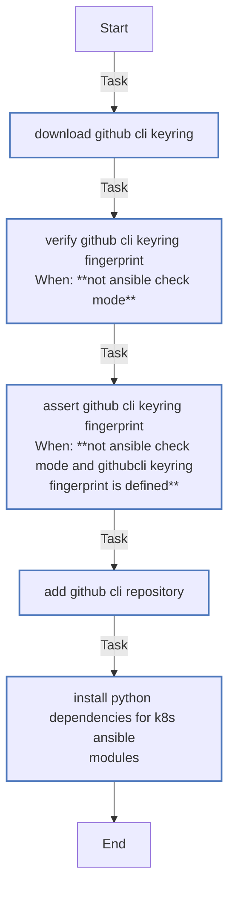
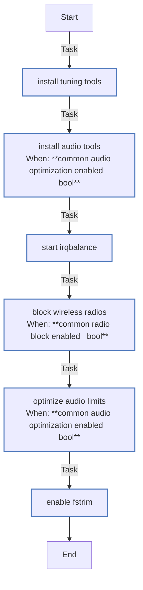
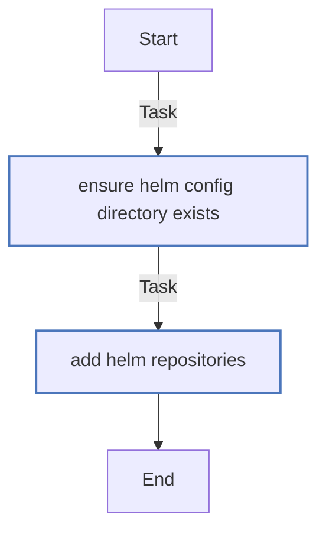
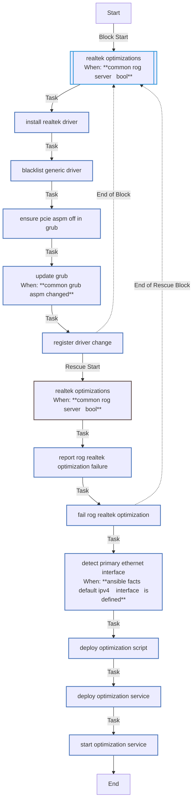
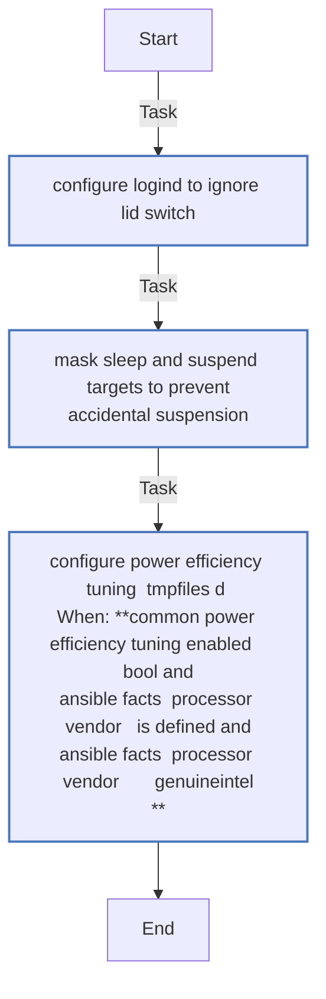
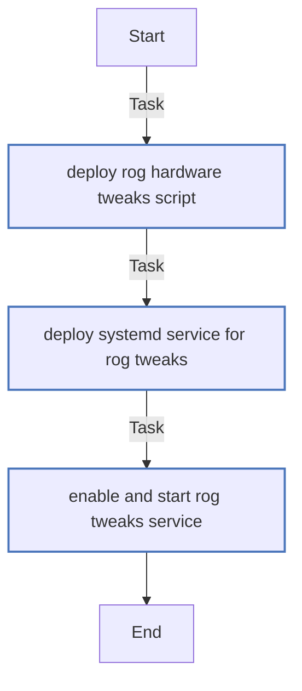
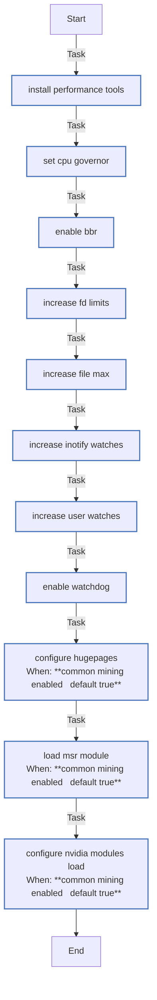

<!-- DOCSIBLE START -->

# 📃 Role overview

## common

Description: Common system configurations and optimizations for K3s homelab.

<b>🧩 Argument Specifications in meta/argument_specs</b>

#### Key: main

**Description**: Configures base system settings including kernel tuning, power management,
RoG hardware tweaks, and network optimizations.

**Options**:

  - **common_network_optimization_enabled**
    - **Required**: False
    - **Type**: bool
    - **Default**: True
  
    - **Description**: Enables sysctl adjustments for network performance.
  
  
  

  - **common_rog_server**
    - **Required**: False
    - **Type**: bool
    - **Default**: True
  
    - **Description**: Enables ASUS RoG specific hardware tweaks (drivers, LEDs, power profiles).
  
  
  

  - **common_radio_block_enabled**
    - **Required**: False
    - **Type**: bool
    - **Default**: True
  
    - **Description**: Soft-blocks WiFi and Bluetooth radios to save power.
  
  
  

  - **common_audio_optimization_enabled**
    - **Required**: False
    - **Type**: bool
    - **Default**: True
  
    - **Description**: Installs alsa-utils and configures realtime limits for audio.
  
  
  

  - **common_file_descriptors_soft**
    - **Required**: False
    - **Type**: int
    - **Default**: 100000
  
    - **Description**: Soft limit for open file descriptors (ulimit -n).
  
  
  

  - **common_file_descriptors_hard**
    - **Required**: False
    - **Type**: int
    - **Default**: 100000
  
    - **Description**: Hard limit for open file descriptors.
  
  
  

  - **common_fs_file_max**
    - **Required**: False
    - **Type**: int
    - **Default**: 2097152
  
    - **Description**: System-wide maximum number of open file descriptors.
  
  
  

  - **common_inotify_max_instances**
    - **Required**: False
    - **Type**: int
    - **Default**: 8192
  
    - **Description**: Max inotify instances per user.
  
  
  

  - **common_inotify_max_watches**
    - **Required**: False
    - **Type**: int
    - **Default**: 524288
  
    - **Description**: Max inotify watches per user.
  
  
  

  - **common_watchdog_timeout_sec**
    - **Required**: False
    - **Type**: int
    - **Default**: 120
  
    - **Description**: Hardware watchdog timeout in seconds (RuntimeWatchdogSec).
  
  
  

  - **common_battery_charge_threshold**
    - **Required**: False
    - **Type**: int
    - **Default**: 80
  
    - **Description**: Battery charge limit percentage for RoG laptops.
  
  
  

  - **common_thermal_policy**
    - **Required**: False
    - **Type**: int
    - **Default**: 1
  
    - **Description**: RoG thermal policy ID (0=balanced, 1=turbo, 2=silent - check specific model).
  
  
  

  - **common_ring_buffer_target**
    - **Required**: False
    - **Type**: int
    - **Default**: 4096
  
    - **Description**: Target size for network ring buffers.
  
  
  

  - **common_mining_enabled**
    - **Required**: False
    - **Type**: bool
    - **Default**: True
  
    - **Description**: Enables optimizations for crypto mining (hugepages, MSR).
  
  
  

  - **common_hugepages_count**
    - **Required**: False
    - **Type**: int
    - **Default**: 1280
  
    - **Description**: Number of hugepages to allocate if mining is enabled (1280 ~ 2.5Gi).
  
  
  

  - **common_helm_repositories**
    - **Required**: False
    - **Type**: list
    - **Default**: []
  
    - **Description**: List of Helm repositories to add.
  
  
  
    
  

### Defaults

**These are static variables with lower priority**

#### File: defaults/main.yml

| Var          | Type         | Value       |Required    | Title       |
|--------------|--------------|-------------|------------|-------------|
| [common_network_optimization_enabled](defaults/main.yml#L5)   | bool | `True` |    false  |  Network Optimization |
| [common_rog_server](defaults/main.yml#L10)   | bool | `True` |    false  |  RoG Server Support |
| [common_radio_block_enabled](defaults/main.yml#L15)   | bool | `True` |    false  |  Radio Block |
| [common_audio_optimization_enabled](defaults/main.yml#L20)   | bool | `True` |    false  |  Audio Optimization |
| [common_file_descriptors_soft](defaults/main.yml#L25)   | int | `100000` |    false  |  File Descriptors (Soft) |
| [common_file_descriptors_hard](defaults/main.yml#L30)   | int | `100000` |    false  |  File Descriptors (Hard) |
| [common_fs_file_max](defaults/main.yml#L35)   | int | `2097152` |    false  |  System File Max |
| [common_inotify_max_instances](defaults/main.yml#L40)   | int | `8192` |    false  |  Inotify Instances |
| [common_inotify_max_watches](defaults/main.yml#L45)   | int | `524288` |    false  |  Inotify Watches |
| [common_power_efficiency_tuning_enabled](defaults/main.yml#L48)   | bool | `False` |    None  |  Power Efficiency Tuning |
| [common_intel_rapl_pl1_limit_microwatts](defaults/main.yml#L49)   | int | `100000000` |    None  |  None |
| [common_intel_rapl_pl2_limit_microwatts](defaults/main.yml#L50)   | int | `140000000` |    None  |  None |
| [common_intel_pstate_max_perf_pct](defaults/main.yml#L51)   | int | `80` |    None  |  None |
| [common_intel_pstate_no_turbo](defaults/main.yml#L52)   | int | `1` |    None  |  None |
| [common_watchdog_timeout_sec](defaults/main.yml#L57)   | int | `120` |    false  |  Watchdog Timeout |
| [common_battery_charge_threshold](defaults/main.yml#L62)   | int | `80` |    false  |  Battery Charge Threshold |
| [common_thermal_policy](defaults/main.yml#L67)   | int | `1` |    false  |  Thermal Policy |
| [common_ring_buffer_target](defaults/main.yml#L72)   | int | `4096` |    false  |  Ring Buffer Target |
| [common_mining_enabled](defaults/main.yml#L77)   | bool | `True` |    false  |  Mining Optimization |
| [common_hugepages_count](defaults/main.yml#L82)   | int | `1280` |    false  |  Hugepages Count |
| [common_helm_repositories](defaults/main.yml#L87)   | list | `[]` |    false  |  Helm Repositories |
| [common_helm_repositories.**0**](defaults/main.yml#L88)   | dict | `{}` |    None  |  None |
| [common_helm_repositories.0.**name**](defaults/main.yml#L88)   | str | `cilium` |    None  |  None |
| [common_helm_repositories.0.**repo_url**](defaults/main.yml#L89)   | str | `https://helm.cilium.io/` |    None  |  None |
| [common_helm_repositories.**1**](defaults/main.yml#L90)   | dict | `{}` |    None  |  None |
| [common_helm_repositories.1.**name**](defaults/main.yml#L90)   | str | `nvdp` |    None  |  None |
| [common_helm_repositories.1.**repo_url**](defaults/main.yml#L91)   | str | `https://nvidia.github.io/k8s-device-plugin` |    None  |  None |
| [common_uv_install_script_checksum](defaults/main.yml#L96)   | str | `f6e468855afb4e653fa96ed68a7cad0b2534794ece25ec202f6543c589eb04dc` |    false  |  UV install script checksum |
| [common_helm_install_script_checksum](defaults/main.yml#L101)   | str | `38b65f882d9cae3891755bdb03becc6a01ae6f9cb24826c191f219ddfee70a5d` |    false  |  Helm install script checksum |

<b>🖇️ Full descriptions for vars in defaults/main.yml</b>

 
<table>
<th>Var</th><th>Description</th>
<tr><td><b>common_network_optimization_enabled</b></td><td>Enables sysctl adjustments for network performance.</td></tr>
<tr><td><b>common_rog_server</b></td><td>Enables ASUS RoG specific hardware tweaks (drivers, LEDs, power profiles).</td></tr>
<tr><td><b>common_radio_block_enabled</b></td><td>Soft-blocks WiFi and Bluetooth radios to save power.</td></tr>
<tr><td><b>common_audio_optimization_enabled</b></td><td>Installs alsa-utils and configures realtime limits for audio.</td></tr>
<tr><td><b>common_file_descriptors_soft</b></td><td>Soft limit for open file descriptors (ulimit -n).</td></tr>
<tr><td><b>common_file_descriptors_hard</b></td><td>Hard limit for open file descriptors.</td></tr>
<tr><td><b>common_fs_file_max</b></td><td>System-wide maximum number of open file descriptors.</td></tr>
<tr><td><b>common_inotify_max_instances</b></td><td>Max inotify instances per user.</td></tr>
<tr><td><b>common_inotify_max_watches</b></td><td>Max inotify watches per user.</td></tr>
<tr><td><b>common_power_efficiency_tuning_enabled</b></td><td>Low-level CPU power management (Intel RAPL & P-State) for efficiency/mining.</td></tr>
<tr><td><b>common_watchdog_timeout_sec</b></td><td>Hardware watchdog timeout in seconds (RuntimeWatchdogSec).</td></tr>
<tr><td><b>common_battery_charge_threshold</b></td><td>Battery charge limit percentage for RoG laptops.</td></tr>
<tr><td><b>common_thermal_policy</b></td><td>RoG thermal policy ID (0=balanced, 1=turbo, 2=silent - check specific model).</td></tr>
<tr><td><b>common_ring_buffer_target</b></td><td>Target size for network ring buffers.</td></tr>
<tr><td><b>common_mining_enabled</b></td><td>Enables optimizations for crypto mining (hugepages, MSR).</td></tr>
<tr><td><b>common_hugepages_count</b></td><td>Number of hugepages to allocate if mining is enabled.</td></tr>
<tr><td><b>common_helm_repositories</b></td><td>List of Helm repositories to add.</td></tr>
<tr><td><b>common_uv_install_script_checksum</b></td><td>SHA256 for https://astral.sh/uv/install.sh (pin to avoid supply-chain drift).</td></tr>
<tr><td><b>common_helm_install_script_checksum</b></td><td>SHA256 for https://raw.githubusercontent.com/helm/helm/main/scripts/get-helm-3.</td></tr>
</table>
 

### Tasks

#### File: tasks/binaries.yml

| Name | Module | Has Conditions |
| ---- | ------ | -------------- |
| [Install uv (Python Tool Manager)](tasks/binaries.yml#L1) | block | False |
| [Check if uv is installed](tasks/binaries.yml#L3) | ansible.builtin.stat | False |
| [Download and install uv](tasks/binaries.yml#L7) | ansible.builtin.get_url | True |
| [Run uv installer](tasks/binaries.yml#L16) | ansible.builtin.command | True |
| [Install Kubectl (Official Binary)](tasks/binaries.yml#L26) | block | False |
| [Get latest stable kubectl version](tasks/binaries.yml#L28) | ansible.builtin.uri | False |
| [Set kubectl version fact](tasks/binaries.yml#L34) | ansible.builtin.set_fact | False |
| [Get kubectl checksum](tasks/binaries.yml#L37) | ansible.builtin.uri | False |
| [Check current kubectl version](tasks/binaries.yml#L43) | ansible.builtin.command | False |
| [Download and install kubectl](tasks/binaries.yml#L48) | ansible.builtin.get_url | True |
| [Install Helm (Official Script)](tasks/binaries.yml#L61) | block | False |
| [Check if helm is installed](tasks/binaries.yml#L63) | ansible.builtin.stat | False |
| [Install Helm](tasks/binaries.yml#L67) | ansible.builtin.get_url | True |
| [Run helm installer](tasks/binaries.yml#L78) | ansible.builtin.command | True |
| [Install helm-diff plugin](tasks/binaries.yml#L84) | ansible.builtin.command | False |

#### File: tasks/dependencies.yml

| Name | Module | Has Conditions |
| ---- | ------ | -------------- |
| [Download GitHub CLI keyring](tasks/dependencies.yml#L1) | ansible.builtin.get_url | False |
| [Verify GitHub CLI keyring fingerprint](tasks/dependencies.yml#L7) | ansible.builtin.command | True |
| [Assert GitHub CLI keyring fingerprint](tasks/dependencies.yml#L13) | ansible.builtin.assert | True |
| [Add GitHub CLI repository](tasks/dependencies.yml#L21) | ansible.builtin.apt_repository | False |
| [Install Python dependencies for K8s Ansible modules](tasks/dependencies.yml#L33) | ansible.builtin.apt | False |

#### File: tasks/hardware_tuning.yml

| Name | Module | Has Conditions |
| ---- | ------ | -------------- |
| [Install tuning tools](tasks/hardware_tuning.yml#L1) | ansible.builtin.apt | False |
| [Install audio tools](tasks/hardware_tuning.yml#L7) | ansible.builtin.apt | True |
| [Start irqbalance](tasks/hardware_tuning.yml#L13) | ansible.builtin.systemd | False |
| [Block wireless radios](tasks/hardware_tuning.yml#L19) | ansible.builtin.command | True |
| [Optimize audio limits](tasks/hardware_tuning.yml#L27) | community.general.pam_limits | True |
| [Enable fstrim](tasks/hardware_tuning.yml#L37) | ansible.builtin.systemd | False |

#### File: tasks/helm_setup.yml

| Name | Module | Has Conditions |
| ---- | ------ | -------------- |
| [Ensure Helm config directory exists](tasks/helm_setup.yml#L1) | ansible.builtin.file | False |
| [Add Helm Repositories](tasks/helm_setup.yml#L7) | kubernetes.core.helm_repository | False |

#### File: tasks/main.yml

| Name | Module | Has Conditions |
| ---- | ------ | -------------- |
| [Disable swap](tasks/main.yml#L1) | ansible.builtin.command | True |
| [Disable swap (fstab)](tasks/main.yml#L5) | ansible.builtin.replace | False |
| [Detect Ubuntu version](tasks/main.yml#L10) | ansible.builtin.set_fact | False |
| [Define kernel package](tasks/main.yml#L13) | ansible.builtin.set_fact | True |
| [Install system base tools](tasks/main.yml#L17) | ansible.builtin.apt | False |
| [Install dependencies](tasks/main.yml#L28) | ansible.builtin.include_tasks | False |
| [Install HWE kernel](tasks/main.yml#L30) | ansible.builtin.apt | True |
| [Install generic kernel](tasks/main.yml#L37) | ansible.builtin.apt | True |
| [Register kernel change](tasks/main.yml#L43) | ansible.builtin.set_fact | False |
| [Configure power](tasks/main.yml#L52) | ansible.builtin.include_tasks | False |
| [Apply hardware tuning](tasks/main.yml#L54) | ansible.builtin.include_tasks | False |
| [System Tuning](tasks/main.yml#L56) | ansible.builtin.include_tasks | False |
| [Install Cloud-Native Binaries](tasks/main.yml#L58) | ansible.builtin.include_tasks | False |
| [Setup Helm Repos](tasks/main.yml#L60) | ansible.builtin.include_tasks | False |

#### File: tasks/network_optimization.yml

| Name | Module | Has Conditions | Comments |
| ---- | ------ | -------------- | -------- |
| [Realtek optimizations](tasks/network_optimization.yml#L2) | block | True | Network optimization: Realtek drivers and network configuration |
| [Install Realtek driver](tasks/network_optimization.yml#L5) | ansible.builtin.apt | False |  |
| [Blacklist generic driver](tasks/network_optimization.yml#L10) | ansible.builtin.copy | False |  |
| [Ensure pcie_aspm=off in GRUB](tasks/network_optimization.yml#L17) | ansible.builtin.replace | False |  |
| [Update GRUB](tasks/network_optimization.yml#L23) | ansible.builtin.command | True |  |
| [Register driver change](tasks/network_optimization.yml#L27) | ansible.builtin.set_fact | False |  |
| [Detect primary ethernet interface](tasks/network_optimization.yml#L41) | ansible.builtin.set_fact | True |  |
| [Deploy optimization script](tasks/network_optimization.yml#L45) | ansible.builtin.template | False |  |
| [Deploy optimization service](tasks/network_optimization.yml#L50) | ansible.builtin.copy | False |  |
| [Start optimization service](tasks/network_optimization.yml#L55) | ansible.builtin.systemd | False |  |

#### File: tasks/power_management.yml

| Name | Module | Has Conditions | Comments |
| ---- | ------ | -------------- | -------- |
| [Configure logind to ignore Lid Switch](tasks/power_management.yml#L2) | ansible.builtin.lineinfile | False | Power management: disable suspension and lid switch handling |
| [Mask sleep and suspend targets to prevent accidental suspension](tasks/power_management.yml#L13) | ansible.builtin.systemd | False |  |
| [Configure Power Efficiency Tuning (tmpfiles.d)](tasks/power_management.yml#L24) | ansible.builtin.template | True |  |

#### File: tasks/rog_hardware.yml

| Name | Module | Has Conditions | Comments |
| ---- | ------ | -------------- | -------- |
| [Deploy RoG Hardware Tweaks Script](tasks/rog_hardware.yml#L4) | ansible.builtin.template | False | ASUS RoG specific hardware configuration
ASUSCTL - ASUS specific hardware control (optional, disabled by default)
ROG HARDWARE TWEAKS - Low-level optimizations (always enabled) |
| [Deploy systemd service for RoG Tweaks](tasks/rog_hardware.yml#L9) | ansible.builtin.copy | False |  |
| [Enable and start RoG Tweaks service](tasks/rog_hardware.yml#L14) | ansible.builtin.systemd | False |  |

#### File: tasks/system_tuning.yml

| Name | Module | Has Conditions | Tags | Comments |
| ---- | ------ | -------------- | -----| -------- |
| [Install performance tools](tasks/system_tuning.yml#L2) | ansible.builtin.apt | False |  | Kernel optimization: CPU, networking, and system limits |
| [Set CPU governor](tasks/system_tuning.yml#L7) | ansible.builtin.lineinfile | False |  |  |
| [Enable BBR](tasks/system_tuning.yml#L15) | ansible.posix.sysctl | False |  |  |
| [Increase FD limits](tasks/system_tuning.yml#L30) | community.general.pam_limits | False |  |  |
| [Increase file-max](tasks/system_tuning.yml#L39) | ansible.posix.sysctl | False |  |  |
| [Increase inotify watches](tasks/system_tuning.yml#L45) | ansible.posix.sysctl | False |  |  |
| [Increase user watches](tasks/system_tuning.yml#L51) | ansible.posix.sysctl | False |  |  |
| [Enable watchdog](tasks/system_tuning.yml#L57) | ansible.builtin.lineinfile | False |  |  |
| [Configure hugepages](tasks/system_tuning.yml#L63) | ansible.posix.sysctl | True | os |  |
| [Load MSR module](tasks/system_tuning.yml#L72) | community.general.modprobe | True | os |  |
| [Configure Nvidia modules load](tasks/system_tuning.yml#L79) | ansible.builtin.copy | True | os,gpu |  |

## Task Flow Graphs

### Graph for binaries.yml

```mermaid
flowchart TD
Start
classDef block stroke:#3498db,stroke-width:2px;
classDef task stroke:#4b76bb,stroke-width:2px;
classDef includeTasks stroke:#16a085,stroke-width:2px;
classDef importTasks stroke:#34495e,stroke-width:2px;
classDef includeRole stroke:#2980b9,stroke-width:2px;
classDef importRole stroke:#699ba7,stroke-width:2px;
classDef includeVars stroke:#8e44ad,stroke-width:2px;
classDef rescue stroke:#665352,stroke-width:2px;

  Start-->|Block Start| Install_uv__Python_Tool_Manager_0_block_start_0[[install uv  python tool manager ]]:::block
  Install_uv__Python_Tool_Manager_0_block_start_0-->|Task| Check_if_uv_is_installed0[check if uv is installed]:::task
  Check_if_uv_is_installed0-->|Task| Download_and_install_uv1[download and install uv<br>When: **not uv binary stat exists**]:::task
  Download_and_install_uv1-->|Task| Run_uv_installer2[run uv installer<br>When: **not uv binary stat exists**]:::task
  Run_uv_installer2-.->|End of Block| Install_uv__Python_Tool_Manager_0_block_start_0
  Run_uv_installer2-->|Rescue Start| Install_uv__Python_Tool_Manager_0_rescue_start_0[install uv  python tool manager ]:::rescue
  Install_uv__Python_Tool_Manager_0_rescue_start_0-->|Task| Report_uv_installation_failure0[report uv installation failure]:::task
  Report_uv_installation_failure0-.->|End of Rescue Block| Install_uv__Python_Tool_Manager_0_block_start_0
  Report_uv_installation_failure0-->|Block Start| Install_Kubectl__Official_Binary_1_block_start_0[[install kubectl  official binary ]]:::block
  Install_Kubectl__Official_Binary_1_block_start_0-->|Task| Get_latest_stable_kubectl_version0[get latest stable kubectl version]:::task
  Get_latest_stable_kubectl_version0-->|Task| Set_kubectl_version_fact1[set kubectl version fact]:::task
  Set_kubectl_version_fact1-->|Task| Get_kubectl_checksum2[get kubectl checksum]:::task
  Get_kubectl_checksum2-->|Task| Check_current_kubectl_version3[check current kubectl version]:::task
  Check_current_kubectl_version3-->|Task| Download_and_install_kubectl4[download and install kubectl<br>When: **kubectl current version failed or kubectl version<br>not in kubectl current version stdout**]:::task
  Download_and_install_kubectl4-.->|End of Block| Install_Kubectl__Official_Binary_1_block_start_0
  Download_and_install_kubectl4-->|Rescue Start| Install_Kubectl__Official_Binary_1_rescue_start_0[install kubectl  official binary ]:::rescue
  Install_Kubectl__Official_Binary_1_rescue_start_0-->|Task| Report_kubectl_installation_failure0[report kubectl installation failure]:::task
  Report_kubectl_installation_failure0-.->|End of Rescue Block| Install_Kubectl__Official_Binary_1_block_start_0
  Report_kubectl_installation_failure0-->|Block Start| Install_Helm__Official_Script_2_block_start_0[[install helm  official script ]]:::block
  Install_Helm__Official_Script_2_block_start_0-->|Task| Check_if_helm_is_installed0[check if helm is installed]:::task
  Check_if_helm_is_installed0-->|Task| Install_Helm1[install helm<br>When: **not helm binary stat exists**]:::task
  Install_Helm1-->|Task| Run_helm_installer2[run helm installer<br>When: **not helm binary stat exists**]:::task
  Run_helm_installer2-->|Task| Install_helm_diff_plugin3[install helm diff plugin]:::task
  Install_helm_diff_plugin3-.->|End of Block| Install_Helm__Official_Script_2_block_start_0
  Install_helm_diff_plugin3-->|Rescue Start| Install_Helm__Official_Script_2_rescue_start_0[install helm  official script ]:::rescue
  Install_Helm__Official_Script_2_rescue_start_0-->|Task| Report_helm_installation_failure0[report helm installation failure]:::task
  Report_helm_installation_failure0-.->|End of Rescue Block| Install_Helm__Official_Script_2_block_start_0
  Report_helm_installation_failure0-->End
```

### Graph for dependencies.yml

### Graph for hardware_tuning.yml

### Graph for helm_setup.yml

### Graph for main.yml

```mermaid
flowchart TD
Start
classDef block stroke:#3498db,stroke-width:2px;
classDef task stroke:#4b76bb,stroke-width:2px;
classDef includeTasks stroke:#16a085,stroke-width:2px;
classDef importTasks stroke:#34495e,stroke-width:2px;
classDef includeRole stroke:#2980b9,stroke-width:2px;
classDef importRole stroke:#699ba7,stroke-width:2px;
classDef includeVars stroke:#8e44ad,stroke-width:2px;
classDef rescue stroke:#665352,stroke-width:2px;

  Start-->|Task| Disable_swap0[disable swap<br>When: **ansible facts  swaptotal mb     0**]:::task
  Disable_swap0-->|Task| Disable_swap__fstab_1[disable swap  fstab ]:::task
  Disable_swap__fstab_1-->|Task| Detect_Ubuntu_version2[detect ubuntu version]:::task
  Detect_Ubuntu_version2-->|Task| Define_kernel_package3[define kernel package<br>When: **ubuntu version is version  20 04         and<br>ubuntu version is version  24 04**]:::task
  Define_kernel_package3-->|Task| Install_system_base_tools4[install system base tools]:::task
  Install_system_base_tools4-->|Include task| Install_dependencies_dependencies_yml_5[install dependencies<br>include_task: dependencies yml]:::includeTasks
  Install_dependencies_dependencies_yml_5-->|Task| Install_HWE_kernel6[install hwe kernel<br>When: **hwe kernel package is defined**]:::task
  Install_HWE_kernel6-->|Task| Install_generic_kernel7[install generic kernel<br>When: **common hwe kernel install is failed or hwe kernel<br>package is not defined**]:::task
  Install_generic_kernel7-->|Task| Register_kernel_change8[register kernel change]:::task
  Register_kernel_change8-->|Include task| Configure_power_power_management_yml_9[configure power<br>include_task: power management yml]:::includeTasks
  Configure_power_power_management_yml_9-->|Include task| Apply_hardware_tuning_hardware_tuning_yml_10[apply hardware tuning<br>include_task: hardware tuning yml]:::includeTasks
  Apply_hardware_tuning_hardware_tuning_yml_10-->|Include task| System_Tuning_system_tuning_yml_11[system tuning<br>include_task: system tuning yml]:::includeTasks
  System_Tuning_system_tuning_yml_11-->|Include task| Install_Cloud_Native_Binaries_binaries_yml_12[install cloud native binaries<br>include_task: binaries yml]:::includeTasks
  Install_Cloud_Native_Binaries_binaries_yml_12-->|Include task| Setup_Helm_Repos_helm_setup_yml_13[setup helm repos<br>include_task: helm setup yml]:::includeTasks
  Setup_Helm_Repos_helm_setup_yml_13-->End
```

### Graph for network_optimization.yml

### Graph for power_management.yml

### Graph for rog_hardware.yml

### Graph for system_tuning.yml

## Author Information
Roura

#### License

MIT

#### Minimum Ansible Version

2.20.0

#### Platforms

- **Ubuntu**: ['noble']

#### Dependencies

No dependencies specified.
<!-- DOCSIBLE END -->
