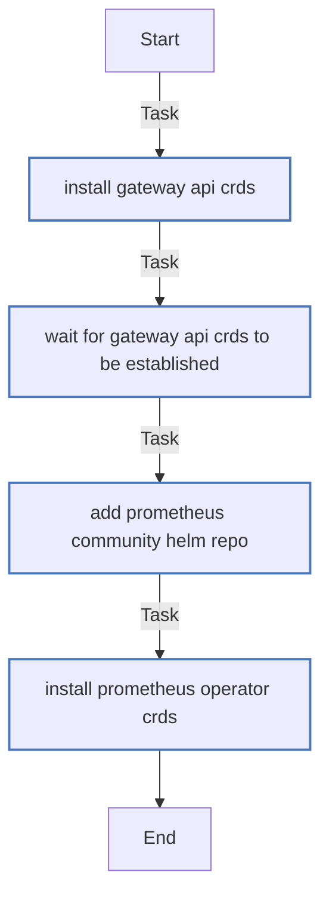

<!-- DOCSIBLE START -->

# 📃 Role overview

## crds_bootstrap

### Defaults

**These are static variables with lower priority**

#### File: defaults/main.yml

| Var          | Type         | Value       | Title       |
|--------------|--------------|-------------|-------------|
| [gateway_api_version](defaults/main.yml#L4)   | str | `v1.2.0` |     Gateway API Version |
| [prometheus_operator_crds_version](defaults/main.yml#L9)   | str | `26.0.0` |     Prometheus Operator CRDs Chart Version |
| [prometheus_operator_crds_namespace](defaults/main.yml#L14)   | str | `monitoring` |     Prometheus Operator CRDs Namespace |

<b>🖇️ Full descriptions for vars in defaults/main.yml</b>

 
<table>
<th>Var</th><th>Description</th>
<tr><td><b>gateway_api_version</b></td><td>Version tag for Gateway API standard install manifest.</td></tr>
<tr><td><b>prometheus_operator_crds_version</b></td><td>Version of the prometheus-operator-crds Helm chart.</td></tr>
<tr><td><b>prometheus_operator_crds_namespace</b></td><td>Namespace where CRDs chart metadata will be installed (CRDs are global).</td></tr>
</table>
 

### Tasks

#### File: tasks/main.yml

| Name | Module | Has Conditions | Comments |
| ---- | ------ | -------------- | -------- |
| [Install Gateway API CRDs](tasks/main.yml#L2) | kubernetes.core.k8s | False | Install Gateway API CRDs |
| [Wait for Gateway API CRDs to be established](tasks/main.yml#L9) | kubernetes.core.k8s_info | False |  |
| [Add Prometheus Community Helm repo](tasks/main.yml#L22) | kubernetes.core.helm_repository | False | Install Prometheus Operator CRDs via Helm |
| [Install Prometheus Operator CRDs](tasks/main.yml#L28) | kubernetes.core.helm | False |  |

## Task Flow Graphs

### Graph for main.yml

#### Dependencies

No dependencies specified.
<!-- DOCSIBLE END -->
