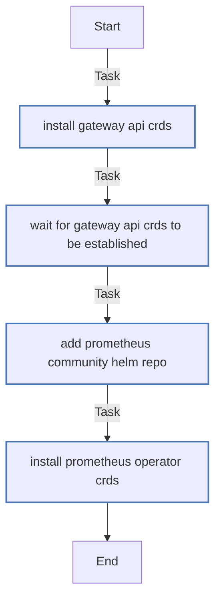

<!-- DOCSIBLE START -->

# 📃 Role overview

## crds_bootstrap

Description: Bootstrap cluster-wide CRDs (Gateway API and Prometheus Operator) for add-on charts.

### Tasks

#### File: tasks/main.yml

| Name | Module | Has Conditions | Comments |
| ---- | ------ | -------------- | -------- |
| [Install Gateway API CRDs](tasks/main.yml#L2) | kubernetes.core.k8s | False | Install Gateway API CRDs |
| [Wait for Gateway API CRDs to be established](tasks/main.yml#L9) | kubernetes.core.k8s_info | False |  |
| [Add Prometheus Community Helm repo](tasks/main.yml#L22) | kubernetes.core.helm_repository | False | Install Prometheus Operator CRDs via Helm |
| [Install Prometheus Operator CRDs](tasks/main.yml#L28) | kubernetes.core.helm | False |  |

## Task Flow Graphs

### Graph for main.yml

## Author Information
rc

### License

MIT

### Minimum Ansible Version

2.14

### Platforms

- **Ubuntu**: ['jammy', 'noble']

### Dependencies

No dependencies specified.
<!-- DOCSIBLE END -->
