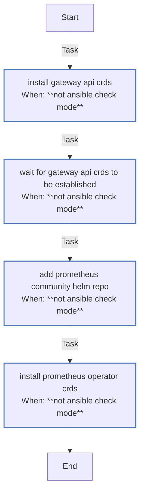

<!-- DOCSIBLE START -->

# 📃 Role overview

## crds_bootstrap

Description: Bootstrap cluster-wide CRDs (Gateway API and Prometheus Operator) for add-on charts.

<b> Argument Specifications in meta/argument_specs</b>

#### Key: main

**Description**: Installs Gateway API standard CRDs and Prometheus Operator CRDs
required by various Helm charts and operators.

**Options**:

  - **gateway_apiVersion**
    - **Required**: False
    - **Type**: str
    - **Default**: v1.2.0
  
    - **Description**: Gateway API CRDs version to install.
  
  
  

  - **prometheus_operatorCrdsNamespace**
    - **Required**: False
    - **Type**: str
    - **Default**: monitoring
  
    - **Description**: Namespace for Prometheus Operator CRDs.
  
  
  

  - **prometheus_operatorCrdsVersion**
    - **Required**: True
    - **Type**: str
    - **Default**: none
  
    - **Description**: Prometheus Operator CRDs Helm chart version.
  
  
  

  - **kubeconfig**
    - **Required**: True
    - **Type**: str
    - **Default**: none
  
    - **Description**: Path to kubeconfig for cluster access.
  
  
  

### Tasks

#### File: tasks/main.yml

| Name | Module | Has Conditions | Tags | Comments |
| ---- | ------ | -------------- | -----| -------- |
| [Install Gateway API CRDs](tasks/main.yml#L2) | kubernetes.core.k8s | True | cluster,infrastructure | @docsible Install Gateway API standard CRDs |
| [Wait for Gateway API CRDs to be established](tasks/main.yml#L12) | kubernetes.core.k8s_info | True | cluster,infrastructure | @docsible Wait for Gateway CRDs to be established |
| [Add Prometheus Community Helm repo](tasks/main.yml#L27) | kubernetes.core.helm_repository | True | cluster,infrastructure | @docsible Add Prometheus Community Helm repository |
| [Install Prometheus Operator CRDs](tasks/main.yml#L36) | kubernetes.core.helm | True | cluster,infrastructure | @docsible Install Prometheus Operator CRDs via Helm |

## Task Flow Graphs

### Graph for main.yml

## Author Information
rc

### License

MIT

### Minimum Ansible Version

2.14

### Platforms

- **Ubuntu**: ['jammy', 'noble']

### Dependencies

No dependencies specified.
<!-- DOCSIBLE END -->
