<!-- DOCSIBLE START -->

# 📃 Role overview

## developer_tools

Description: Installs development tools and useful CLIs for K3s environments.

<b> Argument Specifications in meta/argument_specs</b>

#### Key: main

**Description**: Installs a suite of developer tools including terminal utilities (bat, tmux),
Kubernetes CLIs (kubectl, helm, k9s), Python tools (uv, pipx), and AI CLIs.

**Options**:

  - **devtools_install_docker**
    - **Required**: False
    - **Type**: bool
    - **Default**: False
  
    - **Description**: Installs Docker CLI (not recommended for K3s nodes which use containerd).
  
  
  

  - **devtools_install_vagrant**
    - **Required**: False
    - **Type**: bool
    - **Default**: True
  
    - **Description**: Installs Vagrant for VM provisioning and testing.
  
  
  

### Defaults

**These are static variables with lower priority**

#### File: defaults/main.yml

| Var          | Type         | Value       |Required    | Title       |
|--------------|--------------|-------------|------------|-------------|
| [devtools_nvm_version](defaults/main.yml#L5)   | str | `v0.39.7` |    false  |  NVM Version |
| [devtools_install_docker](defaults/main.yml#L10)   | bool | `False` |    false  |  Install Docker |
| [devtools_install_vagrant](defaults/main.yml#L15)   | bool | `True` |    false  |  Install Vagrant and libvirt |

<b>Full descriptions for vars in defaults/main.yml</b>

 
<table>
<th>Var</th><th>Description</th>
<tr><td><b>devtools_nvm_version</b></td><td>Version of NVM (Node Version Manager) to install.</td></tr>
<tr><td><b>devtools_install_docker</b></td><td>Installs Docker CLI (not recommended for K3s nodes which use containerd).</td></tr>
<tr><td><b>devtools_install_vagrant</b></td><td>Installs Vagrant with libvirt provider for Molecule testing and VM management.</td></tr>
</table>
 

### Tasks

#### File: tasks/main.yml

| Name | Module | Has Conditions | Comments |
| ---- | ------ | -------------- | -------- |
| [Install dev tools (apt)](tasks/main.yml#L1) | ansible.builtin.apt | False |  |
| [Install NVM](tasks/main.yml#L20) | ansible.builtin.shell | True | Kubernetes tools are installed in roles/common to avoid snap usage.
Development environments |
| [Install latest Node.js LTS via NVM](tasks/main.yml#L28) | ansible.builtin.shell | True |  |
| [Enable Corepack and activate pnpm](tasks/main.yml#L38) | ansible.builtin.shell | True |  |
| [Install Devbox](tasks/main.yml#L48) | ansible.builtin.shell | True |  |
| [Install nvitop](tasks/main.yml#L55) | ansible.builtin.command | True | Python CLI tools (pipx/uv) |
| [Install Kimi](tasks/main.yml#L64) | ansible.builtin.command | True |  |
| [Install AI tools](tasks/main.yml#L72) | ansible.builtin.shell | True | AI CLI tools (npm) |
| [Install Docker](tasks/main.yml#L87) | block | True | Docker (optional, disabled by default) |
| [Add Docker key](tasks/main.yml#L92) | ansible.builtin.shell | False |  |
| [Add Docker repo](tasks/main.yml#L99) | ansible.builtin.apt_repository | False |  |
| [Install Docker CLI](tasks/main.yml#L115) | ansible.builtin.apt | False |  |
| [Show Docker warning](tasks/main.yml#L123) | ansible.builtin.debug | False |  |
| [Install Vagrant and libvirt](tasks/main.yml#L135) | block | True | Vagrant + libvirt (for Molecule testing) |
| [Set HashiCorp repo release](tasks/main.yml#L140) | ansible.builtin.set_fact | False |  |
| [Set HashiCorp repo architecture](tasks/main.yml#L144) | ansible.builtin.set_fact | False |  |
| [Validate HashiCorp repo architecture](tasks/main.yml#L154) | ansible.builtin.assert | False |  |
| [Ensure APT keyrings dir (HashiCorp)](tasks/main.yml#L159) | ansible.builtin.file | True |  |
| [Install HashiCorp keyring](tasks/main.yml#L165) | ansible.builtin.shell | True |  |
| [Add HashiCorp APT repo](tasks/main.yml#L174) | ansible.builtin.apt_repository | True |  |
| [Install libvirt and dependencies](tasks/main.yml#L189) | ansible.builtin.apt | False |  |
| [Ensure libvirtd service is enabled and started](tasks/main.yml#L208) | ansible.builtin.systemd | False |  |
| [Add ansible_user to libvirt group](tasks/main.yml#L213) | ansible.builtin.user | False |  |
| [Add root to libvirt group](tasks/main.yml#L218) | ansible.builtin.user | False |  |
| [Check installed Vagrant plugins](tasks/main.yml#L223) | ansible.builtin.command | False |  |
| [Install vagrant-libvirt plugin](tasks/main.yml#L227) | ansible.builtin.command | True |  |
| [Show Vagrant installation success](tasks/main.yml#L235) | ansible.builtin.debug | False |  |

## Task Flow Graphs

### Graph for main.yml

```mermaid
flowchart TD
Start
classDef block stroke:#3498db,stroke-width:2px;
classDef task stroke:#4b76bb,stroke-width:2px;
classDef includeTasks stroke:#16a085,stroke-width:2px;
classDef importTasks stroke:#34495e,stroke-width:2px;
classDef includeRole stroke:#2980b9,stroke-width:2px;
classDef importRole stroke:#699ba7,stroke-width:2px;
classDef includeVars stroke:#8e44ad,stroke-width:2px;
classDef rescue stroke:#665352,stroke-width:2px;

  Start-->|Task| Install_dev_tools__apt_0[install dev tools  apt ]:::task
  Install_dev_tools__apt_0-->|Task| Install_NVM1[install nvm<br>When: **not ansible check mode**]:::task
  Install_NVM1-->|Task| Install_latest_Node_js_LTS_via_NVM2[install latest node js lts via nvm<br>When: **not ansible check mode**]:::task
  Install_latest_Node_js_LTS_via_NVM2-->|Task| Enable_Corepack_and_activate_pnpm3[enable corepack and activate pnpm<br>When: **not ansible check mode**]:::task
  Enable_Corepack_and_activate_pnpm3-->|Task| Install_Devbox4[install devbox<br>When: **not ansible check mode**]:::task
  Install_Devbox4-->|Task| Install_nvitop5[install nvitop<br>When: **nvidia gpu setup mode   default  auto       false <br>and not ansible check mode**]:::task
  Install_nvitop5-->|Task| Install_Kimi6[install kimi<br>When: **not ansible check mode**]:::task
  Install_Kimi6-->|Task| Install_AI_tools7[install ai tools<br>When: **not ansible check mode**]:::task
  Install_AI_tools7-->|Block Start| Install_Docker8_block_start_0[[install docker<br>When: **devtools install docker   default false    bool<br>and not ansible check mode**]]:::block
  Install_Docker8_block_start_0-->|Task| Add_Docker_key0[add docker key]:::task
  Add_Docker_key0-->|Task| Add_Docker_repo1[add docker repo]:::task
  Add_Docker_repo1-->|Task| Install_Docker_CLI2[install docker cli]:::task
  Install_Docker_CLI2-->|Task| Show_Docker_warning3[show docker warning]:::task
  Show_Docker_warning3-.->|End of Block| Install_Docker8_block_start_0
  Show_Docker_warning3-->|Rescue Start| Install_Docker8_rescue_start_0[install docker<br>When: **devtools install docker   default false    bool<br>and not ansible check mode**]:::rescue
  Install_Docker8_rescue_start_0-->|Task| Report_Docker_installation_failure0[report docker installation failure]:::task
  Report_Docker_installation_failure0-->|Task| Fail_Docker_installation1[fail docker installation]:::task
  Fail_Docker_installation1-.->|End of Rescue Block| Install_Docker8_block_start_0
  Fail_Docker_installation1-->|Block Start| Install_Vagrant_and_libvirt9_block_start_0[[install vagrant and libvirt<br>When: **devtools install vagrant   default true    bool<br>and not ansible check mode**]]:::block
  Install_Vagrant_and_libvirt9_block_start_0-->|Task| Set_HashiCorp_repo_release0[set hashicorp repo release]:::task
  Set_HashiCorp_repo_release0-->|Task| Set_HashiCorp_repo_architecture1[set hashicorp repo architecture]:::task
  Set_HashiCorp_repo_architecture1-->|Task| Validate_HashiCorp_repo_architecture2[validate hashicorp repo architecture]:::task
  Validate_HashiCorp_repo_architecture2-->|Task| Ensure_APT_keyrings_dir__HashiCorp_3[ensure apt keyrings dir  hashicorp <br>When: **not ansible check mode**]:::task
  Ensure_APT_keyrings_dir__HashiCorp_3-->|Task| Install_HashiCorp_keyring4[install hashicorp keyring<br>When: **not ansible check mode**]:::task
  Install_HashiCorp_keyring4-->|Task| Add_HashiCorp_APT_repo5[add hashicorp apt repo<br>When: **not ansible check mode**]:::task
  Add_HashiCorp_APT_repo5-->|Task| Install_libvirt_and_dependencies6[install libvirt and dependencies]:::task
  Install_libvirt_and_dependencies6-->|Task| Ensure_libvirtd_service_is_enabled_and_started7[ensure libvirtd service is enabled and started]:::task
  Ensure_libvirtd_service_is_enabled_and_started7-->|Task| Add_ansible_user_to_libvirt_group8[add ansible user to libvirt group]:::task
  Add_ansible_user_to_libvirt_group8-->|Task| Add_root_to_libvirt_group9[add root to libvirt group]:::task
  Add_root_to_libvirt_group9-->|Task| Check_installed_Vagrant_plugins10[check installed vagrant plugins]:::task
  Check_installed_Vagrant_plugins10-->|Task| Install_vagrant_libvirt_plugin11[install vagrant libvirt plugin<br>When: **not ansible check mode and vagrant plugin list rc <br>  0 and  vagrant libvirt  not in vagrant plugin<br>list stdout**]:::task
  Install_vagrant_libvirt_plugin11-->|Task| Show_Vagrant_installation_success12[show vagrant installation success]:::task
  Show_Vagrant_installation_success12-.->|End of Block| Install_Vagrant_and_libvirt9_block_start_0
  Show_Vagrant_installation_success12-->|Rescue Start| Install_Vagrant_and_libvirt9_rescue_start_0[install vagrant and libvirt<br>When: **devtools install vagrant   default true    bool<br>and not ansible check mode**]:::rescue
  Install_Vagrant_and_libvirt9_rescue_start_0-->|Task| Report_Vagrant_installation_failure0[report vagrant installation failure]:::task
  Report_Vagrant_installation_failure0-->|Task| Fail_Vagrant_installation1[fail vagrant installation]:::task
  Fail_Vagrant_installation1-.->|End of Rescue Block| Install_Vagrant_and_libvirt9_block_start_0
  Fail_Vagrant_installation1-->End
```

## Author Information
Roura

### License

MIT

### Minimum Ansible Version

2.20.0

### Platforms

- **Ubuntu**: ['noble']

### Dependencies

No dependencies specified.
<!-- DOCSIBLE END -->
