<!-- DOCSIBLE START -->

# 📃 Role overview

## developer_tools

Description: Installs development tools and useful CLIs for K3s environments.

<b>🧩 Argument Specifications in meta/argument_specs</b>

#### Key: main

**Description**: Installs a suite of developer tools including terminal utilities (bat, tmux),
Kubernetes CLIs (kubectl, helm, k9s), Python tools (uv, pipx), and AI CLIs.

**Options**:

  - **devtools_install_docker**
    - **Required**: False
    - **Type**: bool
    - **Default**: False
  
    - **Description**: Installs Docker CLI (not recommended for K3s nodes which use containerd).
  
  
  

### Defaults

**These are static variables with lower priority**

#### File: defaults/main.yml

| Var          | Type         | Value       |Required    | Title       |
|--------------|--------------|-------------|------------|-------------|
| [devtools_install_docker](defaults/main.yml#L6)   | bool | `False` |    false  |  Install Docker |

<b>🖇️ Full descriptions for vars in defaults/main.yml</b>

 
<table>
<th>Var</th><th>Description</th>
<tr><td><b>devtools_install_docker</b></td><td>Installs Docker CLI (not recommended for K3s nodes which use containerd).</td></tr>
</table>
 

### Tasks

#### File: tasks/main.yml

| Name | Module | Has Conditions | Comments |
| ---- | ------ | -------------- | -------- |
| [Install dev tools (apt)](tasks/main.yml#L2) | ansible.builtin.apt | False |  |
| [Install btop](tasks/main.yml#L22) | ansible.builtin.snap | False | Terminal monitoring tools (snap) |
| [Install kubectl](tasks/main.yml#L27) | ansible.builtin.snap | False | Kubernetes tools (snap) |
| [Install Helm](tasks/main.yml#L31) | ansible.builtin.snap | False |  |
| [Install yq](tasks/main.yml#L35) | ansible.builtin.snap | False |  |
| [Install Node.js](tasks/main.yml#L40) | ansible.builtin.snap | False | Development environments |
| [Install pnpm](tasks/main.yml#L44) | community.general.npm | False |  |
| [Install Devbox](tasks/main.yml#L49) | ansible.builtin.shell | False |  |
| [Install uv](tasks/main.yml#L55) | ansible.builtin.shell | False | Python package manager (uv) |
| [Install nvitop](tasks/main.yml#L63) | ansible.builtin.command | True | Python CLI tools (pipx/uv) |
| [Install Kimi](tasks/main.yml#L68) | ansible.builtin.command | False |  |
| [Install AI tools](tasks/main.yml#L76) | community.general.npm | False | AI CLI tools (npm) |
| [Install Docker](tasks/main.yml#L88) | block | True | Docker (optional, disabled by default) |
| [Add Docker key](tasks/main.yml#L91) | ansible.builtin.shell | False |  |
| [Add Docker repo](tasks/main.yml#L98) | ansible.builtin.apt_repository | False |  |
| [Install Docker CLI](tasks/main.yml#L107) | ansible.builtin.apt | False |  |
| [Show Docker warning](tasks/main.yml#L115) | ansible.builtin.debug | False |  |

## Task Flow Graphs

### Graph for main.yml

```mermaid
flowchart TD
Start
classDef block stroke:#3498db,stroke-width:2px;
classDef task stroke:#4b76bb,stroke-width:2px;
classDef includeTasks stroke:#16a085,stroke-width:2px;
classDef importTasks stroke:#34495e,stroke-width:2px;
classDef includeRole stroke:#2980b9,stroke-width:2px;
classDef importRole stroke:#699ba7,stroke-width:2px;
classDef includeVars stroke:#8e44ad,stroke-width:2px;
classDef rescue stroke:#665352,stroke-width:2px;

  Start-->|Task| Install_dev_tools__apt_0[install dev tools  apt ]:::task
  Install_dev_tools__apt_0-->|Task| Install_btop1[install btop]:::task
  Install_btop1-->|Task| Install_kubectl2[install kubectl]:::task
  Install_kubectl2-->|Task| Install_Helm3[install helm]:::task
  Install_Helm3-->|Task| Install_yq4[install yq]:::task
  Install_yq4-->|Task| Install_Node_js5[install node js]:::task
  Install_Node_js5-->|Task| Install_pnpm6[install pnpm]:::task
  Install_pnpm6-->|Task| Install_Devbox7[install devbox]:::task
  Install_Devbox7-->|Task| Install_uv8[install uv]:::task
  Install_uv8-->|Task| Install_nvitop9[install nvitop<br>When: **nvidia gpu setup mode   default  auto       false**]:::task
  Install_nvitop9-->|Task| Install_Kimi10[install kimi]:::task
  Install_Kimi10-->|Task| Install_AI_tools11[install ai tools]:::task
  Install_AI_tools11-->|Block Start| Install_Docker12_block_start_0[[install docker<br>When: **devtools install docker   default false    bool**]]:::block
  Install_Docker12_block_start_0-->|Task| Add_Docker_key0[add docker key]:::task
  Add_Docker_key0-->|Task| Add_Docker_repo1[add docker repo]:::task
  Add_Docker_repo1-->|Task| Install_Docker_CLI2[install docker cli]:::task
  Install_Docker_CLI2-->|Task| Show_Docker_warning3[show docker warning]:::task
  Show_Docker_warning3-.->|End of Block| Install_Docker12_block_start_0
  Show_Docker_warning3-->|Rescue Start| Install_Docker12_rescue_start_0[install docker<br>When: **devtools install docker   default false    bool**]:::rescue
  Install_Docker12_rescue_start_0-->|Task| Report_Docker_installation_failure0[report docker installation failure]:::task
  Report_Docker_installation_failure0-->|Task| Fail_Docker_installation1[fail docker installation]:::task
  Fail_Docker_installation1-.->|End of Rescue Block| Install_Docker12_block_start_0
  Fail_Docker_installation1-->End
```

## Author Information
Roura

#### License

MIT

#### Minimum Ansible Version

2.20.0

#### Platforms

- **Ubuntu**: ['noble']

#### Dependencies

No dependencies specified.
<!-- DOCSIBLE END -->
