<!-- DOCSIBLE START -->

# 📃 Role overview

## developer_tools

Description: Installs development tools and useful CLIs for K3s environments.

<b>🧩 Argument Specifications in meta/argument_specs</b>

#### Key: main

**Description**: Installs a suite of developer tools including terminal utilities (bat, tmux),
Kubernetes CLIs (kubectl, helm, k9s), Python tools (uv, pipx), and AI CLIs.

**Options**:

  - **devtools_install_docker**
    - **Required**: False
    - **Type**: bool
    - **Default**: False
  
    - **Description**: Installs Docker CLI (not recommended for K3s nodes which use containerd).
  
  
  

### Defaults

**These are static variables with lower priority**

#### File: defaults/main.yml

| Var          | Type         | Value       |Required    | Title       |
|--------------|--------------|-------------|------------|-------------|
| [devtools_install_docker](defaults/main.yml#L6)   | bool | `False` |    false  |  Install Docker |

<b>🖇️ Full descriptions for vars in defaults/main.yml</b>

 
<table>
<th>Var</th><th>Description</th>
<tr><td><b>devtools_install_docker</b></td><td>Installs Docker CLI (not recommended for K3s nodes which use containerd).</td></tr>
</table>
 

### Tasks

#### File: tasks/main.yml

| Name | Module | Has Conditions | Comments |
| ---- | ------ | -------------- | -------- |
| [Install dev tools (apt)](tasks/main.yml#L2) | ansible.builtin.apt | False |  |
| [Install NVM](tasks/main.yml#L21) | ansible.builtin.shell | False | Kubernetes tools are installed in roles/common to avoid snap usage.
Development environments |
| [Install latest Node.js LTS via NVM](tasks/main.yml#L28) | ansible.builtin.shell | False |  |
| [Enable Corepack and activate pnpm](tasks/main.yml#L37) | ansible.builtin.shell | False |  |
| [Install Devbox](tasks/main.yml#L46) | ansible.builtin.shell | False |  |
| [Install nvitop](tasks/main.yml#L52) | ansible.builtin.command | True | Python CLI tools (pipx/uv) |
| [Install Kimi](tasks/main.yml#L59) | ansible.builtin.command | False |  |
| [Install AI tools](tasks/main.yml#L67) | ansible.builtin.shell | False | AI CLI tools (npm) |
| [Install Docker](tasks/main.yml#L82) | block | True | Docker (optional, disabled by default) |
| [Add Docker key](tasks/main.yml#L85) | ansible.builtin.shell | False |  |
| [Add Docker repo](tasks/main.yml#L92) | ansible.builtin.apt_repository | False |  |
| [Install Docker CLI](tasks/main.yml#L99) | ansible.builtin.apt | False |  |
| [Show Docker warning](tasks/main.yml#L107) | ansible.builtin.debug | False |  |

## Task Flow Graphs

### Graph for main.yml

```mermaid
flowchart TD
Start
classDef block stroke:#3498db,stroke-width:2px;
classDef task stroke:#4b76bb,stroke-width:2px;
classDef includeTasks stroke:#16a085,stroke-width:2px;
classDef importTasks stroke:#34495e,stroke-width:2px;
classDef includeRole stroke:#2980b9,stroke-width:2px;
classDef importRole stroke:#699ba7,stroke-width:2px;
classDef includeVars stroke:#8e44ad,stroke-width:2px;
classDef rescue stroke:#665352,stroke-width:2px;

  Start-->|Task| Install_dev_tools__apt_0[install dev tools  apt ]:::task
  Install_dev_tools__apt_0-->|Task| Install_NVM1[install nvm]:::task
  Install_NVM1-->|Task| Install_latest_Node_js_LTS_via_NVM2[install latest node js lts via nvm]:::task
  Install_latest_Node_js_LTS_via_NVM2-->|Task| Enable_Corepack_and_activate_pnpm3[enable corepack and activate pnpm]:::task
  Enable_Corepack_and_activate_pnpm3-->|Task| Install_Devbox4[install devbox]:::task
  Install_Devbox4-->|Task| Install_nvitop5[install nvitop<br>When: **nvidia gpu setup mode   default  auto       false**]:::task
  Install_nvitop5-->|Task| Install_Kimi6[install kimi]:::task
  Install_Kimi6-->|Task| Install_AI_tools7[install ai tools]:::task
  Install_AI_tools7-->|Block Start| Install_Docker8_block_start_0[[install docker<br>When: **devtools install docker   default false    bool**]]:::block
  Install_Docker8_block_start_0-->|Task| Add_Docker_key0[add docker key]:::task
  Add_Docker_key0-->|Task| Add_Docker_repo1[add docker repo]:::task
  Add_Docker_repo1-->|Task| Install_Docker_CLI2[install docker cli]:::task
  Install_Docker_CLI2-->|Task| Show_Docker_warning3[show docker warning]:::task
  Show_Docker_warning3-.->|End of Block| Install_Docker8_block_start_0
  Show_Docker_warning3-->|Rescue Start| Install_Docker8_rescue_start_0[install docker<br>When: **devtools install docker   default false    bool**]:::rescue
  Install_Docker8_rescue_start_0-->|Task| Report_Docker_installation_failure0[report docker installation failure]:::task
  Report_Docker_installation_failure0-->|Task| Fail_Docker_installation1[fail docker installation]:::task
  Fail_Docker_installation1-.->|End of Rescue Block| Install_Docker8_block_start_0
  Fail_Docker_installation1-->End
```

## Author Information
Roura

#### License

MIT

#### Minimum Ansible Version

2.20.0

#### Platforms

- **Ubuntu**: ['noble']

#### Dependencies

No dependencies specified.
<!-- DOCSIBLE END -->
