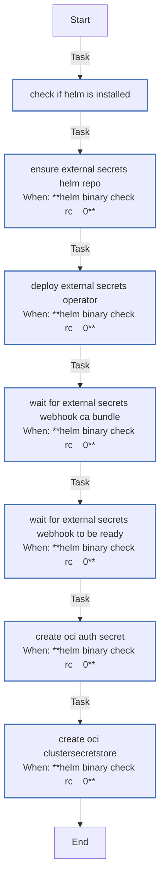

<!-- DOCSIBLE START -->

# 📃 Role overview

## external_secrets

### Defaults

**These are static variables with lower priority**

#### File: defaults/main.yml

| Var          | Type         | Value       |Required    | Title       |
|--------------|--------------|-------------|------------|-------------|
| [oci_config_file](defaults/main.yml#L5)   | str | `{{ playbook_dir }}/.oci` |    false  |  OCI Configuration File |

<b>🖇️ Full descriptions for vars in defaults/main.yml</b>

 
<table>
<th>Var</th><th>Description</th>
<tr><td><b>oci_config_file</b></td><td>Path to Oracle Cloud Infrastructure configuration file.</td></tr>
</table>
 

### Tasks

#### File: tasks/main.yml

| Name | Module | Has Conditions | Tags |
| ---- | ------ | -------------- | -----|
| [Check if Helm is installed](tasks/main.yml#L1) | ansible.builtin.command | False |  |
| [Ensure External Secrets Helm repo](tasks/main.yml#L7) | kubernetes.core.helm_repository | True |  |
| [Deploy External Secrets Operator](tasks/main.yml#L13) | kubernetes.core.helm | True | cluster,infrastructure,external-secrets |
| [Wait for external-secrets webhook CA bundle](tasks/main.yml#L70) | kubernetes.core.k8s_info | True | cluster,infrastructure,external-secrets |
| [Wait for external-secrets webhook to be ready](tasks/main.yml#L91) | kubernetes.core.k8s | True | cluster,infrastructure,external-secrets |
| [Create OCI Auth Secret](tasks/main.yml#L107) | kubernetes.core.k8s | True | cluster,infrastructure,external-secrets,oci |
| [Create OCI ClusterSecretStore](tasks/main.yml#L128) | kubernetes.core.k8s | True | cluster,infrastructure,external-secrets,oci |

## Task Flow Graphs

### Graph for main.yml

#### Dependencies

No dependencies specified.
<!-- DOCSIBLE END -->
