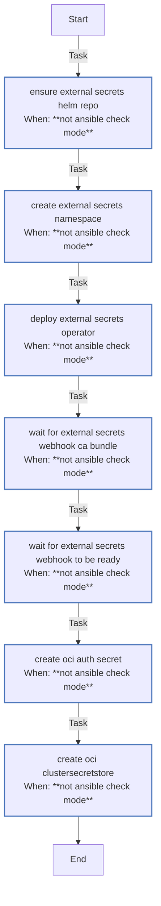

<!-- DOCSIBLE START -->

# 📃 Role overview

## external_secrets

Description: Install External Secrets Operator and configure an OCI Vault-backed ClusterSecretStore (requires cert-manager).

<b>🧩 Argument Specifications in meta/argument_specs</b>

#### Key: main

**Description**: Deploys External Secrets Operator and configures an OCI Vault-backed
ClusterSecretStore for external secret management.

**Options**:

  - **externalSecrets_namespace**
    - **Required**: False
    - **Type**: str
    - **Default**: external-secrets
  
    - **Description**: Namespace for External Secrets Operator.
  
  
  

  - **externalSecrets_chartVersion**
    - **Required**: False
    - **Type**: str
    - **Default**: none
  
    - **Description**: Helm chart version (omit for latest).
  
  
  

  - **externalSecrets_webhookIssuerName**
    - **Required**: False
    - **Type**: str
    - **Default**: selfsigned-issuer
  
    - **Description**: ClusterIssuer for webhook certificates.
  
  
  

  - **externalSecrets_serviceMonitorEnabled**
    - **Required**: False
    - **Type**: bool
    - **Default**: False
  
    - **Description**: Enable Prometheus ServiceMonitor.
  
  
  

  - **externalSecrets_grafanaDashboardEnabled**
    - **Required**: False
    - **Type**: bool
    - **Default**: False
  
    - **Description**: Enable Grafana dashboard ConfigMap.
  
  
  

  - **kubeconfig**
    - **Required**: True
    - **Type**: str
    - **Default**: none
  
    - **Description**: Path to kubeconfig for cluster access.
  
  
  

  - **oci_configFile**
    - **Required**: True
    - **Type**: str
    - **Default**: none
  
    - **Description**: Path to OCI CLI configuration file.
  
  
  

### Tasks

#### File: tasks/main.yml

| Name | Module | Has Conditions | Tags | Comments |
| ---- | ------ | -------------- | -----| -------- |
| [Ensure External Secrets Helm repo](tasks/main.yml#L2) | kubernetes.core.helm_repository | True |  | @docsible Registers External Secrets Helm repository |
| [Create external-secrets namespace](tasks/main.yml#L9) | kubernetes.core.k8s | True |  | @docsible Creates namespace for External Secrets |
| [Deploy External Secrets Operator](tasks/main.yml#L17) | kubernetes.core.helm | True | infra | @docsible Installs External Secrets Operator via Helm |
| [Wait for external-secrets webhook CA bundle](tasks/main.yml#L34) | kubernetes.core.k8s_info | True | infra | @docsible Waits for Webhook CA Bundle Injection |
| [Wait for external-secrets webhook to be ready](tasks/main.yml#L55) | kubernetes.core.k8s | True | infra | @docsible Waits for Webhook Deployment Readiness |
| [Create OCI Auth Secret](tasks/main.yml#L71) | kubernetes.core.k8s | True | infra | @docsible Creates Secret for OCI/GCP Vault Authentication |
| [Create OCI ClusterSecretStore](tasks/main.yml#L82) | kubernetes.core.k8s | True | infra | @docsible Configures ClusterSecretStore (Vault Backend) |

## Task Flow Graphs

### Graph for main.yml

## Author Information
rc

#### License

MIT

#### Minimum Ansible Version

2.20.0

#### Platforms

- **Ubuntu**: ['noble']

#### Dependencies

No dependencies specified.
<!-- DOCSIBLE END -->
