<!-- DOCSIBLE START -->

# 📃 Role overview

## external_secrets

Description: Install External Secrets Operator and configure an OCI Vault-backed ClusterSecretStore (requires cert-manager).

### Tasks

#### File: tasks/main.yml

| Name | Module | Has Conditions | Tags | Comments |
| ---- | ------ | -------------- | -----| -------- |
| [Check if Helm is installed](tasks/main.yml#L3) | ansible.builtin.stat | False |  | @docsible Check Helm availability
@docsible Check Helm availability |
| [Ensure External Secrets Helm repo](tasks/main.yml#L11) | kubernetes.core.helm_repository | True |  | @docsible Add External Secrets Helm repository
@docsible Add External Secrets Helm repository |
| [Deploy External Secrets Operator](tasks/main.yml#L21) | kubernetes.core.helm | True | cluster,infrastructure,external-secrets | @docsible Deploy External Secrets Operator via Helm
@docsible Deploy External Secrets Operator via Helm |
| [Wait for external-secrets webhook CA bundle](tasks/main.yml#L84) | kubernetes.core.k8s_info | True | cluster,infrastructure,external-secrets | @docsible Wait for webhook CA bundle population
@docsible Wait for webhook CA bundle population |
| [Wait for external-secrets webhook to be ready](tasks/main.yml#L109) | kubernetes.core.k8s | True | cluster,infrastructure,external-secrets | @docsible Wait for webhook deployment readiness
@docsible Wait for webhook deployment readiness |
| [Create OCI Auth Secret](tasks/main.yml#L129) | kubernetes.core.k8s | True | cluster,infrastructure,external-secrets,oci | @docsible Create OCI authentication secret
@docsible Create OCI authentication secret |
| [Create OCI ClusterSecretStore](tasks/main.yml#L153) | kubernetes.core.k8s | True | cluster,infrastructure,external-secrets,oci | @docsible Create OCI ClusterSecretStore |

## Task Flow Graphs

### Graph for main.yml

```mermaid
flowchart TD
Start
classDef block stroke:#3498db,stroke-width:2px;
classDef task stroke:#4b76bb,stroke-width:2px;
classDef includeTasks stroke:#16a085,stroke-width:2px;
classDef importTasks stroke:#34495e,stroke-width:2px;
classDef includeRole stroke:#2980b9,stroke-width:2px;
classDef importRole stroke:#699ba7,stroke-width:2px;
classDef includeVars stroke:#8e44ad,stroke-width:2px;
classDef rescue stroke:#665352,stroke-width:2px;

  Start-->|Task| Check_if_Helm_is_installed0[check if helm is installed]:::task
  Check_if_Helm_is_installed0-->|Task| Ensure_External_Secrets_Helm_repo1[ensure external secrets helm repo<br>When: **helm binary check stat exists and not ansible<br>check mode**]:::task
  Ensure_External_Secrets_Helm_repo1-->|Task| Deploy_External_Secrets_Operator2[deploy external secrets operator<br>When: **helm binary check stat exists and not ansible<br>check mode**]:::task
  Deploy_External_Secrets_Operator2-->|Task| Wait_for_external_secrets_webhook_CA_bundle3[wait for external secrets webhook ca bundle<br>When: **helm binary check stat exists and not ansible<br>check mode**]:::task
  Wait_for_external_secrets_webhook_CA_bundle3-->|Task| Wait_for_external_secrets_webhook_to_be_ready4[wait for external secrets webhook to be ready<br>When: **helm binary check stat exists and not ansible<br>check mode**]:::task
  Wait_for_external_secrets_webhook_to_be_ready4-->|Task| Create_OCI_Auth_Secret5[create oci auth secret<br>When: **helm binary check stat exists and not ansible<br>check mode**]:::task
  Create_OCI_Auth_Secret5-->|Task| Create_OCI_ClusterSecretStore6[create oci clustersecretstore<br>When: **helm binary check stat exists and not ansible<br>check mode**]:::task
  Create_OCI_ClusterSecretStore6-->End
```

## Author Information
rc

### License

MIT

### Minimum Ansible Version

2.14

### Platforms

- **Ubuntu**: ['jammy', 'noble']

### Dependencies

No dependencies specified.
<!-- DOCSIBLE END -->
