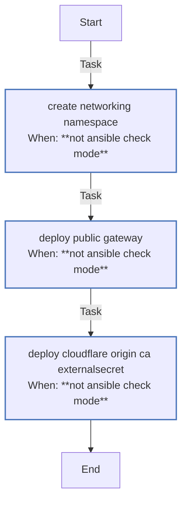

<!-- DOCSIBLE START -->

# 📃 Role overview

## gateway

Description: Deploys Kubernetes Gateway API resources including namespace, ReferenceGrant, and public Gateway.

### Tasks

#### File: tasks/main.yml

| Name | Module | Has Conditions | Tags | Comments |
| ---- | ------ | -------------- | -----| -------- |
| [Create networking namespace](tasks/main.yml#L2) | kubernetes.core.k8s | True | infra,networking | @docsible Creates 'networking' namespace (Privileged for Gateway) |
| [Deploy public Gateway](tasks/main.yml#L19) | kubernetes.core.k8s | True | infra,networking | @docsible Deploys Public Gateway (Static Manifest) |
| [Deploy Cloudflare Origin CA ExternalSecret](tasks/main.yml#L28) | kubernetes.core.k8s | True | infra,networking | @docsible Deploys Cloudflare Origin CA ExternalSecret |

## Task Flow Graphs

### Graph for main.yml

## Author Information
rc

### License

MIT

### Minimum Ansible Version

2.14

### Platforms

- **Ubuntu**: ['noble']

### Dependencies

No dependencies specified.
<!-- DOCSIBLE END -->
