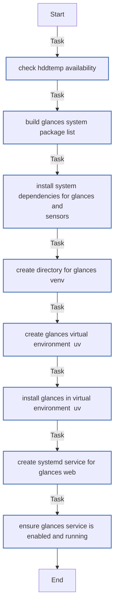

<!-- DOCSIBLE START -->

# 📃 Role overview

## glances

Description: Install and configure Glances system monitoring with web interface.

<b>🧩 Argument Specifications in meta/argument_specs</b>

#### Key: main

**Description**: 
- Installs Glances in a Python virtual environment
- Configures systemd service for web interface

**Options**:

  - **glances_state**
    - **Required**: false
    - **Type**: str
    - **Default**: present
  
    - **Description**: Whether Glances should be installed or removed.
  
      - **Choices**:
    
          - present
    
          - absent
    
  
  
  

  - **glances_port**
    - **Required**: false
    - **Type**: int
    - **Default**: 61208
  
    - **Description**: Port for Glances web interface.
  
  
  

  - **glances_bind_address**
    - **Required**: false
    - **Type**: str
    - **Default**: 127.0.0.1
  
    - **Description**: Address to bind Glances web server.
  
  
  

  - **glances_venv_path**
    - **Required**: false
    - **Type**: str
    - **Default**: /opt/glances
  
    - **Description**: Path for Python virtual environment.
  
  
  

  - **glances_packages**
    - **Required**: false
    - **Type**: list
    - **Default**: ['glances[all]']
  
    - **Description**: Glances packages to install with extras.
  
  
  

### Defaults

**These are static variables with lower priority**

#### File: defaults/main.yml

| Var          | Type         | Value       |
|--------------|--------------|-------------|
| [glances_state](defaults/main.yml#L1)   | str | `present` |    
| [glances_port](defaults/main.yml#L2)   | int | `61208` |    
| [glances_bind_address](defaults/main.yml#L3)   | str | `127.0.0.1` |    
| [glances_venv_path](defaults/main.yml#L4)   | str | `/opt/glances` |    
| [glances_packages](defaults/main.yml#L6)   | list | `[]` |    
| [glances_packages.**0**](defaults/main.yml#L7)   | str | `glances[all]` |    

### Tasks

#### File: tasks/main.yml

| Name | Module | Has Conditions |
| ---- | ------ | -------------- |
| [Check hddtemp availability](tasks/main.yml#L1) | ansible.builtin.command | False |
| [Build Glances system package list](tasks/main.yml#L7) | ansible.builtin.set_fact | False |
| [Install system dependencies for Glances and sensors](tasks/main.yml#L16) | ansible.builtin.apt | False |
| [Create directory for Glances venv](tasks/main.yml#L22) | ansible.builtin.file | False |
| [Create Glances virtual environment (uv)](tasks/main.yml#L27) | ansible.builtin.command | False |
| [Install Glances in virtual environment (uv)](tasks/main.yml#L34) | ansible.builtin.command | False |
| [Create Systemd service for Glances Web](tasks/main.yml#L40) | ansible.builtin.template | False |
| [Ensure Glances service is enabled and running](tasks/main.yml#L46) | ansible.builtin.systemd | False |

## Task Flow Graphs

### Graph for main.yml

## Author Information
Roura

#### License

MIT

#### Minimum Ansible Version

2.20.0

#### Platforms

- **Ubuntu**: ['noble']

#### Dependencies

No dependencies specified.
<!-- DOCSIBLE END -->
