<!-- DOCSIBLE START -->

# 📃 Role overview

## glances

Description: Install and configure Glances system monitoring with web interface.

<b> Argument Specifications in meta/argument_specs</b>

#### Key: main

**Description**:
- Installs Glances in a Python virtual environment
- Configures systemd service for web interface

**Options**:

  - **glances_state**
    - **Required**: false
    - **Type**: str
    - **Default**: present
  
    - **Description**: Whether Glances should be installed or removed.
  
      - **Choices**:
    
          - present
    
          - absent
    
  
  
  

  - **glances_port**
    - **Required**: false
    - **Type**: int
    - **Default**: 61208
  
    - **Description**: Port for Glances web interface.
  
  
  

  - **glances_bind_address**
    - **Required**: false
    - **Type**: str
    - **Default**: 127.0.0.1
  
    - **Description**: Address to bind Glances web server.
  
  
  

  - **glances_venv_path**
    - **Required**: false
    - **Type**: str
    - **Default**: /opt/glances
  
    - **Description**: Path for Python virtual environment.
  
  
  

  - **glances_packages**
    - **Required**: false
    - **Type**: list
    - **Default**: ['glances[all]']
  
    - **Description**: Glances packages to install with extras.
  
  
  

### Defaults

**These are static variables with lower priority**

#### File: defaults/main.yml

| Var          | Type         | Value       |Required    | Title       |
|--------------|--------------|-------------|------------|-------------|
| [glances_state](defaults/main.yml#L5)   | str | `present` |    false  |  Installation State |
| [glances_port](defaults/main.yml#L10)   | int | `61208` |    false  |  Web Interface Port |
| [glances_bind_address](defaults/main.yml#L15)   | str | `127.0.0.1` |    false  |  Bind Address |
| [glances_venv_path](defaults/main.yml#L20)   | str | `/opt/glances` |    false  |  Virtual Environment Path |
| [glances_packages](defaults/main.yml#L26)   | list | `[]` |    false  |  Package List |
| [glances_packages.**0**](defaults/main.yml#L32)   | str | `glances[all]` |    false  |  Glances Package |

<b>Full descriptions for vars in defaults/main.yml</b>

 
<table>
<th>Var</th><th>Description</th>
<tr><td><b>glances_state</b></td><td>Whether Glances should be present or absent.</td></tr>
<tr><td><b>glances_port</b></td><td>Port number for Glances web interface.</td></tr>
<tr><td><b>glances_bind_address</b></td><td>IP address to bind the web interface (127.0.0.1 for localhost only).</td></tr>
<tr><td><b>glances_venv_path</b></td><td>Path where Glances virtual environment will be installed.</td></tr>
<tr><td><b>glances_packages</b></td><td>Glances packages to install (list of pip specifiers, e.g., "glances[all]").</td></tr>
<tr><td><b>glances_packages.0</b></td><td>Pip package specifier for Glances (include extras as needed).</td></tr>
</table>
 

### Tasks

#### File: tasks/main.yml

| Name | Module | Has Conditions | Comments |
| ---- | ------ | -------------- | -------- |
| [Install core system dependencies for Glances](tasks/main.yml#L2) | ansible.builtin.apt | False | @docsible Install core system dependencies |
| [Install smartmontools](tasks/main.yml#L13) | ansible.builtin.apt | True | @docsible Install smartmontools on physical hardware (replacement for hddtemp) |
| [Create directory for Glances venv](tasks/main.yml#L19) | ansible.builtin.file | False | @docsible Create Glances venv directory |
| [Check uv availability](tasks/main.yml#L25) | ansible.builtin.stat | False | @docsible Check uv availability |
| [Fail when uv is missing](tasks/main.yml#L31) | ansible.builtin.fail | True | @docsible Validate uv installation |
| [Create Glances virtual environment (uv)](tasks/main.yml#L38) | ansible.builtin.command | True | @docsible Create Python virtual environment with uv |
| [Install Glances in virtual environment](tasks/main.yml#L47) | ansible.builtin.pip | True | @docsible Install Glances in virtual environment |
| [Create Systemd service for Glances Web](tasks/main.yml#L55) | ansible.builtin.template | False | @docsible Create systemd service for Glances Web |
| [Ensure Glances service is enabled and running](tasks/main.yml#L62) | ansible.builtin.systemd | True | @docsible Enable and start Glances service |

## Task Flow Graphs

### Graph for main.yml

```mermaid
flowchart TD
Start
classDef block stroke:#3498db,stroke-width:2px;
classDef task stroke:#4b76bb,stroke-width:2px;
classDef includeTasks stroke:#16a085,stroke-width:2px;
classDef importTasks stroke:#34495e,stroke-width:2px;
classDef includeRole stroke:#2980b9,stroke-width:2px;
classDef importRole stroke:#699ba7,stroke-width:2px;
classDef includeVars stroke:#8e44ad,stroke-width:2px;
classDef rescue stroke:#665352,stroke-width:2px;

  Start-->|Task| Install_core_system_dependencies_for_Glances0[install core system dependencies for glances]:::task
  Install_core_system_dependencies_for_Glances0-->|Task| Install_smartmontools1[install smartmontools<br>When: **ansible facts  virtualization role     default <br>guest       guest**]:::task
  Install_smartmontools1-->|Task| Create_directory_for_Glances_venv2[create directory for glances venv]:::task
  Create_directory_for_Glances_venv2-->|Task| Check_uv_availability3[check uv availability]:::task
  Check_uv_availability3-->|Task| Fail_when_uv_is_missing4[fail when uv is missing<br>When: **not ansible check mode and not glances uv binary<br>stat exists**]:::task
  Fail_when_uv_is_missing4-->|Task| Create_Glances_virtual_environment__uv_5[create glances virtual environment  uv <br>When: **not ansible check mode**]:::task
  Create_Glances_virtual_environment__uv_5-->|Task| Install_Glances_in_virtual_environment6[install glances in virtual environment<br>When: **not ansible check mode**]:::task
  Install_Glances_in_virtual_environment6-->|Task| Create_Systemd_service_for_Glances_Web7[create systemd service for glances web]:::task
  Create_Systemd_service_for_Glances_Web7-->|Task| Ensure_Glances_service_is_enabled_and_running8[ensure glances service is enabled and running<br>When: **not ansible check mode**]:::task
  Ensure_Glances_service_is_enabled_and_running8-->End
```

## Author Information
Roura

### License

MIT

### Minimum Ansible Version

2.20.0

### Platforms

- **Ubuntu**: ['noble']

### Dependencies

No dependencies specified.
<!-- DOCSIBLE END -->
