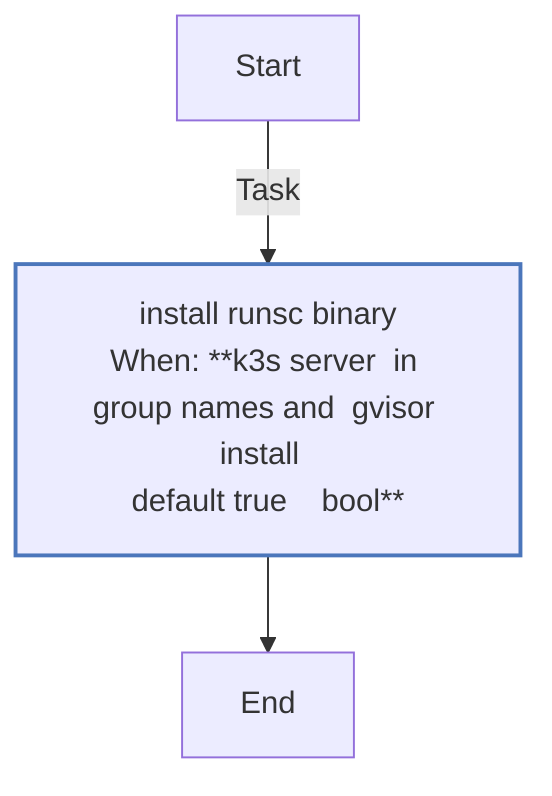
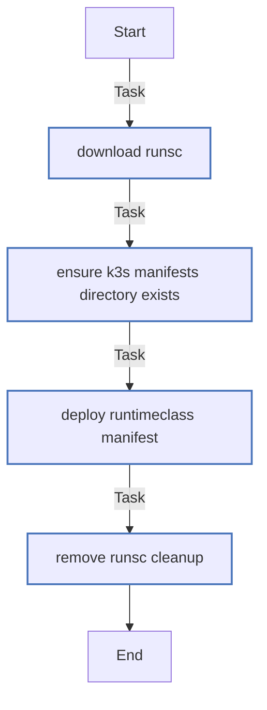
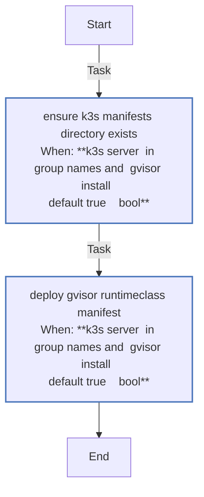

<!-- DOCSIBLE START -->

# 📃 Role overview

## gvisor

Description: Install gVisor runsc and register a RuntimeClass for K3s server workloads.

### Defaults

**These are static variables with lower priority**

#### File: defaults/main.yml

| Var          | Type         | Value       |Required    | Title       |
|--------------|--------------|-------------|------------|-------------|
| [gvisor_install](defaults/main.yml#L5)   | bool | `True` |    false  |  gVisor Install |
| [gvisor_version](defaults/main.yml#L11)   | str | `20231204.0` |    false  |  gVisor Version |

<b>Full descriptions for vars in defaults/main.yml</b>

 
<table>
<th>Var</th><th>Description</th>
<tr><td><b>gvisor_install</b></td><td>Enable gVisor installation and RuntimeClass deployment.</td></tr>
<tr><td><b>gvisor_version</b></td><td>Version of gVisor runtime to install.</td></tr>
</table>
 

### Tasks

#### File: tasks/host.yml

| Name | Module | Has Conditions | Comments |
| ---- | ------ | -------------- | -------- |
| [Install runsc binary](tasks/host.yml#L3) | ansible.builtin.get_url | True | Installation of gVisor (runsc)
@docsible Download gVisor runtime binary |

#### File: tasks/main.yml

| Name | Module | Has Conditions | Tags | Comments |
| ---- | ------ | -------------- | -----| -------- |
| [Download runsc](tasks/main.yml#L3) | ansible.builtin.get_url | False |  | @docsible Download gVisor runtime binary |
| [Ensure K3s manifests directory exists](tasks/main.yml#L13) | ansible.builtin.file | False |  | @docsible Use K3s auto-deploy manifests directory for the RuntimeClass |
| [Deploy RuntimeClass manifest](tasks/main.yml#L20) | ansible.builtin.template | False |  | @docsible Deploy gVisor RuntimeClass manifest |
| [Remove runsc (cleanup)](tasks/main.yml#L27) | ansible.builtin.file | False | cleanup,never | @docsible Remove gVisor runtime binary (cleanup) |

#### File: tasks/runtimeclass.yml

| Name | Module | Has Conditions | Comments |
| ---- | ------ | -------------- | -------- |
| [Ensure K3s manifests directory exists](tasks/runtimeclass.yml#L2) | ansible.builtin.file | True | Use K3s auto-deploy manifests directory for the RuntimeClass |
| [Deploy gVisor RuntimeClass manifest](tasks/runtimeclass.yml#L11) | ansible.builtin.copy | True |  |

## Task Flow Graphs

### Graph for host.yml

### Graph for main.yml

### Graph for runtimeclass.yml

## Author Information
rc

### License

MIT

### Minimum Ansible Version

2.14

### Platforms

- **Ubuntu**: ['jammy', 'noble']

### Dependencies

- k3s_common (or k3s_server), to ensure K3s is present before RuntimeClass deploy
<!-- DOCSIBLE END -->
