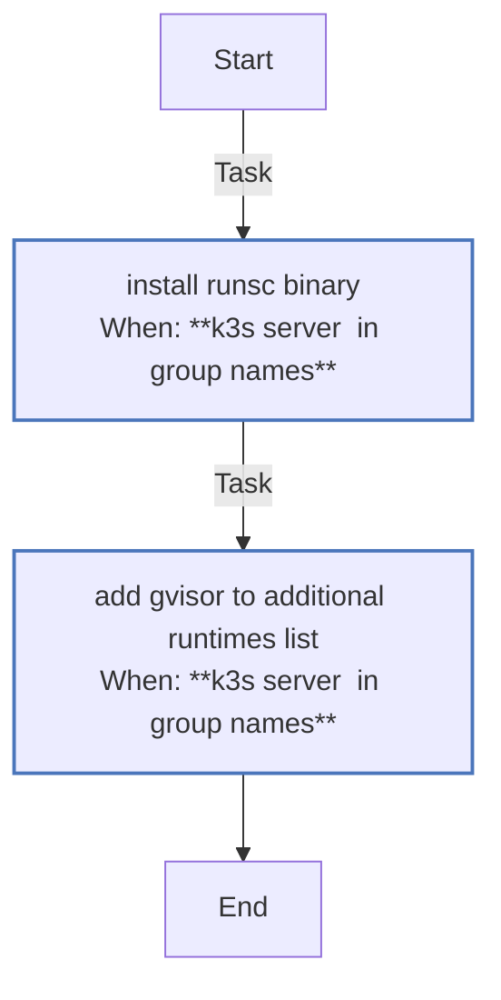
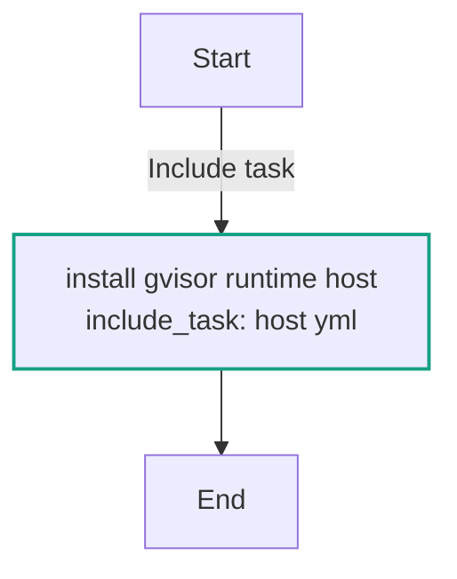
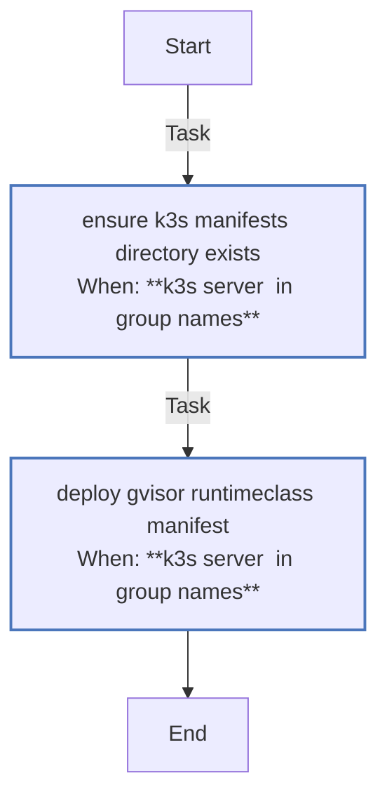

<!-- DOCSIBLE START -->

# 📃 Role overview

## gvisor

Description: Install gVisor runsc and register a RuntimeClass for K3s server workloads.

### Defaults

**These are static variables with lower priority**

#### File: defaults/main.yml

| Var          | Type         | Value       |Required    | Title       |
|--------------|--------------|-------------|------------|-------------|
| [gvisor_version](defaults/main.yml#L5)   | str | `20231204.0` |    false  |  gVisor Version |

<b>🖇️ Full descriptions for vars in defaults/main.yml</b>

 
<table>
<th>Var</th><th>Description</th>
<tr><td><b>gvisor_version</b></td><td>Version of gVisor runtime to install.</td></tr>
</table>
 

### Tasks

#### File: tasks/host.yml

| Name | Module | Has Conditions | Tags | Comments |
| ---- | ------ | -------------- | -----| -------- |
| [Install runsc binary](tasks/host.yml#L2) | ansible.builtin.get_url | True |  | Installation of gVisor (runsc) |
| [Add gVisor to additional runtimes list](tasks/host.yml#L13) | ansible.builtin.set_fact | True | a,l,w,a,y,s | Register gVisor as an available runtime for the cluster |

#### File: tasks/main.yml

| Name | Module | Has Conditions |
| ---- | ------ | -------------- |
| [Install gVisor runtime (host)](tasks/main.yml#L1) | ansible.builtin.include_tasks | False |

#### File: tasks/runtimeclass.yml

| Name | Module | Has Conditions | Comments |
| ---- | ------ | -------------- | -------- |
| [Ensure K3s manifests directory exists](tasks/runtimeclass.yml#L2) | ansible.builtin.file | True | Use K3s auto-deploy manifests directory for the RuntimeClass |
| [Deploy gVisor RuntimeClass manifest](tasks/runtimeclass.yml#L11) | ansible.builtin.copy | True |  |

## Task Flow Graphs

### Graph for host.yml

### Graph for main.yml

### Graph for runtimeclass.yml

## Author Information
rc

#### License

MIT

#### Minimum Ansible Version

2.14

#### Platforms

- **Ubuntu**: ['jammy', 'noble']

#### Dependencies

No dependencies specified.
<!-- DOCSIBLE END -->
