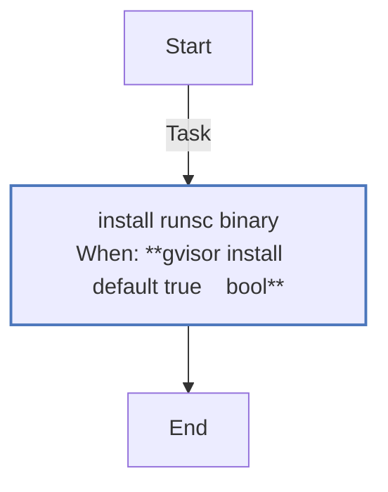
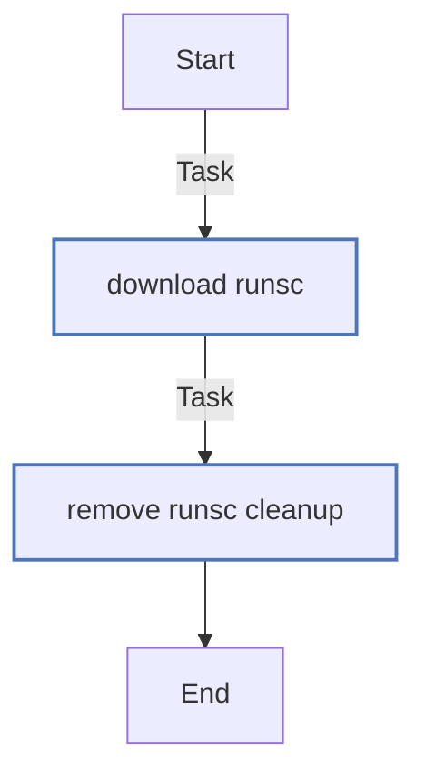
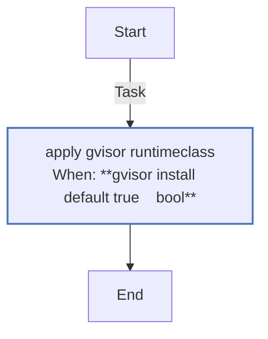

<!-- DOCSIBLE START -->

# 📃 Role overview

## gvisor

Description: Install gVisor runsc and register a RuntimeClass for K3s server workloads.

<b>🧩 Argument Specifications in meta/argument_specs</b>

#### Key: main

**Description**: Downloads and installs gVisor runsc runtime and deploys
a RuntimeClass for sandboxed workloads in K3s.

**Options**:

  - **gvisor_version**
    - **Required**: False
    - **Type**: str
    - **Default**: latest
  
    - **Description**: gVisor version to install.
  
  
  

  - **gvisor_install**
    - **Required**: False
    - **Type**: bool
    - **Default**: True
  
    - **Description**: Enable gVisor installation.
  
  
  

### Tasks

#### File: tasks/host.yml

| Name | Module | Has Conditions | Comments |
| ---- | ------ | -------------- | -------- |
| [Install runsc binary](tasks/host.yml#L2) | ansible.builtin.get_url | True | @docsible Installs runsc gVisor runtime version {{ gvisor_version }} |

#### File: tasks/main.yml

| Name | Module | Has Conditions | Tags | Comments |
| ---- | ------ | -------------- | -----| -------- |
| [Download runsc](tasks/main.yml#L3) | ansible.builtin.get_url | False |  | @docsible Downloads runsc binary from the latest release |
| [Remove runsc (cleanup)](tasks/main.yml#L13) | ansible.builtin.file | False | cleanup,never | @docsible Removes runsc binary during cleanup |

#### File: tasks/runtimeclass.yml

| Name | Module | Has Conditions | Comments |
| ---- | ------ | -------------- | -------- |
| [Apply gVisor RuntimeClass](tasks/runtimeclass.yml#L2) | kubernetes.core.k8s | True | @docsible Registers gVisor RuntimeClass (requires runsc on nodes) |

## Task Flow Graphs

### Graph for host.yml

### Graph for main.yml

### Graph for runtimeclass.yml

## Author Information
rc

#### License

MIT

#### Minimum Ansible Version

2.20.0

#### Platforms

- **Ubuntu**: ['noble']

#### Dependencies

No dependencies specified.
<!-- DOCSIBLE END -->
