<!-- DOCSIBLE START -->

# 📃 Role overview

## k3s_agent

Description: Install and configure K3s agent node to join existing cluster

<b>🧩 Argument Specifications in meta/argument_specs</b>

#### Key: main

**Description**: 
- Installs K3s in agent mode and joins an existing cluster
- Configures Tailscale-based secure communication
- Supports custom node labels and taints

**Options**:

  - **k3s_agentVersion**
    - **Required**: false
    - **Type**: str
    - **Default**: v1.35.3+k3s1
  
    - **Description**: K3s version to install (should match server version)
  
  
  

  - **k3s_agentServerUrl**
    - **Required**: True
    - **Type**: str
    - **Default**: none
  
    - **Description**: K3s server URL (use Tailscale IP)
  
  
  

  - **k3s_agentToken**
    - **Required**: False
    - **Type**: str
    - **Default**: none
  
    - **Description**: K3s server token for node authentication (set dynamically from server)
  
  
  

  - **k3s_agentNodeLabels**
    - **Required**: false
    - **Type**: list
    - **Default**: []
  
    - **Description**: Labels to apply to this node
  
  
  

  - **k3s_agentNodeTaints**
    - **Required**: false
    - **Type**: list
    - **Default**: []
  
    - **Description**: Taints to apply to this node
  
  
  

  - **k3s_agentRecreate**
    - **Required**: false
    - **Type**: bool
    - **Default**: False
  
    - **Description**: Uninstall and wipe previous K3s agent before deploying
  
  
  

  - **IP_tailscale**
    - **Required**: False
    - **Type**: str
    - **Default**: none
  
    - **Description**: Tailscale IP address (100.x.x.x) for node communication (set by tailscale role)
  
  
  

### Tasks

#### File: tasks/main.yml

| Name | Module | Has Conditions | Comments |
| ---- | ------ | -------------- | -------- |
| [Validate Tailscale IP](tasks/main.yml#L2) | ansible.builtin.assert | False | @docsible Validates IP_tailscale follows CGNAT range (100.x.x.x) |
| [Verify K3s agent requirements](tasks/main.yml#L11) | ansible.builtin.assert | False | @docsible Validates presence of K3s URL and Token |
| [Run k3s runtime discovery role](tasks/main.yml#L21) | ansible.builtin.import_role | False | @docsible Detects containerd runtimes (runsc/nvidia) shared across server and agent |
| [Run K3s Common](tasks/main.yml#L26) | ansible.builtin.import_role | False | @docsible Imports K3s Common role (binaries, systemd) |
| [Deploy agent config](tasks/main.yml#L34) | ansible.builtin.template | True | @docsible Deploys K3s Agent config (config.yaml) |
| [Install K3s agent](tasks/main.yml#L43) | ansible.builtin.shell | True | @docsible Installs K3s agent with configured flags |
| [Create override dir](tasks/main.yml#L59) | ansible.builtin.file | False | @docsible Creates systemd override directory |
| [Create override](tasks/main.yml#L66) | ansible.builtin.copy | False | @docsible Deploys systemd ExecStart override |
| [Reload systemd](tasks/main.yml#L77) | ansible.builtin.systemd | False | @docsible Reloads systemd daemon |
| [Start K3s agent](tasks/main.yml#L82) | ansible.builtin.systemd | True | @docsible Starts k3s-agent.service |
| [Flush handlers](tasks/main.yml#L90) | ansible.builtin.meta | False | @docsible Flushes handlers |
| [Wait for node to be ready](tasks/main.yml#L94) | kubernetes.core.k8s_info | True | @docsible Waits for Node "Ready" status in API |
| [Apply node labels](tasks/main.yml#L113) | kubernetes.core.k8s | True | @docsible Applies node labels |
| [Apply node taints](tasks/main.yml#L128) | kubernetes.core.k8s_taint | True | @docsible Applies node taints |
| [Show agent join status](tasks/main.yml#L145) | ansible.builtin.debug | False | @docsible Displays K3s agent join status |

## Task Flow Graphs

### Graph for main.yml

```mermaid
flowchart TD
Start
classDef block stroke:#3498db,stroke-width:2px;
classDef task stroke:#4b76bb,stroke-width:2px;
classDef includeTasks stroke:#16a085,stroke-width:2px;
classDef importTasks stroke:#34495e,stroke-width:2px;
classDef includeRole stroke:#2980b9,stroke-width:2px;
classDef importRole stroke:#699ba7,stroke-width:2px;
classDef includeVars stroke:#8e44ad,stroke-width:2px;
classDef rescue stroke:#665352,stroke-width:2px;

  Start-->|Task| Validate_Tailscale_IP0[validate tailscale ip]:::task
  Validate_Tailscale_IP0-->|Task| Verify_K3s_agent_requirements1[verify k3s agent requirements]:::task
  Verify_K3s_agent_requirements1-->|Import role| Run_k3s_runtime_discovery_role_k3s_runtime_discovery_2([run k3s runtime discovery role<br>import_role: k3s runtime discovery]):::importRole
  Run_k3s_runtime_discovery_role_k3s_runtime_discovery_2-->|Import role| Run_K3s_Common_k3s_common_3([run k3s common<br>import_role: k3s common]):::importRole
  Run_K3s_Common_k3s_common_3-->|Task| Deploy_agent_config4[deploy agent config<br>When: **not ansible check mode**]:::task
  Deploy_agent_config4-->|Task| Install_K3s_agent5[install k3s agent<br>When: **not ansible check mode**]:::task
  Install_K3s_agent5-->|Task| Create_override_dir6[create override dir]:::task
  Create_override_dir6-->|Task| Create_override7[create override]:::task
  Create_override7-->|Task| Reload_systemd8[reload systemd]:::task
  Reload_systemd8-->|Task| Start_K3s_agent9[start k3s agent<br>When: **not ansible check mode**]:::task
  Start_K3s_agent9-->|Task| Flush_handlers10[flush handlers]:::task
  Flush_handlers10-->|Task| Wait_for_node_to_be_ready11[wait for node to be ready<br>When: **not ansible check mode**]:::task
  Wait_for_node_to_be_ready11-->|Task| Apply_node_labels12[apply node labels<br>When: **k3s agentnodelabels   length   0 and not ansible<br>check mode**]:::task
  Apply_node_labels12-->|Task| Apply_node_taints13[apply node taints<br>When: **k3s agentnodetaints   length   0 and not ansible<br>check mode**]:::task
  Apply_node_taints13-->|Task| Show_agent_join_status14[show agent join status]:::task
  Show_agent_join_status14-->End
```

## Author Information
rc

#### License

MIT

#### Minimum Ansible Version

2.20.0

#### Platforms

- **Ubuntu**: ['noble']

#### Dependencies

No dependencies specified.
<!-- DOCSIBLE END -->
