<!-- DOCSIBLE START -->

# 📃 Role overview

## k3s_agent

Description: Install and configure K3s agent node to join existing cluster

<b> Argument Specifications in meta/argument_specs</b>

#### Key: main

**Description**:
- Installs K3s in agent mode and joins an existing cluster
- Configures Tailscale-based secure communication
- Supports custom node labels and taints

**Options**:

  - **k3s_agentVersion**
    - **Required**: false
    - **Type**: str
    - **Default**: v1.35.0+k3s1
  
    - **Description**: K3s version to install (should match server version)
  
  
  

  - **k3s_agentServerUrl**
    - **Required**: True
    - **Type**: str
    - **Default**: none
  
    - **Description**: K3s server URL (use Tailscale IP)
  
  
  

  - **k3s_agentToken**
    - **Required**: False
    - **Type**: str
    - **Default**: none
  
    - **Description**: K3s server token for node authentication (set dynamically from server)
  
  
  

  - **k3s_agentNodeLabels**
    - **Required**: false
    - **Type**: list
    - **Default**: []
  
    - **Description**: Labels to apply to this node
  
  
  

  - **k3s_agentNodeTaints**
    - **Required**: false
    - **Type**: list
    - **Default**: []
  
    - **Description**: Taints to apply to this node
  
  
  

  - **k3s_agentRecreate**
    - **Required**: false
    - **Type**: bool
    - **Default**: False
  
    - **Description**: Uninstall and wipe previous K3s agent before deploying
  
  
  

  - **tailscale_ip**
    - **Required**: False
    - **Type**: str
    - **Default**: none
  
    - **Description**: Tailscale IP address (100.x.x.x) for node communication (set by tailscale role)
  
  
  

### Tasks

#### File: tasks/main.yml

| Name | Module | Has Conditions | Comments |
| ---- | ------ | -------------- | -------- |
| [Verify K3s agent requirements](tasks/main.yml#L2) | ansible.builtin.assert | False | main.yml - K3s Agent Role |
| [Check for runsc binary](tasks/main.yml#L12) | ansible.builtin.stat | False | Detect if gVisor or Nvidia runtimes are present on host |
| [Check for nvidia-container-runtime](tasks/main.yml#L17) | ansible.builtin.stat | False |  |
| [Build containerd runtime list](tasks/main.yml#L22) | ansible.builtin.set_fact | False |  |
| [Run K3s Common](tasks/main.yml#L32) | ansible.builtin.import_role | False | Import common K3s setup tasks (directories, containerd, uninstall logic) |
| [Deploy agent config](tasks/main.yml#L40) | ansible.builtin.template | True | Deploy K3s agent configuration |
| [Install K3s agent](tasks/main.yml#L49) | ansible.builtin.shell | True | Download and install K3s agent with specified version |
| [Create override dir](tasks/main.yml#L65) | ansible.builtin.file | False | Create systemd override directory for K3s agent service customization |
| [Create override](tasks/main.yml#L72) | ansible.builtin.copy | False | Override K3s agent service configuration for clean startup |
| [Reload systemd](tasks/main.yml#L83) | ansible.builtin.systemd | False | Reload systemd configuration after service changes |
| [Start K3s agent](tasks/main.yml#L88) | ansible.builtin.systemd | True | Enable and start K3s agent service |
| [Flush handlers](tasks/main.yml#L96) | ansible.builtin.meta | False | Apply pending service restarts before continuing |
| [Wait for node to be ready](tasks/main.yml#L100) | kubernetes.core.k8s_info | True | Wait for node to appear and become ready on the cluster |
| [Apply node labels](tasks/main.yml#L118) | kubernetes.core.k8s | True | Apply node labels if specified |
| [Apply node taints](tasks/main.yml#L132) | kubernetes.core.k8s_taint | True | Apply node taints if specified |
| [Show agent join status](tasks/main.yml#L148) | ansible.builtin.debug | False | Display success message |

## Task Flow Graphs

### Graph for main.yml

```mermaid
flowchart TD
Start
classDef block stroke:#3498db,stroke-width:2px;
classDef task stroke:#4b76bb,stroke-width:2px;
classDef includeTasks stroke:#16a085,stroke-width:2px;
classDef importTasks stroke:#34495e,stroke-width:2px;
classDef includeRole stroke:#2980b9,stroke-width:2px;
classDef importRole stroke:#699ba7,stroke-width:2px;
classDef includeVars stroke:#8e44ad,stroke-width:2px;
classDef rescue stroke:#665352,stroke-width:2px;

  Start-->|Task| Verify_K3s_agent_requirements0[verify k3s agent requirements]:::task
  Verify_K3s_agent_requirements0-->|Task| Check_for_runsc_binary1[check for runsc binary]:::task
  Check_for_runsc_binary1-->|Task| Check_for_nvidia_container_runtime2[check for nvidia container runtime]:::task
  Check_for_nvidia_container_runtime2-->|Task| Build_containerd_runtime_list3[build containerd runtime list]:::task
  Build_containerd_runtime_list3-->|Import role| Run_K3s_Common_k3s_common_4([run k3s common<br>import_role: k3s common]):::importRole
  Run_K3s_Common_k3s_common_4-->|Task| Deploy_agent_config5[deploy agent config<br>When: **not ansible check mode**]:::task
  Deploy_agent_config5-->|Task| Install_K3s_agent6[install k3s agent<br>When: **not ansible check mode**]:::task
  Install_K3s_agent6-->|Task| Create_override_dir7[create override dir]:::task
  Create_override_dir7-->|Task| Create_override8[create override]:::task
  Create_override8-->|Task| Reload_systemd9[reload systemd]:::task
  Reload_systemd9-->|Task| Start_K3s_agent10[start k3s agent<br>When: **not ansible check mode**]:::task
  Start_K3s_agent10-->|Task| Flush_handlers11[flush handlers]:::task
  Flush_handlers11-->|Task| Wait_for_node_to_be_ready12[wait for node to be ready<br>When: **not ansible check mode**]:::task
  Wait_for_node_to_be_ready12-->|Task| Apply_node_labels13[apply node labels<br>When: **k3s agentnodelabels   length   0 and not ansible<br>check mode**]:::task
  Apply_node_labels13-->|Task| Apply_node_taints14[apply node taints<br>When: **k3s agentnodetaints   length   0 and not ansible<br>check mode**]:::task
  Apply_node_taints14-->|Task| Show_agent_join_status15[show agent join status]:::task
  Show_agent_join_status15-->End
```

## Author Information
rc

### License

MIT

### Minimum Ansible Version

2.14

### Platforms

- **Ubuntu**: ['jammy', 'noble']

### Dependencies

No dependencies specified.
<!-- DOCSIBLE END -->
