<!-- DOCSIBLE START -->

# 📃 Role overview

## k3s_agent

Description: Install and configure K3s agent node to join existing cluster

<b>🧩 Argument Specifications in meta/argument_specs</b>

#### Key: main

**Description**: 
- Installs K3s in agent mode and joins an existing cluster
- Configures Tailscale-based secure communication
- Supports custom node labels and taints

**Options**:

  - **k3s_agent_version**
    - **Required**: false
    - **Type**: str
    - **Default**: v1.35.0+k3s1
  
    - **Description**: K3s version to install (should match server version)
  
  
  

  - **k3s_agent_server_url**
    - **Required**: True
    - **Type**: str
    - **Default**: none
  
    - **Description**: K3s server URL (use Tailscale IP)
  
  
  

  - **k3s_agent_token**
    - **Required**: False
    - **Type**: str
    - **Default**: none
  
    - **Description**: K3s server token for node authentication (set dynamically from server)
  
  
  

  - **k3s_agent_node_labels**
    - **Required**: false
    - **Type**: list
    - **Default**: []
  
    - **Description**: Labels to apply to this node
  
  
  

  - **k3s_agent_node_taints**
    - **Required**: false
    - **Type**: list
    - **Default**: []
  
    - **Description**: Taints to apply to this node
  
  
  

  - **k3s_agent_recreate**
    - **Required**: false
    - **Type**: bool
    - **Default**: False
  
    - **Description**: Uninstall and wipe previous K3s agent before deploying
  
  
  

  - **tailscale_ip**
    - **Required**: False
    - **Type**: str
    - **Default**: none
  
    - **Description**: Tailscale IP address (100.x.x.x) for node communication (set by tailscale role)
  
  
  

### Defaults

**These are static variables with lower priority**

#### File: defaults/main.yml

| Var          | Type         | Value       |Required    | Title       |
|--------------|--------------|-------------|------------|-------------|
| [k3s_agent_version](defaults/main.yml#L5)   | str | `v1.35.0+k3s1` |    false  |  K3s Agent Version |
| [k3s_agent_server_url](defaults/main.yml#L11)   | str |  |    true  |  Server URL |
| [k3s_agent_token](defaults/main.yml#L17)   | str |  |    false  |  Server Token |
| [k3s_agent_node_labels](defaults/main.yml#L23)   | list | `[]` |    false  |  Node Labels |
| [k3s_agent_node_taints](defaults/main.yml#L29)   | list | `[]` |    false  |  Node Taints |
| [k3s_agent_readyz_retries](defaults/main.yml#L35)   | int | `30` |    false  |  Readiness Retries |
| [k3s_agent_readyz_delay](defaults/main.yml#L41)   | int | `5` |    false  |  Readiness Delay |
| [k3s_agent_recreate](defaults/main.yml#L47)   | bool | `False` |    false  |  Recreate Agent |
| [k3s_cni_bin_dir](defaults/main.yml#L53)   | str | `/opt/cni/bin` |    false  |  CNI Bin Directory |
| [k3s_cni_conf_dir](defaults/main.yml#L59)   | str | `/etc/cni/net.d` |    false  |  CNI Config Directory |
| [k3s_agent_kubelet_args](defaults/main.yml#L66)   | list | `[]` |    false  |  Kubelet Arguments |
| [k3s_common_containerd_optimized](defaults/main.yml#L72)   | bool | `True` |    false  |  Containerd Optimizations |
| [k3s_common_containerd_default_runtime](defaults/main.yml#L78)   | str | `runc` |    false  |  Containerd Default Runtime |

<b>🖇️ Full descriptions for vars in defaults/main.yml</b>

 
<table>
<th>Var</th><th>Description</th>
<tr><td><b>k3s_agent_version</b></td><td>K3s version to install (should match server version).</td></tr>
<tr><td><b>k3s_agent_server_url</b></td><td>K3s server URL to connect to (use Tailscale IP for security).</td></tr>
<tr><td><b>k3s_agent_token</b></td><td>K3s server token for node authentication (set dynamically from server; K10 format with CA hash).</td></tr>
<tr><td><b>k3s_agent_node_labels</b></td><td>Labels to apply to this node (list of "key=value" strings).</td></tr>
<tr><td><b>k3s_agent_node_taints</b></td><td>Taints to apply to this node (list of "key=value:effect", e.g., "gpu=true:NoSchedule").</td></tr>
<tr><td><b>k3s_agent_readyz_retries</b></td><td>Number of retries for the node readiness check.</td></tr>
<tr><td><b>k3s_agent_readyz_delay</b></td><td>Delay (seconds) between readiness check retries.</td></tr>
<tr><td><b>k3s_agent_recreate</b></td><td>If true, uninstalls and wipes previous K3s agent before deploying.</td></tr>
<tr><td><b>k3s_cni_bin_dir</b></td><td>Directory for CNI binaries.</td></tr>
<tr><td><b>k3s_cni_conf_dir</b></td><td>Directory for CNI configuration.</td></tr>
<tr><td><b>k3s_agent_kubelet_args</b></td><td>Additional arguments to pass to kubelet (list of strings).</td></tr>
<tr><td><b>k3s_common_containerd_optimized</b></td><td>Enable containerd performance and resource optimizations.</td></tr>
<tr><td><b>k3s_common_containerd_default_runtime</b></td><td>Default runtime name for containerd (use RuntimeClass to opt-in to others).</td></tr>
</table>
 

### Tasks

#### File: tasks/main.yml

| Name | Module | Has Conditions | Comments |
| ---- | ------ | -------------- | -------- |
| [Validate Tailscale IP](tasks/main.yml#L2) | ansible.builtin.assert | True | Validate Tailscale IP address format for secure cluster communication |
| [Validate server parameters](tasks/main.yml#L12) | ansible.builtin.assert | True | Validate required server connection parameters |
| [Run K3s Common](tasks/main.yml#L23) | ansible.builtin.import_role | False | Import common K3s setup tasks (directories, containerd, uninstall logic) |
| [Deploy agent config](tasks/main.yml#L30) | ansible.builtin.template | True | Deploy K3s agent configuration |
| [Install K3s agent](tasks/main.yml#L39) | ansible.builtin.shell | True | Download and install K3s agent with specified version |
| [Create override dir](tasks/main.yml#L55) | ansible.builtin.file | False | Create systemd override directory for K3s agent service customization |
| [Create override](tasks/main.yml#L62) | ansible.builtin.copy | False | Override K3s agent service configuration for clean startup |
| [Reload systemd](tasks/main.yml#L73) | ansible.builtin.systemd | False | Reload systemd configuration after service changes |
| [Start K3s agent](tasks/main.yml#L78) | ansible.builtin.systemd | True | Enable and start K3s agent service |
| [Flush handlers](tasks/main.yml#L86) | ansible.builtin.meta | False | Apply pending service restarts before continuing |
| [Wait for node to be ready](tasks/main.yml#L90) | ansible.builtin.shell | True | Wait for node to appear and become ready on the cluster |
| [Apply node labels](tasks/main.yml#L107) | ansible.builtin.command | True | Apply node labels if specified |
| [Apply node taints](tasks/main.yml#L120) | ansible.builtin.command | True | Apply node taints if specified |
| [Show agent join status](tasks/main.yml#L133) | ansible.builtin.debug | False | Display success message |

## Task Flow Graphs

### Graph for main.yml

```mermaid
flowchart TD
Start
classDef block stroke:#3498db,stroke-width:2px;
classDef task stroke:#4b76bb,stroke-width:2px;
classDef includeTasks stroke:#16a085,stroke-width:2px;
classDef importTasks stroke:#34495e,stroke-width:2px;
classDef includeRole stroke:#2980b9,stroke-width:2px;
classDef importRole stroke:#699ba7,stroke-width:2px;
classDef includeVars stroke:#8e44ad,stroke-width:2px;
classDef rescue stroke:#665352,stroke-width:2px;

  Start-->|Task| Validate_Tailscale_IP0[validate tailscale ip<br>When: **tailscale ip is defined**]:::task
  Validate_Tailscale_IP0-->|Task| Validate_server_parameters1[validate server parameters<br>When: **not ansible check mode**]:::task
  Validate_server_parameters1-->|Import role| Run_K3s_Common_k3s_common_2([run k3s common<br>import_role: k3s common]):::importRole
  Run_K3s_Common_k3s_common_2-->|Task| Deploy_agent_config3[deploy agent config<br>When: **not ansible check mode**]:::task
  Deploy_agent_config3-->|Task| Install_K3s_agent4[install k3s agent<br>When: **not ansible check mode**]:::task
  Install_K3s_agent4-->|Task| Create_override_dir5[create override dir]:::task
  Create_override_dir5-->|Task| Create_override6[create override]:::task
  Create_override6-->|Task| Reload_systemd7[reload systemd]:::task
  Reload_systemd7-->|Task| Start_K3s_agent8[start k3s agent<br>When: **not ansible check mode**]:::task
  Start_K3s_agent8-->|Task| Flush_handlers9[flush handlers]:::task
  Flush_handlers9-->|Task| Wait_for_node_to_be_ready10[wait for node to be ready<br>When: **not ansible check mode**]:::task
  Wait_for_node_to_be_ready10-->|Task| Apply_node_labels11[apply node labels<br>When: **k3s agent node labels   length   0 and not ansible<br>check mode**]:::task
  Apply_node_labels11-->|Task| Apply_node_taints12[apply node taints<br>When: **k3s agent node taints   length   0 and not ansible<br>check mode**]:::task
  Apply_node_taints12-->|Task| Show_agent_join_status13[show agent join status]:::task
  Show_agent_join_status13-->End
```

## Author Information
rc

### License

MIT

### Minimum Ansible Version

2.14

### Platforms

- **Ubuntu**: ['jammy', 'noble']

### Dependencies

No dependencies specified.
<!-- DOCSIBLE END -->
