<!-- DOCSIBLE START -->

# 📃 Role overview

## k3s_common

Description: Common configurations for K3s nodes (server and agent)

<b>🧩 Argument Specifications in meta/argument_specs</b>

#### Key: main

**Description**: Shared tasks for K3s nodes including directory setup,
containerd configuration, and registry authentication.

**Options**:

  - **k3s_recreate**
    - **Required**: False
    - **Type**: bool
    - **Default**: False
  
    - **Description**: Uninstall and wipe existing K3s before setup.
  
  
  

  - **k3s_commonRestartHandler**
    - **Required**: False
    - **Type**: str
    - **Default**: Restart k3s
  
    - **Description**: Handler name to notify on config changes.
  
  
  

  - **k3s_commonRegistryAuths**
    - **Required**: False
    - **Type**: list
    - **Default**: []
  
    - **Description**: List of registry authentication configs.
  
  
  

  - **k3s_commonContainerdAdditionalRuntimes**
    - **Required**: False
    - **Type**: list
    - **Default**: []
  
    - **Description**: Additional containerd runtimes (nvidia, runsc).
  
  
  

  - **k3s_cniConfDir**
    - **Required**: False
    - **Type**: str
    - **Default**: /etc/cni/net.d
  
    - **Description**: CNI configuration directory.
  
  
  

  - **k3s_cniBinDir**
    - **Required**: False
    - **Type**: str
    - **Default**: /opt/cni/bin
  
    - **Description**: CNI binaries directory.
  
  
  

### Tasks

#### File: tasks/main.yml

| Name | Module | Has Conditions | Comments |
| ---- | ------ | -------------- | -------- |
| [Check K3s uninstall script](tasks/main.yml#L2) | ansible.builtin.stat | False | @docsible Checks whether the K3s server uninstall script exists |
| [Check K3s agent uninstall script](tasks/main.yml#L8) | ansible.builtin.stat | False | @docsible Checks whether the K3s agent uninstall script exists |
| [Uninstall K3s (Server)](tasks/main.yml#L14) | ansible.builtin.command | True | @docsible Uninstalls K3s server when recreate mode is enabled |
| [Uninstall K3s (Agent)](tasks/main.yml#L23) | ansible.builtin.command | True | @docsible Uninstalls K3s agent when recreate mode is enabled |
| [Cleanup K3s directories](tasks/main.yml#L32) | ansible.builtin.file | True | @docsible Removes K3s and CNI data directories during recreate |
| [Ensure K3s config directory exists](tasks/main.yml#L46) | ansible.builtin.file | False | @docsible Ensures K3s configuration directory exists |
| [Configure K3s registry auth](tasks/main.yml#L53) | ansible.builtin.template | True | @docsible Renders container registry authentication for K3s |
| [Remove K3s registry auth when unset](tasks/main.yml#L65) | ansible.builtin.file | True | @docsible Removes stale registry auth file when no auth entries are configured |
| [Ensure CNI config directory exists](tasks/main.yml#L74) | ansible.builtin.file | False | @docsible Ensures CNI configuration directory exists |
| [Ensure CNI bin directory exists](tasks/main.yml#L81) | ansible.builtin.file | False | @docsible Ensures CNI binaries directory exists |
| [Ensure K3s agent etc directory exists (for containerd)](tasks/main.yml#L88) | ansible.builtin.file | False | @docsible Ensures containerd configuration directory exists |
| [Deploy containerd configuration template](tasks/main.yml#L95) | ansible.builtin.template | False | @docsible Renders containerd configuration template for K3s |

## Task Flow Graphs

### Graph for main.yml

```mermaid
flowchart TD
Start
classDef block stroke:#3498db,stroke-width:2px;
classDef task stroke:#4b76bb,stroke-width:2px;
classDef includeTasks stroke:#16a085,stroke-width:2px;
classDef importTasks stroke:#34495e,stroke-width:2px;
classDef includeRole stroke:#2980b9,stroke-width:2px;
classDef importRole stroke:#699ba7,stroke-width:2px;
classDef includeVars stroke:#8e44ad,stroke-width:2px;
classDef rescue stroke:#665352,stroke-width:2px;

  Start-->|Task| Check_K3s_uninstall_script0[check k3s uninstall script]:::task
  Check_K3s_uninstall_script0-->|Task| Check_K3s_agent_uninstall_script1[check k3s agent uninstall script]:::task
  Check_K3s_agent_uninstall_script1-->|Task| Uninstall_K3s__Server_2[uninstall k3s  server <br>When: **k3s recreate   bool and k3s server uninstall<br>script stat exists and not ansible check mode**]:::task
  Uninstall_K3s__Server_2-->|Task| Uninstall_K3s__Agent_3[uninstall k3s  agent <br>When: **k3s recreate   bool and k3s agent uninstall script<br>stat exists and not ansible check mode**]:::task
  Uninstall_K3s__Agent_3-->|Task| Cleanup_K3s_directories4[cleanup k3s directories<br>When: **k3s recreate   bool**]:::task
  Cleanup_K3s_directories4-->|Task| Ensure_K3s_config_directory_exists5[ensure k3s config directory exists]:::task
  Ensure_K3s_config_directory_exists5-->|Task| Configure_K3s_registry_auth6[configure k3s registry auth<br>When: **k3s commonregistryauths is defined and k3s<br>commonregistryauths   length   0**]:::task
  Configure_K3s_registry_auth6-->|Task| Remove_K3s_registry_auth_when_unset7[remove k3s registry auth when unset<br>When: **k3s commonregistryauths is not defined or k3s<br>commonregistryauths   length    0**]:::task
  Remove_K3s_registry_auth_when_unset7-->|Task| Ensure_CNI_config_directory_exists8[ensure cni config directory exists]:::task
  Ensure_CNI_config_directory_exists8-->|Task| Ensure_CNI_bin_directory_exists9[ensure cni bin directory exists]:::task
  Ensure_CNI_bin_directory_exists9-->|Task| Ensure_K3s_agent_etc_directory_exists__for_containerd_10[ensure k3s agent etc directory exists  for<br>containerd ]:::task
  Ensure_K3s_agent_etc_directory_exists__for_containerd_10-->|Task| Deploy_containerd_configuration_template11[deploy containerd configuration template]:::task
  Deploy_containerd_configuration_template11-->End
```

## Author Information
rc

#### License

MIT

#### Minimum Ansible Version

2.14

#### Platforms

- **Ubuntu**: ['noble']

#### Dependencies

No dependencies specified.
<!-- DOCSIBLE END -->
