<!-- DOCSIBLE START -->

# 📃 Role overview

## k3s_common

Description: Common configurations for K3s nodes (server and agent)

### Defaults

**These are static variables with lower priority**

#### File: defaults/main.yml

| Var          | Type         | Value       |Required    | Title       |
|--------------|--------------|-------------|------------|-------------|
| [k3s_version](defaults/main.yml#L5)   | str | `v1.35.0+k3s1` |    false  |  K3s Version |
| [containerd_optimized](defaults/main.yml#L10)   | bool | `True` |    false  |  Containerd Optimized |
| [containerd_default_runtime](defaults/main.yml#L15)   | str | `runc` |    false  |  Containerd Default Runtime |
| [containerd_additional_runtimes](defaults/main.yml#L20)   | list | `[]` |    false  |  Containerd Additional Runtimes |
| [k3s_cni_bin_dir](defaults/main.yml#L25)   | str | `/opt/cni/bin` |    false  |  K3s CNI Binary Directory |
| [k3s_cni_conf_dir](defaults/main.yml#L30)   | str | `/etc/cni/net.d` |    false  |  K3s CNI Configuration Directory |
| [k3s_recreate](defaults/main.yml#L35)   | bool | `False` |    false  |  Recreate K3s |

<b>🖇️ Full descriptions for vars in defaults/main.yml</b>

 
<table>
<th>Var</th><th>Description</th>
<tr><td><b>k3s_version</b></td><td>K3s version to install.</td></tr>
<tr><td><b>containerd_optimized</b></td><td>Enable containerd optimized configuration.</td></tr>
<tr><td><b>containerd_default_runtime</b></td><td>Default container runtime to use.</td></tr>
<tr><td><b>containerd_additional_runtimes</b></td><td>List of additional container runtimes to register.</td></tr>
<tr><td><b>k3s_cni_bin_dir</b></td><td>Path to CNI binaries.</td></tr>
<tr><td><b>k3s_cni_conf_dir</b></td><td>Path to CNI configuration files.</td></tr>
<tr><td><b>k3s_recreate</b></td><td>If true, uninstalls and wipes previous K3s installation before deploying.</td></tr>
</table>
 

### Tasks

#### File: tasks/main.yml

| Name | Module | Has Conditions | Comments |
| ---- | ------ | -------------- | -------- |
| [Check K3s uninstall script](tasks/main.yml#L2) | ansible.builtin.stat | False | Check uninstall scripts (handle both server and agent cases) |
| [Check K3s agent uninstall script](tasks/main.yml#L7) | ansible.builtin.stat | False |  |
| [Uninstall K3s (Server)](tasks/main.yml#L13) | ansible.builtin.command | True | Uninstall if recreate is requested |
| [Uninstall K3s (Agent)](tasks/main.yml#L21) | ansible.builtin.command | True |  |
| [Cleanup K3s directories](tasks/main.yml#L30) | ansible.builtin.file | True | Cleanup directories |
| [Ensure K3s config directory exists](tasks/main.yml#L43) | ansible.builtin.file | False | Create base directories |
| [Ensure CNI config directory exists](tasks/main.yml#L49) | ansible.builtin.file | False |  |
| [Ensure CNI bin directory exists](tasks/main.yml#L55) | ansible.builtin.file | False |  |
| [Ensure K3s agent etc directory exists (for containerd)](tasks/main.yml#L61) | ansible.builtin.file | False |  |
| [Deploy containerd configuration template](tasks/main.yml#L69) | ansible.builtin.template | False | Deploy Containerd Config |

## Task Flow Graphs

### Graph for main.yml

```mermaid
flowchart TD
Start
classDef block stroke:#3498db,stroke-width:2px;
classDef task stroke:#4b76bb,stroke-width:2px;
classDef includeTasks stroke:#16a085,stroke-width:2px;
classDef importTasks stroke:#34495e,stroke-width:2px;
classDef includeRole stroke:#2980b9,stroke-width:2px;
classDef importRole stroke:#699ba7,stroke-width:2px;
classDef includeVars stroke:#8e44ad,stroke-width:2px;
classDef rescue stroke:#665352,stroke-width:2px;

  Start-->|Task| Check_K3s_uninstall_script0[check k3s uninstall script]:::task
  Check_K3s_uninstall_script0-->|Task| Check_K3s_agent_uninstall_script1[check k3s agent uninstall script]:::task
  Check_K3s_agent_uninstall_script1-->|Task| Uninstall_K3s__Server_2[uninstall k3s  server <br>When: **k3s recreate   bool and k3s server uninstall<br>script stat exists and not ansible check mode**]:::task
  Uninstall_K3s__Server_2-->|Task| Uninstall_K3s__Agent_3[uninstall k3s  agent <br>When: **k3s recreate   bool and k3s agent uninstall script<br>stat exists and not ansible check mode**]:::task
  Uninstall_K3s__Agent_3-->|Task| Cleanup_K3s_directories4[cleanup k3s directories<br>When: **k3s recreate   bool**]:::task
  Cleanup_K3s_directories4-->|Task| Ensure_K3s_config_directory_exists5[ensure k3s config directory exists]:::task
  Ensure_K3s_config_directory_exists5-->|Task| Ensure_CNI_config_directory_exists6[ensure cni config directory exists]:::task
  Ensure_CNI_config_directory_exists6-->|Task| Ensure_CNI_bin_directory_exists7[ensure cni bin directory exists]:::task
  Ensure_CNI_bin_directory_exists7-->|Task| Ensure_K3s_agent_etc_directory_exists__for_containerd_8[ensure k3s agent etc directory exists  for<br>containerd ]:::task
  Ensure_K3s_agent_etc_directory_exists__for_containerd_8-->|Task| Deploy_containerd_configuration_template9[deploy containerd configuration template]:::task
  Deploy_containerd_configuration_template9-->End
```

## Author Information
rc

#### License

MIT

#### Minimum Ansible Version

2.14

#### Platforms

- **Ubuntu**: ['jammy', 'noble']

#### Dependencies

No dependencies specified.
<!-- DOCSIBLE END -->
