<!-- DOCSIBLE START -->

# 📃 Role overview

## k3s_common

Description: Common configurations for K3s nodes (server and agent)

### Tasks

#### File: tasks/main.yml

| Name | Module | Has Conditions | Comments |
| ---- | ------ | -------------- | -------- |
| [Check K3s uninstall script](tasks/main.yml#L2) | ansible.builtin.stat | False | Check uninstall scripts (handle both server and agent cases) |
| [Check K3s agent uninstall script](tasks/main.yml#L7) | ansible.builtin.stat | False |  |
| [Uninstall K3s (Server)](tasks/main.yml#L13) | ansible.builtin.command | True | Uninstall if recreate is requested |
| [Uninstall K3s (Agent)](tasks/main.yml#L21) | ansible.builtin.command | True |  |
| [Cleanup K3s directories](tasks/main.yml#L30) | ansible.builtin.file | True | Cleanup directories |
| [Ensure K3s config directory exists](tasks/main.yml#L43) | ansible.builtin.file | False | Create base directories |
| [Configure K3s registry auth](tasks/main.yml#L49) | ansible.builtin.template | True |  |
| [Ensure CNI config directory exists](tasks/main.yml#L60) | ansible.builtin.file | True |  |
| [Ensure CNI bin directory exists](tasks/main.yml#L67) | ansible.builtin.file | True |  |
| [Ensure K3s agent etc directory exists (for containerd)](tasks/main.yml#L74) | ansible.builtin.file | True |  |
| [Deploy containerd configuration template](tasks/main.yml#L83) | ansible.builtin.template | True | Deploy Containerd Config |

## Task Flow Graphs

### Graph for main.yml

```mermaid
flowchart TD
Start
classDef block stroke:#3498db,stroke-width:2px;
classDef task stroke:#4b76bb,stroke-width:2px;
classDef includeTasks stroke:#16a085,stroke-width:2px;
classDef importTasks stroke:#34495e,stroke-width:2px;
classDef includeRole stroke:#2980b9,stroke-width:2px;
classDef importRole stroke:#699ba7,stroke-width:2px;
classDef includeVars stroke:#8e44ad,stroke-width:2px;
classDef rescue stroke:#665352,stroke-width:2px;

  Start-->|Task| Check_K3s_uninstall_script0[check k3s uninstall script]:::task
  Check_K3s_uninstall_script0-->|Task| Check_K3s_agent_uninstall_script1[check k3s agent uninstall script]:::task
  Check_K3s_agent_uninstall_script1-->|Task| Uninstall_K3s__Server_2[uninstall k3s  server <br>When: **k3s recreate   bool and k3s server uninstall<br>script stat exists and not ansible check mode**]:::task
  Uninstall_K3s__Server_2-->|Task| Uninstall_K3s__Agent_3[uninstall k3s  agent <br>When: **k3s recreate   bool and k3s agent uninstall script<br>stat exists and not ansible check mode**]:::task
  Uninstall_K3s__Agent_3-->|Task| Cleanup_K3s_directories4[cleanup k3s directories<br>When: **k3s recreate   bool**]:::task
  Cleanup_K3s_directories4-->|Task| Ensure_K3s_config_directory_exists5[ensure k3s config directory exists]:::task
  Ensure_K3s_config_directory_exists5-->|Task| Configure_K3s_registry_auth6[configure k3s registry auth<br>When: **k3s common registry auths is defined and k3s<br>common registry auths   length   0**]:::task
  Configure_K3s_registry_auth6-->|Task| Ensure_CNI_config_directory_exists7[ensure cni config directory exists<br>When: **k3s common containerd additional runtimes  <br>default       length   0**]:::task
  Ensure_CNI_config_directory_exists7-->|Task| Ensure_CNI_bin_directory_exists8[ensure cni bin directory exists<br>When: **k3s common containerd additional runtimes  <br>default       length   0**]:::task
  Ensure_CNI_bin_directory_exists8-->|Task| Ensure_K3s_agent_etc_directory_exists__for_containerd_9[ensure k3s agent etc directory exists  for<br>containerd <br>When: **k3s common containerd additional runtimes  <br>default       length   0**]:::task
  Ensure_K3s_agent_etc_directory_exists__for_containerd_9-->|Task| Deploy_containerd_configuration_template10[deploy containerd configuration template<br>When: **k3s common containerd additional runtimes  <br>default       length   0**]:::task
  Deploy_containerd_configuration_template10-->End
```

## Author Information
rc

### License

MIT

### Minimum Ansible Version

2.14

### Platforms

- **Ubuntu**: ['jammy', 'noble']

### Dependencies

No dependencies specified.
<!-- DOCSIBLE END -->
