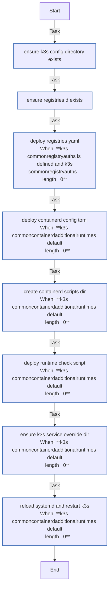

<!-- DOCSIBLE START -->

# 📃 Role overview

## k3s_common

Description: Common configurations for K3s nodes (server and agent)

### Tasks

#### File: tasks/main.yml

| Name | Module | Has Conditions | Comments |
| ---- | ------ | -------------- | -------- |
| [Ensure K3s config directory exists](tasks/main.yml#L2) | ansible.builtin.file | False | main.yml - K3s Common logic |
| [Ensure registries.d exists](tasks/main.yml#L8) | ansible.builtin.file | False |  |
| [Deploy registries.yaml](tasks/main.yml#L14) | ansible.builtin.template | True |  |
| [Deploy containerd-config.toml](tasks/main.yml#L24) | ansible.builtin.template | True |  |
| [Create containerd scripts dir](tasks/main.yml#L31) | ansible.builtin.file | True |  |
| [Deploy runtime check script](tasks/main.yml#L38) | ansible.builtin.template | True |  |
| [Ensure k3s service override dir](tasks/main.yml#L45) | ansible.builtin.file | True |  |
| [Reload systemd and restart k3s](tasks/main.yml#L52) | ansible.builtin.systemd | True |  |

## Task Flow Graphs

### Graph for main.yml

## Author Information
rc

### License

MIT

### Minimum Ansible Version

2.14

### Platforms

- **Ubuntu**: ['jammy', 'noble']

### Dependencies

No dependencies specified.
<!-- DOCSIBLE END -->
