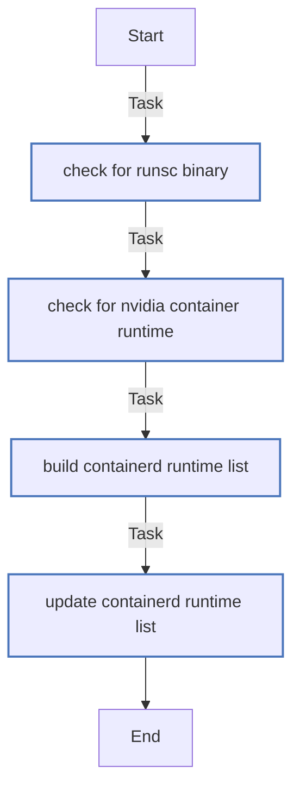

<!-- DOCSIBLE START -->

# 📃 Role overview

## k3s_runtime_discovery

### Tasks

#### File: tasks/main.yml

| Name | Module | Has Conditions | Comments |
| ---- | ------ | -------------- | -------- |
| [Check for runsc binary](tasks/main.yml#L4) | ansible.builtin.stat | False | @docsible Checks whether gVisor runsc binary is installed |
| [Check for nvidia-container-runtime](tasks/main.yml#L10) | ansible.builtin.stat | False | @docsible Checks whether NVIDIA container runtime is installed |
| [Build containerd runtime list](tasks/main.yml#L16) | ansible.builtin.set_fact | False | @docsible Builds base list of detected containerd runtimes |
| [Update containerd runtime list](tasks/main.yml#L21) | ansible.builtin.set_fact | False | @docsible Merges detected runtimes into k3s_commonContainerdAdditionalRuntimes |

## Task Flow Graphs

### Graph for main.yml

#### Dependencies

No dependencies specified.
<!-- DOCSIBLE END -->
