<!-- DOCSIBLE START -->

# 📃 Role overview

## k3s_server

| Field                | Value           |
|--------------------- |-----------------|
| Readme update        | 2026/01/05 |

### Defaults

**These are static variables with lower priority**

#### File: defaults/main.yml

| Var          | Type         | Value       |
|--------------|--------------|-------------|
| [k3s_server_version](defaults/main.yml#L2)   | str | `v1.34.3+k3s1` |    
| [k3s_server_disable_traefik](defaults/main.yml#L3)   | bool | `True` |    
| [k3s_server_disable_servicelb](defaults/main.yml#L4)   | bool | `True` |    
| [k3s_server_kubeconfig_mode](defaults/main.yml#L5)   | str | `644` |    
| [k3s_server_node_token_timeout](defaults/main.yml#L6)   | int | `180` |    
| [k3s_server_readyz_retries](defaults/main.yml#L7)   | int | `30` |    
| [k3s_server_readyz_delay](defaults/main.yml#L8)   | int | `2` |    
| [k3s_server_recreate](defaults/main.yml#L10)   | bool | `True` |    
| [k3s_server_copy_kubeconfig_local](defaults/main.yml#L12)   | bool | `True` |    
| [k3s_server_local_kubeconfig_path](defaults/main.yml#L13)   | str | `{{ lookup('env', 'HOME') }}/.kube/config` |    

### Tasks

#### File: tasks/main.yml

| Name | Module | Has Conditions |
| ---- | ------ | -------------- |
| Validate Tailscale IP is defined | ansible.builtin.assert | False |
| Check if K3s uninstall script exists | ansible.builtin.stat | False |
| Recreate K3s cluster for a clean state | ansible.builtin.command | True |
| Remove residual K3s state directories | ansible.builtin.file | True |
| Ensure K3s config directory exists | ansible.builtin.file | False |
| Deploy K3s declarative configuration | ansible.builtin.template | False |
| Install k3s server | ansible.builtin.shell | False |
| Ensure K3s systemd override directory exists | ansible.builtin.file | False |
| Create K3s systemd override to force declarative config | ansible.builtin.copy | False |
| Remove K3s installer environment file to prevent config duplication | ansible.builtin.file | False |
| Reload systemd daemon immediately | ansible.builtin.systemd | False |
| Ensure K3s service is enabled and running | ansible.builtin.systemd | False |
| Apply pending K3s restarts before readiness checks | ansible.builtin.meta | False |
| Wait for kubeconfig to be generated | ansible.builtin.wait_for | True |
| Read K3s kubeconfig | ansible.builtin.slurp | False |
| Build canonical kubeconfig (Tailscale API endpoint) | ansible.builtin.set_fact | False |
| Write canonical kubeconfig on server | ansible.builtin.copy | False |
| Ensure .kube directory exists for user {{ ansible_user }} | ansible.builtin.file | False |
| Write kubeconfig for target user | ansible.builtin.copy | False |
| Wait for kube-apiserver (Standard Kubectl + Discovery) | ansible.builtin.command | True |
| Remove Traefik HelmCharts when disabled | ansible.builtin.command | True |
| Copy kubeconfig to local machine | block | True |
| Ensure local .kube directory exists | ansible.builtin.file | False |
| Fetch kubeconfig from K3s server | ansible.builtin.slurp | False |
| Parse and modify kubeconfig | ansible.builtin.set_fact | False |
| Write kubeconfig to local path | ansible.builtin.copy | False |
| Show kubeconfig info | ansible.builtin.debug | False |

## Task Flow Graphs

### Graph for main.yml

```mermaid
flowchart TD
Start
classDef block stroke:#3498db,stroke-width:2px;
classDef task stroke:#4b76bb,stroke-width:2px;
classDef includeTasks stroke:#16a085,stroke-width:2px;
classDef importTasks stroke:#34495e,stroke-width:2px;
classDef includeRole stroke:#2980b9,stroke-width:2px;
classDef importRole stroke:#699ba7,stroke-width:2px;
classDef includeVars stroke:#8e44ad,stroke-width:2px;
classDef rescue stroke:#665352,stroke-width:2px;

  Start-->|Task| Validate_Tailscale_IP_is_defined0[validate tailscale ip is defined]:::task
  Validate_Tailscale_IP_is_defined0-->|Task| Check_if_K3s_uninstall_script_exists1[check if k3s uninstall script exists]:::task
  Check_if_K3s_uninstall_script_exists1-->|Task| Recreate_K3s_cluster_for_a_clean_state2[recreate k3s cluster for a clean state<br>When: **k3s server recreate   bool and k3s uninstall<br>script stat exists**]:::task
  Recreate_K3s_cluster_for_a_clean_state2-->|Task| Remove_residual_K3s_state_directories3[remove residual k3s state directories<br>When: **k3s server recreate   bool and k3s uninstall<br>script stat exists**]:::task
  Remove_residual_K3s_state_directories3-->|Task| Ensure_K3s_config_directory_exists4[ensure k3s config directory exists]:::task
  Ensure_K3s_config_directory_exists4-->|Task| Deploy_K3s_declarative_configuration5[deploy k3s declarative configuration]:::task
  Deploy_K3s_declarative_configuration5-->|Task| Install_k3s_server6[install k3s server]:::task
  Install_k3s_server6-->|Task| Ensure_K3s_systemd_override_directory_exists7[ensure k3s systemd override directory exists]:::task
  Ensure_K3s_systemd_override_directory_exists7-->|Task| Create_K3s_systemd_override_to_force_declarative_config8[create k3s systemd override to force declarative<br>config]:::task
  Create_K3s_systemd_override_to_force_declarative_config8-->|Task| Remove_K3s_installer_environment_file_to_prevent_config_duplication9[remove k3s installer environment file to prevent<br>config duplication]:::task
  Remove_K3s_installer_environment_file_to_prevent_config_duplication9-->|Task| Reload_systemd_daemon_immediately10[reload systemd daemon immediately]:::task
  Reload_systemd_daemon_immediately10-->|Task| Ensure_K3s_service_is_enabled_and_running11[ensure k3s service is enabled and running]:::task
  Ensure_K3s_service_is_enabled_and_running11-->|Task| Apply_pending_K3s_restarts_before_readiness_checks12[apply pending k3s restarts before readiness checks]:::task
  Apply_pending_K3s_restarts_before_readiness_checks12-->|Task| Wait_for_kubeconfig_to_be_generated13[wait for kubeconfig to be generated<br>When: **not ansible check mode**]:::task
  Wait_for_kubeconfig_to_be_generated13-->|Task| Read_K3s_kubeconfig14[read k3s kubeconfig]:::task
  Read_K3s_kubeconfig14-->|Task| Build_canonical_kubeconfig__Tailscale_API_endpoint_15[build canonical kubeconfig  tailscale api endpoint<br>]:::task
  Build_canonical_kubeconfig__Tailscale_API_endpoint_15-->|Task| Write_canonical_kubeconfig_on_server16[write canonical kubeconfig on server]:::task
  Write_canonical_kubeconfig_on_server16-->|Task| Ensure__kube_directory_exists_for_user_ansible_user17[ensure  kube directory exists for user ansible<br>user]:::task
  Ensure__kube_directory_exists_for_user_ansible_user17-->|Task| Write_kubeconfig_for_target_user18[write kubeconfig for target user]:::task
  Write_kubeconfig_for_target_user18-->|Task| Wait_for_kube_apiserver__Standard_Kubectl___Discovery_19[wait for kube apiserver  standard kubectl  <br>discovery <br>When: **not ansible check mode**]:::task
  Wait_for_kube_apiserver__Standard_Kubectl___Discovery_19-->|Task| Remove_Traefik_HelmCharts_when_disabled20[remove traefik helmcharts when disabled<br>When: **not ansible check mode and k3s server disable<br>traefik   bool**]:::task
  Remove_Traefik_HelmCharts_when_disabled20-->|Block Start| Copy_kubeconfig_to_local_machine21_block_start_0[[copy kubeconfig to local machine<br>When: **k3s server copy kubeconfig local   default true   <br>bool and not ansible check mode**]]:::block
  Copy_kubeconfig_to_local_machine21_block_start_0-->|Task| Ensure_local__kube_directory_exists0[ensure local  kube directory exists]:::task
  Ensure_local__kube_directory_exists0-->|Task| Fetch_kubeconfig_from_K3s_server1[fetch kubeconfig from k3s server]:::task
  Fetch_kubeconfig_from_K3s_server1-->|Task| Parse_and_modify_kubeconfig2[parse and modify kubeconfig]:::task
  Parse_and_modify_kubeconfig2-->|Task| Write_kubeconfig_to_local_path3[write kubeconfig to local path]:::task
  Write_kubeconfig_to_local_path3-->|Task| Show_kubeconfig_info4[show kubeconfig info]:::task
  Show_kubeconfig_info4-.->|End of Block| Copy_kubeconfig_to_local_machine21_block_start_0
  Show_kubeconfig_info4-->|Rescue Start| Copy_kubeconfig_to_local_machine21_rescue_start_0[copy kubeconfig to local machine<br>When: **k3s server copy kubeconfig local   default true   <br>bool and not ansible check mode**]:::rescue
  Copy_kubeconfig_to_local_machine21_rescue_start_0-->|Task| Report_kubeconfig_copy_failure0[report kubeconfig copy failure]:::task
  Report_kubeconfig_copy_failure0-->|Task| Fail_kubeconfig_copy1[fail kubeconfig copy]:::task
  Fail_kubeconfig_copy1-.->|End of Rescue Block| Copy_kubeconfig_to_local_machine21_block_start_0
  Fail_kubeconfig_copy1-->End
```

#### Dependencies

No dependencies specified.
<!-- DOCSIBLE END -->
