<!-- DOCSIBLE START -->

# 📃 Role overview

## k3s_server

Description: Installs and configures K3s Kubernetes server for homelab usage.

<b> Argument Specifications in meta/argument_specs</b>

#### Key: main

**Description**: Deploys a single-node K3s server with Tailscale integration.
Manages component disabling (Traefik/ServiceLB), kubeconfig generation,
and local context merging.

**Options**:

  - **k3s_serverVersion**
    - **Required**: False
    - **Type**: str
    - **Default**: v1.35.0+k3s1
  
    - **Description**: K3s version to install (e.g., v1.35.0+k3s1).
  
  
  

  - **k3s_serverDisableTraefik**
    - **Required**: False
    - **Type**: bool
    - **Default**: True
  
    - **Description**: Disables the default Traefik ingress controller.
  
  
  

  - **k3s_serverDisableServicelb**
    - **Required**: False
    - **Type**: bool
    - **Default**: True
  
    - **Description**: Disables the default ServiceLB load balancer.
  
  
  

  - **k3s_serverKubeconfigMode**
    - **Required**: False
    - **Type**: str
    - **Default**: 0600
  
    - **Description**: File permission mode for the generated kubeconfig on the server.
  
  
  

  - **k3s_serverNodeTokenTimeout**
    - **Required**: False
    - **Type**: int
    - **Default**: 180
  
    - **Description**: Timeout (seconds) to wait for K3s generated config/token presence.
  
  
  

  - **k3s_serverReadyzRetries**
    - **Required**: False
    - **Type**: int
    - **Default**: 30
  
    - **Description**: Number of retries for the API server readiness check.
  
  
  

  - **k3s_serverReadyzDelay**
    - **Required**: False
    - **Type**: int
    - **Default**: 2
  
    - **Description**: Delay (seconds) between readiness check retries.
  
  
  

  - **k3s_serverRecreate**
    - **Required**: False
    - **Type**: bool
    - **Default**: True
  
    - **Description**: If true, uninstalls and wipes previous K3s installation before deploying.
  
  
  

  - **k3s_serverCopyKubeconfigLocal**
    - **Required**: False
    - **Type**: bool
    - **Default**: True
  
    - **Description**: If true, copies the generated kubeconfig to the Ansible controller.
  
  
  

  - **k3s_serverLocalKubeconfigPath**
    - **Required**: False
    - **Type**: str
    - **Default**: ~/.kube/config
  
    - **Description**: Local path where the kubeconfig should be saved.
  
  
  

### Tasks

#### File: tasks/main.yml

| Name | Module | Has Conditions | Comments |
| ---- | ------ | -------------- | -------- |
| [Validate Tailscale IP](tasks/main.yml#L2) | ansible.builtin.assert | False | @docsible Validate Tailscale IP format (100.x.x.x) |
| [Verify K3s server version](tasks/main.yml#L11) | ansible.builtin.assert | False | @docsible Verify K3s version is defined |
| [Check for runsc binary](tasks/main.yml#L19) | ansible.builtin.stat | False | @docsible Check for gVisor runtime |
| [Check for nvidia-container-runtime](tasks/main.yml#L25) | ansible.builtin.stat | False | @docsible Check for NVIDIA runtime |
| [Build containerd runtime list](tasks/main.yml#L31) | ansible.builtin.set_fact | False | @docsible Build list of additional containerd runtimes |
| [Run K3s Common](tasks/main.yml#L41) | ansible.builtin.import_role | False | @docsible Import common K3s setup tasks |
| [Ensure K3s log directory exists](tasks/main.yml#L49) | ansible.builtin.file | False | @docsible Create log directory for audit logs |
| [Ensure K3s audit log file exists with restrictive permissions](tasks/main.yml#L56) | ansible.builtin.file | False | @docsible Create audit log with restrictive permissions |
| [Deploy K3s audit policy](tasks/main.yml#L66) | ansible.builtin.template | False | @docsible Deploy Kubernetes audit policy |
| [Deploy server config](tasks/main.yml#L73) | ansible.builtin.template | True | @docsible Deploy server configuration file |
| [Download K3s install script](tasks/main.yml#L82) | ansible.builtin.get_url | True | @docsible Download K3s install script |
| [Install K3s server](tasks/main.yml#L90) | ansible.builtin.shell | True | @docsible Install K3s server binary |
| [Create override dir](tasks/main.yml#L103) | ansible.builtin.file | False | @docsible Create systemd override directory |
| [Create override](tasks/main.yml#L110) | ansible.builtin.copy | False | @docsible Deploy systemd service override |
| [Reload systemd (k3s)](tasks/main.yml#L121) | ansible.builtin.systemd | False | @docsible Reload systemd daemon |
| [Start K3s](tasks/main.yml#L126) | ansible.builtin.systemd | True | @docsible Enable and start K3s service |
| [Flush handlers](tasks/main.yml#L134) | ansible.builtin.meta | False | @docsible Apply pending handler restarts |
| [Wait for node-token](tasks/main.yml#L138) | ansible.builtin.wait_for | True | @docsible Wait for node join token generation |
| [Wait for kubeconfig](tasks/main.yml#L145) | ansible.builtin.wait_for | True | @docsible Wait for admin kubeconfig generation |
| [Read kubeconfig](tasks/main.yml#L152) | ansible.builtin.slurp | True | @docsible Read generated kubeconfig |
| [Build canonical config](tasks/main.yml#L160) | ansible.builtin.set_fact | True | @docsible Replace localhost with Tailscale IP |
| [Write server config](tasks/main.yml#L168) | ansible.builtin.copy | True | @docsible Store Tailscale-enabled kubeconfig |
| [Create user kube dir](tasks/main.yml#L178) | ansible.builtin.file | True | @docsible Create kubeconfig directory for ansible user |
| [Write user config](tasks/main.yml#L188) | ansible.builtin.copy | True | @docsible Deploy kubeconfig for ansible user |
| [Read node-token](tasks/main.yml#L198) | ansible.builtin.slurp | True | @docsible Read node token for agent registration |
| [Set node-token fact](tasks/main.yml#L205) | ansible.builtin.set_fact | True | @docsible Store node token as fact |
| [Wait for apiserver](tasks/main.yml#L211) | kubernetes.core.k8s_info | True | @docsible Wait for Kubernetes API server readiness |
| [Label master node](tasks/main.yml#L224) | kubernetes.core.k8s | True | @docsible Label node as control-plane |
| [Remove Traefik resources if disabled](tasks/main.yml#L237) | kubernetes.core.k8s | True | @docsible Remove Traefik if disabled |
| [Copy local config](tasks/main.yml#L252) | block | True | @docsible Copy kubeconfig to Ansible controller |
| [Create local dir](tasks/main.yml#L261) | ansible.builtin.file | False | @docsible Create local kubeconfig directory |
| [Fetch config](tasks/main.yml#L268) | ansible.builtin.slurp | False | @docsible Fetch kubeconfig from server |
| [Parse config](tasks/main.yml#L276) | ansible.builtin.set_fact | False | @docsible Customize kubeconfig context names |
| [Write local config](tasks/main.yml#L287) | ansible.builtin.copy | False | @docsible Save customized kubeconfig locally |
| [Show config info](tasks/main.yml#L294) | ansible.builtin.debug | False | @docsible Display kubeconfig location |

## Task Flow Graphs

### Graph for main.yml

```mermaid
flowchart TD
Start
classDef block stroke:#3498db,stroke-width:2px;
classDef task stroke:#4b76bb,stroke-width:2px;
classDef includeTasks stroke:#16a085,stroke-width:2px;
classDef importTasks stroke:#34495e,stroke-width:2px;
classDef includeRole stroke:#2980b9,stroke-width:2px;
classDef importRole stroke:#699ba7,stroke-width:2px;
classDef includeVars stroke:#8e44ad,stroke-width:2px;
classDef rescue stroke:#665352,stroke-width:2px;

  Start-->|Task| Validate_Tailscale_IP0[validate tailscale ip]:::task
  Validate_Tailscale_IP0-->|Task| Verify_K3s_server_version1[verify k3s server version]:::task
  Verify_K3s_server_version1-->|Task| Check_for_runsc_binary2[check for runsc binary]:::task
  Check_for_runsc_binary2-->|Task| Check_for_nvidia_container_runtime3[check for nvidia container runtime]:::task
  Check_for_nvidia_container_runtime3-->|Task| Build_containerd_runtime_list4[build containerd runtime list]:::task
  Build_containerd_runtime_list4-->|Import role| Run_K3s_Common_k3s_common_5([run k3s common<br>import_role: k3s common]):::importRole
  Run_K3s_Common_k3s_common_5-->|Task| Ensure_K3s_log_directory_exists6[ensure k3s log directory exists]:::task
  Ensure_K3s_log_directory_exists6-->|Task| Ensure_K3s_audit_log_file_exists_with_restrictive_permissions7[ensure k3s audit log file exists with restrictive<br>permissions]:::task
  Ensure_K3s_audit_log_file_exists_with_restrictive_permissions7-->|Task| Deploy_K3s_audit_policy8[deploy k3s audit policy]:::task
  Deploy_K3s_audit_policy8-->|Task| Deploy_server_config9[deploy server config<br>When: **not ansible check mode**]:::task
  Deploy_server_config9-->|Task| Download_K3s_install_script10[download k3s install script<br>When: **not ansible check mode**]:::task
  Download_K3s_install_script10-->|Task| Install_K3s_server11[install k3s server<br>When: **not ansible check mode**]:::task
  Install_K3s_server11-->|Task| Create_override_dir12[create override dir]:::task
  Create_override_dir12-->|Task| Create_override13[create override]:::task
  Create_override13-->|Task| Reload_systemd__k3s_14[reload systemd  k3s ]:::task
  Reload_systemd__k3s_14-->|Task| Start_K3s15[start k3s<br>When: **not ansible check mode**]:::task
  Start_K3s15-->|Task| Flush_handlers16[flush handlers]:::task
  Flush_handlers16-->|Task| Wait_for_node_token17[wait for node token<br>When: **not ansible check mode**]:::task
  Wait_for_node_token17-->|Task| Wait_for_kubeconfig18[wait for kubeconfig<br>When: **not ansible check mode**]:::task
  Wait_for_kubeconfig18-->|Task| Read_kubeconfig19[read kubeconfig<br>When: **not ansible check mode**]:::task
  Read_kubeconfig19-->|Task| Build_canonical_config20[build canonical config<br>When: **not ansible check mode**]:::task
  Build_canonical_config20-->|Task| Write_server_config21[write server config<br>When: **not ansible check mode**]:::task
  Write_server_config21-->|Task| Create_user_kube_dir22[create user kube dir<br>When: **not ansible check mode**]:::task
  Create_user_kube_dir22-->|Task| Write_user_config23[write user config<br>When: **not ansible check mode**]:::task
  Write_user_config23-->|Task| Read_node_token24[read node token<br>When: **not ansible check mode**]:::task
  Read_node_token24-->|Task| Set_node_token_fact25[set node token fact<br>When: **not ansible check mode**]:::task
  Set_node_token_fact25-->|Task| Wait_for_apiserver26[wait for apiserver<br>When: **not ansible check mode**]:::task
  Wait_for_apiserver26-->|Task| Label_master_node27[label master node<br>When: **not ansible check mode**]:::task
  Label_master_node27-->|Task| Remove_Traefik_resources_if_disabled28[remove traefik resources if disabled<br>When: **k3s serverdisabletraefik   bool and not ansible<br>check mode**]:::task
  Remove_Traefik_resources_if_disabled28-->|Block Start| Copy_local_config29_block_start_0[[copy local config<br>When: **k3s servercopykubeconfiglocal   default true   <br>bool and not ansible check mode**]]:::block
  Copy_local_config29_block_start_0-->|Task| Create_local_dir0[create local dir]:::task
  Create_local_dir0-->|Task| Fetch_config1[fetch config]:::task
  Fetch_config1-->|Task| Parse_config2[parse config]:::task
  Parse_config2-->|Task| Write_local_config3[write local config]:::task
  Write_local_config3-->|Task| Show_config_info4[show config info]:::task
  Show_config_info4-.->|End of Block| Copy_local_config29_block_start_0
  Show_config_info4-->|Rescue Start| Copy_local_config29_rescue_start_0[copy local config<br>When: **k3s servercopykubeconfiglocal   default true   <br>bool and not ansible check mode**]:::rescue
  Copy_local_config29_rescue_start_0-->|Task| Report_kubeconfig_copy_failure0[report kubeconfig copy failure]:::task
  Report_kubeconfig_copy_failure0-->|Task| Fail_kubeconfig_copy1[fail kubeconfig copy]:::task
  Fail_kubeconfig_copy1-.->|End of Rescue Block| Copy_local_config29_block_start_0
  Fail_kubeconfig_copy1-->End
```

## Author Information
Roura

### License

MIT

### Minimum Ansible Version

2.20.0

### Platforms

- **Ubuntu**: ['noble']

### Dependencies

No dependencies specified.
<!-- DOCSIBLE END -->
