<!-- DOCSIBLE START -->

# 📃 Role overview

## k3s_server

Description: Installs and configures K3s Kubernetes server for homelab usage.

<b> Argument Specifications in meta/argument_specs</b>

#### Key: main

**Description**: Deploys a single-node K3s server with Tailscale integration.
Manages component disabling (Traefik/ServiceLB), kubeconfig generation,
and local context merging.

**Options**:

  - **k3s_serverVersion**
    - **Required**: False
    - **Type**: str
    - **Default**: v1.35.0+k3s1
  
    - **Description**: K3s version to install (e.g., v1.35.0+k3s1).
  
  
  

  - **k3s_serverDisableTraefik**
    - **Required**: False
    - **Type**: bool
    - **Default**: True
  
    - **Description**: Disables the default Traefik ingress controller.
  
  
  

  - **k3s_serverDisableServicelb**
    - **Required**: False
    - **Type**: bool
    - **Default**: True
  
    - **Description**: Disables the default ServiceLB load balancer.
  
  
  

  - **k3s_serverKubeconfigMode**
    - **Required**: False
    - **Type**: str
    - **Default**: 0600
  
    - **Description**: File permission mode for the generated kubeconfig on the server.
  
  
  

  - **k3s_serverNodeTokenTimeout**
    - **Required**: False
    - **Type**: int
    - **Default**: 180
  
    - **Description**: Timeout (seconds) to wait for K3s generated config/token presence.
  
  
  

  - **k3s_serverReadyzRetries**
    - **Required**: False
    - **Type**: int
    - **Default**: 30
  
    - **Description**: Number of retries for the API server readiness check.
  
  
  

  - **k3s_serverReadyzDelay**
    - **Required**: False
    - **Type**: int
    - **Default**: 2
  
    - **Description**: Delay (seconds) between readiness check retries.
  
  
  

  - **k3s_serverRecreate**
    - **Required**: False
    - **Type**: bool
    - **Default**: True
  
    - **Description**: If true, uninstalls and wipes previous K3s installation before deploying.
  
  
  

  - **k3s_serverCopyKubeconfigLocal**
    - **Required**: False
    - **Type**: bool
    - **Default**: True
  
    - **Description**: If true, copies the generated kubeconfig to the Ansible controller.
  
  
  

  - **k3s_serverLocalKubeconfigPath**
    - **Required**: False
    - **Type**: str
    - **Default**: ~/.kube/config
  
    - **Description**: Local path where the kubeconfig should be saved.
  
  
  

### Tasks

#### File: tasks/main.yml

| Name | Module | Has Conditions | Comments |
| ---- | ------ | -------------- | -------- |
| [Validate Tailscale IP](tasks/main.yml#L2) | ansible.builtin.assert | False | @docsible Asserts IP_tailscale follows CGNAT range (100.x.x.x) |
| [Verify K3s server version](tasks/main.yml#L11) | ansible.builtin.assert | False | @docsible Asserts k3s_serverVersion is defined |
| [Check for runsc binary](tasks/main.yml#L19) | ansible.builtin.stat | False | @docsible Checks for gVisor (runsc) binary |
| [Check for nvidia-container-runtime](tasks/main.yml#L25) | ansible.builtin.stat | False | @docsible Checks for NVIDIA Container Runtime |
| [Build containerd runtime list](tasks/main.yml#L31) | ansible.builtin.set_fact | False | @docsible Constructs list of Containerd runtimes (runsc, nvidia) |
| [Update containerd runtime list](tasks/main.yml#L35) | ansible.builtin.set_fact | False |  |
| [Run K3s Common](tasks/main.yml#L45) | ansible.builtin.import_role | False | @docsible Imports K3s Common role (binaries, systemd) |
| [Ensure K3s log directory exists](tasks/main.yml#L53) | ansible.builtin.file | False | @docsible Creates K3s log directory structure |
| [Ensure K3s audit log file exists with restrictive permissions](tasks/main.yml#L60) | ansible.builtin.file | False | @docsible Creates empty audit log file (0600) |
| [Deploy K3s audit policy](tasks/main.yml#L70) | ansible.builtin.template | False | @docsible Deploys K8s Audit Policy configuration |
| [Deploy server config](tasks/main.yml#L77) | ansible.builtin.template | True | @docsible Deploys K3s Server config (config.yaml) |
| [Download K3s install script](tasks/main.yml#L86) | ansible.builtin.get_url | True | @docsible Downloads K3s official install script |
| [Install K3s server](tasks/main.yml#L94) | ansible.builtin.shell | True | @docsible Executes K3s Server installation |
| [Create override dir](tasks/main.yml#L107) | ansible.builtin.file | False | @docsible Creates systemd override directory |
| [Create override](tasks/main.yml#L114) | ansible.builtin.copy | False | @docsible Deploys systemd ExecStart override |
| [Reload systemd (k3s)](tasks/main.yml#L125) | ansible.builtin.systemd | False | @docsible Reloads systemd daemon |
| [Start K3s](tasks/main.yml#L130) | ansible.builtin.systemd | True | @docsible Starts k3s.service |
| [Flush handlers](tasks/main.yml#L138) | ansible.builtin.meta | False | @docsible Flushes handlers (restarts services) |
| [Wait for node-token](tasks/main.yml#L142) | ansible.builtin.wait_for | True | @docsible Waits for K3s node-token generation |
| [Wait for kubeconfig](tasks/main.yml#L149) | ansible.builtin.wait_for | True | @docsible Waits for K3s kubeconfig generation |
| [Read kubeconfig](tasks/main.yml#L156) | ansible.builtin.slurp | True | @docsible Reads raw kubeconfig |
| [Build canonical config](tasks/main.yml#L164) | ansible.builtin.set_fact | True | @docsible Generates Tailscale-aware kubeconfig (Replaces 127.0.0.1) |
| [Write server config](tasks/main.yml#L172) | ansible.builtin.copy | True | @docsible Writes canonical kubeconfig to /etc/rancher/k3s/k3s-tailscale.yaml |
| [Create user kube dir](tasks/main.yml#L182) | ansible.builtin.file | True | @docsible Creates ~/.kube directory for ansible user |
| [Write user config](tasks/main.yml#L192) | ansible.builtin.copy | True | @docsible Deploys kubeconfig to ansible user home |
| [Read node-token](tasks/main.yml#L202) | ansible.builtin.slurp | True | @docsible Reads node-token |
| [Set node-token fact](tasks/main.yml#L209) | ansible.builtin.set_fact | True | @docsible Sets k3s_server_node_token fact |
| [Wait for apiserver](tasks/main.yml#L215) | kubernetes.core.k8s_info | True | @docsible Waits for API Server readiness |
| [Label master node](tasks/main.yml#L228) | kubernetes.core.k8s | True | @docsible Labels node as control-plane/master |
| [Remove Traefik resources if disabled](tasks/main.yml#L242) | kubernetes.core.k8s | True | @docsible Purges Traefik HelmChart if disabled |
| [Copy local config](tasks/main.yml#L258) | block | True | @docsible Block: Download Kubeconfig to Controller |
| [Create local dir](tasks/main.yml#L267) | ansible.builtin.file | False | @docsible Creates local .kube directory |
| [Fetch config](tasks/main.yml#L274) | ansible.builtin.slurp | False | @docsible Fetches k3s-tailscale.yaml |
| [Parse config](tasks/main.yml#L282) | ansible.builtin.set_fact | False | @docsible Renames context to k3s-{{ hostname }} |
| [Write local config](tasks/main.yml#L293) | ansible.builtin.copy | False | @docsible Saves final kubeconfig locally |
| [Show config info](tasks/main.yml#L300) | ansible.builtin.debug | False | @docsible Displays local kubeconfig path |

## Task Flow Graphs

### Graph for main.yml

```mermaid
flowchart TD
Start
classDef block stroke:#3498db,stroke-width:2px;
classDef task stroke:#4b76bb,stroke-width:2px;
classDef includeTasks stroke:#16a085,stroke-width:2px;
classDef importTasks stroke:#34495e,stroke-width:2px;
classDef includeRole stroke:#2980b9,stroke-width:2px;
classDef importRole stroke:#699ba7,stroke-width:2px;
classDef includeVars stroke:#8e44ad,stroke-width:2px;
classDef rescue stroke:#665352,stroke-width:2px;

  Start-->|Task| Validate_Tailscale_IP0[validate tailscale ip]:::task
  Validate_Tailscale_IP0-->|Task| Verify_K3s_server_version1[verify k3s server version]:::task
  Verify_K3s_server_version1-->|Task| Check_for_runsc_binary2[check for runsc binary]:::task
  Check_for_runsc_binary2-->|Task| Check_for_nvidia_container_runtime3[check for nvidia container runtime]:::task
  Check_for_nvidia_container_runtime3-->|Task| Build_containerd_runtime_list4[build containerd runtime list]:::task
  Build_containerd_runtime_list4-->|Task| Update_containerd_runtime_list5[update containerd runtime list]:::task
  Update_containerd_runtime_list5-->|Import role| Run_K3s_Common_k3s_common_6([run k3s common<br>import_role: k3s common]):::importRole
  Run_K3s_Common_k3s_common_6-->|Task| Ensure_K3s_log_directory_exists7[ensure k3s log directory exists]:::task
  Ensure_K3s_log_directory_exists7-->|Task| Ensure_K3s_audit_log_file_exists_with_restrictive_permissions8[ensure k3s audit log file exists with restrictive<br>permissions]:::task
  Ensure_K3s_audit_log_file_exists_with_restrictive_permissions8-->|Task| Deploy_K3s_audit_policy9[deploy k3s audit policy]:::task
  Deploy_K3s_audit_policy9-->|Task| Deploy_server_config10[deploy server config<br>When: **not ansible check mode**]:::task
  Deploy_server_config10-->|Task| Download_K3s_install_script11[download k3s install script<br>When: **not ansible check mode**]:::task
  Download_K3s_install_script11-->|Task| Install_K3s_server12[install k3s server<br>When: **not ansible check mode**]:::task
  Install_K3s_server12-->|Task| Create_override_dir13[create override dir]:::task
  Create_override_dir13-->|Task| Create_override14[create override]:::task
  Create_override14-->|Task| Reload_systemd__k3s_15[reload systemd  k3s ]:::task
  Reload_systemd__k3s_15-->|Task| Start_K3s16[start k3s<br>When: **not ansible check mode**]:::task
  Start_K3s16-->|Task| Flush_handlers17[flush handlers]:::task
  Flush_handlers17-->|Task| Wait_for_node_token18[wait for node token<br>When: **not ansible check mode**]:::task
  Wait_for_node_token18-->|Task| Wait_for_kubeconfig19[wait for kubeconfig<br>When: **not ansible check mode**]:::task
  Wait_for_kubeconfig19-->|Task| Read_kubeconfig20[read kubeconfig<br>When: **not ansible check mode**]:::task
  Read_kubeconfig20-->|Task| Build_canonical_config21[build canonical config<br>When: **not ansible check mode**]:::task
  Build_canonical_config21-->|Task| Write_server_config22[write server config<br>When: **not ansible check mode**]:::task
  Write_server_config22-->|Task| Create_user_kube_dir23[create user kube dir<br>When: **not ansible check mode**]:::task
  Create_user_kube_dir23-->|Task| Write_user_config24[write user config<br>When: **not ansible check mode**]:::task
  Write_user_config24-->|Task| Read_node_token25[read node token<br>When: **not ansible check mode**]:::task
  Read_node_token25-->|Task| Set_node_token_fact26[set node token fact<br>When: **not ansible check mode**]:::task
  Set_node_token_fact26-->|Task| Wait_for_apiserver27[wait for apiserver<br>When: **not ansible check mode**]:::task
  Wait_for_apiserver27-->|Task| Label_master_node28[label master node<br>When: **not ansible check mode**]:::task
  Label_master_node28-->|Task| Remove_Traefik_resources_if_disabled29[remove traefik resources if disabled<br>When: **k3s serverdisabletraefik   bool and not ansible<br>check mode**]:::task
  Remove_Traefik_resources_if_disabled29-->|Block Start| Copy_local_config30_block_start_0[[copy local config<br>When: **k3s servercopykubeconfiglocal   default true   <br>bool and not ansible check mode**]]:::block
  Copy_local_config30_block_start_0-->|Task| Create_local_dir0[create local dir]:::task
  Create_local_dir0-->|Task| Fetch_config1[fetch config]:::task
  Fetch_config1-->|Task| Parse_config2[parse config]:::task
  Parse_config2-->|Task| Write_local_config3[write local config]:::task
  Write_local_config3-->|Task| Show_config_info4[show config info]:::task
  Show_config_info4-.->|End of Block| Copy_local_config30_block_start_0
  Show_config_info4-->|Rescue Start| Copy_local_config30_rescue_start_0[copy local config<br>When: **k3s servercopykubeconfiglocal   default true   <br>bool and not ansible check mode**]:::rescue
  Copy_local_config30_rescue_start_0-->|Task| Report_kubeconfig_copy_failure0[report kubeconfig copy failure]:::task
  Report_kubeconfig_copy_failure0-->|Task| Fail_kubeconfig_copy1[fail kubeconfig copy]:::task
  Fail_kubeconfig_copy1-.->|End of Rescue Block| Copy_local_config30_block_start_0
  Fail_kubeconfig_copy1-->End
```

## Author Information
rc

### License

MIT

### Minimum Ansible Version

2.20.0

### Platforms

- **Ubuntu**: ['noble']

### Dependencies

No dependencies specified.
<!-- DOCSIBLE END -->
