<!-- DOCSIBLE START -->

# 📃 Role overview

## k3s_server

Description: Installs and configures K3s Kubernetes server for homelab usage.

<b>🧩 Argument Specifications in meta/argument_specs</b>

#### Key: main

**Description**: Deploys a single-node K3s server with Tailscale integration.
Manages component disabling (Traefik/ServiceLB), kubeconfig generation,
and local context merging.

**Options**:

  - **k3s_serverVersion**
    - **Required**: False
    - **Type**: str
    - **Default**: v1.35.3+k3s1
  
    - **Description**: K3s version to install (e.g., v1.35.0+k3s1).
  
  
  

  - **k3s_serverDisableTraefik**
    - **Required**: False
    - **Type**: bool
    - **Default**: True
  
    - **Description**: Disables the default Traefik ingress controller.
  
  
  

  - **k3s_serverDisableServicelb**
    - **Required**: False
    - **Type**: bool
    - **Default**: True
  
    - **Description**: Disables the default ServiceLB load balancer.
  
  
  

  - **k3s_serverKubeconfigMode**
    - **Required**: False
    - **Type**: str
    - **Default**: 0600
  
    - **Description**: File permission mode for the generated kubeconfig on the server.
  
  
  

  - **k3s_serverNodeTokenTimeout**
    - **Required**: False
    - **Type**: int
    - **Default**: 180
  
    - **Description**: Timeout (seconds) to wait for K3s generated config/token presence.
  
  
  

  - **k3s_serverReadyzRetries**
    - **Required**: False
    - **Type**: int
    - **Default**: 30
  
    - **Description**: Number of retries for the API server readiness check.
  
  
  

  - **k3s_serverReadyzDelay**
    - **Required**: False
    - **Type**: int
    - **Default**: 2
  
    - **Description**: Delay (seconds) between readiness check retries.
  
  
  

  - **k3s_serverRecreate**
    - **Required**: False
    - **Type**: bool
    - **Default**: True
  
    - **Description**: If true, uninstalls and wipes previous K3s installation before deploying.
  
  
  

  - **k3s_serverCopyKubeconfigLocal**
    - **Required**: False
    - **Type**: bool
    - **Default**: True
  
    - **Description**: If true, copies the generated kubeconfig to the Ansible controller.
  
  
  

  - **k3s_serverLocalKubeconfigPath**
    - **Required**: False
    - **Type**: str
    - **Default**: ~/.kube/config
  
    - **Description**: Local path where the kubeconfig should be saved.
  
  
  

### Tasks

#### File: tasks/main.yml

| Name | Module | Has Conditions | Comments |
| ---- | ------ | -------------- | -------- |
| [Validate Tailscale IP](tasks/main.yml#L2) | ansible.builtin.assert | False | @docsible Validates IP_tailscale follows CGNAT range (100.x.x.x) |
| [Verify K3s server version](tasks/main.yml#L11) | ansible.builtin.assert | False | @docsible Validates k3s_serverVersion is defined |
| [Run k3s runtime discovery role](tasks/main.yml#L19) | ansible.builtin.import_role | False | @docsible Detects containerd runtimes (runsc/nvidia) shared across server and agent |
| [Run K3s Common](tasks/main.yml#L24) | ansible.builtin.import_role | False | @docsible Imports k3s_common role for shared K3s host setup |
| [Ensure K3s log directory exists](tasks/main.yml#L32) | ansible.builtin.file | False | @docsible Ensures K3s log directory exists |
| [Ensure K3s audit log file exists with restrictive permissions](tasks/main.yml#L39) | ansible.builtin.file | False | @docsible Ensures K3s audit log file exists with mode 0600 |
| [Deploy K3s audit policy](tasks/main.yml#L49) | ansible.builtin.template | False | @docsible Renders Kubernetes audit policy for K3s server |
| [Deploy server config](tasks/main.yml#L56) | ansible.builtin.template | True | @docsible Renders K3s server config.yaml |
| [Download K3s install script](tasks/main.yml#L65) | ansible.builtin.get_url | True | @docsible Downloads official K3s install script |
| [Install K3s server](tasks/main.yml#L73) | ansible.builtin.shell | True | @docsible Installs K3s server with configured flags |
| [Create override dir](tasks/main.yml#L86) | ansible.builtin.file | False | @docsible Ensures systemd override directory for k3s exists |
| [Create override](tasks/main.yml#L93) | ansible.builtin.copy | False | @docsible Writes systemd ExecStart override for k3s |
| [Reload systemd (k3s)](tasks/main.yml#L104) | ansible.builtin.systemd | False | @docsible Reloads systemd daemon |
| [Start K3s](tasks/main.yml#L109) | ansible.builtin.systemd | True | @docsible Enables and starts k3s.service |
| [Flush handlers](tasks/main.yml#L117) | ansible.builtin.meta | False | @docsible Flushes pending handlers (service restarts) |
| [Wait for node-token](tasks/main.yml#L121) | ansible.builtin.wait_for | True | @docsible Waits for K3s node-token file generation |
| [Wait for kubeconfig](tasks/main.yml#L128) | ansible.builtin.wait_for | True | @docsible Waits for K3s kubeconfig file generation |
| [Read kubeconfig](tasks/main.yml#L135) | ansible.builtin.slurp | True | @docsible Reads raw server kubeconfig |
| [Build canonical config](tasks/main.yml#L143) | ansible.builtin.set_fact | True | @docsible Builds Tailscale-aware kubeconfig endpoint |
| [Write server config](tasks/main.yml#L151) | ansible.builtin.copy | True | @docsible Writes canonical kubeconfig to /etc/rancher/k3s/k3s-tailscale.yaml |
| [Create user kube dir](tasks/main.yml#L161) | ansible.builtin.file | True | @docsible Ensures kubeconfig directory exists for ansible user |
| [Write user config](tasks/main.yml#L171) | ansible.builtin.copy | True | @docsible Writes kubeconfig to ansible user home path |
| [Read node-token](tasks/main.yml#L181) | ansible.builtin.slurp | True | @docsible Reads generated K3s node-token |
| [Set node-token fact](tasks/main.yml#L188) | ansible.builtin.set_fact | True | @docsible Sets k3s_server_node_token fact from node-token file |
| [Wait for apiserver](tasks/main.yml#L194) | kubernetes.core.k8s_info | True | @docsible Waits for Kubernetes API server readiness |
| [Label master node](tasks/main.yml#L207) | kubernetes.core.k8s | True | @docsible Labels node with control-plane and master roles |
| [Remove Traefik resources if disabled](tasks/main.yml#L221) | kubernetes.core.k8s | True | @docsible Removes Traefik HelmChart resources when disabled |
| [Apply CoreDNS custom ConfigMap](tasks/main.yml#L237) | kubernetes.core.k8s | True | @docsible Applies CoreDNS custom ConfigMap for upstream and MagicDNS forwarding |
| [Copy local config](tasks/main.yml#L246) | block | True | @docsible Copies kubeconfig to controller host when enabled |
| [Create local dir](tasks/main.yml#L255) | ansible.builtin.file | False | @docsible Ensures local kubeconfig directory exists |
| [Fetch config](tasks/main.yml#L262) | ansible.builtin.slurp | False | @docsible Fetches k3s-tailscale.yaml from server node |
| [Parse config](tasks/main.yml#L270) | ansible.builtin.set_fact | False | @docsible Rewrites kubeconfig context names to k3s-{{ hostname }} |
| [Write local config](tasks/main.yml#L281) | ansible.builtin.copy | False | @docsible Writes final kubeconfig on controller |
| [Show config info](tasks/main.yml#L288) | ansible.builtin.debug | False | @docsible Prints resulting local kubeconfig path |

## Task Flow Graphs

### Graph for main.yml

```mermaid
flowchart TD
Start
classDef block stroke:#3498db,stroke-width:2px;
classDef task stroke:#4b76bb,stroke-width:2px;
classDef includeTasks stroke:#16a085,stroke-width:2px;
classDef importTasks stroke:#34495e,stroke-width:2px;
classDef includeRole stroke:#2980b9,stroke-width:2px;
classDef importRole stroke:#699ba7,stroke-width:2px;
classDef includeVars stroke:#8e44ad,stroke-width:2px;
classDef rescue stroke:#665352,stroke-width:2px;

  Start-->|Task| Validate_Tailscale_IP0[validate tailscale ip]:::task
  Validate_Tailscale_IP0-->|Task| Verify_K3s_server_version1[verify k3s server version]:::task
  Verify_K3s_server_version1-->|Import role| Run_k3s_runtime_discovery_role_k3s_runtime_discovery_2([run k3s runtime discovery role<br>import_role: k3s runtime discovery]):::importRole
  Run_k3s_runtime_discovery_role_k3s_runtime_discovery_2-->|Import role| Run_K3s_Common_k3s_common_3([run k3s common<br>import_role: k3s common]):::importRole
  Run_K3s_Common_k3s_common_3-->|Task| Ensure_K3s_log_directory_exists4[ensure k3s log directory exists]:::task
  Ensure_K3s_log_directory_exists4-->|Task| Ensure_K3s_audit_log_file_exists_with_restrictive_permissions5[ensure k3s audit log file exists with restrictive<br>permissions]:::task
  Ensure_K3s_audit_log_file_exists_with_restrictive_permissions5-->|Task| Deploy_K3s_audit_policy6[deploy k3s audit policy]:::task
  Deploy_K3s_audit_policy6-->|Task| Deploy_server_config7[deploy server config<br>When: **not ansible check mode**]:::task
  Deploy_server_config7-->|Task| Download_K3s_install_script8[download k3s install script<br>When: **not ansible check mode**]:::task
  Download_K3s_install_script8-->|Task| Install_K3s_server9[install k3s server<br>When: **not ansible check mode**]:::task
  Install_K3s_server9-->|Task| Create_override_dir10[create override dir]:::task
  Create_override_dir10-->|Task| Create_override11[create override]:::task
  Create_override11-->|Task| Reload_systemd__k3s_12[reload systemd  k3s ]:::task
  Reload_systemd__k3s_12-->|Task| Start_K3s13[start k3s<br>When: **not ansible check mode**]:::task
  Start_K3s13-->|Task| Flush_handlers14[flush handlers]:::task
  Flush_handlers14-->|Task| Wait_for_node_token15[wait for node token<br>When: **not ansible check mode**]:::task
  Wait_for_node_token15-->|Task| Wait_for_kubeconfig16[wait for kubeconfig<br>When: **not ansible check mode**]:::task
  Wait_for_kubeconfig16-->|Task| Read_kubeconfig17[read kubeconfig<br>When: **not ansible check mode**]:::task
  Read_kubeconfig17-->|Task| Build_canonical_config18[build canonical config<br>When: **not ansible check mode**]:::task
  Build_canonical_config18-->|Task| Write_server_config19[write server config<br>When: **not ansible check mode**]:::task
  Write_server_config19-->|Task| Create_user_kube_dir20[create user kube dir<br>When: **not ansible check mode**]:::task
  Create_user_kube_dir20-->|Task| Write_user_config21[write user config<br>When: **not ansible check mode**]:::task
  Write_user_config21-->|Task| Read_node_token22[read node token<br>When: **not ansible check mode**]:::task
  Read_node_token22-->|Task| Set_node_token_fact23[set node token fact<br>When: **not ansible check mode**]:::task
  Set_node_token_fact23-->|Task| Wait_for_apiserver24[wait for apiserver<br>When: **not ansible check mode**]:::task
  Wait_for_apiserver24-->|Task| Label_master_node25[label master node<br>When: **not ansible check mode**]:::task
  Label_master_node25-->|Task| Remove_Traefik_resources_if_disabled26[remove traefik resources if disabled<br>When: **k3s serverdisabletraefik   bool and not ansible<br>check mode**]:::task
  Remove_Traefik_resources_if_disabled26-->|Task| Apply_CoreDNS_custom_ConfigMap27[apply coredns custom configmap<br>When: **not ansible check mode**]:::task
  Apply_CoreDNS_custom_ConfigMap27-->|Block Start| Copy_local_config28_block_start_0[[copy local config<br>When: **k3s servercopykubeconfiglocal   default true   <br>bool and not ansible check mode**]]:::block
  Copy_local_config28_block_start_0-->|Task| Create_local_dir0[create local dir]:::task
  Create_local_dir0-->|Task| Fetch_config1[fetch config]:::task
  Fetch_config1-->|Task| Parse_config2[parse config]:::task
  Parse_config2-->|Task| Write_local_config3[write local config]:::task
  Write_local_config3-->|Task| Show_config_info4[show config info]:::task
  Show_config_info4-.->|End of Block| Copy_local_config28_block_start_0
  Show_config_info4-->|Rescue Start| Copy_local_config28_rescue_start_0[copy local config<br>When: **k3s servercopykubeconfiglocal   default true   <br>bool and not ansible check mode**]:::rescue
  Copy_local_config28_rescue_start_0-->|Task| Report_kubeconfig_copy_failure0[report kubeconfig copy failure]:::task
  Report_kubeconfig_copy_failure0-->|Task| Fail_kubeconfig_copy1[fail kubeconfig copy]:::task
  Fail_kubeconfig_copy1-.->|End of Rescue Block| Copy_local_config28_block_start_0
  Fail_kubeconfig_copy1-->End
```

## Author Information
rc

#### License

MIT

#### Minimum Ansible Version

2.20.0

#### Platforms

- **Ubuntu**: ['noble']

#### Dependencies

No dependencies specified.
<!-- DOCSIBLE END -->
