<!-- DOCSIBLE START -->

# 📃 Role overview

## k3s_server

Description: Installs and configures K3s Kubernetes server for homelab usage.

<b>🧩 Argument Specifications in meta/argument_specs</b>

#### Key: main

**Description**: Deploys a single-node K3s server with Tailscale integration.
Manages component disabling (Traefik/ServiceLB), kubeconfig generation,
and local context merging.

**Options**:

  - **k3s_server_version**
    - **Required**: False
    - **Type**: str
    - **Default**: v1.34.3+k3s1
  
    - **Description**: K3s version to install (e.g., v1.34.3+k3s1).
  
  
  

  - **k3s_server_disable_traefik**
    - **Required**: False
    - **Type**: bool
    - **Default**: True
  
    - **Description**: Disables the default Traefik ingress controller.
  
  
  

  - **k3s_server_disable_servicelb**
    - **Required**: False
    - **Type**: bool
    - **Default**: True
  
    - **Description**: Disables the default ServiceLB load balancer.
  
  
  

  - **k3s_server_kubeconfig_mode**
    - **Required**: False
    - **Type**: str
    - **Default**: 0644
  
    - **Description**: File permission mode for the generated kubeconfig on the server.
  
  
  

  - **k3s_server_node_token_timeout**
    - **Required**: False
    - **Type**: int
    - **Default**: 180
  
    - **Description**: Timeout (seconds) to wait for K3s generated config/token presence.
  
  
  

  - **k3s_server_readyz_retries**
    - **Required**: False
    - **Type**: int
    - **Default**: 30
  
    - **Description**: Number of retries for the API server readiness check.
  
  
  

  - **k3s_server_readyz_delay**
    - **Required**: False
    - **Type**: int
    - **Default**: 2
  
    - **Description**: Delay (seconds) between readiness check retries.
  
  
  

  - **k3s_server_recreate**
    - **Required**: False
    - **Type**: bool
    - **Default**: True
  
    - **Description**: If true, uninstalls and wipes previous K3s installation before deploying.
  
  
  

  - **k3s_server_copy_kubeconfig_local**
    - **Required**: False
    - **Type**: bool
    - **Default**: True
  
    - **Description**: If true, copies the generated kubeconfig to the Ansible controller.
  
  
  

  - **k3s_server_local_kubeconfig_path**
    - **Required**: False
    - **Type**: str
    - **Default**: ~/.kube/config
  
    - **Description**: Local path where the kubeconfig should be saved.
  
  
  

### Defaults

**These are static variables with lower priority**

#### File: defaults/main.yml

| Var          | Type         | Value       |Required    | Title       |
|--------------|--------------|-------------|------------|-------------|
| [k3s_server_version](defaults/main.yml#L6)   | str | `v1.34.3+k3s1` |    false  |  K3s Version |
| [k3s_server_disable_traefik](defaults/main.yml#L12)   | bool | `True` |    false  |  Disable Traefik |
| [k3s_server_disable_servicelb](defaults/main.yml#L18)   | bool | `True` |    false  |  Disable ServiceLB |
| [k3s_server_kubeconfig_mode](defaults/main.yml#L24)   | str | `0644` |    false  |  Kubeconfig Mode |
| [k3s_server_node_token_timeout](defaults/main.yml#L30)   | int | `180` |    false  |  Token Timeout |
| [k3s_server_readyz_retries](defaults/main.yml#L36)   | int | `30` |    false  |  Readiness Retries |
| [k3s_server_readyz_delay](defaults/main.yml#L42)   | int | `2` |    false  |  Readiness Delay |
| [k3s_server_recreate](defaults/main.yml#L48)   | bool | `True` |    false  |  Recreate Cluster |
| [k3s_server_copy_kubeconfig_local](defaults/main.yml#L54)   | bool | `True` |    false  |  Copy Kubeconfig Local |
| [k3s_server_local_kubeconfig_path](defaults/main.yml#L60)   | str | `{{ lookup('env', 'HOME') }}/.kube/config` |    false  |  Local Kubeconfig Path |

<b>🖇️ Full descriptions for vars in defaults/main.yml</b>

 
<table>
<th>Var</th><th>Description</th>
<tr><td><b>k3s_server_version</b></td><td>K3s version to install (e.g., v1.34.3+k3s1).</td></tr>
<tr><td><b>k3s_server_disable_traefik</b></td><td>Disables the default Traefik ingress controller.</td></tr>
<tr><td><b>k3s_server_disable_servicelb</b></td><td>Disables the default ServiceLB load balancer.</td></tr>
<tr><td><b>k3s_server_kubeconfig_mode</b></td><td>File permission mode for the generated kubeconfig on the server.</td></tr>
<tr><td><b>k3s_server_node_token_timeout</b></td><td>Timeout (seconds) to wait for K3s generated config/token presence.</td></tr>
<tr><td><b>k3s_server_readyz_retries</b></td><td>Number of retries for the API server readiness check.</td></tr>
<tr><td><b>k3s_server_readyz_delay</b></td><td>Delay (seconds) between readiness check retries.</td></tr>
<tr><td><b>k3s_server_recreate</b></td><td>If true, uninstalls and wipes previous K3s installation before deploying.</td></tr>
<tr><td><b>k3s_server_copy_kubeconfig_local</b></td><td>If true, copies the generated kubeconfig to the Ansible controller.</td></tr>
<tr><td><b>k3s_server_local_kubeconfig_path</b></td><td>Local path where the kubeconfig should be saved.</td></tr>
</table>
 

### Tasks

#### File: tasks/main.yml

| Name | Module | Has Conditions |
| ---- | ------ | -------------- |
| [Validate IP](tasks/main.yml#L2) | ansible.builtin.assert | False |
| [Check uninstall script](tasks/main.yml#L10) | ansible.builtin.stat | False |
| [Recreate cluster](tasks/main.yml#L15) | ansible.builtin.command | True |
| [Cleanup directories](tasks/main.yml#L23) | ansible.builtin.file | True |
| [Create config dir](tasks/main.yml#L37) | ansible.builtin.file | False |
| [Deploy config](tasks/main.yml#L43) | ansible.builtin.template | False |
| [Install K3s](tasks/main.yml#L50) | ansible.builtin.shell | False |
| [Create override dir](tasks/main.yml#L60) | ansible.builtin.file | False |
| [Create override](tasks/main.yml#L66) | ansible.builtin.copy | False |
| [Remove env file](tasks/main.yml#L76) | ansible.builtin.file | False |
| [Reload systemd (k3s)](tasks/main.yml#L82) | ansible.builtin.systemd | False |
| [Start K3s](tasks/main.yml#L86) | ansible.builtin.systemd | False |
| [Flush handlers](tasks/main.yml#L92) | ansible.builtin.meta | False |
| [Wait for kubeconfig](tasks/main.yml#L95) | ansible.builtin.wait_for | True |
| [Read kubeconfig](tasks/main.yml#L101) | ansible.builtin.slurp | False |
| [Build canonical config](tasks/main.yml#L106) | ansible.builtin.set_fact | False |
| [Write server config](tasks/main.yml#L112) | ansible.builtin.copy | False |
| [Create user kube dir](tasks/main.yml#L120) | ansible.builtin.file | False |
| [Write user config](tasks/main.yml#L128) | ansible.builtin.copy | False |
| [Wait for apiserver](tasks/main.yml#L136) | ansible.builtin.command | True |
| [Remove Traefik](tasks/main.yml#L148) | ansible.builtin.command | True |
| [Copy local config](tasks/main.yml#L160) | block | True |
| [Create local dir](tasks/main.yml#L168) | ansible.builtin.file | False |
| [Fetch config](tasks/main.yml#L173) | ansible.builtin.slurp | False |
| [Parse config](tasks/main.yml#L179) | ansible.builtin.set_fact | False |
| [Write local config](tasks/main.yml#L188) | ansible.builtin.copy | False |
| [Show config info](tasks/main.yml#L193) | ansible.builtin.debug | False |

## Task Flow Graphs

### Graph for main.yml

```mermaid
flowchart TD
Start
classDef block stroke:#3498db,stroke-width:2px;
classDef task stroke:#4b76bb,stroke-width:2px;
classDef includeTasks stroke:#16a085,stroke-width:2px;
classDef importTasks stroke:#34495e,stroke-width:2px;
classDef includeRole stroke:#2980b9,stroke-width:2px;
classDef importRole stroke:#699ba7,stroke-width:2px;
classDef includeVars stroke:#8e44ad,stroke-width:2px;
classDef rescue stroke:#665352,stroke-width:2px;

  Start-->|Task| Validate_IP0[validate ip]:::task
  Validate_IP0-->|Task| Check_uninstall_script1[check uninstall script]:::task
  Check_uninstall_script1-->|Task| Recreate_cluster2[recreate cluster<br>When: **k3s server recreate   bool and k3s uninstall<br>script stat exists**]:::task
  Recreate_cluster2-->|Task| Cleanup_directories3[cleanup directories<br>When: **k3s server recreate   bool and k3s uninstall<br>script stat exists**]:::task
  Cleanup_directories3-->|Task| Create_config_dir4[create config dir]:::task
  Create_config_dir4-->|Task| Deploy_config5[deploy config]:::task
  Deploy_config5-->|Task| Install_K3s6[install k3s]:::task
  Install_K3s6-->|Task| Create_override_dir7[create override dir]:::task
  Create_override_dir7-->|Task| Create_override8[create override]:::task
  Create_override8-->|Task| Remove_env_file9[remove env file]:::task
  Remove_env_file9-->|Task| Reload_systemd__k3s_10[reload systemd  k3s ]:::task
  Reload_systemd__k3s_10-->|Task| Start_K3s11[start k3s]:::task
  Start_K3s11-->|Task| Flush_handlers12[flush handlers]:::task
  Flush_handlers12-->|Task| Wait_for_kubeconfig13[wait for kubeconfig<br>When: **not ansible check mode**]:::task
  Wait_for_kubeconfig13-->|Task| Read_kubeconfig14[read kubeconfig]:::task
  Read_kubeconfig14-->|Task| Build_canonical_config15[build canonical config]:::task
  Build_canonical_config15-->|Task| Write_server_config16[write server config]:::task
  Write_server_config16-->|Task| Create_user_kube_dir17[create user kube dir]:::task
  Create_user_kube_dir17-->|Task| Write_user_config18[write user config]:::task
  Write_user_config18-->|Task| Wait_for_apiserver19[wait for apiserver<br>When: **not ansible check mode**]:::task
  Wait_for_apiserver19-->|Task| Remove_Traefik20[remove traefik<br>When: **not ansible check mode and k3s server disable<br>traefik   bool**]:::task
  Remove_Traefik20-->|Block Start| Copy_local_config21_block_start_0[[copy local config<br>When: **k3s server copy kubeconfig local   default true   <br>bool and not ansible check mode**]]:::block
  Copy_local_config21_block_start_0-->|Task| Create_local_dir0[create local dir]:::task
  Create_local_dir0-->|Task| Fetch_config1[fetch config]:::task
  Fetch_config1-->|Task| Parse_config2[parse config]:::task
  Parse_config2-->|Task| Write_local_config3[write local config]:::task
  Write_local_config3-->|Task| Show_config_info4[show config info]:::task
  Show_config_info4-.->|End of Block| Copy_local_config21_block_start_0
  Show_config_info4-->|Rescue Start| Copy_local_config21_rescue_start_0[copy local config<br>When: **k3s server copy kubeconfig local   default true   <br>bool and not ansible check mode**]:::rescue
  Copy_local_config21_rescue_start_0-->|Task| Report_kubeconfig_copy_failure0[report kubeconfig copy failure]:::task
  Report_kubeconfig_copy_failure0-->|Task| Fail_kubeconfig_copy1[fail kubeconfig copy]:::task
  Fail_kubeconfig_copy1-.->|End of Rescue Block| Copy_local_config21_block_start_0
  Fail_kubeconfig_copy1-->End
```

## Author Information
Roura

#### License

MIT

#### Minimum Ansible Version

2.20.0

#### Platforms

- **Ubuntu**: ['noble']

#### Dependencies

No dependencies specified.
<!-- DOCSIBLE END -->
