<!-- DOCSIBLE START -->

# 📃 Role overview

## k3s_server

Description: Installs and configures K3s Kubernetes server for homelab usage.

<b> Argument Specifications in meta/argument_specs</b>

#### Key: main

**Description**: Deploys a single-node K3s server with Tailscale integration.
Manages component disabling (Traefik/ServiceLB), kubeconfig generation,
and local context merging.

**Options**:

  - **k3s_server_version**
    - **Required**: False
    - **Type**: str
    - **Default**: v1.35.0+k3s1
  
    - **Description**: K3s version to install (e.g., v1.35.0+k3s1).
  
  
  

  - **k3s_server_disable_traefik**
    - **Required**: False
    - **Type**: bool
    - **Default**: True
  
    - **Description**: Disables the default Traefik ingress controller.
  
  
  

  - **k3s_server_disable_servicelb**
    - **Required**: False
    - **Type**: bool
    - **Default**: True
  
    - **Description**: Disables the default ServiceLB load balancer.
  
  
  

  - **k3s_server_kubeconfig_mode**
    - **Required**: False
    - **Type**: str
    - **Default**: 0600
  
    - **Description**: File permission mode for the generated kubeconfig on the server.
  
  
  

  - **k3s_server_node_token_timeout**
    - **Required**: False
    - **Type**: int
    - **Default**: 180
  
    - **Description**: Timeout (seconds) to wait for K3s generated config/token presence.
  
  
  

  - **k3s_server_readyz_retries**
    - **Required**: False
    - **Type**: int
    - **Default**: 30
  
    - **Description**: Number of retries for the API server readiness check.
  
  
  

  - **k3s_server_readyz_delay**
    - **Required**: False
    - **Type**: int
    - **Default**: 2
  
    - **Description**: Delay (seconds) between readiness check retries.
  
  
  

  - **k3s_server_recreate**
    - **Required**: False
    - **Type**: bool
    - **Default**: True
  
    - **Description**: If true, uninstalls and wipes previous K3s installation before deploying.
  
  
  

  - **k3s_server_copy_kubeconfig_local**
    - **Required**: False
    - **Type**: bool
    - **Default**: True
  
    - **Description**: If true, copies the generated kubeconfig to the Ansible controller.
  
  
  

  - **k3s_server_local_kubeconfig_path**
    - **Required**: False
    - **Type**: str
    - **Default**: ~/.kube/config
  
    - **Description**: Local path where the kubeconfig should be saved.
  
  
  

### Defaults

**These are static variables with lower priority**

#### File: defaults/main.yml

| Var          | Type         | Value       |Required    | Title       |
|--------------|--------------|-------------|------------|-------------|
| [k3s_server_version](defaults/main.yml#L5)   | str | `v1.35.0+k3s1` |    false  |  K3s Version |
| [k3s_server_disable_traefik](defaults/main.yml#L10)   | bool | `True` |    false  |  Disable Traefik |
| [k3s_server_disable_servicelb](defaults/main.yml#L15)   | bool | `True` |    false  |  Disable ServiceLB |
| [k3s_server_kubeconfig_mode](defaults/main.yml#L20)   | str | `0600` |    false  |  Kubeconfig Mode |
| [k3s_server_node_token_timeout](defaults/main.yml#L25)   | int | `180` |    false  |  Token Timeout |
| [k3s_server_readyz_retries](defaults/main.yml#L30)   | int | `30` |    false  |  Readiness Retries |
| [k3s_server_readyz_delay](defaults/main.yml#L35)   | int | `2` |    false  |  Readiness Delay |
| [k3s_server_recreate](defaults/main.yml#L40)   | bool | `True` |    false  |  Recreate Cluster |
| [k3s_server_copy_kubeconfig_local](defaults/main.yml#L45)   | bool | `True` |    false  |  Copy Kubeconfig Local |
| [k3s_server_local_kubeconfig_path](defaults/main.yml#L50)   | str | `{{ lookup('env', 'HOME') }}/.kube/config` |    false  |  Local Kubeconfig Path |
| [k3s_server_context_name](defaults/main.yml#L55)   | str | `{{ inventory_hostname }}` |    false  |  Kubeconfig Context Name |
| [k3s_cni_bin_dir](defaults/main.yml#L61)   | str | `/opt/cni/bin` |    false  |  CNI Bin Directory |
| [k3s_cni_conf_dir](defaults/main.yml#L67)   | str | `/etc/cni/net.d` |    false  |  CNI Config Directory |
| [k3s_common_containerd_optimized](defaults/main.yml#L73)   | bool | `True` |    false  |  Containerd Optimizations |

<b>Full descriptions for vars in defaults/main.yml</b>

 
<table>
<th>Var</th><th>Description</th>
<tr><td><b>k3s_server_version</b></td><td>K3s version to install (e.g., v1.35.0+k3s1).</td></tr>
<tr><td><b>k3s_server_disable_traefik</b></td><td>Disables the default Traefik ingress controller.</td></tr>
<tr><td><b>k3s_server_disable_servicelb</b></td><td>Disables the default ServiceLB load balancer.</td></tr>
<tr><td><b>k3s_server_kubeconfig_mode</b></td><td>File permission mode for the generated kubeconfig on the server.</td></tr>
<tr><td><b>k3s_server_node_token_timeout</b></td><td>Timeout (seconds) to wait for K3s generated config/token presence.</td></tr>
<tr><td><b>k3s_server_readyz_retries</b></td><td>Number of retries for the API server readiness check.</td></tr>
<tr><td><b>k3s_server_readyz_delay</b></td><td>Delay (seconds) between readiness check retries.</td></tr>
<tr><td><b>k3s_server_recreate</b></td><td>If true, uninstalls and wipes previous K3s installation before deploying.</td></tr>
<tr><td><b>k3s_server_copy_kubeconfig_local</b></td><td>If true, copies the generated kubeconfig to the Ansible controller.</td></tr>
<tr><td><b>k3s_server_local_kubeconfig_path</b></td><td>Local path where the kubeconfig should be saved.</td></tr>
<tr><td><b>k3s_server_context_name</b></td><td>Context name to use in the local kubeconfig.</td></tr>
<tr><td><b>k3s_cni_bin_dir</b></td><td>Directory for CNI binaries.</td></tr>
<tr><td><b>k3s_cni_conf_dir</b></td><td>Directory for CNI configuration.</td></tr>
<tr><td><b>k3s_common_containerd_optimized</b></td><td>Enable containerd performance and resource optimizations.</td></tr>
</table>
 

### Tasks

#### File: tasks/main.yml

| Name | Module | Has Conditions | Comments |
| ---- | ------ | -------------- | -------- |
| [Validate IP](tasks/main.yml#L2) | ansible.builtin.assert | True | Validate Tailscale IP address format for secure cluster communication |
| [Check for runsc runtime](tasks/main.yml#L12) | ansible.builtin.stat | False | Detect available container runtimes BEFORE importing k3s_common |
| [Check for NVIDIA container runtime](tasks/main.yml#L17) | ansible.builtin.stat | False |  |
| [Build containerd runtime list](tasks/main.yml#L22) | ansible.builtin.set_fact | False |  |
| [Run K3s Common](tasks/main.yml#L32) | ansible.builtin.import_role | False | Import common K3s setup tasks (directories, containerd, uninstall logic) |
| [Ensure K3s log directory exists](tasks/main.yml#L40) | ansible.builtin.file | False | Create secure log directory for K3s components |
| [Ensure K3s audit log file exists with restrictive permissions](tasks/main.yml#L48) | ansible.builtin.file | False | Create audit log file with strict permissions for security |
| [Deploy K3s audit policy](tasks/main.yml#L57) | ansible.builtin.template | False | Deploy Kubernetes audit policy for API security monitoring |
| [Deploy config](tasks/main.yml#L64) | ansible.builtin.template | True | Deploy K3s server configuration with security hardening |
| [Install K3s](tasks/main.yml#L72) | ansible.builtin.shell | True | Download and install K3s with specified version |
| [Create override dir](tasks/main.yml#L83) | ansible.builtin.file | False | Create systemd override directory for K3s service customization |
| [Create override](tasks/main.yml#L89) | ansible.builtin.copy | False | Override K3s service configuration for clean startup |
| [Remove env file](tasks/main.yml#L99) | ansible.builtin.file | False | Remove legacy environment file to prevent conflicts |
| [Reload systemd (k3s)](tasks/main.yml#L105) | ansible.builtin.systemd | False | Reload systemd configuration after service changes |
| [Start K3s](tasks/main.yml#L109) | ansible.builtin.systemd | True | Enable and start K3s service |
| [Flush handlers](tasks/main.yml#L116) | ansible.builtin.meta | False | Apply pending service restarts before continuing |
| [Wait for kubeconfig](tasks/main.yml#L119) | ansible.builtin.wait_for | True | Wait for K3s to generate admin kubeconfig file |
| [Read kubeconfig](tasks/main.yml#L125) | ansible.builtin.slurp | True | Read K3s admin kubeconfig for Tailscale integration |
| [Build canonical config](tasks/main.yml#L132) | ansible.builtin.set_fact | True | Replace localhost with Tailscale IP for remote cluster access |
| [Write server config](tasks/main.yml#L139) | ansible.builtin.copy | True | Store Tailscale-enabled kubeconfig for server access |
| [Create user kube dir](tasks/main.yml#L148) | ansible.builtin.file | True | Create secure kubeconfig directory for ansible user |
| [Write user config](tasks/main.yml#L157) | ansible.builtin.copy | True | Deploy Tailscale-enabled kubeconfig for ansible user |
| [Wait for apiserver](tasks/main.yml#L166) | kubernetes.core.k8s_info | True | Verify Kubernetes API server is ready before proceeding |
| [Remove Traefik](tasks/main.yml#L179) | kubernetes.core.k8s | True | Remove default Traefik ingress controller if disabled |
| [Copy local config](tasks/main.yml#L195) | block | True | Copy kubeconfig to local machine for remote cluster management |
| [Create local dir](tasks/main.yml#L204) | ansible.builtin.file | False | Create local directory for kubeconfig storage |
| [Fetch config](tasks/main.yml#L210) | ansible.builtin.slurp | False | Retrieve Tailscale-enabled kubeconfig from server |
| [Parse config](tasks/main.yml#L217) | ansible.builtin.set_fact | False | Customize kubeconfig with unique context names for multi-cluster support |
| [Write local config](tasks/main.yml#L227) | ansible.builtin.copy | False | Save customized kubeconfig to local file |
| [Show config info](tasks/main.yml#L233) | ansible.builtin.debug | False | Display success message with kubeconfig location |

## Task Flow Graphs

### Graph for main.yml

```mermaid
flowchart TD
Start
classDef block stroke:#3498db,stroke-width:2px;
classDef task stroke:#4b76bb,stroke-width:2px;
classDef includeTasks stroke:#16a085,stroke-width:2px;
classDef importTasks stroke:#34495e,stroke-width:2px;
classDef includeRole stroke:#2980b9,stroke-width:2px;
classDef importRole stroke:#699ba7,stroke-width:2px;
classDef includeVars stroke:#8e44ad,stroke-width:2px;
classDef rescue stroke:#665352,stroke-width:2px;

  Start-->|Task| Validate_IP0[validate ip<br>When: **tailscale ip is defined**]:::task
  Validate_IP0-->|Task| Check_for_runsc_runtime1[check for runsc runtime]:::task
  Check_for_runsc_runtime1-->|Task| Check_for_NVIDIA_container_runtime2[check for nvidia container runtime]:::task
  Check_for_NVIDIA_container_runtime2-->|Task| Build_containerd_runtime_list3[build containerd runtime list]:::task
  Build_containerd_runtime_list3-->|Import role| Run_K3s_Common_k3s_common_4([run k3s common<br>import_role: k3s common]):::importRole
  Run_K3s_Common_k3s_common_4-->|Task| Ensure_K3s_log_directory_exists5[ensure k3s log directory exists]:::task
  Ensure_K3s_log_directory_exists5-->|Task| Ensure_K3s_audit_log_file_exists_with_restrictive_permissions6[ensure k3s audit log file exists with restrictive<br>permissions]:::task
  Ensure_K3s_audit_log_file_exists_with_restrictive_permissions6-->|Task| Deploy_K3s_audit_policy7[deploy k3s audit policy]:::task
  Deploy_K3s_audit_policy7-->|Task| Deploy_config8[deploy config<br>When: **not ansible check mode**]:::task
  Deploy_config8-->|Task| Install_K3s9[install k3s<br>When: **not ansible check mode**]:::task
  Install_K3s9-->|Task| Create_override_dir10[create override dir]:::task
  Create_override_dir10-->|Task| Create_override11[create override]:::task
  Create_override11-->|Task| Remove_env_file12[remove env file]:::task
  Remove_env_file12-->|Task| Reload_systemd__k3s_13[reload systemd  k3s ]:::task
  Reload_systemd__k3s_13-->|Task| Start_K3s14[start k3s<br>When: **not ansible check mode**]:::task
  Start_K3s14-->|Task| Flush_handlers15[flush handlers]:::task
  Flush_handlers15-->|Task| Wait_for_kubeconfig16[wait for kubeconfig<br>When: **not ansible check mode**]:::task
  Wait_for_kubeconfig16-->|Task| Read_kubeconfig17[read kubeconfig<br>When: **not ansible check mode**]:::task
  Read_kubeconfig17-->|Task| Build_canonical_config18[build canonical config<br>When: **not ansible check mode**]:::task
  Build_canonical_config18-->|Task| Write_server_config19[write server config<br>When: **not ansible check mode**]:::task
  Write_server_config19-->|Task| Create_user_kube_dir20[create user kube dir<br>When: **not ansible check mode**]:::task
  Create_user_kube_dir20-->|Task| Write_user_config21[write user config<br>When: **not ansible check mode**]:::task
  Write_user_config21-->|Task| Wait_for_apiserver22[wait for apiserver<br>When: **not ansible check mode**]:::task
  Wait_for_apiserver22-->|Task| Remove_Traefik23[remove traefik<br>When: **not ansible check mode and k3s server disable<br>traefik   bool**]:::task
  Remove_Traefik23-->|Block Start| Copy_local_config24_block_start_0[[copy local config<br>When: **k3s server copy kubeconfig local   default true   <br>bool and not ansible check mode**]]:::block
  Copy_local_config24_block_start_0-->|Task| Create_local_dir0[create local dir]:::task
  Create_local_dir0-->|Task| Fetch_config1[fetch config]:::task
  Fetch_config1-->|Task| Parse_config2[parse config]:::task
  Parse_config2-->|Task| Write_local_config3[write local config]:::task
  Write_local_config3-->|Task| Show_config_info4[show config info]:::task
  Show_config_info4-.->|End of Block| Copy_local_config24_block_start_0
  Show_config_info4-->|Rescue Start| Copy_local_config24_rescue_start_0[copy local config<br>When: **k3s server copy kubeconfig local   default true   <br>bool and not ansible check mode**]:::rescue
  Copy_local_config24_rescue_start_0-->|Task| Report_kubeconfig_copy_failure0[report kubeconfig copy failure]:::task
  Report_kubeconfig_copy_failure0-->|Task| Fail_kubeconfig_copy1[fail kubeconfig copy]:::task
  Fail_kubeconfig_copy1-.->|End of Rescue Block| Copy_local_config24_block_start_0
  Fail_kubeconfig_copy1-->End
```

## Author Information
Roura

### License

MIT

### Minimum Ansible Version

2.20.0

### Platforms

- **Ubuntu**: ['noble']

### Dependencies

No dependencies specified.
<!-- DOCSIBLE END -->
