<!-- DOCSIBLE START -->

# 📃 Role overview

## k3s_server

Description: Installs and configures K3s Kubernetes server for homelab usage.

<b> Argument Specifications in meta/argument_specs</b>

#### Key: main

**Description**: Deploys a single-node K3s server with Tailscale integration.
Manages component disabling (Traefik/ServiceLB), kubeconfig generation,
and local context merging.

**Options**:

  - **k3s_serverVersion**
    - **Required**: False
    - **Type**: str
    - **Default**: v1.35.0+k3s1
  
    - **Description**: K3s version to install (e.g., v1.35.0+k3s1).
  
  
  

  - **k3s_serverDisableTraefik**
    - **Required**: False
    - **Type**: bool
    - **Default**: True
  
    - **Description**: Disables the default Traefik ingress controller.
  
  
  

  - **k3s_serverDisableServicelb**
    - **Required**: False
    - **Type**: bool
    - **Default**: True
  
    - **Description**: Disables the default ServiceLB load balancer.
  
  
  

  - **k3s_serverKubeconfigMode**
    - **Required**: False
    - **Type**: str
    - **Default**: 0600
  
    - **Description**: File permission mode for the generated kubeconfig on the server.
  
  
  

  - **k3s_serverNodeTokenTimeout**
    - **Required**: False
    - **Type**: int
    - **Default**: 180
  
    - **Description**: Timeout (seconds) to wait for K3s generated config/token presence.
  
  
  

  - **k3s_serverReadyzRetries**
    - **Required**: False
    - **Type**: int
    - **Default**: 30
  
    - **Description**: Number of retries for the API server readiness check.
  
  
  

  - **k3s_serverReadyzDelay**
    - **Required**: False
    - **Type**: int
    - **Default**: 2
  
    - **Description**: Delay (seconds) between readiness check retries.
  
  
  

  - **k3s_serverRecreate**
    - **Required**: False
    - **Type**: bool
    - **Default**: True
  
    - **Description**: If true, uninstalls and wipes previous K3s installation before deploying.
  
  
  

  - **k3s_serverCopyKubeconfigLocal**
    - **Required**: False
    - **Type**: bool
    - **Default**: True
  
    - **Description**: If true, copies the generated kubeconfig to the Ansible controller.
  
  
  

  - **k3s_serverLocalKubeconfigPath**
    - **Required**: False
    - **Type**: str
    - **Default**: ~/.kube/config
  
    - **Description**: Local path where the kubeconfig should be saved.
  
  
  

### Tasks

#### File: tasks/main.yml

| Name | Module | Has Conditions | Comments |
| ---- | ------ | -------------- | -------- |
| [Verify K3s server version](tasks/main.yml#L2) | ansible.builtin.assert | False | main.yml - K3s Server Role |
| [Check for runsc binary](tasks/main.yml#L10) | ansible.builtin.stat | False | Detect if gVisor or Nvidia runtimes are present on host |
| [Check for nvidia-container-runtime](tasks/main.yml#L15) | ansible.builtin.stat | False |  |
| [Build containerd runtime list](tasks/main.yml#L20) | ansible.builtin.set_fact | False |  |
| [Run K3s Common](tasks/main.yml#L30) | ansible.builtin.import_role | False | Import common K3s setup tasks (directories, containerd, uninstall logic) |
| [Ensure K3s log directory exists](tasks/main.yml#L37) | ansible.builtin.file | False |  |
| [Deploy server config](tasks/main.yml#L44) | ansible.builtin.template | True | Deploy K3s server configuration |
| [Install K3s server](tasks/main.yml#L53) | ansible.builtin.shell | True | Download and install K3s server with specified version |
| [Create override dir](tasks/main.yml#L68) | ansible.builtin.file | False | Create systemd override directory for K3s server service customization |
| [Create override](tasks/main.yml#L75) | ansible.builtin.copy | False | Override K3s server service configuration for clean startup |
| [Wait for node-token](tasks/main.yml#L86) | ansible.builtin.wait_for | True | Wait for K3s node token to be generated |
| [Read node-token](tasks/main.yml#L93) | ansible.builtin.slurp | True | Read the generated node token for agent joins |
| [Set node-token fact](tasks/main.yml#L99) | ansible.builtin.set_fact | True |  |
| [Set kubeconfig permissions](tasks/main.yml#L105) | ansible.builtin.file | True | Set proper permissions for the K3s kubeconfig file |
| [Wait for API server to be ready](tasks/main.yml#L112) | ansible.builtin.uri | True | Wait for K3s API server to become ready |
| [Label master node](tasks/main.yml#L123) | kubernetes.core.k8s | True | Label the master node as a control-plane node |
| [Remove Traefik resources if disabled](tasks/main.yml#L136) | kubernetes.core.k8s | True | Remove Traefik resources if disabled |
| [Local kubeconfig setup](tasks/main.yml#L151) | block | True | Optional: Copy kubeconfig to a local path for management from workstation |
| [Create local .kube directory](tasks/main.yml#L156) | ansible.builtin.file | False |  |
| [Fetch kubeconfig from server](tasks/main.yml#L164) | ansible.builtin.fetch | False |  |
| [Update server address in local kubeconfig](tasks/main.yml#L170) | ansible.builtin.replace | False |  |
| [Set context name in local kubeconfig](tasks/main.yml#L178) | ansible.builtin.replace | False |  |
| [Show kubeconfig status](tasks/main.yml#L186) | ansible.builtin.debug | False |  |

## Task Flow Graphs

### Graph for main.yml

```mermaid
flowchart TD
Start
classDef block stroke:#3498db,stroke-width:2px;
classDef task stroke:#4b76bb,stroke-width:2px;
classDef includeTasks stroke:#16a085,stroke-width:2px;
classDef importTasks stroke:#34495e,stroke-width:2px;
classDef includeRole stroke:#2980b9,stroke-width:2px;
classDef importRole stroke:#699ba7,stroke-width:2px;
classDef includeVars stroke:#8e44ad,stroke-width:2px;
classDef rescue stroke:#665352,stroke-width:2px;

  Start-->|Task| Verify_K3s_server_version0[verify k3s server version]:::task
  Verify_K3s_server_version0-->|Task| Check_for_runsc_binary1[check for runsc binary]:::task
  Check_for_runsc_binary1-->|Task| Check_for_nvidia_container_runtime2[check for nvidia container runtime]:::task
  Check_for_nvidia_container_runtime2-->|Task| Build_containerd_runtime_list3[build containerd runtime list]:::task
  Build_containerd_runtime_list3-->|Import role| Run_K3s_Common_k3s_common_4([run k3s common<br>import_role: k3s common]):::importRole
  Run_K3s_Common_k3s_common_4-->|Task| Ensure_K3s_log_directory_exists5[ensure k3s log directory exists]:::task
  Ensure_K3s_log_directory_exists5-->|Task| Deploy_server_config6[deploy server config<br>When: **not ansible check mode**]:::task
  Deploy_server_config6-->|Task| Install_K3s_server7[install k3s server<br>When: **not ansible check mode**]:::task
  Install_K3s_server7-->|Task| Create_override_dir8[create override dir]:::task
  Create_override_dir8-->|Task| Create_override9[create override]:::task
  Create_override9-->|Task| Wait_for_node_token10[wait for node token<br>When: **not ansible check mode**]:::task
  Wait_for_node_token10-->|Task| Read_node_token11[read node token<br>When: **not ansible check mode**]:::task
  Read_node_token11-->|Task| Set_node_token_fact12[set node token fact<br>When: **not ansible check mode**]:::task
  Set_node_token_fact12-->|Task| Set_kubeconfig_permissions13[set kubeconfig permissions<br>When: **not ansible check mode**]:::task
  Set_kubeconfig_permissions13-->|Task| Wait_for_API_server_to_be_ready14[wait for api server to be ready<br>When: **not ansible check mode**]:::task
  Wait_for_API_server_to_be_ready14-->|Task| Label_master_node15[label master node<br>When: **not ansible check mode**]:::task
  Label_master_node15-->|Task| Remove_Traefik_resources_if_disabled16[remove traefik resources if disabled<br>When: **k3s serverdisabletraefik   bool and not ansible<br>check mode**]:::task
  Remove_Traefik_resources_if_disabled16-->|Block Start| Local_kubeconfig_setup17_block_start_0[[local kubeconfig setup<br>When: **k3s servercopykubeconfiglocal   default true   <br>bool and not ansible check mode**]]:::block
  Local_kubeconfig_setup17_block_start_0-->|Task| Create_local__kube_directory0[create local  kube directory]:::task
  Create_local__kube_directory0-->|Task| Fetch_kubeconfig_from_server1[fetch kubeconfig from server]:::task
  Fetch_kubeconfig_from_server1-->|Task| Update_server_address_in_local_kubeconfig2[update server address in local kubeconfig]:::task
  Update_server_address_in_local_kubeconfig2-->|Task| Set_context_name_in_local_kubeconfig3[set context name in local kubeconfig]:::task
  Set_context_name_in_local_kubeconfig3-->|Task| Show_kubeconfig_status4[show kubeconfig status]:::task
  Show_kubeconfig_status4-.->|End of Block| Local_kubeconfig_setup17_block_start_0
  Show_kubeconfig_status4-->|Rescue Start| Local_kubeconfig_setup17_rescue_start_0[local kubeconfig setup<br>When: **k3s servercopykubeconfiglocal   default true   <br>bool and not ansible check mode**]:::rescue
  Local_kubeconfig_setup17_rescue_start_0-->|Task| Warn_about_local_kubeconfig_failure0[warn about local kubeconfig failure]:::task
  Warn_about_local_kubeconfig_failure0-.->|End of Rescue Block| Local_kubeconfig_setup17_block_start_0
  Warn_about_local_kubeconfig_failure0-->End
```

## Author Information
Roura

### License

MIT

### Minimum Ansible Version

2.20.0

### Platforms

- **Ubuntu**: ['noble']

### Dependencies

No dependencies specified.
<!-- DOCSIBLE END -->
