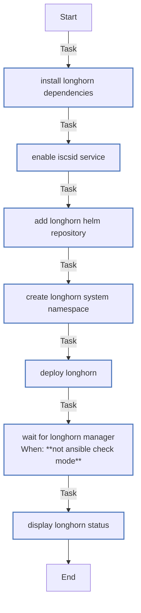

<!-- DOCSIBLE START -->

# 📃 Role overview

## longhorn

Description: Deploy Longhorn distributed storage on K3s

### Defaults

**These are static variables with lower priority**

#### File: defaults/main.yml

| Var          | Type         | Value       |Required    | Title       |
|--------------|--------------|-------------|------------|-------------|
| [longhorn_chart_version](defaults/main.yml#L7)   | str | `1.7.2` |    false  |  Longhorn Chart Version |
| [longhorn_default_replica_count](defaults/main.yml#L13)   | int | `1` |    false  |  Default Replica Count |
| [longhorn_data_locality](defaults/main.yml#L19)   | str | `best-effort` |    false  |  Data Locality |
| [longhorn_storage_over_provisioning](defaults/main.yml#L25)   | int | `100` |    false  |  Storage Over Provisioning |
| [longhorn_storage_minimal_available](defaults/main.yml#L31)   | int | `25` |    false  |  Storage Minimal Available |
| [longhorn_default_class](defaults/main.yml#L37)   | bool | `True` |    false  |  Default Storage Class |
| [longhorn_backup_target](defaults/main.yml#L43)   | str |  |    false  |  Backup Target |
| [longhorn_backup_credential_secret](defaults/main.yml#L49)   | str |  |    false  |  Backup Target Credential Secret |
| [longhorn_guaranteed_engine_manager_cpu](defaults/main.yml#L55)   | int | `12` |    false  |  Guaranteed Engine Manager CPU |
| [longhorn_guaranteed_replica_manager_cpu](defaults/main.yml#L61)   | int | `12` |    false  |  Guaranteed Replica Manager CPU |
| [longhorn_priority_class](defaults/main.yml#L67)   | str | `priority-ops-critical` |    false  |  Priority Class |

<b>🖇️ Full descriptions for vars in defaults/main.yml</b>

 
<table>
<th>Var</th><th>Description</th>
<tr><td><b>longhorn_chart_version</b></td><td>Version of Longhorn Helm chart to install.</td></tr>
<tr><td><b>longhorn_default_replica_count</b></td><td>Default number of replicas for volumes.</td></tr>
<tr><td><b>longhorn_data_locality</b></td><td>Data locality setting (disabled, best-effort, strict-local).</td></tr>
<tr><td><b>longhorn_storage_over_provisioning</b></td><td>Percentage of storage over-provisioning allowed.</td></tr>
<tr><td><b>longhorn_storage_minimal_available</b></td><td>Minimum percentage of storage that must remain available.</td></tr>
<tr><td><b>longhorn_default_class</b></td><td>Whether to set Longhorn as the default StorageClass.</td></tr>
<tr><td><b>longhorn_backup_target</b></td><td>Backup target URL (e.g., s3://bucket or nfs://server/path).</td></tr>
<tr><td><b>longhorn_backup_credential_secret</b></td><td>Name of the secret containing backup credentials.</td></tr>
<tr><td><b>longhorn_guaranteed_engine_manager_cpu</b></td><td>CPU allocation for engine manager.</td></tr>
<tr><td><b>longhorn_guaranteed_replica_manager_cpu</b></td><td>CPU allocation for replica manager.</td></tr>
<tr><td><b>longhorn_priority_class</b></td><td>PriorityClass for Longhorn components.</td></tr>
</table>
 

### Tasks

#### File: tasks/main.yml

| Name | Module | Has Conditions | Comments |
| ---- | ------ | -------------- | -------- |
| [Install Longhorn dependencies](tasks/main.yml#L6) | ansible.builtin.apt | False | Install iscsi tools (required by Longhorn) |
| [Enable iscsid service](tasks/main.yml#L14) | ansible.builtin.systemd | False | Enable and start iscsid service |
| [Add Longhorn Helm repository](tasks/main.yml#L21) | kubernetes.core.helm_repository | False | Add Longhorn Helm repository |
| [Create longhorn-system namespace](tasks/main.yml#L28) | kubernetes.core.k8s | False | Create longhorn-system namespace |
| [Deploy Longhorn](tasks/main.yml#L41) | kubernetes.core.helm | False | Deploy Longhorn |
| [Wait for Longhorn manager](tasks/main.yml#L70) | kubernetes.core.k8s_info | True | Wait for Longhorn to be ready |
| [Display Longhorn status](tasks/main.yml#L86) | ansible.builtin.debug | False | Display post-installation info |

## Task Flow Graphs

### Graph for main.yml

## Author Information
rc

#### License

MIT

#### Minimum Ansible Version

2.14

#### Platforms

- **Ubuntu**: ['jammy', 'noble']

#### Dependencies

No dependencies specified.
<!-- DOCSIBLE END -->
